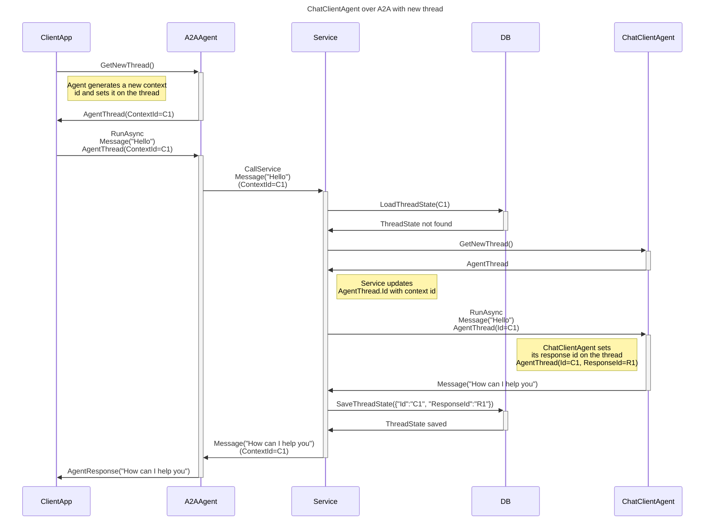
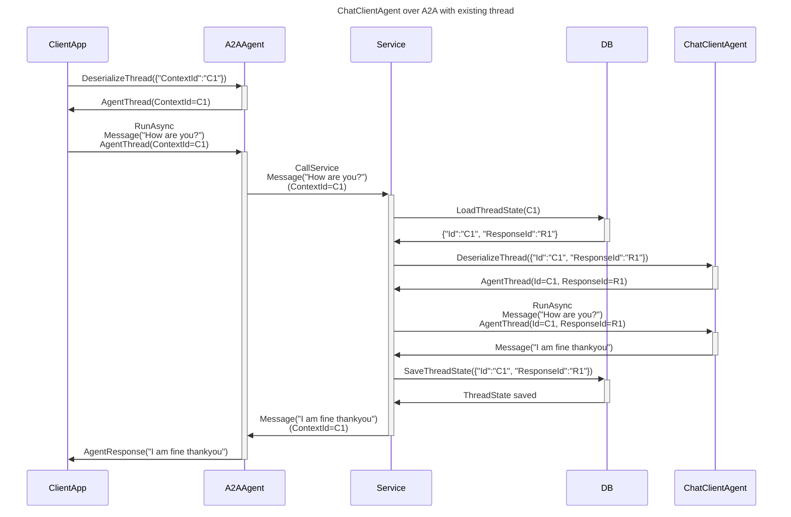

---
# These are optional elements. Feel free to remove any of them.
status: proposed
contact: westey-m
date: 2025-09-09 # {YYYY-MM-DD when the decision was last updated}
deciders: sergeymenshykh, markwallace-microsoft, rogerbarreto, dmytrostruk, westey-m, eavanvalkenburg, stephentoub, peterychang
consulted: 
informed: 
---

# Agent Thread

## Context and Problem Statement

### Message Storage Location

We need a way to abstract away the different behaviors that different agent threads exhibit, specifically when it comes to message storage.

There are three different messages storage scenarios we need to support:

1. **AgentService**: The messages are stored by the agent/inference service being used by the agent.
2. **InMemory**: The messages are stored in-memory and are transient.
3. **3rdParty**: The messages are stored in a 3rd party storage solution, e.g. Cosmos DB.

With Scenario 1 the storage of messages is built into the underlying service, and the service typically only supports storage of messages in its own storage.

Where services do not have built in storage, the service caller has to provide all chat history on each invocation.
The messages making up this chat history, can be stored either in memory locally or in some 3rd party storage location.

### Service message storage

Agentic/Inference Services that have built in message storage, typically expose an id that represents the message thread.
We therefore need the ability to store that id, in cases where the agent is using a service with built in storage.

Note that we have multiple possible scenarios for the type and quantity of threads being used by an agent.

- If the agent is a simple ChatClientAgent that agent may have 0 or 1 thread ids for communicating with the underlying service.
- If the agent is a complex custom agent, it may use multiple underlying services with different thread ids.

### InMemory/3rdParty storage

For cases where the Agentic/Inference Service does not have built in message storage, we need to provide support in the agent framework for storage messages elsewhere.

The simplest of these options is **InMemory** storage, where messages are just kept in an object and are transient.
In many cases, this is sufficient for short-lived conversations where the context does not need to be persisted.
Here, the thread object contains all the messages.

There may be other cases where longer-lived conversations require more robust storage solutions, such as a 3rd party database.
The storage may also be provided by a conversation storage service that provides support for chat history reduction.
E.g. messages may be added to the service as they are created, but the service may then do truncation/summarization in the background
to keep the chat history small enough to fit within any required context window.
This means that the agent would want to request the latest chat history from the service before each invocation.

For the 3rd party storage scenario, the thread object needs to capture the id (could be a compound id too, e.g. partitionkey+id) that the messages are stored under.
The thread should also be able to update and query that 3rd party storage solution.

### 3rd party storage ids vs Agentic/Inference service thread Ids

The id used for 3rd party storage should not be confused with any id used for an Agentic/Inference Service's built in storage.
They are mutually exclusive, since if you use Agentic/Inference service provided storage, you cannot provide chat history on each invocation
and 3rd party storage becomes pointless.
Conversely, if the Agentic/Inference service does not provide built in storage, you must provide chat history on each invocation.

It's also important to consider the case where services support both modes, e.g. Responses with store=true or store=false.
If we are using store=false, and storing data in a 3rd party storage solution under an id, we need to ensure that we don't
confuse that id for a Response id, as passing it to the response service will result in an error.
It would not be a valid response id after all.

### OPEN QUESTION: Efficient loading of 3rd party stored chat history

Let's consider a scenario where we have an agent host that can host any type of AIAgent and doesn't know the specifics of the underlying implementations.
The developer is hosting a ChatClientAgent with an AgentThread that is configured to use 3rd party storage.

Now let's consider what happens when the host is invoked from a remote client.

1. The host needs to take the thread id provided by the caller, and load the serialized AgentThread json from storage using that id.
1. The host then deserializes the AgentThread and passes it to the AIAgent.
1. The AIAgent calls the IChatMessageStore on the AgentThread to retrieve the current ChatHistory.
1. The 3rd Party storage IChatMessageStore loads the chat history from the 3rd party storage solution.

In this case we have two roundtrips to storage to eventually load the chat history.
If the public thread id that we received from the caller, is also the id that the data was stored under in the 3rd party storage solution (or the latter can be derived from the former), this adds unnecessary latency.
Loading the serialized AgentThread from storage, would have just given us a piece of json with the same id we already had.

That said, the host doesn't know whether the AgentThread will use the public thread id for storage or not.
Perhaps the AgentThread is using InMemory storage, in which case the serialized thread will already contain the entire chat history.
When we add `AIContextProvider` support, their state will also be part of the serialized thread, and this also needs to be loaded/serialized.

> Do we need to support a scenario where developers can construct an AgentThread with the id they already have, without needing to load the serialized AgentThread from storage, when they know the underlying supported storage type, and if there are any implications for the AIContextProvider state?

### Public thread id support

Let's consider a scenario where we have a ChatClientAgent that is hosted in a service and exposed publicly via the A2A protocol.
This agent may be built using Responses (store = true), and therefore have a response id that it needs to communicate with the underlying service.
However, when the agent is accessed via A2A, the thread is represented using an A2A context id.
These two ids have very different behavioral characteristics.
Response ids change with each turn of the conversation, while A2A context ids remain constant for the duration of the conversation.
These two ids therefore cannot be the same.

Let's step through the sequence of events for a thread that already exists:

1. The service is invoked via the A2A protocol with a context id.
2. The A2A context id is used to look up the thread object state from storage.
3. The thread object state is loaded from storage. The state will need to be stored under the context id to ensure it can be retrieved.
4. The thread object contains the the separate response id used to invoke the responses api.
5. The agent uses the response id to communicate with the underlying service.
6. The thread is updated with the new response id from the underlying service, plus the input and output messages for this run.
7. The service returns the response to the caller via the A2A protocol.
8. The service serializes the thread object state and stores it under the context id.

Agents may be exposed via other protocols as well, which may require similar "public" thread ids to the context id of A2A.
Some may even require a response style id change after each invocation.
Similarly to the previous example the internal thread id used to communicate with the service may however be static, making it important to support two separate ids.

### Reusing Public thread ids for 3rd party storage

Developers may want to store various pieces of data attached to threads in 3rd party storage, e.g.

1. The chat history from the thread
1. Memories

Chat history is always scoped to a single thread and memories may often also be scoped to a single thread.
The developer may therefore want to use the id of the thread as the key for storing these pieces of data.
We have multiple ids in play though, so which one makes sense here?

If we were using ChatClientAgent with Foundry agents, we may be tempted to use the Foundry agent's thread id as the key for storing chat history and memories.
The problem with this though, is that if we used a different agent type, it may just be storing messages in memory and have no equivalent agentic service provided thread id.

If we had the public thread id (as described above) available in the `AgentThread`, this could be used for 3rd party storage keys.
It is available regardless of the internal thread id used by the agent to communicate with the internal service.

### Service Storage support for different services

|Underlying Service|Uses Service Storage|
|---|---|
|Foundry Agents|Y|
|OpenAI Assistants|Y|
|OpenAI Responses (store = true)|Y|
|OpenAI Responses (store = false)|N|
|OpenAI Chat|N|
|All other inference services|N|
|A2A|Y|
|CopilotStudio|Y|
|Custom Agent|Could be either, agent decides|

## Considered Options

### Decision A: Internal Id Management

We need to decide how we manage the internal thread ids used for communication with the underlying service.

#### Option 1 - Service thread id is considered implementation detail of Agent and stored in AdditionalProperties

Any thread id required for communication with the underlying service would be stored in `AdditionalProperties`.

```csharp
public class AgentThread
{
    public Dictionary<string, string> AdditionalProperties { get; set; }
}

new AgentThread()
{
    AdditionalProperties = new Dictionary<string, string>
    {
        { "response-id", "r-12345" }
    }
}
```

PRO: Consistent experience with any type of agent.
CON: Harder to use with the common case where only a single service thread id is needed.
CON: Harder for users to read the service thread id if they need it for breaking out of the abstraction.

#### Option 2 - Service thread id has concrete property

AgentThread has a `ServiceThreadId` property that exposes the thread's ID used for communication with the underlying service.
If the agent is using multiple underlying services with different thread ids, it may need to store thread ids in `AdditionalProperties`.

```csharp
public class AgentThread
{
    public string? ServiceThreadId { get; set; }
    public Dictionary<string, string> AdditionalProperties { get; set; }
}

var singleInternalId = new AgentThread()
{
    ServiceThreadId = "r-12345"
}

var multipleInternalIds = new AgentThread()
{
    Id = "thread-1",
    AdditionalProperties = new Dictionary<string, string>
    {
        { "response-id", "r-12345" },
        { "foundry-id", "f-12345" }
    }
}
```

PRO: Simple to use for agents that only need a single service thread id.
PRO: Easy for users to read the service thread id if they need it for breaking out of the abstraction, e.g. when deleting a thread.
CON: For agents that need multiple service thread ids, or that don't use service threads, we end up with an unused property which may confuse users.

#### Option 3 - Agents subclass AgentThread if they need to store additional ids

If a specific agent needs to store service IDs, it can subclass `AgentThread` and add the necessary properties.

```csharp
public class AgentThread
{
}

// Sample Implementation: We could have one specifically for ChatClientAgent
public class ChatClientAgentThread : AgentThread
{
    public string? ServiceThreadId { get; set; }
}

// Sample Implementation: We could have more generalised types that are reusable by many agent types.
public class ServiceThreadAgentThread : AgentThread
{
    public string? ServiceThreadId { get; set; }
}

// Sample Implementation: For orchestration agents we could have an AgentThread that supports storing a service thread ids per sub agents.
public class OrchestrationAgentThread : AgentThread
{
    public Dictionary<string, string> ServiceThreadIdsBySubAgent { get; set; }
}
```

PRO: Consistent experience with any type of agent.
CON: Needs subclassing for agent types, which makes this harder to understand and use.

### Decision B: Storage ID Management

#### Option 1 - We have an Id on AgentThread for Storage

In this case we would add a StorageId property to the AgentThread and pass this to the IChatMessageStore methods
so that it could be used for message storage and retrieval.
This can be autogenerated, and overridden by users, when creating a new thread.
The store would also be able to return a new id when adding a message to the store to support responses like storage, or generating a new id on first storage.

```csharp
public class AgentThread
{
    public string? StorageId { get; set; }
}

public interface IChatMessageStore
{
    Task<IEnumerable<ChatMessage>> GetMessagesAsync(string storageId, CancellationToken cancellationToken);
    Task<string> AddMessagesAsync(string storageId, IReadOnlyCollection<ChatMessage> messages, CancellationToken cancellationToken);
}

public class AIAgent
{
    public AgentThread GetNewThread(string? storageId = null);
}

```

PRO: Ability to pass the thread id to the message store for message storage and retrieval.
CON: We are exposing a property that is only applicable to certain message stores, assuming there even is a message store at all, which can be confusing.

#### Option 2 - We do not have an Id on AgentThread for Storage

In this case, the ChatMessageStore implementation would autogenerate an ID and associate it with the messages in its store.
For users to retrieve or change this id, they would need to cast the MessageStore to the specific type and access the id on the store,
effectively breaking out of the abstraction.

```csharp
public interface IChatMessageStore
{
    Task<IEnumerable<ChatMessage>> GetMessagesAsync(CancellationToken cancellationToken);
    Task<string> AddMessagesAsync(IReadOnlyCollection<ChatMessage> messages, CancellationToken cancellationToken);
}

class MyCustomMessageStore : IChatMessageStore
{
    public string PrimaryKey { get; set; } = Guid.NewGuid().ToString();
}

var storageId = (thread.MessageStore as MyCustomMessageStore).PrimaryKey;
```

PRO: No additional properties that are only applicable to certain message stores, assuming there even is a message store at all.
CON: Since ids are autogenerated by default, the ids would always be different to service thread ids, even when they could have been the same.

### Decision C: Message Storage

We have to decide how we support message storage with Agent Threads where they are not stored in the service.

#### Option 1 - Store messages in an IChatMessageStore, defaulted to InMemoryChatMessageStore

The AgentThread class has an optional MessageStore property for storing messages.
The agent cannot use both the MessageStore and an Agentic/InferenceService thread id, so for cases
where an Agentic/InferenceService thread id is available, the MessageStore would be ignored.

When using 3rd party storage, the message store needs to store the messages using
an id. The message store may generate an id for this purpose (on first use), store the messages
using that id, and then keep the id in a property for future use.
When serializing the thread, the message store would need to include the id in its serialized data.
Since the messages store is a child of the thread, its state should be included in the thread's serialized state.

When using In-Memory storage, the messages are simply kept in the InMemoryChatMessageStore in a property.
When serializing the thread, the message store would need to include the messages in its serialized data.

```csharp
// The thread has an optional MessageStore property for storing messages
public class AgentThread
{
    public IChatMessageStore? MessageStore { get; set; }
}

public interface IChatMessageStore
{
    Task<IEnumerable<ChatMessage>> GetMessagesAsync(CancellationToken cancellationToken);
    Task AddMessagesAsync(IReadOnlyCollection<ChatMessage> messages, CancellationToken cancellationToken);
}

// A default InMemoryChatMessageStore implementation is available if no other chat message store is configured.
internal class InMemoryChatMessageStore : IList<ChatMessage>, IChatMessageStore
{
}

public class AIAgent
{
    // The agent is responsible for setting the MessageStore (if needed)
    // when it creates the thread. How it does this is agent specific.
    public virtual AgentThread GetNewThread();
}

// For ChatClientAgent we have a optional factory in options, that developers
// can use to provide new message stores for any threads created by the agent.
// This factory is called by GetNewThread.
public class ChatClientAgentOptions
{
    public Func<IChatMessageStore>? ChatMessageStoreFactory { get; set; } = null;
}
```

#### Option 1.1 - Variation on Option 1: Add StorageId for messages store

This is a variation of Option 1 where the `StorageId` of the `AgentThread` is passed to the `MessageStore` when
messages are added or retrieved, so that messages can be stored under this id.

In this case, a 3rd party message store would not need to generate its own ids for messages, as it can use the `StorageId` provided by the `AgentThread`,
however it is still free to generate its own ids.

```csharp
public interface IChatMessageStore
{
    Task<IEnumerable<ChatMessage>> GetMessagesAsync(string storageId, CancellationToken cancellationToken);
    Task AddMessagesAsync(string storageId, IReadOnlyCollection<ChatMessage> messages, CancellationToken cancellationToken);
}
```

#### Option 2 - Store in-memory messages the thread, with an optional IChatMessageStore for 3rd party integrations

The AgentThread class has an optional MessageStore property for storing messages.
The AgentThread also has a ChatHistory property for storing messages in-memory.
Only one of these can be used at a time, and if an Agentic/InferenceService thread id is available,
both the ChatHistory and MessageStore would be ignored.

When serializing the thread, the thread would either include the messages from the ChatHistory, or
whatever state the MessageStore has, including potentially an id under which the MessageStore is storing messages.

```csharp
// The thread has an optional ChatHistory for storing messages in-memory
// and a MessageStore property for storing messages externally if required.
// Only one may be set at a time.
public class AgentThread
{
    public List<ChatMessage>? ChatHistory { get; set; }
    public IChatMessageStore? MessageStore { get; set; }
}

// ChatMessageStore implementation and factory works the same as in option 1.
```

#### Option 2.1 - Variation on Option 2: Reuse AgentThread id for messages store

Same variation as Option 1.1, applied to option 2.

## Appendices

### Sequence Diagram: ChatClientAgent over A2A with new thread



### Sequence Diagram: ChatClientAgent over A2A with existing thread



### Sequence Diagram: ChatClientAgent over A2A with existing thread with 3rd Party Storage

To be added.
