# Agent Threads Update

## Context and Problem Statement

We are re-looking at the way threads work and what they are.

Threads have the following:
- `AgentThread` - contains: `service_thread_id`, `chat_message_store`, `context_providers`
- In dotnet there are also subclasses used such as `ChatClientAgentThread`, to handle additional logic.
- Threads should be managed by a Agent, not by the user, so creation, serialization, alterations should all be agent methods.
    - In python, we do not have the notion of protected methods, so we cannot prevent users from directly creating `AgentThread` instances, which can lead to confusion, this is why in Python there are no subclasses of `AgentThread`.

### Logical flow of threads
The following diagrams illustrate the logical flow of an agent run with threads in the current implementation.

Current (simplified) state for a AgentThread with a ChatMessageStore in Python:
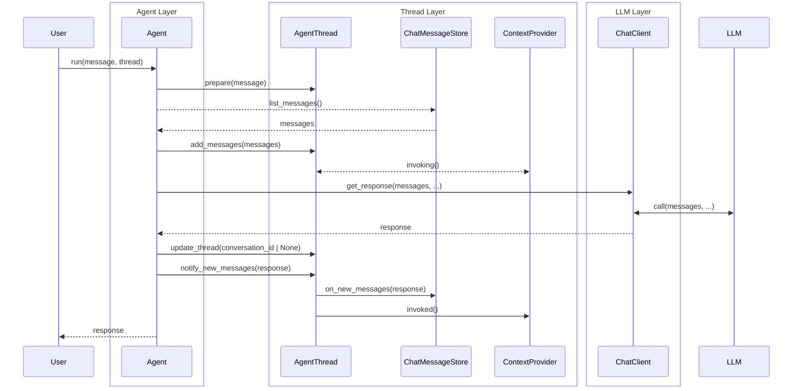
And for a thread with a service_thread_id (or `store=True`):
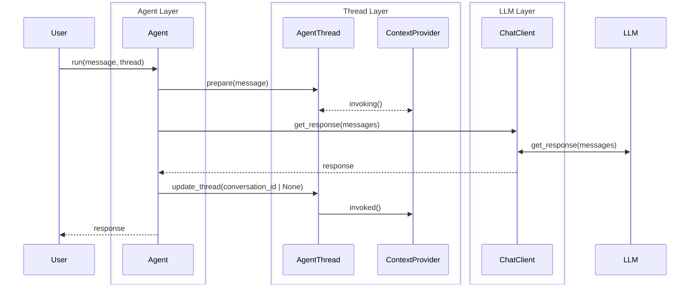
There are several issues with the current implementation of threads in the Agent Framework, which we would like to address in this ADR.

### Issue 1: Threads can have different behaviors based on their state
The first issue with threads is that depending on whether the `service_thread_id` is filled we treat it differently from a thread with `chat_message_store` filled, and when neither is filled it is considered uninitialized. Further, depending on the state, certain methods behave differently, such as `on_new_messages`, which is a no-op for threads with a `service_thread_id`, but calls `add_messages` on the `chat_message_store` for threads with that filled. When calling `agent.get_new_thread` it is also unclear what is referred to, a service side thread, a locally stored thread or neither. Finally, when passing in a thread of one type, but also setting the `store` and `conversation_id` parameters when calling `agent.run` might either raise a error, change something or does not work as expected.

### Issue 2: ChatMessageStore usage
The second issue is the usage of `ChatMessageStore` as the way to store messages locally, while it works well, it does not capture a whole thread , so it does not include context provider settings, or a service_thread_id, nor can it be used as a way to store either messages or a service id, leading to the need for a separate class that can store `AgentThread` objects, meaning we either need two abstractions and implementations, one for `ChatMessageStore` and one for `AgentThreadStore`, or we need to complicate the `AgentThread` class further by adding an id and save/load methods. Or people will forego using the ChatMessageStore altogether and just use a AgentThreadStore and the built-in in-memory ChatMessageStore. Giving us two versions of doing similar things: "storing threads", where one works for all thread (AgentThreadStore) and one only for local threads (ChatMessageStore).

### Issue 3: Thread serialization
Because we have both a `ChatMessageStore` object and a `ContextProvider` object inside a thread, it is quite a challenge to serialize and deserialize threads, as both the ChatMessageStore and ContextProviders can have configuration that needs to be serialized as well, including potentially hard to serialize things like clients, for which we would need to add dependency injection, and the logic of how to do that is contained in those classes. This makes it hard to create a standard way of serializing and deserializing threads, as each ChatMessageStore and ContextProvider can have different requirements.

### Issue 4: Thread state inconsistencies
Another issue applies to service side threads and that is that a thread can be updated on the service side without going through a agent. This can lead to inconsistencies between which messages have gone through the agent and it's context providers and which messages have not. For example, if a user adds messages directly to the service side thread, the agent and it's context providers will not be aware of those messages, leading to potential confusion and unexpected behavior.

### Issue 5: Language differences
In .Net threads have protected constructors, and can therefore not be created directly by a user, all interactions (adding messages from a run and (de)serialization) with a thread are also supposed to go through the agent. It is already doubtful if that is a good idea, since it makes adding things like ChatHistoryReducers more difficult, if we keep to that principle, they will have to be part of the agent as well in order to work properly. And in Python, there are no protected methods, classes can be "marked" as private, but that does not prevent users from using them directly.

### Issue 6: Cross-agent threads
Threads are used for certain workflows to support things like group chats, in that case a thread should be shared between multiple agents, but those agents are not necessarily of the same type, or they might be using different chat clients, which might have different support for threads. This makes it problematic to share threads because some might have a preference for a service side thread, but others might use a different service, or have not support for service side threads at all.

## Scenario's
To further clarify both the issues and the solutions, we can look at the scenario's below and ensure we support them, or choose to not support one of them and why.

**Note on streaming**: All scenarios below are equally valid for both `agent.run()` and `agent.run_stream()` methods. Threads maintain conversation state across streaming interactions just as they do for non-streaming runs.

### Scenario 1: The simple should be simple
A user gets an agent and wants to run a conversation with it, that is continuous, so messages like: "and what about X", referring to something previous discussed should just work.

```python
agent = SomeAgent(...)
thread = agent.get_new_thread()
response1 = agent.run("Tell me about the history of AI.", thread=thread)
response2 = agent.run("And what about in Europe?", thread=thread)
```
Or:
```python
agent = SomeAgent(...)
response1 = agent.run("Tell me about the history of AI.")
response2 = agent.run("And what about in Europe?", thread_id=response1.thread_id)
```

### Scenario 2a: Storing and restoring threads
A user wants to store a thread and restore it later, either in the same session or in a different session.

```python
agent = SomeAgent(...)
thread = agent.get_new_thread()
response1 = agent.run("Tell me about the history of AI.", thread=thread)
# Store thread somewhere
stored_thread_data = agent.serialize_thread(thread)
# Later, restore thread
restored_thread = agent.deserialize_thread(stored_thread_data)
response2 = agent.run("And what about in Europe?", thread=restored_thread)
```

### Scenario 2b: Storing and restoring chat messages
A user wants to store just the chat messages of a thread and restore them later, either in the same session or in a different session. This shows conversation persistence across application restarts using a persistent chat message store.

```python
from agent_framework import AgentThread
from agent_framework.redis import RedisChatMessageStore

conversation_id = "persistent_chat_001"

# Phase 1: Start conversation
store1 = RedisChatMessageStore(
    redis_url="redis://localhost:6379",
    thread_id=conversation_id,
)
thread1 = AgentThread(message_store=store1)

agent = OpenAIChatClient().create_agent(
    name="PersistentBot",
    instructions="You are a helpful assistant. Remember our conversation history.",
)

response1 = await agent.run("Hello! I'm working on a Python project.", thread=thread1)
response2 = await agent.run("I'm interested in neural networks.", thread=thread1)
await store1.aclose()

# Phase 2: Resume conversation (simulating app restart)
store2 = RedisChatMessageStore(
    redis_url="redis://localhost:6379",
    thread_id=conversation_id,  # Same thread ID
)
thread2 = AgentThread(message_store=store2)

# Continue conversation - agent should remember context
response3 = await agent.run("What was I working on before?", thread=thread2)
response4 = await agent.run("Can you suggest some libraries?", thread=thread2)
await store2.aclose()
```

### Scenario 3: Context Providers
A user wants to use context providers to add context to the conversation, and have that context be stored and restored with the thread, and this should work with any thread type. This example shows using a ContextProviderFactory pattern in .NET to create per-thread context providers.

```csharp
// Create the agent with a context provider factory
AIAgent agent = new AzureOpenAIClient(
    new Uri(endpoint),
    new AzureCliCredential())
    .GetChatClient(deploymentName)
    .CreateAIAgent(new ChatClientAgentOptions
    {
        Instructions = "You are good at telling jokes.",
        Name = "Joker",
        AIContextProviderFactory = (ctx) => new ChatHistoryMemoryProvider(
            vectorStore,
            collectionName: "chathistory",
            vectorDimensions: 3072,
            // Configure the scope values under which chat messages will be stored.
            // In this case, we are using a fixed user ID and a unique thread ID for each new thread.
            storageScope: new() { UserId = "UID1", ThreadId = new Guid().ToString() },
            // Configure the scope which would be used to search for relevant prior messages.
            // In this case, we are searching for any messages for the user across all threads.
            searchScope: new() { UserId = "UID1" })
    });

// Start a new thread - the factory creates a context provider for this thread
AgentThread thread = agent.GetNewThread();

// Run the agent with the thread that stores conversation history in the vector store.
await agent.RunAsync("I like jokes about Pirates. Tell me a joke about a pirate.", thread);

// Start a second thread - gets its own context provider instance
AgentThread thread2 = agent.GetNewThread();

// Run the agent with the second thread - provider searches across all threads for the user.
await agent.RunAsync("Tell me a joke that I might like.", thread2);
```

Further a context provider should be able to store a few messages (regardless of thread type) as additional context to provide better outputs. This example shows a context provider that maintains a rolling window of recent messages for summarization.

```csharp
// Context provider that stores last N messages for summarization
internal sealed class SummaryContextProvider : AIContextProvider
{
    private readonly IChatClient _chatClient;
    private readonly int _maxMessages;

    public SummaryContextProvider(IChatClient chatClient, SummaryState? state = null, int maxMessages = 10)
    {
        this._chatClient = chatClient;
        this._maxMessages = maxMessages;
        this.State = state ?? new SummaryState();
    }

    // Constructor for deserialization - receives serialized state
    public SummaryContextProvider(IChatClient chatClient, JsonElement serializedState, JsonSerializerOptions? jsonSerializerOptions = null)
    {
        this._chatClient = chatClient;
        this._maxMessages = 10;
        this.State = serializedState.ValueKind == JsonValueKind.Object ?
            serializedState.Deserialize<SummaryState>(jsonSerializerOptions)! :
            new SummaryState();
    }

    public SummaryState State { get; set; }

    // Called before agent invocation - provides summary of stored messages
    public override async ValueTask<AIContext> InvokingAsync(InvokingContext context, CancellationToken cancellationToken = default)
    {
        if (this.State.RecentMessages.Count == 0)
        {
            return new AIContext();
        }

        // Generate summary from stored messages
        var summaryPrompt = new List<ChatMessage>(this.State.RecentMessages)
        {
            new ChatMessage(ChatRole.User, "Summarize the above conversation in 2-3 sentences.")
        };

        var summaryResponse = await this._chatClient.GetResponseAsync(
            summaryPrompt,
            new ChatOptions(),
            cancellationToken: cancellationToken);

        return new AIContext
        {
            Instructions = $"Previous conversation summary: {summaryResponse.Message.Text}"
        };
    }

    // Called after agent invocation - stores recent messages
    public override ValueTask InvokedAsync(InvokedContext context, CancellationToken cancellationToken = default)
    {
        // Add new messages to state
        this.State.RecentMessages.AddRange(context.RequestMessages);
        this.State.RecentMessages.AddRange(context.ResponseMessages);

        // Keep only last N messages
        if (this.State.RecentMessages.Count > this._maxMessages)
        {
            var excess = this.State.RecentMessages.Count - this._maxMessages;
            this.State.RecentMessages.RemoveRange(0, excess);
        }

        return ValueTask.CompletedTask;
    }

    // Serialize state for thread serialization
    public override JsonElement Serialize(JsonSerializerOptions? jsonSerializerOptions = null)
    {
        return JsonSerializer.SerializeToElement(this.State, jsonSerializerOptions);
    }
}

internal sealed class SummaryState
{
    public List<ChatMessage> RecentMessages { get; set; } = new();
}

// Usage - context provider factory creates instance per thread
AIAgent agent = chatClient.CreateAIAgent(new ChatClientAgentOptions()
{
    Instructions = "You are a helpful assistant.",
    AIContextProviderFactory = ctx => new SummaryContextProvider(
        chatClient.AsIChatClient(),
        ctx.SerializedState,
        ctx.JsonSerializerOptions)
});

AgentThread thread = agent.GetNewThread();
// After many messages, only last 10 are stored in the context provider
for (int i = 0; i < 20; i++)
{
    await agent.RunAsync($"Question {i}: Tell me about AI.", thread);
}

// Serialize thread - includes context provider's recent messages
var threadElement = thread.Serialize();

// Deserialize thread - restores context provider with its stored messages
var deserializedThread = agent.DeserializeThread(threadElement);
await agent.RunAsync("Summarize what we discussed.", deserializedThread);
```

**Note on context provider scoping**: Context providers can be scoped in different ways to support various use cases:
- **Global scope**: A fixed `thread_id` or `session_id` shares context across all operations (e.g., `RedisProvider(thread_id="global")`)
- **Per-thread scope**: The provider binds to the specific thread for its lifetime (e.g., `RedisProvider(scope_to_per_operation_thread_id=True)`)
- **Per-agent scope**: Different `agent_id` values isolate context between agents (e.g., `RedisProvider(agent_id="personal")` vs `RedisProvider(agent_id="work")`)

The `context_data/state` design should support all three scoping patterns, allowing context providers to maintain state that is either shared globally, isolated per-thread, or isolated per-agent as needed.

### Scenario 4: Multi-agent threads with the same agent type
A user wants to share a thread between multiple agents of the same type.

```python
agent1 = SomeAgent(...)
agent2 = SomeAgent(...)

group = GroupChatBuilder().add_participants([agent1, agent2]).build()
group.run("Hello everyone, let's discuss AI.")

```
### Scenario 5: Multi-agent threads with different agent types
A user wants to share a thread between multiple agents of different types.

```python
agent1 = SomeAgentTypeA(...)
agent2 = SomeAgentTypeB(...)
group = GroupChatBuilder().add_participants([agent1, agent2]).build()
group.run("Hello everyone, let's discuss AI.")
```

**Note on workflows as agents**: When workflows are wrapped as agents via `workflow.as_agent()`, they need to coordinate thread usage across their internal sub-agents. The framework should support workflows exposing a single thread interface to the user while managing per-agent threads or a shared thread internally. This is particularly relevant for sequential workflows, group chat workflows, and concurrent agent patterns.

### Scenario 6: All of the above
A user wants to combine all of the above scenarios.

```python
agent1 = SomeAgentTypeA(context_provider_factories=[SomeContextProviderFactory()])
agent2 = SomeAgentTypeB(chat_message_store_factory=CosmosDBChatMessageStoreFactory()
thread1 = agent1.get_new_thread()
response1 = agent1.run("Tell me about the history of AI.", thread=thread1)
# Store thread somewhere
stored_thread_data = agent1.serialize_thread(thread1)
# Later, restore thread in agent2
restored_thread = agent2.deserialize_thread(stored_thread_data)
response2 = agent2.run("And what about in Europe?", thread=restored_thread)

group = GroupChatBuilder().add_participants([agent1, agent2]).build()
group.run("Hello everyone, let's discuss AI.")
```

### Scenario 7: Chat history reduction with local threads
A user wants to manage the context window size by reducing chat history, which is only feasible with local threads where history is stored client-side.

```python
from semantic_kernel_agent_framework.chat_message_stores import InMemoryChatMessageStore
from semantic_kernel_agent_framework.chat_history_reducers import MessageCountingChatReducer

agent = SomeAgent(
    chat_message_store_factory=lambda: InMemoryChatMessageStore(
        reducer=MessageCountingChatReducer(max_messages=10)
    )
)
thread = agent.get_local_thread()
# After many runs, thread only contains last 10 messages
for i in range(20):
    response = agent.run(f"Question {i}", thread=thread)
# Thread history is automatically reduced to last 10 messages
```

**Note on remote threads**: Chat history reduction is only applicable to `LocalThread` where the client maintains the message store. `RemoteThread` instances rely on service-side storage, which may have its own reduction mechanisms that are not controllable from the client side. This is a key distinction that motivates the separation between `LocalThread` and `RemoteThread` types.

### Scenario 8: Middleware accessing thread state
A user wants to implement middleware that tracks or modifies thread behavior, understanding that the middleware needs to handle different thread types appropriately based on their fields.

```python
async def thread_tracking_middleware(context: AgentRunContext, next, ...):
    if context.thread:
        # Check if thread is service-managed by presence of service_thread_id
        if context.thread.service_thread_id:
            # Service-managed thread: Limited to metadata only
            # We do NOT fetch messages from the service
            logger.info(f"Service thread {context.thread.service_thread_id} - message access not available")
        elif context.thread.chat_message_store:
            # Local thread with message store: Full access to message history
            message_count = len(await context.thread.get_messages())
            logger.info(f"Local thread has {message_count} messages before execution")
        else:
            # Thread without message store
            logger.info("No message store available")

    await next(context)

    if context.thread:
        if context.thread.service_thread_id:
            # Service-managed thread: Still only metadata available
            logger.info(f"Service thread {context.thread.service_thread_id} - execution completed")
        elif context.thread.chat_message_store:
            # Can inspect updated local thread state
            updated_count = len(await context.thread.get_messages())
            logger.info(f"Local thread now has {updated_count} messages after execution")

agent = SomeAgent(middleware=[thread_tracking_middleware])

# Local thread with message store
local_thread = agent.get_new_thread()
agent.run("Query with local thread", thread=local_thread)

# Service-managed thread (has service_thread_id)
service_thread = agent.get_new_thread(service_thread_id="thread_abc123")
agent.run("Query with service thread", thread=service_thread)
```

**Important**: Middleware behavior may differ significantly between `LocalThread` and `RemoteThread`:
- **LocalThread**: Middleware has full access to the message list via `get_messages()`, enabling rich inspection, modification, or analytics.
- **RemoteThread**: Middleware only has access to metadata (e.g., `thread_id`). There is no abstraction for fetching thread state from the service, as this would add complexity and latency. Some middleware may become a no-op for `RemoteThread` if they require message-level access.

This design choice prioritizes simplicity and performance over uniformity. Middleware authors should design their components to gracefully handle both thread types or clearly document which thread types they support.

## Decision Drivers

- Ease of use: make it easy for users to understand how to use threads, one class, one purpose.
- Clarity: create a single way of storing and restoring threads that is clear and unambiguous.
- Ease of handling: make it easy to work with Threads and store them in a way that is easily serializable.
- There is a potential difference needed between python and dotnet for this, because the current dotnet design with the thread as a protected class, cannot easily be translated to python, where there are no protected classes or methods, and tricks that make it appear so are not ideomatic.


## Possible enhancements

1. Separate classes for remote thread and local thread, each with their own behaviors and methods.
1. Make Threads fully serializable, including ChatMessageStore and ContextProviders.
    1. Remove `ContextProvider` from the thread itself, replace with `context_data/state` on the thread, which the agent uses to get context from the providers when running in that thread.
    1. Replace `ChatMessageStore` with a list of ChatMessages.
1. Local threads only, adding a abstraction on ChatClient to load a thread by id, so that the local thread can always be synced with the service side thread, and the agent can then run with just the new messages compared to the last known state.
1. Using a Context Provider to handle local message storage and context generation.
    1. Variant with a special Context Provider that handles local storage and generates a thread id for local threads, so that the agent only deals with thread ids.
    1. Variant with a default Context Provider that can store messages, that can be overridden by other context providers
1. Rename `Thread` for clarity.

### 1. Separate classes for `ServiceThread`/`RemoteThread` and `LocalAgentThread`/`LocalThread`, each with their own behaviors and methods.

There are two variants for this approach:

#### Variant A: Separate methods for each thread type
This approach would mean:
- Creating two subclasses of AgentThread, one for service threads and one for local threads, both with different attributes and methods. Tentatively called `HostedThread` and `LocalThread`.
- We would need to add a flag on `ChatClients`, to indicate if they support `hosted/remote` threads, and we assume that we always support `local` threads.
- All Agents would get two methods, `get_local_thread(messages: list[ChatMessage] | None = None, ...)` and `get_hosted_thread(thread_id: str | None = None, ...)`, the latter of which might raise an error if the chat client does not support that type of thread.
- The `run` methods would take both types of threads, but would raise an error if the thread type is not supported by the chat client.
- If you pass a `LocalThread` to `run`, it would invoke the chat client with `store=False` and `conversation_id=None`, and if you pass a `HostedThread`, it would invoke the chat client with `store=True` and the `conversation_id` from the thread (if any). And this also means removing the `store` and `conversation_id` parameters from the `run` method at the agent level, as they would be redundant and potentially conflicting.

#### Variant B: Single method with type parameter (backward compatible)
This approach would mean:
- Creating a base class `AgentThread` with two subclasses `HostedThread` and `LocalThread`, each with their own behaviors and methods.
- A single `get_new_thread()` method that accepts an optional `thread_type` parameter (Python) or generic type parameter (C#).
- When called without a type parameter, returns a base `AgentThread` that adapts on first run based on the chat client's response (maintaining backward compatibility).
- When called with an explicit type, returns the specified subclass with well-defined behavior.
- The thread type is determined/finalized on the first `run()` call:
  - If `AgentThread` (unspecified): checks chat client response for `conversation_id` to determine if it becomes `HostedThread` or `LocalThread`
  - If `LocalThread` (explicit): always uses local storage, `store=False`
  - If `HostedThread` (explicit): always uses service storage, `store=True`

Naming options:
- For the hosted/remote threads: `ServiceThread`, `RemoteThread`, `ServiceSideThread`, `HostedThread`
- For the local threads: `LocalAgentThread`, `LocalThread`, `ClientSideThread`

`HostedThread` and `LocalThread` seem the clearest and most concise options and the most pythonic.

#### Code Examples

**Variant A: Separate methods**

**Python:**
```python
# Creating threads
agent = OpenAIChatAgent(...)

# Option 1: Local thread with client-side message storage
local_thread = agent.get_local_thread()
response = await agent.run("Hello", thread=local_thread)

# Option 2: Hosted thread with service-side storage
hosted_thread = agent.get_hosted_thread()  # Creates or retrieves from service
response = await agent.run("Hello", thread=hosted_thread)

# Option 3: Resume existing hosted thread
existing_thread = agent.get_hosted_thread(thread_id="thread_abc123")
response = await agent.run("Continue conversation", thread=existing_thread)

# Thread type determines storage behavior automatically
# No need for store=True/False or conversation_id parameters
```

**C#:**
```csharp
// Creating threads
var agent = new OpenAIChatAgent(...);

// Option 1: Local thread with client-side message storage
LocalThread localThread = agent.GetLocalThread();
var response = await agent.RunAsync("Hello", localThread);

// Option 2: Hosted thread with service-side storage
HostedThread hostedThread = agent.GetHostedThread();  // Creates or retrieves from service
response = await agent.RunAsync("Hello", hostedThread);

// Option 3: Resume existing hosted thread
HostedThread existingThread = agent.GetHostedThread(threadId: "thread_abc123");
response = await agent.RunAsync("Continue conversation", existingThread);

// Thread type determines storage behavior automatically
// No need for Store=true/false or ConversationId parameters
```

**Variant B: Single method with type parameter (backward compatible)**

**Python:**
```python
agent = OpenAIChatAgent(...)

# Option 1: Unspecified type (backward compatible) - adapts on first run
thread = agent.get_new_thread()  # Returns AgentThread
response = await agent.run("Hello", thread=thread)
# After first run, thread becomes LocalThread or HostedThread based on service response

# Option 2: Explicit local thread
local_thread = agent.get_new_thread(thread_type='local')
response = await agent.run("Hello", thread=local_thread)

# Option 3: Explicit hosted thread
hosted_thread = agent.get_new_thread(thread_type='hosted')
response = await agent.run("Hello", thread=hosted_thread)

# Option 4: Resume existing hosted thread with explicit type
existing_thread = agent.get_new_thread(thread_type='hosted', thread_id="thread_abc123")
response = await agent.run("Continue", thread=existing_thread)
```

**C#:**
```csharp
var agent = new OpenAIChatAgent(...);

// Option 1: Unspecified type (backward compatible) - adapts on first run
AgentThread thread = agent.GetNewThread();  // Returns base AgentThread
var response = await agent.RunAsync("Hello", thread);
// After first run, thread becomes LocalThread or HostedThread based on service response

// Option 2: Explicit local thread
LocalThread localThread = agent.GetNewThread<LocalThread>();
response = await agent.RunAsync("Hello", localThread);

// Option 3: Explicit hosted thread
HostedThread hostedThread = agent.GetNewThread<HostedThread>();
response = await agent.RunAsync("Hello", hostedThread);

// Option 4: Resume existing hosted thread with explicit type
HostedThread existingThread = agent.GetNewThread<HostedThread>(threadId: "thread_abc123");
response = await agent.RunAsync("Continue", existingThread);
```

#### Impact on Scenarios

**Variant A: Separate methods**

**Solves/Enables:**
- ✅ **Scenario 1**: Simplified - user explicitly chooses thread type, behavior is clear
- ✅ **Scenario 2a**: Easier serialization - each thread type has well-defined state
- ✅ **Scenario 2b**: Natural fit - `LocalThread` with custom message store factory
- ✅ **Scenario 3**: Works for both thread types - context providers remain on threads with their current interface
- ✅ **Scenario 7**: Explicitly supported only on `LocalThread`, makes limitation clear
- ✅ **Scenario 8**: Middleware can use `isinstance()` checks to handle each type appropriately

**Challenges/Limitations:**
- ⚠️ **Scenario 4 & 5**: Multi-agent scenarios need careful handling when agents use different thread types
- ❌ **Breaking change**: Users must migrate from `get_new_thread()` to explicit `get_local_thread()` or `get_hosted_thread()`
- ⚠️ **Learning curve**: Users must understand the difference between thread types upfront

**Variant B: Single method with type parameter**

**Solves/Enables:**
- ✅ **Scenario 1**: Works with or without explicit type - flexible for users
- ✅ **Scenario 2a**: Easier serialization - each thread type has well-defined state
- ✅ **Scenario 2b**: Natural fit - `LocalThread` with custom message store factory
- ✅ **Scenario 3**: Works for both thread types - context providers remain on threads with their current interface
- ✅ **Scenario 7**: Explicitly supported only on `LocalThread`, makes limitation clear
- ✅ **Scenario 8**: Middleware can use `isinstance()` checks to handle each type appropriately
- ✅ **Backward compatible**: Existing code using `get_new_thread()` continues to work

**Challenges/Limitations:**
- ⚠️ **Scenario 4 & 5**: Multi-agent scenarios need careful handling when agents use different thread types
- ⚠️ **Complexity**: Base `AgentThread` that adapts adds runtime complexity and potential confusion
- ⚠️ **Type safety**: Returning base `AgentThread` when unspecified reduces type safety benefits
- ⚠️ **Learning curve**: Users may not understand when to specify type vs. let it adapt
- ⚠️ **Serialization**: Base `AgentThread` may need to capture "not yet determined" state before first run

### 2. Making Threads fully serializable, including ChatMessageStore and ContextProviders.
This approach would mean:
- Making the thread state only, so instead of a ChatMessageStore, it would be a list of ChatMessages, and instead of ContextProviders, it would be some kind of context state object.
- **Note**: This enhancement is independent and can be applied to the current single `AgentThread` class or combined with Enhancement 1's `LocalThread`/`HostedThread` separation.

    #### 1. Removing `ChatMessageStore`, use `list[ChatMessage]`, and add a `ThreadStore` abstraction to handle persistence.
    This approach would mean:
    - Removing `ChatMessageStore`, instead a thread would have a list of ChatMessages as an attribute.

    #### 2. Removing `ContextProvider`, replacing with a field `context_data`/`context_state` or a dict of `context_provider_name/id: context_data/state` on threads, which the agent would then use to get the context from the context providers when running in that thread.
    This approach would mean:
    - Moving `ContextProvider` back into Agent, replacing with a field `context_data`/`context_state` or a dict of `context_provider_name/id: context_data/state` on threads, which the agent would then use to get the context from the context providers when running in that thread. This makes the thread itself state-only, and the context provider can be stateless and live in the agent.
    - The protocol/interface for ContextProviders would need a slight update, one to return a initial `context_data/state` object, the logic of which is maintained by the provider (whether it matches a app, user or session and what to record in there), and adding that `context_data/state` to the invoked and invoking methods. The `context_data/state` needs to be (de)serializable in a standard way, to make handling the thread easier.

#### Code Examples

**Python:**
```python
# Thread is now pure state - fully serializable
# (Can be applied to current AgentThread or to separate LocalThread/HostedThread classes)
@dataclass
class AgentThread:
    messages: list[ChatMessage] | None = None
    context_state: dict[str, Any] | None = None
    thread_id: str | None = None

# Context providers live on the agent
class SummaryContextProvider(ContextProvider):
    async def initialize_state(self) -> dict[str, Any]:
        """Return initial serializable state for this provider"""
        return {"summary_messages": [], "last_summary": None}

    async def invoking(
        self,
        messages: list[ChatMessage],
        context_state: dict[str, Any],  # Provider's state from thread
        **kwargs
    ) -> tuple[Context, dict[str, Any]]:  # Returns context + updated state
        summary_messages = context_state.get("summary_messages", [])
        # Generate summary...
        updated_state = {"summary_messages": summary_messages[-10:], "last_summary": summary}
        return Context(messages=[summary]), updated_state

# Usage
agent = OpenAIChatAgent(context_providers=[SummaryContextProvider()])
thread = agent.get_new_thread()
response = await agent.run("Hello", thread=thread)

# Serialize - thread is just data
serialized = json.dumps({
    "messages": [m.model_dump() for m in thread.messages],
    "context_state": thread.context_state,  # Already serializable
    "thread_id": thread.thread_id
})

# Deserialize - reconstruct pure state
thread_data = json.loads(serialized)
restored_thread = AgentThread(
    messages=[ChatMessage(**m) for m in thread_data["messages"]],
    context_state=thread_data["context_state"],
    thread_id=thread_data["thread_id"]
)
```

**C#:**
```csharp
// Thread is now pure state - fully serializable
// (Can be applied to current AgentThread or to separate LocalThread/HostedThread classes)
public record AgentThread
{
    public List<ChatMessage>? Messages { get; init; }
    public Dictionary<string, object>? ContextState { get; init; }
    public string? ThreadId { get; init; }
}

// Context providers live on the agent
public class SummaryContextProvider : IContextProvider
{
    public async Task<Dictionary<string, object>> InitializeStateAsync()
    {
        // Return initial serializable state for this provider
        return new Dictionary<string, object>
        {
            ["summary_messages"] = new List<ChatMessage>(),
            ["last_summary"] = null
        };
    }

    public async Task<(Context, Dictionary<string, object>)> InvokingAsync(
        List<ChatMessage> messages,
        Dictionary<string, object> contextState,  // Provider's state from thread
        CancellationToken cancellationToken)
    {
        var summaryMessages = (List<ChatMessage>)contextState["summary_messages"];
        // Generate summary...
        var updatedState = new Dictionary<string, object>
        {
            ["summary_messages"] = summaryMessages.TakeLast(10).ToList(),
            ["last_summary"] = summary
        };
        return (new Context { Messages = new[] { summary } }, updatedState);
    }
}

// Usage
var agent = new OpenAIChatAgent(contextProviders: new[] { new SummaryContextProvider() });
var thread = agent.GetNewThread();
var response = await agent.RunAsync("Hello", thread);

// Serialize - thread is just data
var serialized = JsonSerializer.Serialize(new
{
    Messages = thread.Messages,
    ContextState = thread.ContextState,  // Already serializable
    ThreadId = thread.ThreadId
});

// Deserialize - reconstruct pure state
var threadData = JsonSerializer.Deserialize<ThreadData>(serialized);
var restoredThread = new AgentThread
{
    Messages = threadData.Messages,
    ContextState = threadData.ContextState,
    ThreadId = threadData.ThreadId
};
```

#### Context Provider State Matching Options

When context providers are moved to the agent and their state is stored on the thread, we need a mechanism to match each provider with its corresponding state. Several design options exist:

##### Option A: Provider ID/Name Keying with Both IDs Passed

The thread has two ID fields: `id` (always a GUID for the thread itself) and `hosted_thread_id` (optional, for service-side threads). The `context_state` dictionary is keyed by provider ID or class name. When invoking/invoked, both the thread IDs and the provider's specific state are passed.

**Python:**
```python
@dataclass
class AgentThread:
    messages: list[ChatMessage] | None = None
    context_state: dict[str, Any] | None = None  # Keyed by provider ID or name
    id: str | None = None  # Always a GUID for this thread
    hosted_thread_id: str | None = None  # Only set for hosted threads

class SummaryContextProvider(ContextProvider):
    def __init__(self, provider_id: str = "summary"):
        self.id = provider_id

    async def initialize_state(self) -> dict[str, Any]:
        return {"summary_messages": [], "last_summary": None}

    async def invoking(
        self,
        messages: list[ChatMessage],
        thread_id: str,  # Thread.id (GUID)
        context_state: dict[str, Any],  # This provider's state from thread.context_state[self.id]
        **kwargs
    ) -> tuple[Context, dict[str, Any]]:
        # Provider can use thread_id for external storage if needed
        # Provider uses context_state for its persisted state
        summary_messages = context_state.get("summary_messages", [])
        # ... generate summary ...
        updated_state = {"summary_messages": summary_messages[-10:], "last_summary": summary}
        return context, updated_state

# Usage
agent = OpenAIChatAgent(context_providers=[
    SummaryContextProvider(provider_id="summary"),
    RedisContextProvider(provider_id="redis")
])
thread = agent.get_new_thread()
# thread.id = "guid-1234"
# thread.context_state = {"summary": {...}, "redis": {...}}
```

**Pros:**
- Simple and explicit
- Developer controls the provider ID
- Thread ID available for external storage lookups if needed
- Multiple instances of same provider type possible with different IDs
- Both thread types (local/hosted) supported via hosted_thread_id

**Cons:**
- Requires two ID fields on thread
- Developer must ensure provider ID uniqueness
- Potential for ID conflicts if not careful

##### Option B: Provider Type Name as Key

Similar to Option A, but use the provider's class name automatically as the dictionary key instead of manual IDs.

**Python:**
```python
@dataclass
class AgentThread:
    id: str | None = None  # Always a GUID
    messages: list[ChatMessage] | None = None
    context_state: dict[str, Any] | None = None  # Keyed by class name
    hosted_thread_id: str | None = None

class SummaryContextProvider(ContextProvider):
    async def initialize_state(self) -> dict[str, Any]:
        return {"summary_messages": [], "last_summary": None}

    async def invoking(
        self,
        messages: list[ChatMessage],
        thread_id: str,
        context_state: dict[str, Any],  # From thread.context_state[self.__class__.__name__]
        **kwargs
    ) -> tuple[Context, dict[str, Any]]:
        # Use context_state for this provider
        return context, updated_state

# Agent uses provider.__class__.__name__ automatically
agent = OpenAIChatAgent(context_providers=[
    SummaryContextProvider(),
    RedisContextProvider()
])
thread = agent.get_new_thread()
# thread.context_state = {"SummaryContextProvider": {...}, "RedisContextProvider": {...}}
```

**Pros:**
- No manual ID management required
- Automatic and predictable
- No risk of ID conflicts within single agent
- Both thread IDs still available

**Cons:**
- Cannot have multiple instances of same provider type
- Class renames break serialization
- Less flexible for advanced use cases

##### Option C: Provider-Generated Unique ID

On thread creation, the provider is passed the thread and generates a unique ID for the provider/thread combination. This ID is stored in `context_state`, and the entire state object is passed to the provider.

**Python:**
```python
@dataclass
class AgentThread:
    messages: list[ChatMessage] | None = None
    context_state: dict[str, Any] | None = None  # Entire state dict passed to providers
    hosted_thread_id: str | None = None

class RedisContextProvider(ContextProvider):
    def __init__(self, redis_client: RedisClient):
        self.redis = redis_client
        self.ids = []

    async def thread_created(self, thread: AgentThread) -> dict[str, Any]:
        """Called when thread is created, provider generates unique ID"""
        unique_id = f"redis:{uuid4()}"
        self.ids.append(unique_id)
        return {
            "_redis_provider_id": unique_id,
            "data": {}
        }

    async def invoking(
        self,
        messages: list[ChatMessage],
        context_state: dict[str, Any],  # Entire thread.context_state dict
        **kwargs
    ) -> tuple[Context, dict[str, Any]]:
        # Provider finds its own state within context_state
        for unique_id, state in context_state.items():
            if unique_id in self.ids:
                break
        else:
            raise ValueError("State not found in context_state")

        # ... process using provider_data ...

        # Return updated full context_state
        updated_state = {...}
        return unique_id, updated_state

# Usage
agent = OpenAIChatAgent(context_providers=[RedisContextProvider(redis_client)])
thread = agent.get_new_thread()
# thread.context_state = {"guid-1234": {...}}
```

**Pros:**
- Provider has full control over state structure and key naming
- Unique ID automatically generated per provider/thread combination
- No manual ID management from user
- Provider can organize state however it wants
- Thread doesn't have separate `id` field (just `hosted_thread_id`)

**Cons:**
- Entire context_state dict passed to each provider (not isolated per provider)
- Provider must track its own IDs across multiple threads (stored in `self.ids`)
- Must iterate through context_state to find provider's own state
- Returns tuple of (id, state) instead of just state
- Risk of key conflicts between providers if IDs overlap
- More complex for providers to implement correctly
- Stateful provider (must maintain `self.ids` list)

##### Recommendation

**Option A (Provider ID/Name Keying with Both IDs Passed)** is recommended as the approach for Enhancement 2 because:
- It maintains the "pure state" goal of Enhancement 2
- It's simple and explicit with clear separation of concerns
- It allows full thread serialization (Scenario 2a)
- It enables multiple instances of the same provider type
- Each provider gets its own isolated state from `context_state[provider_id]`

#### Impact on Scenarios

**Solves/Enables:**
- ✅ **Scenario 2a**: Perfect fit - trivial serialization with standard JSON/binary serializers
- ✅ **Scenario 2b**: Simplified - no need for ChatMessageStore abstraction, just `list[ChatMessage]`
- ✅ **Scenario 3**: Enables context provider state persistence via `context_state` dict
- ✅ **Scenario 6**: Cross-agent thread sharing becomes easier with pure state transfer

**Challenges/Limitations:**
- ❌ **Scenario 7**: Chat history reduction becomes harder - need to move reducer logic elsewhere, potentially a ThreadStore could serve this purpose
- ⚠️ **Scenario 8**: Middleware loses direct access to ChatMessageStore methods, must work with raw lists
- ⚠️ **Breaking change**: Major refactor of ContextProvider interface to accept/return state
- ⚠️ **Constraint**: Context provider state MUST be serializable - limits flexibility
- ⚠️ **Complexity**: Context providers must manage stateless operations, which may be unnatural for some use cases

### 4. Local threads only
This approach would mean:
- Adding an abstraction on ChatClient to load a thread by id from the service and cast the messages to our types, so that the local thread can always be synced with the service side thread, and the agent can then run with just the new messages compared to the last known state. This will make supporting cross-agent threads easier.
- The additional latency of reading the service side thread, and the fact that adding a thread reading abstraction to existing ChatClients is a breaking change, means that this option is excluded and will not be further investigated.

#### Code Examples

**Python:**
```python
# All threads are local, but can sync with service
class LocalThread:
    messages: list[ChatMessage]
    service_thread_id: str | None = None  # If synced with service

# ChatClient gets new method to fetch service thread
class ChatClient:
    async def get_thread_messages(self, thread_id: str) -> list[ChatMessage]:
        """Fetch messages from service thread"""
        # Implementation fetches and converts to our types
        raise NotImplementedError()

# Usage - sync before each run
agent = OpenAIChatAgent(...)
thread = agent.get_thread(service_thread_id="thread_abc123")

# Before each run, sync from service
if thread.service_thread_id:
    service_messages = await agent.chat_client.get_thread_messages(thread.service_thread_id)
    # Merge with local messages...
    thread.messages = merge_messages(thread.messages, service_messages)

response = await agent.run("Hello", thread=thread)
```

**C#:**
```csharp
// All threads are local, but can sync with service
public class LocalThread
{
    public List<ChatMessage> Messages { get; set; }
    public string? ServiceThreadId { get; set; }  // If synced with service
}

// ChatClient gets new method to fetch service thread
public interface IChatClient
{
    Task<List<ChatMessage>> GetThreadMessagesAsync(string threadId);
}

// Usage - sync before each run
var agent = new OpenAIChatAgent(...);
var thread = agent.GetThread(serviceThreadId: "thread_abc123");

// Before each run, sync from service
if (thread.ServiceThreadId != null)
{
    var serviceMessages = await agent.ChatClient.GetThreadMessagesAsync(thread.ServiceThreadId);
    // Merge with local messages...
    thread.Messages = MergeMessages(thread.Messages, serviceMessages);
}

var response = await agent.RunAsync("Hello", thread);
```

#### Impact on Scenarios

**Solves/Enables:**
- ✅ **Scenario 4 & 5**: Unified thread model simplifies cross-agent sharing
- ✅ **Scenario 2a**: Single serialization approach for all threads

**Challenges/Limitations:**
- ❌ **Explicitly excluded**: Adds latency, breaking change to ChatClient interface
- ❌ **Performance**: Every run requires service fetch when `service_thread_id` is set
- ❌ **Complexity**: Message merging logic needed to handle concurrent updates
- ❌ **Service dependency**: Local thread becomes dependent on service availability

### 5. Context Provider to handle local message storage and context generation.
- The contract of a ChatMessageStore is already quite similar to a Context Provider, so we could create a Context Provider that handles local message storage and context generation for local threads.
- One note is that potentially, something like `Context Manager` would be a more accurate name for such a Context Provider, as it would manage the context (messages) for the thread, but for consistency we will keep using Context Provider here.
- There are two variants to consider here:

    #### 1. Variant with a special Context Provider that handles local storage and generates a thread id for local threads, so that the agent only deals with the service side thread id, and all local context would be handled by the context provider.
    This approach would mean:
    - Creating a default context provider that stores chat messages, when a response has a `response_id/conversation_id`, it updates that id on the thread, and sets a flag on the storage context provider to indicate that messages should not be added as context per run. If the response does not indicate it can store and continue, then the context provider adds the full history (or a reduced version) as context for the next run. This would simplify the thread handling significantly, as the agent would only deal with the service side thread id, and all local context would be handled by the context provider.
    - The response would contain a id in either case, either generated by the context provider to indicate the current thread, or the service side thread id, a subsequent run with that id/thread would then continue the conversation and the context provider decides if it should add the full history or not.

**Python:**
```python
# Special context provider handles all message storage
class MessageStorageContextProvider(ContextProvider):
    def __init__(self, storage: ChatMessageStore):
        self.storage = storage
        self.is_service_managed = False
        self.thread_id = None

    async def invoking(self, messages: list[ChatMessage], **kwargs: Any) -> Context:
        if self.is_service_managed:
            # Service stores messages, don't add history
            return Context(messages=[])
        else:
            # Load full history from storage
            history = await self.storage.list_messages(self.thread_id)
            return Context(messages=history)

    async def invoked(self, request_messages: list[ChatMessage], response_messages: list[ChatMessage], **kwargs: Any):
        # Extract thread_id and conversation_id from kwargs
        conversation_id = kwargs.get("conversation_id")
        if conversation_id:
            # Service is now managing storage
            self.is_service_managed = True
        else:
            # Store messages locally
            await self.storage.add_messages(self.thread_id, request_messages + response_messages)

# Usage - user only deals with thread IDs
agent = OpenAIChatAgent(
    context_providers=[MessageStorageContextProvider(RedisMessageStore())]
)
response1 = await agent.run("Hello")  # Returns thread_id
response2 = await agent.run("Continue", thread_id=response1.thread_id)
```

**C#:**
```csharp
// Special context provider handles all message storage
public class MessageStorageContextProvider : IContextProvider
{
    private readonly IChatMessageStore _storage;
    private bool _isServiceManaged;
    private string? _threadId;

    public MessageStorageContextProvider(IChatMessageStore storage)
    {
        _storage = storage;
    }

    public async Task<Context> InvokingAsync(
        List<ChatMessage> messages,
        CancellationToken cancellationToken)
    {
        if (_isServiceManaged)
        {
            // Service stores messages, don't add history
            return new Context { Messages = Array.Empty<ChatMessage>() };
        }
        else
        {
            // Load full history from storage
            var history = await _storage.ListMessagesAsync(_threadId, cancellationToken);
            return new Context { Messages = history };
        }
    }

    public async Task InvokedAsync(
        List<ChatMessage> requestMessages,
        List<ChatMessage> responseMessages,
        CancellationToken cancellationToken,
        string? conversationId = null)
    {
        if (conversationId != null)
        {
            // Service is now managing storage
            _isServiceManaged = true;
        }
        else
        {
            // Store messages locally
            var allMessages = requestMessages.Concat(responseMessages).ToList();
            await _storage.AddMessagesAsync(_threadId, allMessages, cancellationToken);
        }
    }
}

// Usage - user only deals with thread IDs
var agent = new OpenAIChatAgent(
    contextProviders: new[] { new MessageStorageContextProvider(new RedisMessageStore()) }
);
var response1 = await agent.RunAsync("Hello");  // Returns ThreadId
var response2 = await agent.RunAsync("Continue", threadId: response1.ThreadId);
```

#### Impact on Scenarios (Variant 1)

**Solves/Enables:**
- ✅ **Scenario 1**: Simplified - user only manages thread IDs, not thread objects
- ✅ **Scenario 2b**: Natural fit - storage handled by context provider

**Challenges/Limitations:**
- ❌ **Scenario 2a**: Cannot easily serialize full thread state - only thread ID available
- ❌ **Scenario 7**: Chat history reduction difficult - buried in context provider
- ❌ **Scenario 8**: Middleware cannot easily access thread messages
- ⚠️ **Confusion**: Mixing storage concerns with context generation is non-intuitive
- ⚠️ **Stateful provider**: Context provider becomes stateful, contradicts Enhancement 2

    #### 2. Variant with a default Context Provider that can store messages, that can be overridden by other context providers
    This approach would mean:
    - Creating a default context provider that stores chat messages, that can be overridden by other context providers, but the agent would still deal with both local and service side threads, and the context provider would just be an additional way to add context to the conversation.
    - This means that alternative context providers become responsible for storing messages locally, which can lead to confusion and inconsistencies, as different context providers might have different ways of storing messages, and the agent would still need to deal with both local and service side threads.

**Python:**
```python
# Default context provider for message storage (can be overridden)
class DefaultMessageContextProvider(ContextProvider):
    """Default provider - stores messages if no other storage exists"""
    priority = -1  # Lowest priority

    def __init__(self, thread: AgentThread):
        self.thread = thread

    async def invoking(self, messages: list[ChatMessage], **kwargs: Any) -> Context:
        # Add all thread history as context
        return Context(messages=self.thread.messages)

    async def invoked(self, request_messages: list[ChatMessage], response_messages: list[ChatMessage], **kwargs: Any):
        # Store new messages in thread
        self.thread.messages.extend(request_messages)
        self.thread.messages.extend(response_messages)

# Custom context provider must also handle storage
class SummaryContextProvider(ContextProvider):
    def __init__(self, thread: AgentThread):
        self.thread = thread

    async def invoking(self, messages: list[ChatMessage], **kwargs: Any) -> Context:
        # Must decide: do I add history or just summary?
        # Confusing responsibility
        summary = self._generate_summary(self.thread.messages)
        return Context(messages=[summary])

    async def invoked(self, request_messages: list[ChatMessage], response_messages: list[ChatMessage], **kwargs: Any):
        # Must also store messages? Or rely on default provider?
        pass

# Usage - unclear who stores messages
agent = OpenAIChatAgent(
    context_providers=[SummaryContextProvider()]  # No default provider?
)
```

**C#:**
```csharp
// Default context provider for message storage (can be overridden)
public class DefaultMessageContextProvider : IContextProvider
{
    private readonly AgentThread _thread;
    public int Priority => -1;  // Lowest priority

    public DefaultMessageContextProvider(AgentThread thread)
    {
        _thread = thread;
    }

    public async Task<Context> InvokingAsync(
        List<ChatMessage> messages,
        CancellationToken cancellationToken)
    {
        // Add all thread history as context
        return new Context { Messages = _thread.Messages };
    }

    public async Task InvokedAsync(
        List<ChatMessage> requestMessages,
        List<ChatMessage> responseMessages,
        CancellationToken cancellationToken)
    {
        // Store new messages in thread
        _thread.Messages.AddRange(requestMessages);
        _thread.Messages.AddRange(responseMessages);
    }
}

// Custom context provider must also handle storage
public class SummaryContextProvider : IContextProvider
{
    private readonly AgentThread _thread;

    public SummaryContextProvider(AgentThread thread)
    {
        _thread = thread;
    }

    public async Task<Context> InvokingAsync(
        List<ChatMessage> messages,
        CancellationToken cancellationToken)
    {
        // Must decide: do I add history or just summary?
        // Confusing responsibility
        var summary = GenerateSummary(_thread.Messages);
        return new Context { Messages = new[] { summary } };
    }

    public async Task InvokedAsync(
        List<ChatMessage> requestMessages,
        List<ChatMessage> responseMessages,
        CancellationToken cancellationToken)
    {
        // Must also store messages? Or rely on default provider?
    }
}
```

#### Impact on Scenarios (Variant 2)

**Solves/Enables:**
- ✅ **Scenario 1**: Works but requires understanding of default provider

**Challenges/Limitations:**
- ❌ **All scenarios**: Confusing responsibility - unclear who stores messages
- ❌ **Scenario 3**: Custom context providers must understand storage semantics
- ⚠️ **Inconsistency**: Different context providers may handle storage differently
- ⚠️ **Hidden behavior**: Default provider may be implicitly added, surprising users

### 6. Rename `Thread` for clarity.
- Another consideration is if we should continue the `Thread` name or move to something else like `Conversation`, `Session`, or `Context`, that would be a bigger breaking change initially but would be clearer in the long run. This ADR will keep using `Thread` for now for consistency. One of the reasons for it is to clarify that it is not focused only on chat and messages, but especially for workflows, it is a broader concept.

#### Code Examples

**Python (Option A: "Conversation"):**
```python
# Rename to emphasize chat/message focus
conversation = agent.get_new_conversation()

response = await agent.run("Hello", conversation=conversation)
serialized = agent.serialize_conversation(conversation)
```

**Python (Option B: "Session"):**
```python
# Rename to emphasize broader state management
session = agent.get_new_session()

response = await agent.run("Hello", session=session)
serialized = agent.serialize_session(session)
```

**Python (Option C: "Context"):**
```python
# Rename to emphasize execution context/state
context = agent.get_new_context()

response = await agent.run("Hello", context=context)
serialized = agent.serialize_context(context)
```

**Python (Option D: Keep "Thread"):**
```python
# Keep existing name to emphasize workflow concept
thread = agent.get_new_thread()

response = await agent.run("Hello", thread=thread)
serialized = agent.serialize_thread(thread)
```

**C# (Same options):**
```csharp
// Option A: Conversation
var conversation = agent.GetNewConversation();
var response = await agent.RunAsync("Hello", conversation);

// Option B: Session
var session = agent.GetNewSession();
var response = await agent.RunAsync("Hello", session);

// Option C: Context
var context = agent.GetNewContext();
var response = await agent.RunAsync("Hello", context);

// Option D: Thread
var thread = agent.GetNewThread();
var response = await agent.RunAsync("Hello", thread);
```

#### Impact on Scenarios

**"Conversation" Naming:**
- ✅ Clear for chat-focused use cases (Scenarios 1, 2, 3)
- ⚠️ Less clear for workflow use cases (Scenarios 4, 5, 6)
- ⚠️ May imply chat-only functionality

**"Session" Naming:**
- ✅ Broader concept, fits workflows better
- ✅ Common term in web/API contexts
- ⚠️ May conflict with authentication session concepts
- ⚠️ Less intuitive for simple chat scenarios

**"Context" Naming:**
- ✅ Neutral term that fits both chat and workflows
- ✅ Emphasizes state/execution context
- ⚠️ May conflict with `Context` class used by ContextProviders
- ⚠️ Overloaded term in programming (execution context, DI context, etc.)
- ⚠️ May be too generic/ambiguous

**"Thread" Naming (Current):**
- ✅ Works for both chat and workflows
- ✅ Aligns with OpenAI Assistant API terminology
- ⚠️ May conflict with programming language threading concepts (especially in Python)
- ⚠️ Not immediately intuitive for newcomers

**Overall Impact:**
- ⚠️ **Breaking change**: Requires renaming across entire codebase and user code
- ⚠️ **Migration effort**: Documentation, samples, user code all need updates
- ⚠️ **Deprecation period**: Would need to support both names temporarily

## Agent Thread Invocation Flows

The following diagrams illustrate the flow for each enhancement option. These show how threads interact with agents, context providers, and chat clients.

### Enhancement 1: LocalThread and HostedThread Flows

These flows represent Enhancement 1 (separate thread classes). The threads shown here use the current architecture with `ChatMessageStore` on `LocalThread` and context providers on both thread types.

#### Enhancement 1 Variant A: Separate Methods (as shown below)
The flows below show the separate methods approach where users explicitly call `get_local_thread()` or `get_hosted_thread()`.

#### Enhancement 1 Variant B: Adaptive Thread Flow
When using the single method with optional type parameter, the flow includes an adaptation step:

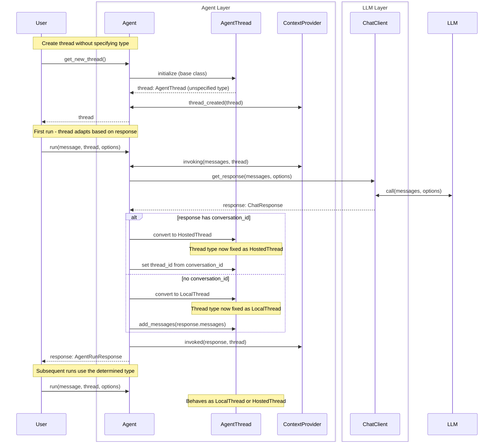

**Note**: This adaptive approach maintains backward compatibility but adds complexity. The thread type is "locked in" after the first run.

#### Local Thread Flow

The following diagram illustrates the flow when using a local thread with Enhancement 1. This shows the current architecture where `LocalThread` contains a `ChatMessageStore` and context providers live on the thread. The `get_messages` and `add_messages` methods interact with the `ChatMessageStore` for persistence.

Creating a thread:

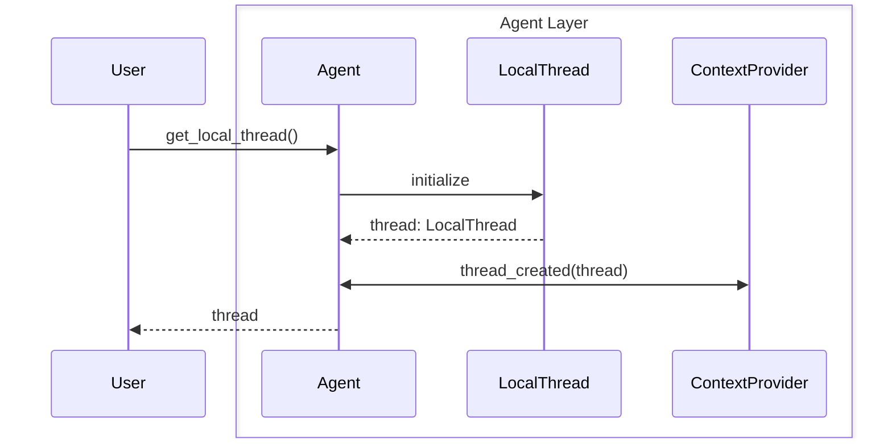

Using the thread:
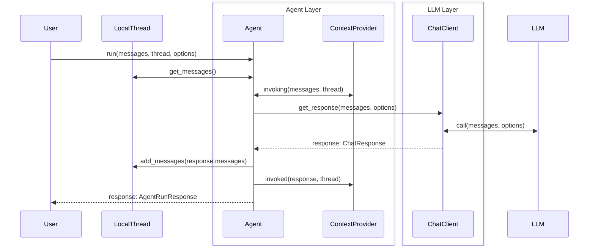

### Hosted Thread Flow

The following diagram illustrates the flow when using a hosted/service thread. When the thread does not have a ID yet, it sets `store=True` and then it will be updated after the run.

Creating a thread:

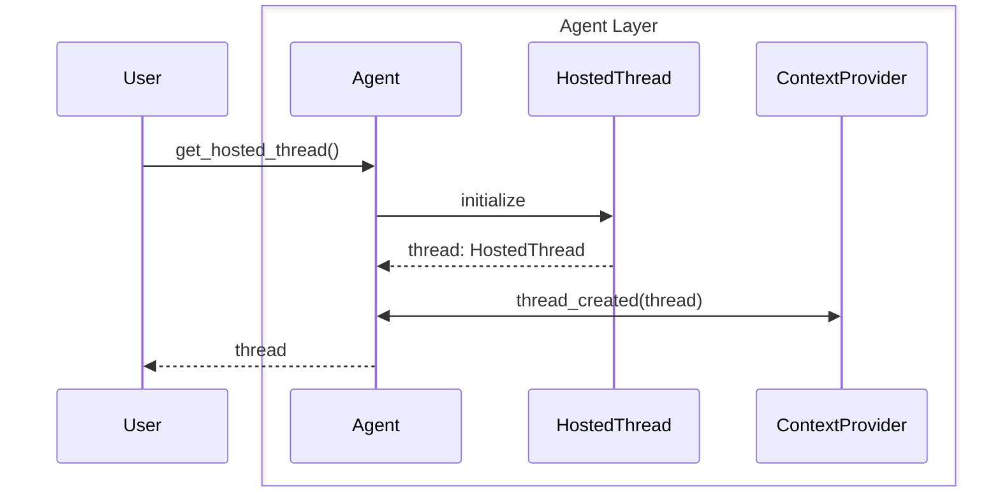

Using the thread:


### Hosted app thread flow (Enhancement 1 - local flow shown, same setup would apply to the hosted flow)

In a hosted environment, such as Azure Functions or when creating a A2A agent, the app layer would be responsible for loading and saving the thread before and after the run, as illustrated below. Enhancement 1's simpler thread types (LocalThread/HostedThread) makes this much simpler and provides complete configurability to the ThreadStore and app layer on how they want to deal with threads. The `af_thread_id` in this diagram is just a placeholder for whatever ID the app layer wants to use to identify the thread.

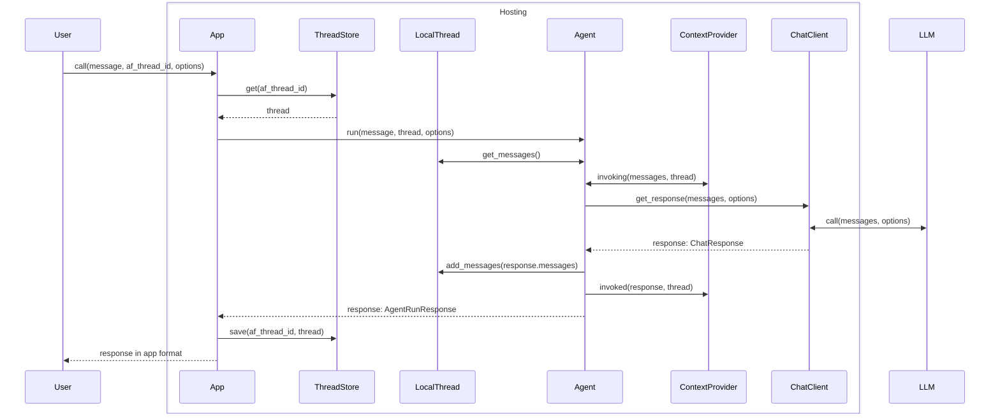

### Enhancement 2: Fully Serializable Threads Flow

This flow shows how Enhancement 2 works independently - threads become pure state (no `ChatMessageStore` objects, no `ContextProvider` objects on threads), with context providers living on the agent and accepting/returning state.

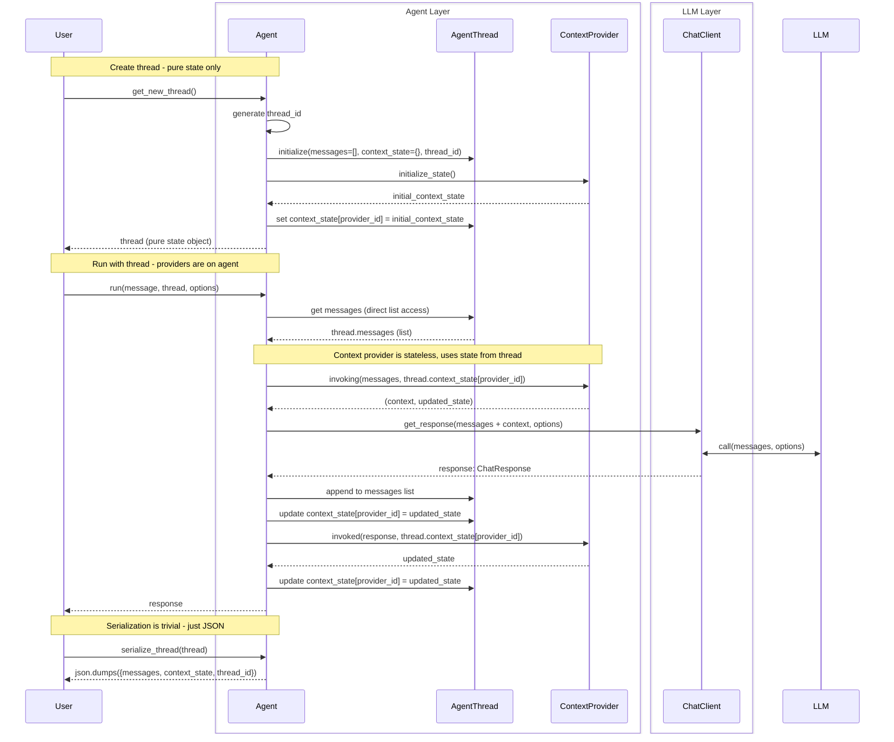

**Key differences from current architecture:**
- Thread contains only data: `messages: list[ChatMessage]` and `context_state: dict[str, Any]`
- No `ChatMessageStore` object on thread - just a plain list
- No `ContextProvider` objects on thread - they live on the agent
- Context providers are stateless, receiving and returning `context_state` for each invocation
- Serialization becomes trivial with standard JSON/binary serializers

### Enhancement 4: Local Threads Only (with Service Sync)

This flow shows how all threads would be local but sync with service before each run.

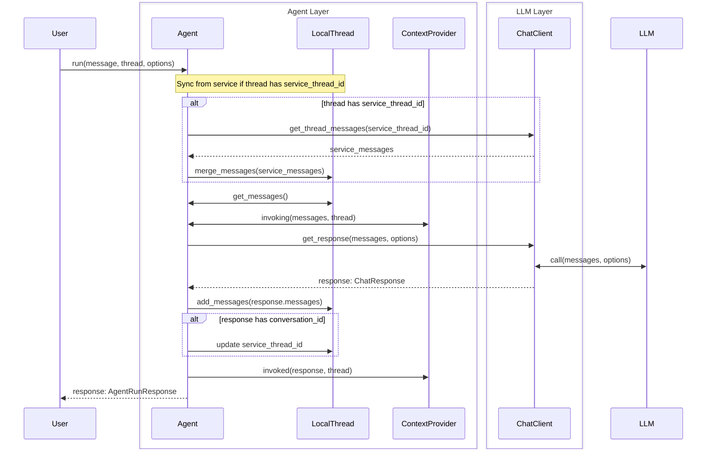

**Note**: This option was excluded due to added latency and complexity, but the diagram shows how it would work.

### Enhancement 5.1: Context Provider Handles Storage (Special Provider)

This flow shows how a special context provider would handle all message storage, with the agent only dealing with thread IDs.

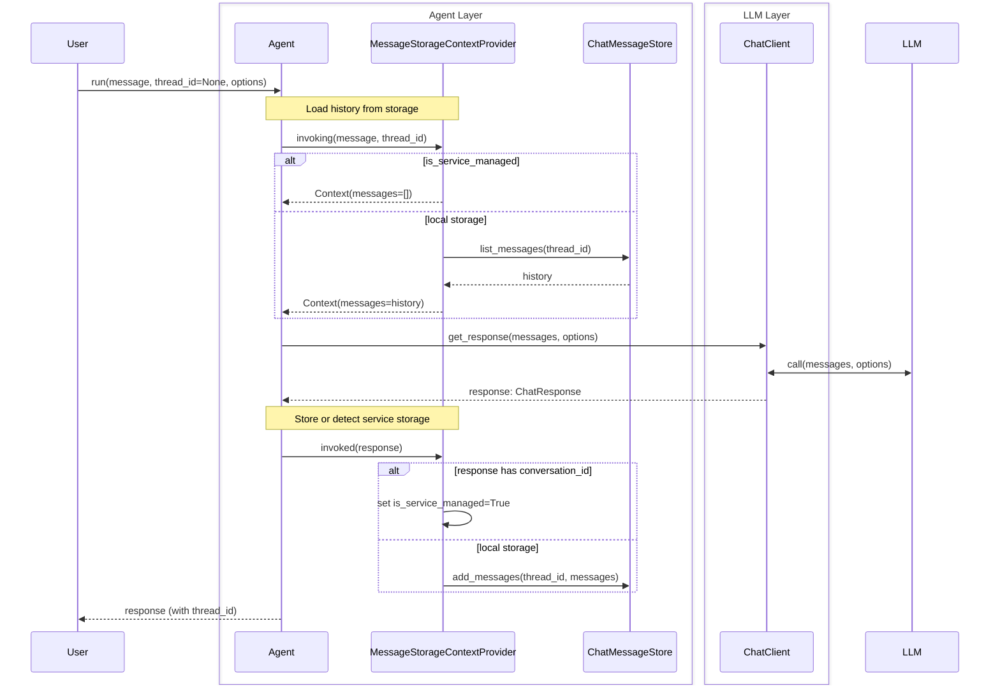

**Note**: User only sees thread IDs, never thread objects. Storage is completely handled by the context provider.

### Enhancement 5.2: Default Context Provider (Can Be Overridden)

This flow shows how a default context provider would handle storage, but can be overridden by custom providers.

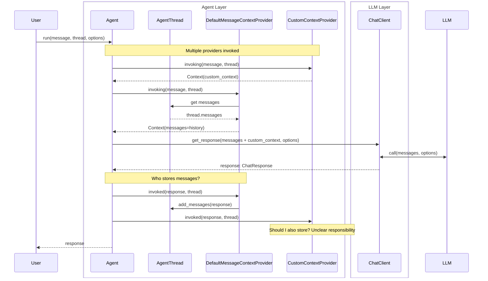

**Note**: Confusing responsibility - unclear whether custom providers should also handle storage.

### Enhancement 6: Rename Thread (No Flow Change)

The renaming option (Enhancement 6) does not change the flow - it only renames `Thread` to `Conversation`, `Session`, or keeps it as `Thread`. The flows above would remain the same, just with different naming.

## Decision Outcome

TBD
