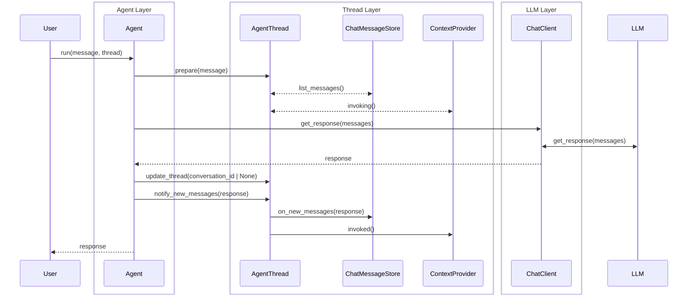
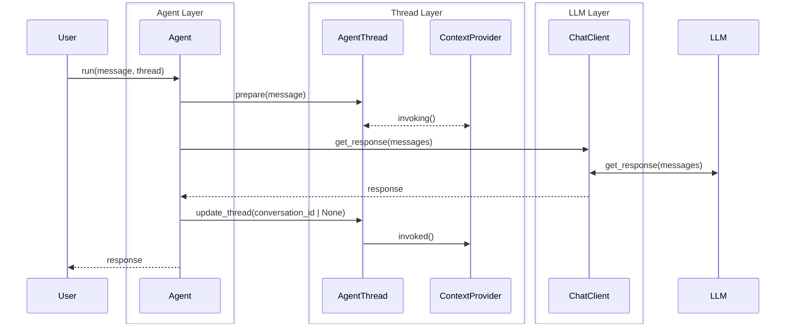
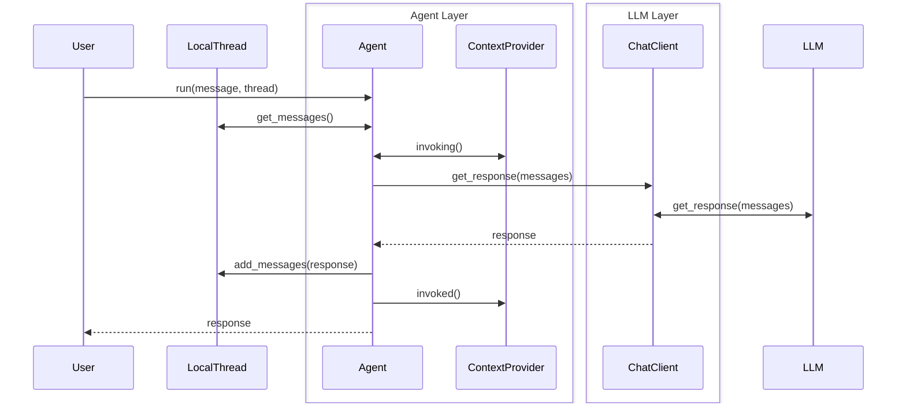
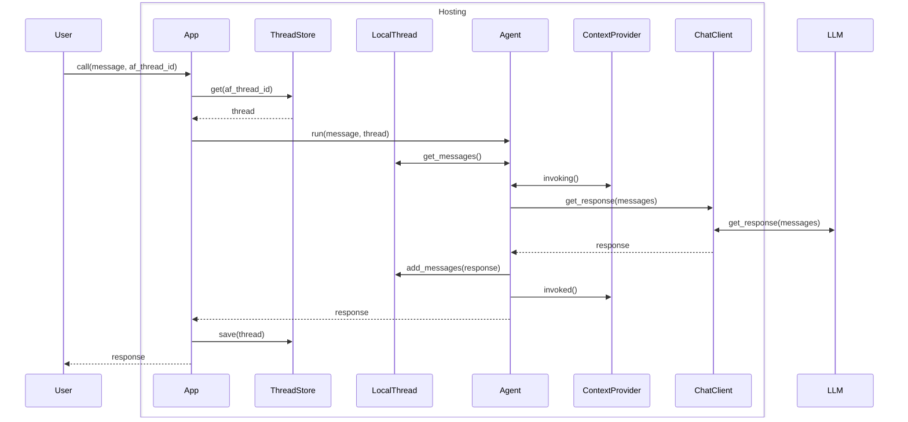

# Agent Threads in Python

## Context and Problem Statement

Currently in Python we use `threads` in the following way: we have a single thread class, called `AgentThread`, which is responsible for holding either a `ChatMessageStore` or a `service_thread_id`, but not both. It also has a `context providers` attribute, which is used to provide additional context to the agent when running in that thread.
- Generally you create a thread by calling `agent.get_new_thread()` which can take some arguments as well.
- It can then be used, if you use it by passing it to a `agent.run` or `agent.run_stream` call, with `store=True`, it will then attempt (if the chat client supports that) to create a thread in the service, we will then store the response_id as the `service_thread_id` in the `AgentThread` instance.
- If you use it with `store=False`, it will try to call the `ChatMessageStoreFactory` on the agent to get a new `ChatMessageStore` instance, which will then be stored in the `AgentThread` instance.
- However before all of that a thread is `uninitialized`, meaning it has neither a `ChatMessageStore` nor a `service_thread_id`.
- It also has a method called `on_new_messages` which does nothing when called to a thread that has a `service_thread_id`, but when called to a thread that has a `ChatMessageStore`, it will call the `add_messages` method of the `ChatMessageStore` instance.
This all means that at various moments a thread can be different things and have different behaviors, which can be confusing for users. It is also unclear which chat clients can support which type of thread, and what the implications are of using one or the other, in combination with the `store` parameter.
- We currently do not have additional thread types, such as a A2AAgentThread, which has a TaskID in addition to a service_thread_id.
- `ChatMessageStore` is mostly used as a simple list of `ChatMessage` instances, but can also have additional logic, such as persisting messages to a database, or loading messages from a database.
- There is a proposal to add a `AgentThreadStore` abstraction and a in-memory implementation, which would further complicate the current `AgentThread` class, this adds a id and save and load methods.
- Currently the thread is updated by the agent, based on the outcome of the whole run, so if the underlying chat client does function calling, we won't get the intermediate messages in the thread until the end of the run, this has raised a question as well, as users would like to have the thread updated during the run, so that they can see the intermediate messages, however this runs the risk of ending up with a thread that is not usable anymore, for instance because it is missing chunks (when streaming) or does not have function call results matching the function calls.

Current (simplified) state for a AgentThread with a ChatMessageStore in Python:

And for a thread with a service_thread_id (or `store=True`):

## Decision Drivers

- Ease of use: make it easy for users to understand how to use threads in the Python SDK -> Zen of Python: "Explicit is better than implicit".
- Clarity: make it clear what a thread is and what it can do.
- Ease of handling: make it easy to work with Threads and store them in a way that makes sense for the user.

## Considered Options

1. Current approach with a single `AgentThread` class that can hold either a `ChatMessageStore` or a `service_thread_id`.
1. Separate classes for remote thread and local thread, each with their own behaviors and methods.
1. Remove ChatMessageStore, use `list[ChatMessage]` in a local thread, and add a ThreadStore abstraction to handle persistence.

### 1. Current approach with a single `AgentThread` class that can hold either a `ChatMessageStore` or a `service_thread_id`.
- Good, because it is a single class that can be used for both types of threads.
- Good, because it is easy to create a new thread by calling `agent.get_new_thread()`.
- Good, because it is consistent with dotnet.
- Bad, because it can be confusing for users to understand the different states of a thread.
- Bad, because it is unclear which chat clients can support which type of thread.
- Bad, because dotnet also has subclasses for each type of agent, so already somewhat diverging from dotnet.

### 2. Separate classes for `ServiceThread`/`RemoteThread` and `LocalAgentThread`/`LocalThread`, each with their own behaviors and methods.
This approach would mean:
- Creating two subclasses of AgentThread, one for service threads and one for local threads, both with different attributes and methods.
- Removing `ChatMessageStore`, instead a LocalThread would have a list of ChatMessages as attribute, and the thread itself can be saved and restored.
- Moving `ContextProvider` back into Agent, replacing with a field `context_data`/`context_state` or a dict of `context_provider_name/id: context_data/state` on both thread types, which the agent would then use to get the context from the context providers when running in that thread. This makes the thread itself state-only, and the context provider can be stateless and live in the agent.
- The protocol/interface for ContextProviders would need a slight update, one to return a initial `context_data/state` object, the logic of which is maintained by the provider (whether it matches a app, user or session and what to record in there), and adding that `context_data/state` to the invoked and invoking methods. The `context_data/state` needs to be (de)serializable in a standard way, to make handling the thread easier.
- We would then add a flag on `ChatClients`, to indicate if they support `remote/service` threads, and we assume that we always support `local` threads.
- And finally, all Agents would get two methods, `get_service_thread(thread_id: str | None = None, ...)`/`get_remote_thread(thread_id: str | None = None, ...)` and `get_local_thread(messages: list[ChatMessage] | None = None, ...)`, both of which might raise an error if the chat client does not support that type of thread, after creation the agent then calls the context_provider(s) to get a `context_data/state` assigned as well.
- the `run` methods would take both types of threads, but would raise an error if the thread type is not supported by the chat client.
- If you pass a `LocalThread` to `run`, it would invoke the chat client with `store=False` and `conversation_id=None`, and if you pass a `RemoteThread`, it would invoke the chat client with `store=True` and the `conversation_id` from the thread (if any).
- Naming is a open question, options are:
    - for the remote threads:
        - `ServiceThread`
        - `RemoteThread`
        - `ServiceSideThread`
    - for the local threads:
        - `LocalAgentThread`
        - `LocalThread`
        - `ClientSideThread`

    `RemoteThread` and `LocalThread` seem the clearest and most concise options and the most pythonic.

So that gives the following:
- Good, because it is explicit about the type of thread being used.
- Good, because it is clear which chat clients support which type of thread.
- Good, because we can make all the logic that deals with threads much clearer, as each class has a single responsibility.
- Good, because it might also enable a abstracted method to get a list of chat messages from a thread through the chat client.
- Good, because the simplified state-only context data make the threads much easier to handle and store.

## Proposed Agent Thread Invocation Flow

### Local Thread Flow

The following diagram illustrates the flow when using a local thread. The `get_messages` and `add_messages` methods should be async and can thus be used to store a thread long-term, similar to the current ChatMessageStore. The `context providers` are invoked called from the agent.

### Remote Thread Flow

The following diagram illustrates the flow when using a remote/service thread. When the thread does not have a ID yet, it sets `store=True` and then it will be updated after the run.

```mermaid
sequenceDiagram
        participant User
        participant RemoteThread
    box Agent Layer
        participant Agent
        participant ContextProvider
    end
    box LLM Layer
        participant ChatClient
    end
        participant LLM

    User->>Agent: run(message, thread)
    Agent<<->>RemoteThread: overwrite store and conversation_id
    Agent<<->>ContextProvider: invoking()
    Agent->>ChatClient: get_response(messages)
    ChatClient<<->>LLM: get_response(messages)
    ChatClient-->>Agent: response
    Agent->>RemoteThread: update_thread_id(response)
    Agent->>ContextProvider: invoked()
    Agent-->>User: response
```

### Hosted app thread flow (local flow shown, same setup would apply to the remote flow)

In a hosted environment, such as Azure Functions or when creating a A2A agent, the app layer would be responsible for loading and saving the thread before and after the run, as illustrated below, having the simpler thread types makes this much simpler as well, and provides complete configurability to the ThreadStore and app layer on how they want to deal with threads. The `af_thread_id` in this diagram is just a placeholder for whatever ID the app layer wants to use to identify the thread.

## Decision Outcome

TBD
