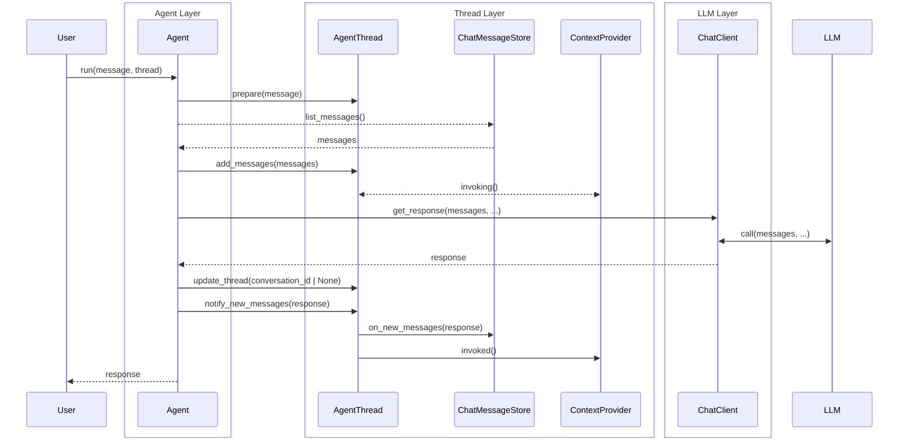
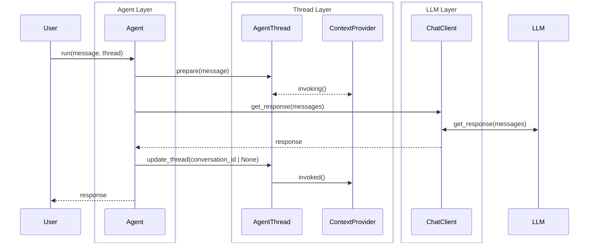
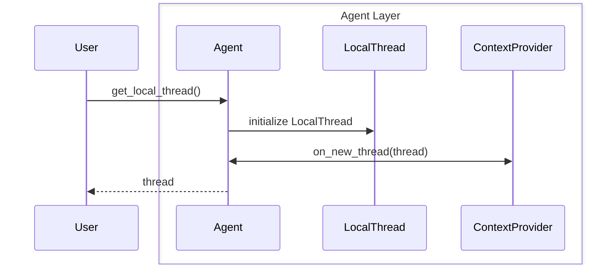
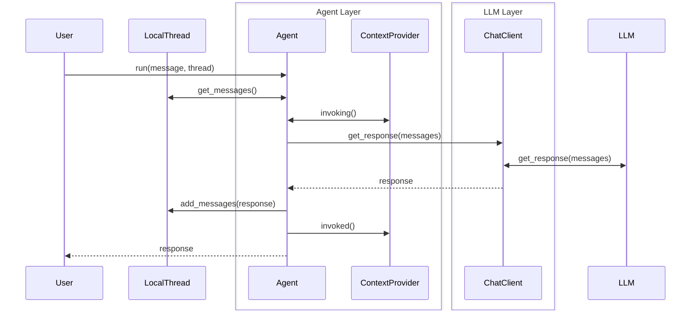
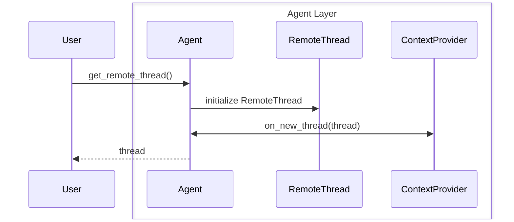
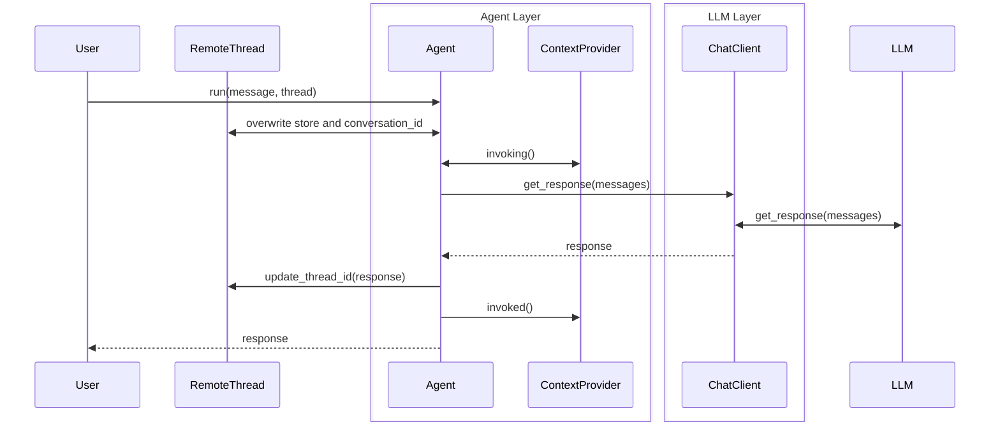
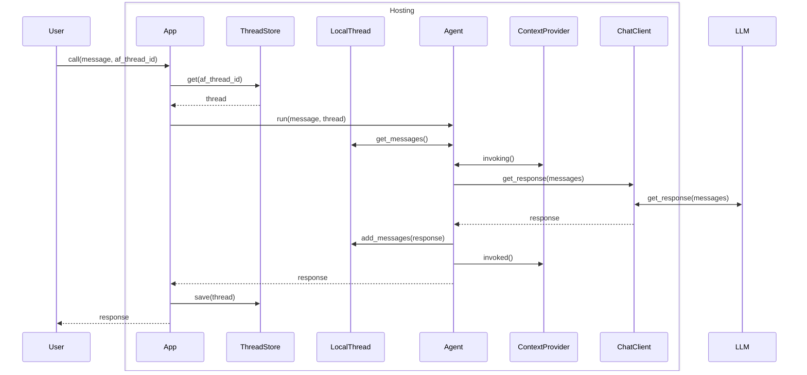

# Agent Threads Update

## Context and Problem Statement

Currently there are three main issues with the current thread setup. We have the following:
- `AgentThread` - contains: `service_thread_id`, `chat_message_store`, `context_providers`
- In dotnet there are also subclasses used such as `ChatClientAgentThread`, to handle additional logic.
- Ideally, developers create threads by calling `agent.get_new_thread()`, which can take some arguments as well.
- In python, we do not have the notion of protected methods, so we cannot prevent users from directly creating `AgentThread` instances, which can lead to confusion.

### Issue 1: Threads can have different behaviors based on their state
The first issue with threads is that depending on whether the `service_thread_id` is filled we treat it differently from a thread with `chat_message_store` filled, and when neither is filled it is considered uninitialized. Further, depending on the state, certain methods behave differently, such as `on_new_messages`, which is a no-op for threads with a `service_thread_id`, but calls `add_messages` on the `chat_message_store` for threads with that filled. When calling `agent.get_new_thread` it is also unclear what is referred to, a service side thread, a locally stored thread or neither. Finally, when passing in a thread of one type, but also setting the `store` and `conversation_id` parameters when calling `agent.run` might either raise a error, change something or does not work as expected.

### Issue 2: ChatMessageStore usage
The second issue is the usage of `ChatMessageStore` as the way to store messages locally, while it works well, it does not capture a whole thread, nor can it be used as a way to store either messages or a service id, leading to the need for a separate class that can store `AgentThread` objects, meaning we either need two abstractions and implementations, one for `ChatMessageStore` and one for `AgentThreadStore`, or we need to complicate the `AgentThread` class further by adding an id and save/load methods. Or people will forego using the ChatMessageStore altogether and just use a AgentThreadStore and the built-in in-memory ChatMessageStore. Giving us two versions of doing similar things: "storing threads", where one works for all thread (AgentThreadStore) and one only for local threads (ChatMessageStore).

### Issue 3: Thread serialization
Because we have both a `ChatMessageStore` object and a `ContextProvider` object inside a thread, it is quite a challenge to serialize and deserialize threads, as both the ChatMessageStore and ContextProviders can have configuration that needs to be serialized as well, including potentially hard to serialize things like clients, for which we would need to add dependency injection, and the logic of how to do that is contained in those classes. This makes it hard to create a standard way of serializing and deserializing threads, as each ChatMessageStore and ContextProvider can have different requirements.

### Logical flow of threads
The following diagrams illustrate the logical flow of an agent run with threads in the current implementation.

Current (simplified) state for a AgentThread with a ChatMessageStore in Python:

And for a thread with a service_thread_id (or `store=True`):

## Decision Drivers

- Ease of use: make it easy for users to understand how to use threads, one class, one purpose.
- Clarity: create a single way of storing and restoring threads that is clear and unambiguous.
- Ease of handling: make it easy to work with Threads and store them in a way that is easily serializable.

## Considered Options

1. Current approach with a single `AgentThread` class that can hold either a `ChatMessageStore` or a `service_thread_id`.
1. Separate classes for remote thread and local thread, each with their own behaviors and methods. Remove ChatMessageStore, use `list[ChatMessage]` in a local thread, and add a ThreadStore abstraction to handle persistence. Remove `ContextProvider`, replace with `context_data/state` on the thread, which the agent uses to get context from the providers when running in that thread.

### 1. Current approach with a single `AgentThread` class that can hold either a `ChatMessageStore` or a `service_thread_id`.
- Good, because it is a single class that can be used for both types of threads.
- Good, because it is easy to create a new thread by calling `agent.get_new_thread()`.
- Good, because it is consistent with dotnet.
- Bad, because it can be confusing for users to understand the different states of a thread.
- Bad, because it is unclear which chat clients can support which type of thread.
- Bad, because dotnet also has subclasses for each type of agent, so already somewhat diverging from dotnet.

### 2. Separate classes for `ServiceThread`/`RemoteThread` and `LocalAgentThread`/`LocalThread`, each with their own behaviors and methods.
This approach would mean:
- Creating two subclasses of AgentThread, one for service threads and one for local threads, both with different attributes and methods. Tentatively called `RemoteThread` and `LocalThread`.
- Removing `ChatMessageStore`, instead a `LocalThread` would have a list of ChatMessages as attribute.
- Moving `ContextProvider` back into Agent, replacing with a field `context_data`/`context_state` or a dict of `context_provider_name/id: context_data/state` on both thread types, which the agent would then use to get the context from the context providers when running in that thread. This makes the thread itself state-only, and the context provider can be stateless and live in the agent.
- The protocol/interface for ContextProviders would need a slight update, one to return a initial `context_data/state` object, the logic of which is maintained by the provider (whether it matches a app, user or session and what to record in there), and adding that `context_data/state` to the invoked and invoking methods. The `context_data/state` needs to be (de)serializable in a standard way, to make handling the thread easier.
- We would need to add a flag on `ChatClients`, to indicate if they support `remote/service` threads, and we assume that we always support `local` threads.
- All Agents would get two methods, `get_service_thread(thread_id: str | None = None, ...)`/`get_remote_thread(thread_id: str | None = None, ...)` and `get_local_thread(messages: list[ChatMessage] | None = None, ...)`, both of which might raise an error if the chat client does not support that type of thread, after creation the agent then calls the context_provider(s) to get a `context_data/state` assigned as well.
- The `run` methods would take both types of threads, but would raise an error if the thread type is not supported by the chat client.
- If you pass a `LocalThread` to `run`, it would invoke the chat client with `store=False` and `conversation_id=None`, and if you pass a `RemoteThread`, it would invoke the chat client with `store=True` and the `conversation_id` from the thread (if any). And this also means removing the `store` and `conversation_id` parameters from the `run` method at the agent level, as they would be redundant and potentially conflicting.
- Naming is a open question, options are:
    - for the remote threads:
        - `ServiceThread`
        - `RemoteThread`
        - `ServiceSideThread`
    - for the local threads:
        - `LocalAgentThread`
        - `LocalThread`
        - `ClientSideThread`

    `RemoteThread` and `LocalThread` seem the clearest and most concise options and the most pythonic.

So that gives the following:
- Good, because it is explicit about the type of thread being used. (solve for issue 1)
- Good, because it is clear which chat clients support which type of thread. (solve for issue 1)
- Good, because we can make all the logic that deals with threads much clearer, as each class has a single responsibility. (solve for issue 1 and 2)
- Good, because the simplified state-only context data make the threads much easier to handle and store. (solve for issue 2 and 3)

## Option 2 Agent Thread Invocation Flow

### Local Thread Flow

The following diagram illustrates the flow when using a local thread. The `get_messages` and `add_messages` methods should be async and can thus be used to store a thread long-term, similar to the current ChatMessageStore. The `context providers` are invoked by the agent, against it's own attribute.

Creating a thread:

Using the thread:

### Remote Thread Flow

The following diagram illustrates the flow when using a remote/service thread. When the thread does not have a ID yet, it sets `store=True` and then it will be updated after the run.

Creating a thread:

Using the thread:

### Hosted app thread flow (local flow shown, same setup would apply to the remote flow)

In a hosted environment, such as Azure Functions or when creating a A2A agent, the app layer would be responsible for loading and saving the thread before and after the run, as illustrated below, having the simpler thread types makes this much simpler as well, and provides complete configurability to the ThreadStore and app layer on how they want to deal with threads. The `af_thread_id` in this diagram is just a placeholder for whatever ID the app layer wants to use to identify the thread.

## Decision Outcome

TBD
