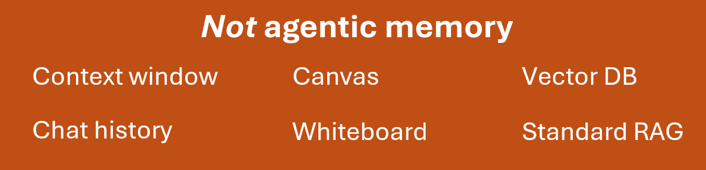
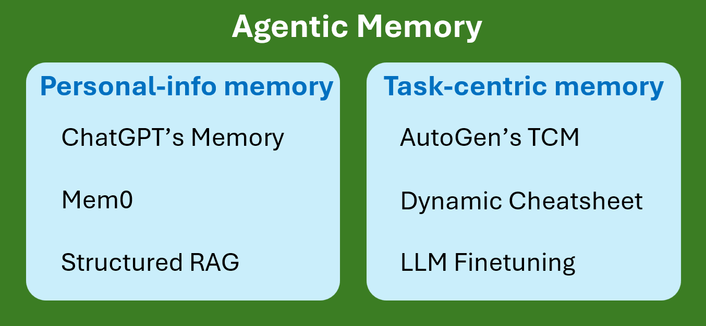

# Agentic Memory

The term 'memory' has been applied to many unrelated aspects of AI agents,
so we first clarify the scope of Agentic Memory by pointing out a few things that it excludes.

Chat history and the model's context window are sometimes referred to as memory or working memory,
and LangChain even provides explicit 'memory' classes for handling conversation history.
But for technical precision, we follow OpenAI's practice of never applying the term 'memory' to chat history or context windows. 

A convas or whiteboard is a type of state that some call memory,
but we recommend using the less loaded terms 'state' or 'data' for such information. 

Because agentic memory implementations often rely on vector databases,
the term 'memory' is sometimes extended to include vector stores themselves,
or any system (such as RAG) that retrieves data from vector stores for insertion into a context window.
But when talking about agents, we recommend defining 'memory' more narrowly than general information retrieval.

We define Agentic Memory as an agent's ability to store and retrieve memories in roughly human-like ways:

- Storing memories drawn from the agent's experience, including its interactions with users or other agents.
- Recalling selective memories as needed, such as for insertion into the context window of a later chat.

To illustrate these concepts, imagine the straightforward approach of treating prior chats as documents,
then applying standard RAG by chunking the chats, indexing and storing them in a vector DB,
and later retrieving into the context window any chunks that closely match a user turn.
While relatively easy to implement (given an existing RAG system),
this approach inherits the poor precision and recall of standard RAG. 

This highlights the crucial importance of evaluations.
For further discussion below, it's useful to distinguish among three progressive stages of any AI system evaluation:

1. Proof-of-concept evaluations, to assess whether a proposed system is worth trying to develop further.
2. Extended evaluations, to guide the improvement and building out of the system. This is where most of the evaluation-driven development occurs, and where most of a system's problems are discovered and resolved. Choosing an evaluation that is misaligned with the downstream target scenario can waste time and even guide the system's development in the wrong direction.
3. Deployed evaluations, to measure how well the complete system meets customer needs, and guide further improvements.

Evaluations of agentic memory are necessarily more complex and challenging than evaluation of agents without memory,
because the agent's performance at any point in time is conditioned on the full contents of its memory. 

### Types of agentic memory

AutoGen pioneered agentic memory in 2023 with its [Teachable Agents](https://microsoft.github.io/autogen/0.2/blog/2023/10/26/TeachableAgent/),
drawing attention to the importance of memory persistence beyond the context window, and giving developers a fully functional implementation.
Teachable Agents were designed to learn facts, preferences, and task-solving skills through ordinary chats with users.
To avoid the poor performance of standard RAG, Teachable Agents used LLMs to extract potentially useful information and skills from each user turn,
then stored that information in a vector DB and associated structures for later retrieval.
POC evaluations were included in AutoGen as code samples. We performed no extended evaluations,
but several members of the AutoGen community applied Teachable Agents to their own use cases.

Since 2023, research into agentic memory has made further progress by branching into two largely separate categories
that we refer to as Personal-Info Memory and Task-Centric Memory, covered below.

## Personal-Info Memory

The great majority of the agentic memory systems developed since 2023 can be categorized as personal-info memory,
which is designed to store information about the user such as biographical details, user preferences,
and a chronology of events in the user's life. Mem0 and ChatGPT's Memory feature are well known examples.
The main open question regarding personal-info memory is how much perceived benefit it can deliver to users at the end of the day.

We highlight three important examples of personal-info memory.

### ChatGPT's Memory Feature

In 2024, OpenAI rolled out a [memory feature](https://help.openai.com/en/articles/8590148-memory-faq) in ChatGPT
that is very similar to the personal-info memory aspects of AutoGen's Teachable Agents.
The details of OpenAI's implementation and internal evaluations have not been made public.
The memory feature has prompted mixed anecdotal accounts from users, with some citing good results like giving good movie recommendations,
and others turning the feature off to avoid degradation of generations.

### Mem0

Recent evaluations on LOCOMO (a dataset of chats and queries involving personal information)
indicate that the best open source implementation of personal-info memory is [Mem0](https://github.com/mem0ai/mem0),
for which the company [mem0.ai](https://mem0.ai/) also provides a live service.
In the _Azure Search Agent Memory Strategy_ document authored by Farzad Sunavala in preparation for Ignite 2025,
an approach similar to Mem0 is called the Memory Fact Store. We plan to integrate Mem0 into the Agent Framework,
based on a PR submitted recently by the AutoGen community. This Mem0 integration uses AutoGen's Memory protocol.
In addition, Wesley Stein has recently added an integration of Mem0 to Semantic Kernel.

### Structured RAG

A markedly different implementation of personal-info memory is being developed by the TypeAgent team in Microsoft OCTO, as called out by Kevin Scott as Build 2025.
[Structured RAG](https://github.com/microsoft/TypeAgent/blob/main/docs/content/architecture/memory.md) uses relational databases
instead of vector DBs for improved precision, recall, and speed.
We are in communication with the TypeAgent team regarding potential integration of Structured RAG
into the Agent Framework after their API stabilizes in August, 2025.

## Task-Centric Memory

Unlike personal-info memory, task-centric memory is designed to create agents that quickly learn to perform tasks
faster and more reliably through their own trial-and-error experience, with or without user guidance
(which was required for Teachable Agents to learn task-solving skills).
Despite overlapping a bit with personal-info memory, these two forms of agentic memory are disjoint in most respects.
One can imagine certain tasks (like "Recommend a movie I would enjoy watching tonight") which personal-info memory
would help the agent solve. But for tasks in general,
there is no reason to expect that personal-info memory can fill the role of task-centric memory,
and we find no reports of such results in the literature.

For years, Kevin Scott has emphasized the need for what he terms "real agentic memory", which matches our definition.
He argues that in order for agents to become expert coworkers, they need the ability to recall their past deliberations
and learnings in solving tasks so that they don't have to learn how to solve the same problem over and over.
Kevin expects that agents with such memory will be highly capable and "sticky", so that users will use them more and more.
And he predicts that this kind of agentic memory will become "one of the most powerful things in the universe of AI".

While it is widely recognized that an agent's ability to learn from its on-the-job experience would be highly valuable,
open questions remain about how to effectively implement task-centric memory for realistic user scenarios at scale.
Because of the size of this challenge, very few implementations of task-centric memory have been publicly reported.
As of May, 2025, we are aware of only two such implementations for general domains:
AutoGen's Task-Centric Memory (TCM), and Dynamic Cheatsheet (DC).

### AutoGen's Task-Centric Memory (TCM)

To the best of our knowledge, AutoGen's Task-Centric Memory (January, 2025) is the first implementation of this form of agentic memory.
TCM uses LLMs to extract useful 'insights' from user teachings, demonstrations, and (unlike Teachable Agents)
from the agent's own trial-and-error experience, where an insight is any text that could help the agent complete a set of similar tasks more effectively.
Sample code in AutoGen provides POC evaluations of TCM learning quickly from user teachings, demonstrations,
and the agent's own experience. Additional POC evaluations on the standard AIME benchmark show that memories retrieved
using TCM can dramatically boost the performance of reasoning models like o4-mini while reducing the number of reasoning tokens required. 

In the [Magentic-UI](https://github.com/microsoft/magentic-ui) system recently released by MSR AI Frontiers,
TCM is used to store and flexibly retrieve plans for solving tasks.
As part of that work, we performed extended evaluations of TCM on GAIA tasks chosen to match the type of tasks
that Magentic-UI users are expected to assign. These rigorous evaluations showed that TCM's precision and recall were near 100%,
which was much higher than what a vector DB alone provided on the same evaluations. 

We plan to continue TCM's evaluation-driven development in preparation for releasing TCM to Azure customers
as part of the Foundry Agent Service, which we expect will provide significant differentiation
over competing agent services that lack task-centric memory.

### Dynamic Cheatsheet (DC)

The second implementation of task-centric memory that we have seen is the open source [Dynamic Cheatsheet](https://arxiv.org/pdf/2504.07952)
(arXiv, April, 2025).
The implementations of DC and TCM are very different. But DC's evaluations on the AIME benchmark are interesting,
and we plan to investigate DC further for potential usage as a baseline for comparison to TCM.

### LLM Finetuning

LLM finetuning can be seen as a slow form of task-centric memory, since new information and task-solving skills
can be trained into LLMs through standard finetuning techniques. Finetuning is currently far too slow
to be considered a form of task-centric memory as we define it here. But if the sample efficiency of LLM finetuning
continues to improve, it may eventually become a viable form of fast memory.

Even before reaching that point, task-centric memories stored by TCM can be used as finetuning data,
effectively offloading accumulated memories into the LLM weights.
We have no immediate plans to pursue this in the Agent Framework, but by the end of 2025 it may become a priority.

## Conclusion

AutoGen's success in the AI community was built by repeatedly pushing the boundaries of what was possible at any given time,
in AI agents, multi-agent solutions, agentic memory, and the underlying protocols to tie it all together.
For the Agent Framework to continue this forward-looking thought leadership, we should integrate functional implementations
of personal-info memory into the framework, and continue our evaluation-driven development of
Task-Centric Memory to achieve strong product differentiation among agent frameworks.
