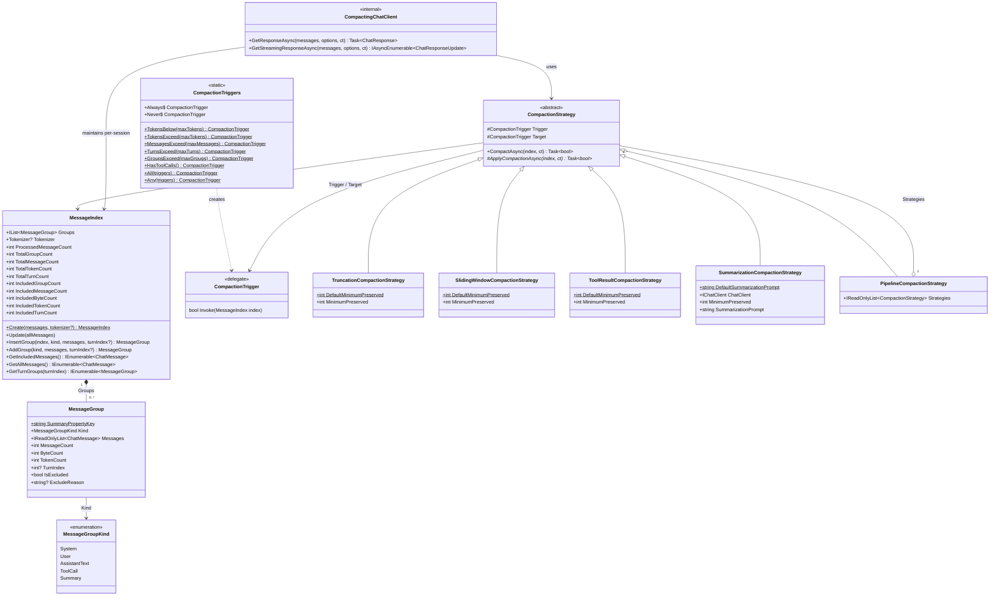
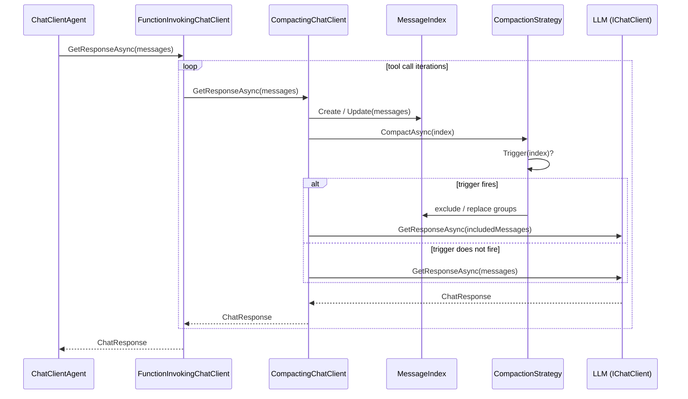

# Microsoft.Agents.AI.Compaction Namespace

This document describes the types in the `Microsoft.Agents.AI.Compaction` namespace and how they
relate to each other.

## Overview

Context compaction keeps the message list sent to an LLM within its context-window limit.
The namespace provides:

- **Strategies** – classes that decide _how_ to reduce messages (truncation, sliding-window, tool-result
  collapse, LLM summarization, or a sequential pipeline of the above).
- **Triggers** – predicates that decide _when_ a strategy should run (e.g. token threshold exceeded).
- **MessageIndex / MessageGroup** – the structural model strategies operate on, grouping raw
  `ChatMessage` objects into atomic, compaction-safe units.
- **CompactingChatClient** – the internal `IChatClient` middleware that runs in-run compaction
  before every LLM call inside the tool loop.

Compaction can be applied at three lifecycle points:

| Point | Mechanism |
|---|---|
| **In-run** (before each LLM call during the tool loop) | `ChatClientAgentOptions.CompactionStrategy` → `CompactingChatClient` |
| **Pre-write** (before messages are persisted via `ChatHistoryProvider`) | `InMemoryChatHistoryProviderOptions.ChatReducer` |
| **On existing storage** (maintenance operation) | Call `CompactionStrategy.CompactAsync` directly |

## Class Diagram

## Lifecycle: In-Run Compaction

The following sequence diagram shows the call flow when in-run compaction is configured via
`ChatClientAgentOptions.CompactionStrategy`.

## Key Design Decisions

- **Atomic grouping** – `MessageIndex` groups an assistant tool-call message together with its
  tool-result messages into a single `MessageGroupKind.ToolCall` group. Compaction strategies
  only exclude or replace whole groups, so the tool-call/result invariant required by the LLM
  API is never broken.
- **Trigger / Target separation** – every `CompactionStrategy` holds two predicates. The
  _trigger_ decides whether to start compacting; the optional _target_ decides when to stop.
  When no target is supplied it defaults to `!trigger`, so compaction runs until the trigger
  condition would no longer fire.
- **Exclusion semantics** – strategies mark groups as `IsExcluded` rather than removing them.
  Excluded groups are still held in the `MessageIndex` and can be inspected for diagnostics or
  written to storage.
- **Incremental update** – `MessageIndex.Update` appends only new messages without
  re-processing previously grouped messages, so per-session state can be cached and reused
  across tool-loop iterations.
- **Pipeline composition** – `PipelineCompactionStrategy` applies multiple strategies in
  sequence on the same `MessageIndex`, enabling layered policies (e.g. collapse tool results
  first, then summarize, then truncate if necessary).
