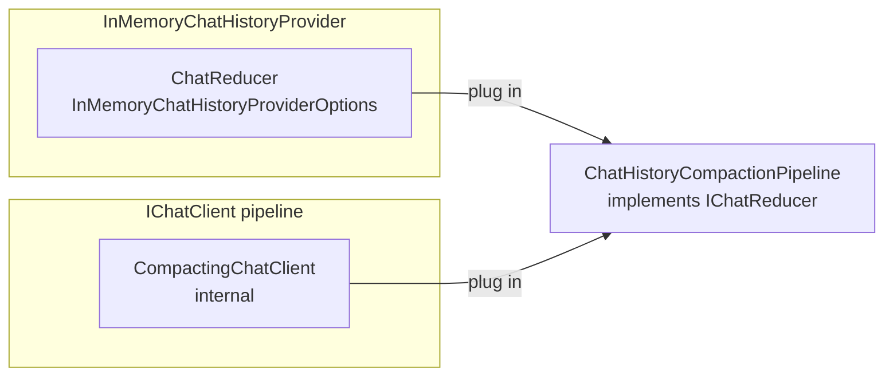

# Microsoft.Agents.AI.Compaction — Namespace Design

This document describes the types in the `Microsoft.Agents.AI.Compaction` namespace and how they relate to each other.

The compaction system manages long-running chat histories by reducing token and message counts before they exceed model context limits.  Two integration points exist:

- **Pre-write compaction** – `InMemoryChatHistoryProviderOptions.ChatReducer` runs the pipeline when messages are stored or retrieved.
- **In-run compaction** – a `CompactingChatClient` inserted into the `IChatClient` pipeline runs compaction on every inference call.

`ChatHistoryCompactionPipeline` implements `IChatReducer`, so it can be used at either integration point.

## Class Diagram

```mermaid
classDiagram
    direction TB

    %% ── External contracts (Microsoft.Extensions.AI) ─────────────────────
    class IChatReducer {
        <<interface>>
        +ReduceAsync(messages, cancellationToken) Task~IEnumerable~ChatMessage~~
    }

    class IChatClient {
        <<interface>>
    }

    %% ── Core namespace interface ──────────────────────────────────────────
    class IChatHistoryMetricsCalculator {
        <<interface>>
        +Calculate(messages) ChatHistoryMetric
    }

    %% ── Pipeline ──────────────────────────────────────────────────────────
    class ChatHistoryCompactionPipeline {
        +ReduceAsync(messages, cancellationToken) Task~IEnumerable~ChatMessage~~
        +CompactAsync(messages, cancellationToken) CompactionPipelineResult
        +Create(approach, size, chatClient)$ ChatHistoryCompactionPipeline
    }

    class PipelineApproach["ChatHistoryCompactionPipeline.Approach"] {
        <<enum>>
        Aggressive
        Balanced
        Gentle
    }

    class PipelineSize["ChatHistoryCompactionPipeline.Size"] {
        <<enum>>
        Compact
        Adequate
        Accomodating
    }

    %% ── Abstract base strategy ────────────────────────────────────────────
    class ChatHistoryCompactionStrategy {
        <<abstract>>
        +Reducer IChatReducer
        +Name string
        #ShouldCompact(metrics) bool*
        ~CompactAsync(history, calculator, ct) CompactionResult
        #CurrentMetrics$ ChatHistoryMetric
    }

    %% ── Concrete strategies ───────────────────────────────────────────────
    class ChatReducerCompactionStrategy {
        +ChatReducerCompactionStrategy(reducer, condition)
        #ShouldCompact(metrics) bool
    }

    class ToolResultCompactionStrategy {
        +DefaultPreserveRecentGroups$ int
        +ToolResultCompactionStrategy(maxTokens, preserveRecentGroups)
        #ShouldCompact(metrics) bool
    }

    class SummarizationCompactionStrategy {
        +DefaultSummarizationPrompt$ string
        +SummarizationCompactionStrategy(chatClient, maxTokens, preserveRecentGroups, prompt)
        #ShouldCompact(metrics) bool
    }

    class SlidingWindowCompactionStrategy {
        +SlidingWindowCompactionStrategy(maxTurns)
        #ShouldCompact(metrics) bool
    }

    class TruncationCompactionStrategy {
        +TruncationCompactionStrategy(maxTokens, preserveRecentGroups)
        #ShouldCompact(metrics) bool
    }

    %% ── Metrics & calculator ──────────────────────────────────────────────
    class DefaultChatHistoryMetricsCalculator {
        +Instance$ DefaultChatHistoryMetricsCalculator
        +DefaultChatHistoryMetricsCalculator(charsPerToken)
        +Calculate(messages) ChatHistoryMetric
    }

    class ChatHistoryMetric {
        +TokenCount int
        +ByteCount long
        +MessageCount int
        +ToolCallCount int
        +UserTurnCount int
        +Groups IReadOnlyList~ChatMessageGroup~
    }

    %% ── Message grouping ──────────────────────────────────────────────────
    class ChatMessageGroup {
        <<struct>>
        +StartIndex int
        +Count int
        +Kind ChatMessageGroupKind
    }

    class ChatMessageGroupKind {
        <<enum>>
        System
        UserTurn
        AssistantToolGroup
        AssistantPlain
        ToolResult
        Other
    }

    %% ── Result types ──────────────────────────────────────────────────────
    class CompactionResult {
        +StrategyName string
        +Applied bool
        +Before ChatHistoryMetric
        +After ChatHistoryMetric
        +Skipped(name, metrics)$ CompactionResult
    }

    class CompactionPipelineResult {
        +Before ChatHistoryMetric
        +After ChatHistoryMetric
        +StrategyResults IReadOnlyList~CompactionResult~
        +AnyApplied bool
    }

    %% ── Relationships ─────────────────────────────────────────────────────

    %% Pipeline implements IChatReducer so it can plug into any reducer slot
    ChatHistoryCompactionPipeline ..|> IChatReducer : implements

    %% Pipeline owns an ordered set of strategies
    ChatHistoryCompactionPipeline "1" *-- "1..*" ChatHistoryCompactionStrategy : executes in order

    %% Pipeline uses a metrics calculator
    ChatHistoryCompactionPipeline --> IChatHistoryMetricsCalculator : uses

    %% Pipeline produces an aggregate result
    ChatHistoryCompactionPipeline --> CompactionPipelineResult : returns

    %% Factory enums are nested inside the pipeline
    ChatHistoryCompactionPipeline --> PipelineApproach : factory param
    ChatHistoryCompactionPipeline --> PipelineSize : factory param

    %% Each strategy wraps an IChatReducer for the actual reduction work
    ChatHistoryCompactionStrategy --> IChatReducer : wraps

    %% Strategies evaluate metrics to decide whether to compact
    ChatHistoryCompactionStrategy --> ChatHistoryMetric : evaluates

    %% Strategy execution produces a per-strategy result
    ChatHistoryCompactionStrategy --> CompactionResult : returns

    %% Concrete strategy inheritance
    ChatReducerCompactionStrategy --|> ChatHistoryCompactionStrategy
    ToolResultCompactionStrategy --|> ChatHistoryCompactionStrategy
    SummarizationCompactionStrategy --|> ChatHistoryCompactionStrategy
    SlidingWindowCompactionStrategy --|> ChatHistoryCompactionStrategy
    TruncationCompactionStrategy --|> ChatHistoryCompactionStrategy

    %% SummarizationCompactionStrategy calls an LLM to generate summaries
    SummarizationCompactionStrategy --> IChatClient : calls for summarization

    %% Default calculator implements the interface
    DefaultChatHistoryMetricsCalculator ..|> IChatHistoryMetricsCalculator : implements

    %% Calculator produces metrics
    DefaultChatHistoryMetricsCalculator --> ChatHistoryMetric : produces

    %% Metric contains groups
    ChatHistoryMetric "1" *-- "0..*" ChatMessageGroup : contains

    %% Group is classified by kind
    ChatMessageGroup --> ChatMessageGroupKind : typed by

    %% Pipeline result aggregates per-strategy results
    CompactionPipelineResult "1" *-- "1..*" CompactionResult : aggregates

    %% Each result references before/after metrics
    CompactionResult --> ChatHistoryMetric : before / after
```

## Type Overview

### Pipeline

| Type | Role |
|------|------|
| `ChatHistoryCompactionPipeline` | Orchestrates an ordered chain of strategies; implements `IChatReducer` for drop-in use |
| `ChatHistoryCompactionPipeline.Approach` | Factory enum — `Aggressive`, `Balanced`, `Gentle` |
| `ChatHistoryCompactionPipeline.Size` | Factory enum — `Compact`, `Adequate`, `Accomodating` |

### Strategies

| Type | Trigger | Effect |
|------|---------|--------|
| `ToolResultCompactionStrategy` | Token count > threshold **and** tool calls present | Collapses old `AssistantToolGroup` entries into `[Tool calls: …]` summaries (gentlest) |
| `SummarizationCompactionStrategy` | Token count > threshold | Sends older messages to an LLM and replaces them with a single summary |
| `SlidingWindowCompactionStrategy` | User-turn count > threshold | Keeps the N most-recent user turns and drops the rest |
| `TruncationCompactionStrategy` | Token count > threshold | Drops oldest non-system groups until within budget (most aggressive) |
| `ChatReducerCompactionStrategy` | Custom `Func<ChatHistoryMetric, bool>` | Delegates to any `IChatReducer` with caller-supplied trigger logic |

### Data Models

| Type | Description |
|------|-------------|
| `ChatHistoryMetric` | Immutable snapshot of a conversation: token count, byte count, message count, tool-call count, user-turn count, and a `Groups` index |
| `ChatMessageGroup` | Value type identifying a contiguous, atomic slice of the message list (`StartIndex`, `Count`, `Kind`) |
| `ChatMessageGroupKind` | `System` · `UserTurn` · `AssistantToolGroup` · `AssistantPlain` · `ToolResult` · `Other` |
| `IChatHistoryMetricsCalculator` | Computes a `ChatHistoryMetric` from a message list |
| `DefaultChatHistoryMetricsCalculator` | Default implementation using JSON-length heuristics for token estimation |

### Results

| Type | Description |
|------|-------------|
| `CompactionResult` | Outcome of a single strategy: `StrategyName`, `Applied`, `Before`/`After` metrics |
| `CompactionPipelineResult` | Aggregate outcome of the full pipeline: overall `Before`/`After` metrics and per-strategy `StrategyResults` |

## Integration Points

`ChatHistoryCompactionPipeline` can be wired in at either location, or both, to apply compaction before messages are stored/retrieved **and** on every inference call.
