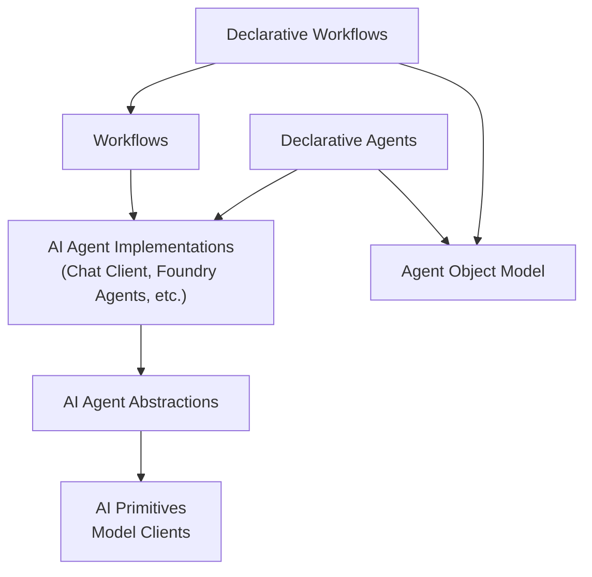

# Guidance for Language Ports

## Overview

This document provides some general guidance for teams considering creating a language port of Microsoft Agent Framework.

Some expectations for language ports:

    - Provide an idiomatic API i.e., they should avoid being just a port from .NET or Python.
    - Keep in sync with the main implementations, in particular a developer should be able to run a declarative agent or workflow in any language version and have cosnsistent behavior.
    - Provide all of the production read features e.g. observability using the OTel semantic AI conventions. 

### Out of Scope

The following aspects of the Microsoft Agent Framework are out of scope for this version of the document:

1. Agent and Workflow Hosting
2. AG-UI integration
3. Durable Task extension
4. Agent runtime

## General Guidance

1. Feature Compatibility
    - Language ports **must** have all of the core abstractions defined for model clients, agents and workflows.
    - Language ports **must** provide compatability with delcarative agents and workflows.
    - Language ports **should** provide the same integrations as the Python and .NET versions where client libraries are available.
2. Idiomatic Conventions
    - Adhere to the idiomatic practices of the target programming language (e.g., naming conventions, design patterns).
    - Leverage the native data types and structures of the target language for better integration.
    - Implement error handling in a way that is considered standard for the target language.
3. Testing
    - Implement a comprehensive suite of unit tests for all functionalities, the target for GA is to have 80% unit test coverage.
    - Provide integration tests ensure the SDK works correctly with external dependencies or services.
    - Unit tests **must** run on all PR's when they are created our updated.
    - Integration tests **must** run before PR's are merged to main.
4. Documentation
    - Create clear and thorough API documentation for the new SDK, including examples and use cases.
    - Update the learn site documentation with language pivots for the new language.
    - Documentation will be published here: https://learn.microsoft.com/agent-framework/
5. Code Signing and Security
    - Where applicable implement a process for signing the SDK for distribution to ensure authenticity and integrity.
    - Follow best practices for secure code signing, code scanning, etc.
6. Release Pipelines
    - Establish a versioning scheme (e.g., Semantic Versioning) to track changes and updates. Allow developers to distingush between GA and pre-release versions of the packages.
    - Implement automated build processes to streamline SDK packaging and distribution in adherence with Microsoft best practices. Work with the core team to set up these pipelines.
    - Determine the appropriate channels for distributing the SDK (e.g., package managers, GitHub releases).
    - Publish releases on GitHub e.g. https://github.com/microsoft/agent-framework/releases
7. Community Engagement
    - Use GitHub issues for users to provide feedback and report issues.
    - Plan to engage in the Agent Framework Office Hours.
    - Define contribution guidelines in line with: https://github.com/microsoft/agent-framework/blob/main/CONTRIBUTING.md
8. Maintenance and Updates
    - Create a roadmap for future features, enhancements, and maintenance.
    - Plan for regular updates and bug fixes based on user feedback and evolving requirements.
    - Define a strategy for providing new features as experimental initially to help stablise changes and avoid breaking changes.

## Microsoft Agent Framework Layering

#### Declarative Workflows

Microsoft Agent Framework supports a delcartive format for workflows which is shared with other teams within Microsoft e.g. Foundry Workflows. The declarative format uses YAML as the file format and the schema is implemented by the Agent Object Model.

For examples of declarative workflows go [here](https://github.com/microsoft/agent-framework/tree/main/workflow-samples)

#### Declarative Agents

Microsoft Agent Framework supports a delcartive format for agents which is shared with other teams within Microsoft e.g. Copilot Studio agents. The declarative format uses YAML as the file format and the schema is implemented by the Agent Object Model.

For examples of declarative agents go [here](https://github.com/microsoft/agent-framework/tree/main/agent-samples)

For more information on the schema used for single agents go [here](https://github.com/microsoft/AgentSchema).

#### Workflows

Microsoft Agent Framework Workflows enables developers to build intelligent automation systems that seamlessly blend AI agents with business processes. It provides type-safe architecture so developers can orchestrate complex workflows.

For more information on workflows go [here](https://learn.microsoft.com/en-us/agent-framework/user-guide/workflows/overview).

#### AI Agent Implementations

Microsoft Agent Framework provides agent implementations for the following services:

- Chat completion services such as Azure OpenAI, OpenAI, Anthropic, Ollama, Amazon Bedrock, ...
- Agent services such as Foundry Agent Service, OpenAI Assistants, ...

For more information on supported agent types go [here](https://learn.microsoft.com/en-us/agent-framework/user-guide/agents/agent-types/).

#### AI Agent Abstractions

The AI Agent abstractions are the agentic primitives defined by Microsoft Agent Framework. These primitives allow runnable agents to be defined and different agents context strategies to be integrated. Agents defined using these abstractions can be orchestrated using the Workflows component.

#### AI Primitives & Model Clients

The AI Primitives allow developers to integrate and interact with a growing variety of artificial intelligence (AI) services in their apps. Microsoft Agent Framework takes Microsoft.Extensions.AI.Abstractions as a dependency for the .NET version and the team has also ported these abstractions to Python. If the language already has a set of AI Primitives and associated model clients that developers use consider building on top of these. This will save a lot of time, provide better coverage and reduce friction for developers.

For more information on Microsoft.Extensions.AI.Abstractions go [here](https://github.com/dotnet/extensions/blob/main/src/Libraries/Microsoft.Extensions.AI.Abstractions/README.md)

#### Agent Object Model

The Agent Object Model is used for declarative agents and workflows. It provides the model objects required for declarative works which are created using Foundry and Copilot Studio.

For more information on the schema used for single agents go [here](https://github.com/microsoft/AgentSchema).

## High-Level Plan for Porting Microsoft Agent Framework

1. Project Setup
    - Create GitHub Repository:
        - Name the repository agent-framework-<language>.
        - Consider making the repository private initially to control access during development.
        - Ensure the repository is compliant with Microsoft OS requirements.
    - Define Repository Structure:
        - Organize the repository to reflect the layered architecture (e.g., src/, tests/, docs/).
    - Set Up Development Environment:
        - Choose tools and frameworks that align with the target language.
        - Set up a local development environment, including IDEs and dependencies.
    - Set up teams, branch protection rules, security settings, initial GitHub actions
        - Code reviews **must** be required, main repo requires two reviews from code owners.
        - Recommendation is to start with the same setup as the main repo and adjust based on team preferences.
2. Establish Initial Documentation
    - Create a README:
        - Follow pattern established in the main repo e.g. https://github.com/microsoft/agent-framework/blob/main/README.md
    - Define Contribution Guidelines:
        - Outline how contributors can participate, including code style, branching strategy, and testing expectations e.g. https://github.com/microsoft/agent-framework/blob/main/CONTRIBUTING.md
3. Layered Development Approach
    - Start with AI Primitives:
      - Implement the foundational AI primitives, adhering to patterns established in Microsoft.Extensions.AI.
      - Ensure all basic functionalities are covered, including data types and core algorithms.
    - Develop Agent Abstractions:
      - Define interfaces and abstract classes that will serve as the foundation for agent implementations.
      - Ensure these abstractions are idiomatic to the target language.
    - Implement Agent Implementations:
      - Focus on creating agent implementations, prioritizing:
        - Chat client-based agents (e.g., Azure OpenAI, OpenAI, Anthropic).
        - Foundry agents.
      - Ensure each implementation adheres to the defined abstractions and is tested thoroughly.
    - Create Workflows:
      - Develop workflow capabilities that allow for the orchestration of agent actions.
      - Include mechanisms for defining, executing, and managing workflows.
    - Implement Multi-Agent Orchestrations:
      - Create systems to manage and coordinate interactions between multiple agents.
      - Ensure that the orchestration layer can handle communication and data exchange between agents.
    - Build Declarative Agents:
      - Implement declarative agents that can be defined using YAML definition rather than imperative coding.
    - Develop Declarative Workflows:
      - Implement declarative workflows that can be defined using YAML definition rather than imperative coding.
4. Testing Strategy
    - Unit Tests:
      - Implement unit tests for each layer, ensuring that each component functions correctly in isolation. Minimum test coverage is 80%.
    - Integration Tests:
      - Develop integration tests that verify the interaction between different components, particularly between agents and workflows.
    - Continuous Integration:
      - Set up a CI pipeline to automate testing and ensure code quality with every commit.
5. Documentation and Community Engagement
    - API Documentation:
      - Create detailed API documentation as components are developed, using tools that support the target language.
    - User Guides:
      - Extend existing docuiemntation to cover the new language by adding a language pivot.
6. Public Release
    - Public preview:
      - Once the SDK is stable and documented, consider making the repository public.
      - Publish packages that are clearly marked as a pre-release.
    - GA release:
      - Minimal functionality is complete, verify using customer feedback.
      - Required test coverage (unit and integration) is in place.
      - Documentation is complete and published (including API documentation).
      - Release processes have all been completed (security reviews, ...)
