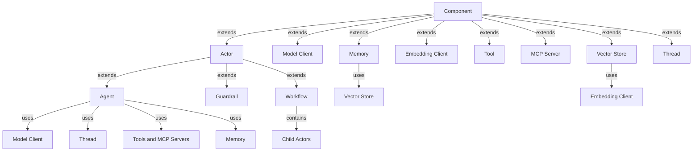

# Agent Framework: Overview

What values does the framework provide?

- A set of configurable, extensible and high-quality components (e.g., model clients, tools, MCP servers and memory).
- An easy path for deploying, securing and scaling applications, both locally and in the cloud.
- A set of tools for monitoring, debugging, evaluation and optimization, both locally and in the cloud.
- A community of developers and users for support, ideas, and contributions, benefiting everyone in the ecosystem.

What is this document?

- An overview of the new framework.
- Defining the major elements of the framework and their relationships.
- Detailed design of each element and its implementation will be in a separate document.

Table of Contents

- [Core Data Types](#core-data-types)
- [Component](#component)
- [Agent Components](#agent-components)
  - [Model Client](#model-client)
  - [Vector Store and Embedding Client](#vector-store-and-embedding-client)
  - [Tool](#tool)
  - [MCP Server](#mcp-server)
  - [Memory](#memory)
  - [Thread](#thread)
- [Actor Components](#actor-components)
  - [Agent](#agent)
  - [Guardrail](#guardrail)
  - [Workflow](#workflow)
- [Deployment and Scaling](#deployment-and-scaling)
- [Monitoring](#monitoring)
- [Evaluation](#evaluation)
- [Debugging](#debugging)

## Core Data Types

To unify the interaction between components, we define a set of core
data types.

For example, text, images, function calls, tool schema are
all examples of such data types.
These data types are used to interact with agent components (model clients, tools, MCP, threads, and memory),
forming the connective tissue between those components.

In AutoGen, these are the data types mostly defined in `autogen_core.models` module,
and others like `autogen_core.Image` and `autogen_core.FunctionCall`. This is just
an example as AutoGen has no formal definition of model context.

A design goal of the new framework to simplify the interaction between agent components
through a common set of data types, minimizing boilerplate code
in the application for transforming data between components.

We can start with a set of data types based on Microsoft.Extension.AI and MCP.

## Component

A component is a class that provides a specific functionality and can be used
independently by applications.

Components can be composed to create complex components. For example,
an agent can be composed from model clients, tools and memory,
and a tool can be composed from an agent or a workflow.
It is the responsibility of the framework to validate components
and their composition,
and ensure the lifecycle of the components are managed correctly.

A component can be created from a set of serializable configuration parameters,
with the help of dependency injection to resolve non-serializable dependencies.
For example, a model client can be created from a set of parameters like temperature and model names,
but the actual underlying client can be instantiated as an object.

The following diagram shows the component relationship of the framework:



Some components are implemented using the [Agent Runtime](https://github.com/microsoft/agent-runtime):

- Thread as a state object
- Memory as a state object
- Agent as an actor
- Guardrail as an actor
- Workflow as an actor that orchestrates other actors.

## Agent Components

Agent components are components that are used to build an agent.

### Model Client

A model client is a component that implements a unified interface for
interacting with different language models. It exposes a standardized metadata
about the model it provides (e.g., model name, tool call and vision capabilities, etc.)
to support validation and composition with other components.

The framework provides a set of pre-built model clients:

- `OpenAIChatCompletionClient`
- `AzureOpenAIChatCompletionClient`
- `AzureOpenAIResponseClient`
- `AzureAIClient`
- `AnthropicClient`
- `GeminiClient`
- `HuggingFaceClient`
- `OllamaClient`
- `VLLMClient`
- `ONNXRuntimeClient`
- `BedrockClient`
- `NIMClient`

Prompt template is a component that is used by model clients to generate prompts with parameters set based on some injected context.
prompts with parameters set based on some injected context.
This gets into the actual interface and implementation detail of model clients,
so we just mention it here.

### Vector Store and Embedding Client

A vector store is component that provides a unified interface for
interacting with different vector databases, similar to model clients.
It exposes indexing and querying methods, including vector, text-based
and hybrid queries.

The details can be filled in based on the existing vector abstraction
in Semantic Kernel.

The framework provides pre-built vector stores (already exist in
Semantic Kernel):

- Azure AI Search
- Cosmos DB
- Chroma
- Couchbase
- Elasticsearch
- Faiss
- In-memory
- JDBC
- MongoDB
- Pinecone
- Postgres
- Qdrant
- Redis
- SQL Server
- SQLite
- Volatile
- Weaviate

Many vector store implementations will require embedding clients
to function. An embedding client is a component that implements a unified interface
to interact with different embedding models.

The framework provides a set of pre-built embedding clients:

- TBD.

### Tool

A tool is a component that can be used to invoke procedure code
and returns a well-defined result type to the caller.

The result type should indicate the success or failure of the invocation,
as well as the output of the invocation in terms of the core data types.
There may be other fields in the result type for things like
side effects, etc.. We should address this when designing the
tool interface.

A tool may have arguments for invocation.
The arguments must be defined using JSON schema that language model supports.

A tool may have dependencies such as tokens, credentials,
or output message channels that will be provided by the framework
through dependency injection.

A tool may also have an action guard that is used to ensure the
tool is invoked with proper arguments, or that the agent has the
right context such as human approval to invoke the tool.

The framework provides a set of pre-built tools:

- `FunctionTool`: a tool that wraps a function.
- `AzureAISearchTool`: a tool that is backed by Azure AI Search Service.

### MCP Server

(Exact name to be determined)

An MCP server is a component that wraps a session to an
[Model Context Protocol](https://modelcontextprotocol.io/) (MCP) server.

The tools provided by MCP server should match the tool interface to ensure
minimal boilerplate code when dealing with both tools and MCP servers.

Other features like sampling and resources, should be accessible through
the MCP server interface as well.

### Memory

A memory is a component that stores arbitrary data types while providing
an interface for retrieving model context from the stored data for language models.
For example, a memory can store multi-media documents, and provide an interface
for synthesizing model context from snippets of the documents.
In another example, a memory can store the past interactions with a language model,
and provide an interface for synthesizing summaries of the interactions.

Some memory may implement tool or MCP server interfaces to allow models to
operate on them.

The framework provides a set of pre-built memories:

- `ListMemory`: a memory that synthesizes model context formatted from all data it stores as a list.
- `VectorMemory`: a memory that synthesize model context from data retrieved from a vector store.
This may be a base class for vendor-specific implementations.
- `Mem0Memory`: a memory that is backed by Mem0.

### Thread

A thread is a component that stores message history
and provides a view of the message history to the language model.

The framework provides a set of pre-built threads:

- `UnboundedThread`: a thread that provides view for all of the message history
- `TruncatedThread`: a thread that provides a view of a message history from the last N messages.
- `TokenLimitedThread`: a thread that provides a view of a message history up to
a certain number of tokens.
- `TimeLimitedThread`: a thread that provides a view of a message history up to
a certain time limit.

## Actor Components

An actor is a component that takes a sequence of messages and produces a stream
of messages. The data types of the messages can be built-in or defined by the application,
but they must be serializable and defined for each actor.
These data types are not necessarily the same ones in model context.

The actor class is inherited from the actor base class in the agent runtime,
so it holds state managed by the agent runtime through the state API, including
the thread and memory components.

_NOTE: we need to align the actor definition in the agent runtime with this one,
so we are using the actor class directly from the agent runtime._

_NOTE: we need to design the agent runtime to make sure the state API can
be used to implement the components in the agent framework._

_NOTE: Instead of "Agent", in the runtime, we should use "Actor" to refer to the
current agent base class `autogen_core.Agent`. We want to reserve the term "Agent"
to refer to entities that use language models. This aligns with the usage in the
AI community, where people often refer to "Agent" as an entity that can perceive, plan
and act._

### Agent

An agent is an actor that uses a language model.
During its handling of messages, the agent:

- Uses model client to process messages,
- Uses thread to keep track of the interaction with the model,
- Invokes tools or MCP servers, and
- Retrieves and stores data through memory.

An agent base class has access to a set of well-known states through the state API provided by its actor base class. These well-known states are:

- `Thread`: the thread component.
- `Memory`: the memory component.

It is up to the implementation of the agent class to decide how these states and
components are used.

__An important design goal of the framework is to ensure the developer experience
of creating custom agent is as easy as possible.__ Existing frameworks
have made "kitchen-sink" agents that are hard to understand and maintain.

A teaser of the experience for creating a custom agent is shown below.

```python
from agent_framework import Agent, MessageBatch

class ToolCallingAgent(Agent):
    async def on_messages(self, messages: MessageBatch) -> MessageBatch:
        # Update the thread with the messages.
        await self.thread.update(messages.to_model_messages())
        # Create a response using the model client.
        create_result = await self.model_client.create(thread=self.thread)
        # Update the thread with the response.
        await self.thread.update(create_result.to_model_messages())
        if create_result.is_tool_call():
            # Call the tools with the tool calls in the response.
            tool_result = await self.mcp_server.call_tools(create_result.tool_calls)
            # Update the thread with the tool result.
            await self.thread.update(tool_result.to_model_messages())
            # Return the tool result as the response.
            return MessageBatch(messages=tool_result.messages)
        else: 
            # Return the response as the result.
            return MessageBatch(messages=create_result.messages)
```

An agent might not use the components provided by the framework to implement
the actor interface.
Azure AI Agent is an example of such agent: its implementation is
backed by the Azure AI Agent Service.

The framework provides a set of pre-built agents:

- `ChatCompletionAgent`: an agent that uses a chat-completion model to process messages
and use thread, memory, tools and MCP servers in a configurable way. __If we can make
custom agents easy to implement, we can remove this agent.__
- `AzureAIAgent`: an agent that is backed by Azure AI Agent Service.
- `ResponsesAgent`: an agent that is backed by OpenAI's Responses API.
- `A2AAgent`: an agent that is backed by the [A2A Protocol](https://google.github.io/A2A/documentation/).

### Guardrail

A guardrail is an actor that enforces constraints on
the messages sent to or produced by other actors.
For example, a guardrail can be used to ensure the input messages to an agent
does not contain jailbreaks or malicious instructions, or that the
output messages of an agent does not contain sensitive information or harmful content.
In another example, a guardrail can be used to review code produced by an agent
is safe and following the security guidelines.

The implementation of guardrails and tool guard may share common subcomponents
for enforcing constraints, but the former is an actor,
and the latter is used within an agent.

The framework provides a set of pre-built guardrails as reference implementation:

- `JailbreakGuardrail`: a guardrail that uses a language model to detect malicious instructions
and jailbreaks in the input messages.
- `SecretGuardrail`: a guardrail that uses a configurable set of rules to detect
sensitive data such as passwords, credit card numbers, tokens, etc. in the output messages.
- `PIIGuardrail`: a guardrail that uses a configurable set of rules to detect
personally identifiable information (PII) such as email addresses, phone numbers,
social security numbers, etc. in the output messages.
- `PythonCodeReviewGuardrail`: a guardrail that uses Python linting tools and a language
model to review code in the output messages.

### Workflow

A workflow is an actor consists of multiple child actors, some of which may be
actors, and some may be other workflows.
During its handling of messages, it invokes its child actors
in some order (could be concurrent or sequential), collects the messages
produced by the child actors, and create the output messages.

The composition of actors can be declaratively defined using a directed graph, or can
emerge from the type-based message routing defined for each actor.

The workflow should understand the agent and guardrail interfaces, and knows
how to compose them appropriately to achieve functionality like trip-wiring
and retry.

The workflow should cover all the use cases of current AutoGen's
AgentChat, Semantic Kernel's Agent Framework and Process Framework.

The framework provides a set of pre-built workflows:

- `GraphWorkflow`: a workflow that specifies the order of invocation as a directed graph.
- `RoutedWorkflow`: a workflow that routes messages to its child actors based on the
message type and the message content. Swarm is an example of such workflow.

Pesudo Python code for creating a `GraphWorkflow`.

```python
from agent_framework import GraphWorkflow, GraphBuilder, ChatCompletionAgent, PIIGuardrail, SecretGuardrail, Any, All

agent1 = ChatCompletionAgent(
    model_client="OpenAIChatCompletionClient",
    tools=["Tool1", "Tool2"],
    memory="ListMemory",
    thread="UnboundedThread"
)
agent2 = ChatCompletionAgent(
    model_client="OpenAIChatCompletionClient",
    tools=["Tool3", "Tool4"],
    memory="ListMemory",
    thread="TruncatedThread"
)
pii_guardrail = PIIGuardrail(
    config={
        "rules": [
            {
                "type": "email",
                "action": "block"
            },
            {
                "type": "phone",
                "action": "block"
            }
        ]
    }
)
secret_guardrail = SecretGuardrail(...)

graph = GraphBuilder() \
    .add_agent(agent1) \
    .add_agent(agent2) \
    .add_loop(agent1, agent1, conditions=Any(...)) \
    .add_transition(agent1, agent2, conditions=Any(..., All(...))]) \
    .add_output_guardrail(pii_guardrail) \
    .add_output_guardrail(secret_guardrail) \
    .build()

workflow = GraphWorkflow(graph=graph)

# This is just a teaser, we still need to define how the actual API looks like.
events = workflow.run_stream(
    input_message="Hello, world!",
    context={
        "user_id": "123456",
        "session_id": "abcdefg"
    },
    tools={
        "Tool1": ...,
        "Tool2": ...,
        "Tool3": ...,
        "Tool4": ...,
        ...,
    }
)
```

## Deployment and Scaling

Agents and workflows created using this framework can be deloyed through
the [Agent Runtime](https://github.com/microsoft/agent-runtime).

Details TBD.

## Monitoring

Traces should follow the [OTEL GenAI Conventions](https://opentelemetry.io/docs/specs/semconv/gen-ai/).

Details TBD.

## Evaluation

Integrate with Azure AI Evaluation Service.

Details TBD.

## Debugging

Future work, a placeholder here for our mind.

## Optimization

Future work, a placeholder here for our mind.
