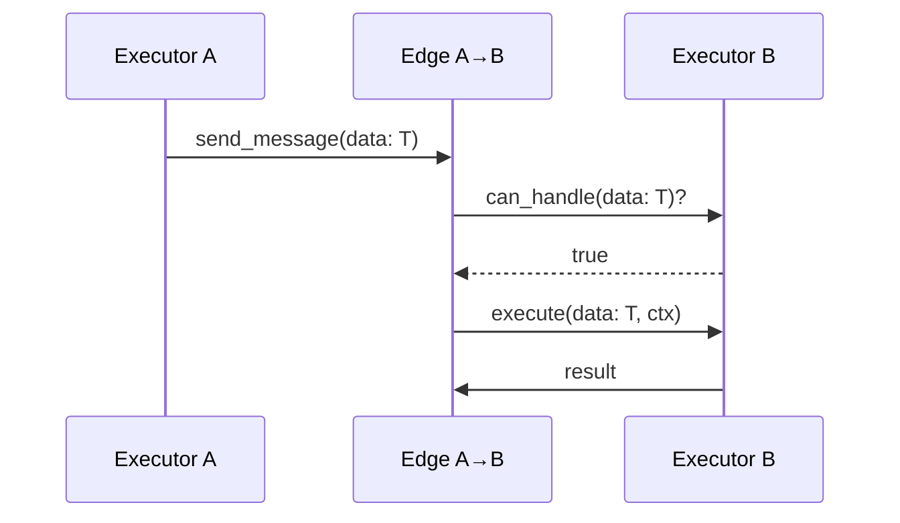
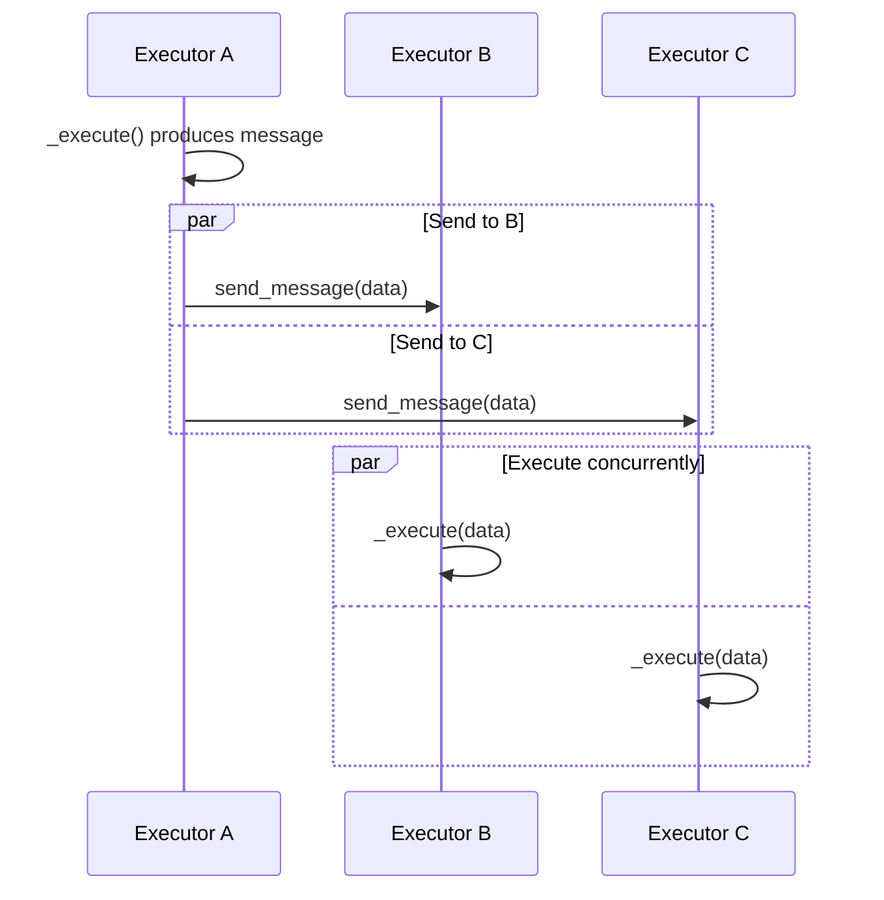
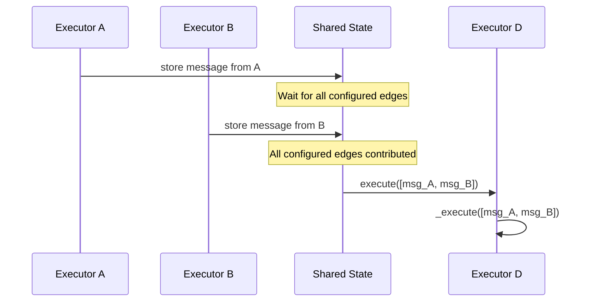
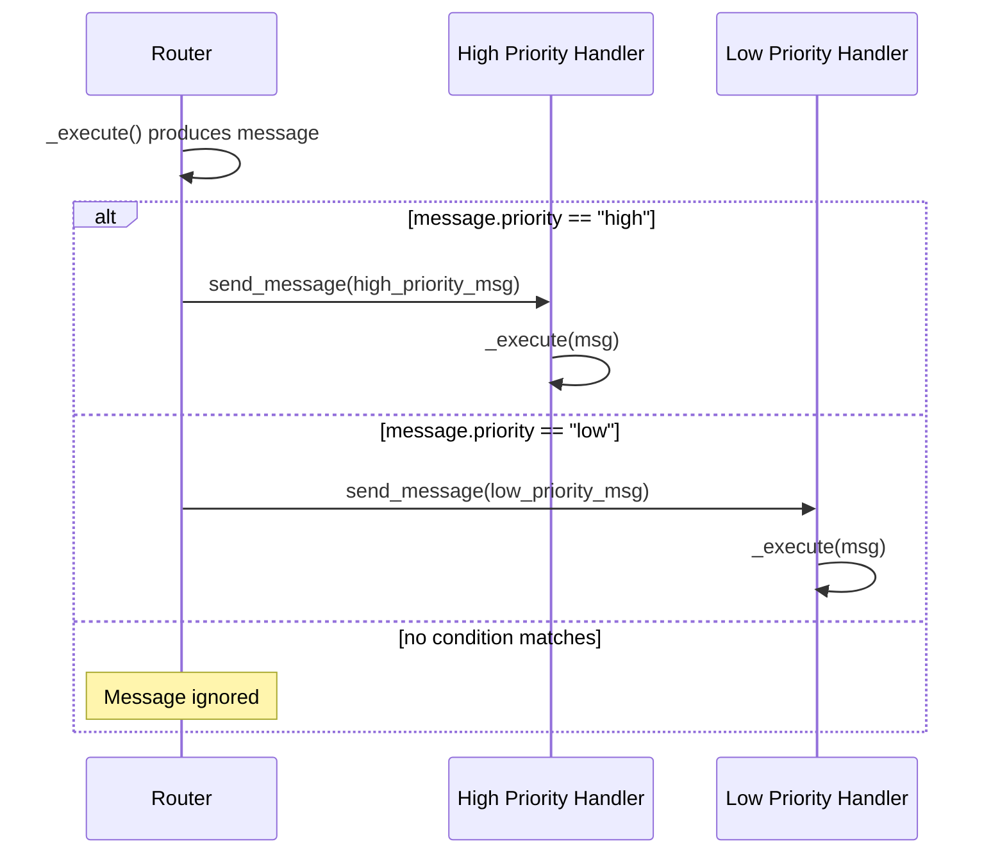

# Agent Framework Workflows - Technical Design Document

## Table of Contents

1. [Executive Summary](#executive-summary)
2. [Introduction](#introduction)
3. [Architecture Overview](#architecture-overview)
4. [Core Components](#core-components)
5. [Execution Model](#execution-model)
6. [API Design](#api-design)
7. [Pattern Implementation](#pattern-implementation)
8. [Event System](#event-system)
9. [State Management](#state-management)
10. [Human-in-the-Loop Support](#human-in-the-loop-support)
11. [Advanced Features](#advanced-features)
12. [Security Considerations](#security-considerations)
13. [Performance Considerations](#performance-considerations)
14. [Future Enhancements](#future-enhancements)

## Executive Summary

The Semantic Kernel Workflow Framework is a sophisticated orchestration system designed to manage complex multi-agent workflows with support for various execution patterns including sequential, concurrent, conditional, and human-in-the-loop scenarios. Built on a graph-based architecture using Pregel-style execution, the framework provides a flexible and extensible foundation for building AI-powered applications.

Key features include:

- Type-safe executor-based architecture
- Asynchronous event-driven execution
- Built-in support for common patterns (sequential, fan-out/fan-in, loops)
- Human-in-the-loop capabilities
- Shared state management with thread-safe operations
- Comprehensive event streaming for observability
- Checkpointing and resumption capabilities (planned)

## Introduction

### Purpose

The Workflow Framework serves as a middle layer between multi-agent orchestrations and the agent runtime, providing developers with a powerful abstraction for building complex AI workflows. It addresses the need for structured, observable, and maintainable agent coordination patterns.

### Design Goals

1. **Type Safety**: Enforce strong typing throughout the workflow pipeline
2. **Flexibility**: Support various execution patterns without framework modifications
3. **Observability**: Provide comprehensive event streaming for monitoring and debugging
4. **Extensibility**: Allow custom executors and patterns to be easily integrated
5. **Performance**: Enable concurrent execution where possible
6. **Reliability**: Support checkpointing and fault tolerance (future)

### Target Use Cases

- Multi-agent group chats with various routing strategies
- Map-reduce style data processing pipelines
- Sequential task chains with conditional branching
- Human-in-the-loop decision workflows
- Complex orchestrations requiring state management

## Architecture Overview

The framework follows a graph-based architecture where:

- **Nodes** are represented by `Executor` instances
- **Edges** define the flow of data between executors
- **Messages** carry typed data through the graph
- **Events** provide observability into the execution

```
┌─────────────┐     Edge      ┌─────────────┐
│  Executor A │──────────────▶│  Executor B │
└─────────────┘               └─────────────┘
       │                             │
       │         ┌─────────────┐     │
       └────────▶│  Executor C │◀────┘
                 └─────────────┘
```

### Key Architectural Decisions

1. **Executor-Based Design**: Each processing unit is an executor with strongly typed input/output
2. **Pregel-Style Execution**: Superstep-based execution model for predictable behavior
3. **Event-Driven Communication**: Asynchronous message passing between executors
4. **Shared State Management**: Thread-safe shared state with atomic operations

## Core Components

### 1. Executor (`executor.py`)

The fundamental processing unit in the workflow system.

```python
class Executor(Generic[T], ABC):
    """Base class for all workflow executors"""

    def __init__(self, id: str | None = None):
        self._id = id or str(uuid.uuid4())
        self._input_type = self._extract_type_parameter()

    @abstractmethod
    async def _execute(self, data: T, ctx: ExecutorContext) -> Any:
        """Execute logic to be implemented by subclasses"""

    async def execute(self, data: T, ctx: ExecutorContext) -> Any:
        """Wrapper that emits events and calls _execute"""

    def can_handle(self, data: Any) -> bool:
        """Type checking for incoming messages"""
```

**Key Features:**

- Generic type parameter for input type safety
- Automatic type extraction and validation
- Built-in event emission for observability
- Unique identifier for routing and debugging

### 2. Edge (`_edge.py`)

Represents directed connections between executors with optional routing conditions.

```python
class _Edge:
    """Directed edge with conditional routing support"""

    def __init__(self, source: Executor, target: Executor,
                 condition: Callable[[Any], bool] | None = None):
        self.source = source
        self.target = target
        self._condition = condition
        self._edge_group_ids: list[str] = []
```

**Key Features:**

- Conditional routing based on message content
- Edge groups for fan-in synchronization
- Type-aware message filtering
- Support for complex routing patterns

### 3. Workflow (`workflow.py`)

The main orchestration container that manages execution.

```python
class Workflow:
    """Workflow container managing executors and execution"""

    def __init__(self, edges: list[_Edge], start_executor: Executor | str,
                 execution_context: ExecutionContext):
        self._edges = edges
        self._start_executor = start_executor
        self._runner = _Runner(edges, shared_state, execution_context)

    async def run_stream(self, message: Any,
                        executor: Executor | str | None = None) -> AsyncIterable[WorkflowEvent]:
        """Stream execution events as the workflow runs"""
```

### 4. WorkflowBuilder (`workflow.py`)

Fluent API for constructing workflows.

```python
class WorkflowBuilder:
    """Builder pattern for workflow construction"""

    def add_edge(self, source: Executor, target: Executor,
                 condition: Callable[[Any], bool] | None = None) -> Self
    def add_fan_out_edges(self, source: Executor, targets: list[Executor]) -> Self
    def add_fan_in_edges(self, sources: list[Executor], target: Executor,
                         activation: Activation = Activation.WhenAll) -> Self
    def add_loop(self, source: Executor, target: Executor,
                 condition: Callable[[Any], bool] | None = None) -> Self
    def add_chain(self, executors: list[Executor]) -> Self
```

### 5. Runner (`_runner.py`)

Internal component managing the Pregel-style execution.

```python
class _Runner:
    """Manages superstep-based workflow execution"""

    async def run_until_convergence(self) -> AsyncIterable[WorkflowEvent]:
        """Run supersteps until no messages remain"""

    async def _run_iteration(self):
        """Execute one superstep of message delivery"""
```

### 6. ExecutionContext (`execution_context.py`)

Protocol defining the execution environment interface.

```python
@runtime_checkable
class ExecutionContext(Protocol):
    """Execution context for message passing and event handling"""

    async def send_message(self, source_id: str, message: Any) -> None
    async def drain_messages(self) -> dict[str, list[Any]]
    async def add_event(self, event: WorkflowEvent) -> None
    async def drain_events(self) -> list[WorkflowEvent]
```

## Execution Model

### Data Flow Architecture

The workflow framework implements a type-safe message passing system with the following key principles:

#### Executor Type System
- **Single Input Type**: Each executor declares exactly one input type via generic parameter `Executor[T]`
- **Any Output Type**: Executors can produce any output type from their `_execute()` method
- **Type Validation**: Messages are routed only if `target.can_handle(data)` returns true

#### Edge Routing Logic
Messages flow along edges based on a two-step validation:
1. **Type Compatibility**: Target executor must be able to handle the message type
2. **Condition Check**: Optional edge condition (if present) must evaluate to true

If either check fails, the message is ignored for that edge.

### Pregel-Style Supersteps

The framework uses a modified Pregel execution model with clear data flow semantics:

```
Superstep N:
┌─────────────────┐    ┌─────────────────┐    ┌─────────────────┐
│  Collect All    │───▶│  Route Messages │───▶│  Execute All    │
│  Pending        │    │  Based on Type  │    │  Target         │
│  Messages       │    │  & Conditions   │    │  Executors      │
└─────────────────┘    └─────────────────┘    └─────────────────┘
                                                        │
┌─────────────────┐    ┌─────────────────┐             │
│  Start Next     │◀───│  Emit Events &  │◀────────────┘
│  Superstep      │    │  New Messages   │
└─────────────────┘    └─────────────────┘
```

### Message Delivery Patterns

#### 1. Direct Routing (1:1)
```
┌─────────────┐    message    ┌─────────────┐
│ Executor A  │──────────────▶│ Executor B  │
│ Output: T   │               │ Input: T    │
└─────────────┘               └─────────────┘
```

**Sequence:**


#### 2. Fan-out (1:N)
```
                  ┌─────────────┐
             ┌───▶│ Executor B  │
┌────────────┤    │ Input: T    │
│ Executor A │    └─────────────┘
│ Output: T  │    
└────────────┤    ┌─────────────┐
             └───▶│ Executor C  │
                  │ Input: T    │
                  └─────────────┘
```

**Sequence:**


#### 3. Fan-in with Message Accumulation (N:1)
```
┌─────────────┐    
│ Executor A  │───┐   
│ Output: T₁  │   │   ┌─────────────────┐
└─────────────┘   │   │                 │
                  ├──▶│   Executor D    │
┌─────────────┐   │   │ Input: [T₁,T₂]  │
│ Executor B  │───┘   │                 │
│ Output: T₂  │       └─────────────────┘
└─────────────┘       
```

**Key Behavior**: Messages accumulate in shared state until ALL configured edges in the fan-in group have contributed messages, then delivered as a collection. If any edge never contributes (due to type mismatch, condition failure, or no output), the fan-in won't execute.

**Sequence:**


#### 4. Conditional Routing
```
              condition=λx: x.priority=="high"
         ┌──────────────────────────────────┐
┌────────┤                                  ▼
│Router  │                        ┌─────────────────┐
│        │                        │ High Priority   │
│        │                        │ Handler         │
└────────┤                        └─────────────────┘
         │  condition=λx: x.priority=="low"
         └──────────────────────────────────┐
                                            ▼
                                  ┌─────────────────┐
                                  │ Low Priority    │
                                  │ Handler         │
                                  └─────────────────┘
```

**Sequence:**


### Concurrency Model

- **Superstep Isolation**: All executors in a superstep run concurrently
- **Message Delivery**: Parallel delivery to all matching edges  
- **Shared State**: Thread-safe access with atomic operations
- **Event Collection**: Lock-free event streaming

## API Design

### Creating Executors

```python
@output_message_types(str)
class UpperCaseExecutor(Executor[str]):
    async def _execute(self, data: str, ctx: ExecutorContext) -> str:
        result = data.upper()
        await ctx.send_message(result)
        return result
```

### Building Workflows

```python
# Sequential workflow
workflow = (
    WorkflowBuilder()
    .add_chain([executor_a, executor_b, executor_c])
    .set_start_executor(executor_a)
    .build()
)

# Conditional routing
workflow = (
    WorkflowBuilder()
    .add_edge(router, executor_a, lambda msg: msg.type == "A")
    .add_edge(router, executor_b, lambda msg: msg.type == "B")
    .set_start_executor(router)
    .build()
)

# Fan-out/Fan-in pattern
workflow = (
    WorkflowBuilder()
    .set_start_executor(splitter)
    .add_fan_out_edges(splitter, [worker1, worker2, worker3])
    .add_fan_in_edges([worker1, worker2, worker3], aggregator,
                      activation=Activation.WhenAll)
    .build()
)
```

### Running Workflows

```python
# Stream execution with event handling
async for event in workflow.run_stream(initial_message):
    if isinstance(event, ExecutorCompleteEvent):
        print(f"Executor {event.executor_id} completed")
    elif isinstance(event, HumanInTheLoopEvent):
        # Handle human intervention request
        user_input = await get_user_input()
        async for event in workflow.run_stream(user_input, executor=event.executor_id):
            # Process continuation events
```

## Pattern Implementation

### 1. Sequential Processing

Simple chain of executors processing data in order.

```python
workflow = (
    WorkflowBuilder()
    .add_chain([preprocessor, analyzer, formatter])
    .set_start_executor(preprocessor)
    .build()
)
```

### 2. Round-Robin Group Chat

Executors take turns in a predefined sequence.

```python
# Building the group chat workflow
executor_a = AgentExecutor(id="agent_a")
executor_b = AgentExecutor(id="agent_b")
executor_c = AgentExecutor(id="agent_c")

group_chat_manager = RoundRobinGroupChatManager(
    members=["agent_a", "agent_b", "agent_c"],
    max_rounds=3
)

workflow = (
    WorkflowBuilder()
    .set_start_executor(group_chat_manager)
    .add_loop(group_chat_manager, executor_a,
              condition=lambda x: x.selection == "agent_a")
    .add_loop(group_chat_manager, executor_b,
              condition=lambda x: x.selection == "agent_b")
    .add_loop(group_chat_manager, executor_c,
              condition=lambda x: x.selection == "agent_c")
    .build()
)
```

### 3. Map-Reduce Pattern

Parallel processing with aggregation.

```python
# Split -> Map (parallel) -> Shuffle -> Reduce (parallel) -> Aggregate
workflow = (
    WorkflowBuilder()
    .set_start_executor(splitter)
    .add_fan_out_edges(splitter, mappers)
    .add_fan_in_edges(mappers, shuffler, activation=Activation.WhenAll)
    .add_fan_out_edges(shuffler, reducers)
    .add_fan_in_edges(reducers, aggregator, activation=Activation.WhenAll)
    .build()
)
```

### 4. Conditional Branching

Dynamic routing based on message content.

```python
workflow = (
    WorkflowBuilder()
    .add_edge(classifier, high_priority_handler,
              lambda msg: msg.priority == "high")
    .add_edge(classifier, normal_handler,
              lambda msg: msg.priority == "normal")
    .add_edge(classifier, low_priority_handler,
              lambda msg: msg.priority == "low")
    .set_start_executor(classifier)
    .build()
)
```

## Event System

### Event Types

```python
# Workflow lifecycle events
WorkflowStartedEvent    # Workflow execution begins
WorkflowCompletedEvent  # Workflow reaches completion

# Executor events
ExecutorInvokeEvent     # Executor starts processing
ExecutorCompleteEvent   # Executor finishes processing

# Agent-specific events
AgentRunEvent          # Agent produces final response
AgentRunStreamingEvent # Agent streams partial response

# Control flow events
HumanInTheLoopEvent    # Human intervention required
```

### Event Handling

Events are emitted during execution and streamed to consumers:

```python
async for event in workflow.run_stream(message):
    match event:
        case ExecutorCompleteEvent(executor_id=id, data=result):
            logger.info(f"Executor {id} completed with result: {result}")
        case HumanInTheLoopEvent(executor_id=id):
            # Pause workflow for human input
            human_response = await prompt_user()
            # Resume with human input
        case WorkflowCompletedEvent(data=final_result):
            return final_result
```

## State Management

### Shared State

Thread-safe key-value store accessible to all executors.

```python
class _SharedState:
    """Thread-safe shared state management"""

    async def set(self, key: str, value: Any) -> None
    async def get(self, key: str) -> Any
    async def has(self, key: str) -> bool
    async def delete(self, key: str) -> None

    @asynccontextmanager
    async def hold(self):
        """Hold lock for multiple operations"""
```

### Usage in Executors

```python
class StatefulExecutor(Executor[str]):
    async def _execute(self, data: str, ctx: ExecutorContext) -> None:
        # Read from shared state
        counter = await ctx.get_shared_state("counter") or 0

        # Update shared state
        await ctx.set_shared_state("counter", counter + 1)

        # Atomic multi-operation update
        async with ctx._shared_state.hold():
            value1 = await ctx.get_shared_state("key1")
            value2 = await ctx.get_shared_state("key2")
            await ctx.set_shared_state("combined", value1 + value2)
```

## Human-in-the-Loop Support

### Design Approach

The framework supports human intervention through:

1. Special HIL executors that emit `HumanInTheLoopEvent`
2. Workflow suspension while awaiting human input
3. Targeted message delivery to resume execution

### Implementation Example

```python
class HumanInTheLoopExecutor(Executor[list[ChatMessageContent]]):
    def __init__(self):
        super().__init__()
        self._awaiting_input = False

    async def _execute(self, data: list[ChatMessageContent],
                      ctx: ExecutorContext) -> list[ChatMessageContent] | None:
        if not self._awaiting_input:
            # Request human input
            self._awaiting_input = True
            await ctx.add_event(HumanInTheLoopEvent(executor_id=self.id))
            return None
        else:
            # Process human response
            self._awaiting_input = False
            await ctx.send_message(data)
            return data
```

### Integration Pattern

```python
# Main execution loop with HIL support
hil_event = None
while True:
    if hil_event:
        # Resume at specific executor with human input
        events = workflow.run_stream(human_input, executor=hil_event.executor_id)
    else:
        # Normal execution
        events = workflow.run_stream(initial_message)

    async for event in events:
        if isinstance(event, HumanInTheLoopEvent):
            hil_event = event
            human_input = await get_human_input()
            break
        elif isinstance(event, WorkflowCompletedEvent):
            return event.data
```

## Advanced Features

### 1. Edge Groups and Synchronization

Fan-in edges can be grouped for synchronized delivery:

```python
# All three workers must complete before aggregator runs
workflow = (
    WorkflowBuilder()
    .add_fan_in_edges([worker1, worker2, worker3], aggregator,
                      activation=Activation.WhenAll)
    .build()
)
```

### 2. Type System Integration

The framework leverages Python's type system for safety:

```python
def _is_instance_of(data: Any, target_type: type) -> bool:
    """Runtime type checking supporting generics"""
    # Handles Union, Optional, List, Dict, Tuple types
    # Provides comprehensive type validation
```

### 3. Custom Output Type Declaration

Executors can declare multiple output types:

```python
@output_message_types(ProcessedData, ErrorReport, None)
class DataProcessor(Executor[RawData]):
    async def _execute(self, data: RawData, ctx: ExecutorContext):
        try:
            result = process(data)
            await ctx.send_message(ProcessedData(result))
        except Exception as e:
            await ctx.send_message(ErrorReport(str(e)))
```

### 4. Streaming Support

Built-in support for streaming responses:

```python
class StreamingAgentExecutor(Executor[str]):
    async def _execute(self, prompt: str, ctx: ExecutorContext):
        async for chunk in self.agent.stream(prompt):
            await ctx.add_event(AgentRunStreamingEvent(self.id, chunk))

        final_response = await self.agent.get_final()
        await ctx.send_message(final_response)
```

## Security Considerations

### 1. Type Safety

- Strong typing prevents type confusion attacks
- Runtime type validation catches mismatched messages
- Generic type parameters enforce compile-time safety

### 2. State Isolation

- Executors cannot directly access each other's state
- Shared state requires explicit key-based access
- No global mutable state outside controlled interfaces

### 3. Message Validation

- All messages are validated against executor input types
- Conditional routing provides additional filtering
- Malformed messages are rejected at edge boundaries

### 4. Resource Limits

- Maximum iteration count prevents infinite loops
- Timeout support for long-running executors (planned)
- Memory usage bounded by message queue size

## Performance Considerations

### 1. Concurrency

- Superstep model enables parallel executor execution
- Message delivery within superstep is concurrent
- Async/await throughout for non-blocking I/O

### 2. Memory Efficiency

- Messages are passed by reference where possible
- Event streaming prevents memory accumulation
- Lazy evaluation of conditional edges

### 3. Scalability

- O(E + V) complexity per superstep (edges + vertices)
- Linear scaling with number of messages
- Shared state operations are O(1) average case

### 4. Optimization Opportunities

- Edge pre-computation for static workflows
- Message batching for high-throughput scenarios
- Executor pooling for stateless processors

## Future Enhancements

### 1. Checkpointing and Recovery

```python
class CheckpointProvider(Protocol):
    async def save_checkpoint(self, workflow_id: str, state: WorkflowState) -> str
    async def load_checkpoint(self, checkpoint_id: str) -> WorkflowState
    async def list_checkpoints(self, workflow_id: str) -> list[CheckpointInfo]
```

### 2. Distributed Execution

- Support for executor distribution across nodes
- Message passing via message queues
- Distributed shared state with consistency guarantees

### 3. Advanced Patterns

- Sub-workflow composition
- Dynamic executor instantiation
- Recursive workflow structures
- Time-based triggers and delays

### 4. Observability Enhancements

- OpenTelemetry integration
- Structured logging with correlation IDs
- Performance metrics and profiling
- Visual workflow debugging tools

### 5. Template System

```python
# Planned template system for reusable patterns
template = WorkflowTemplate("map_reduce")
    .with_parameter("mapper_count", type=int, default=3)
    .with_parameter("reducer_count", type=int, default=2)
    .with_pattern(MapReducePattern())
    .build()

workflow = template.instantiate(mapper_count=5, reducer_count=3)
```

### 6. Error Handling and Retry

- Configurable retry policies per executor
- Dead letter queues for failed messages
- Circuit breaker pattern support
- Graceful degradation strategies

## Conclusion

The Semantic Kernel Workflow Framework provides a robust foundation for building complex AI-powered workflows. Its type-safe, event-driven architecture combined with flexible execution patterns makes it suitable for a wide range of applications from simple sequential processing to complex multi-agent orchestrations with human oversight.

The framework's design prioritizes developer experience through its fluent API while maintaining the flexibility needed for advanced use cases. As the framework evolves, planned enhancements around distributed execution, checkpointing, and advanced patterns will further expand its capabilities while maintaining the core principles of type safety, observability, and extensibility.
