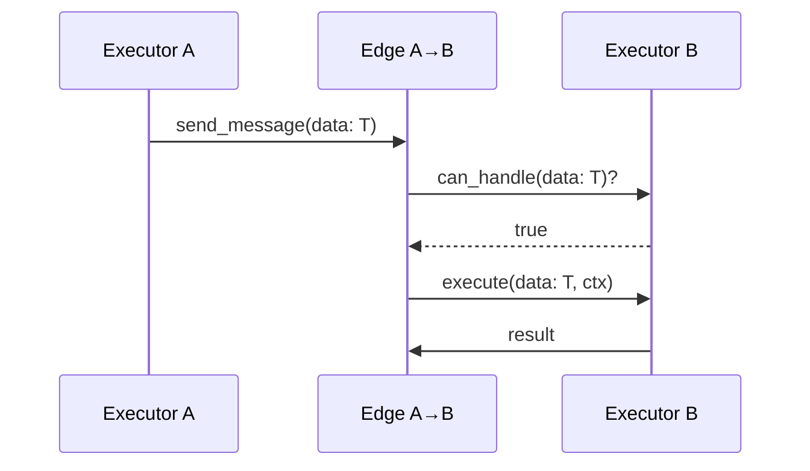
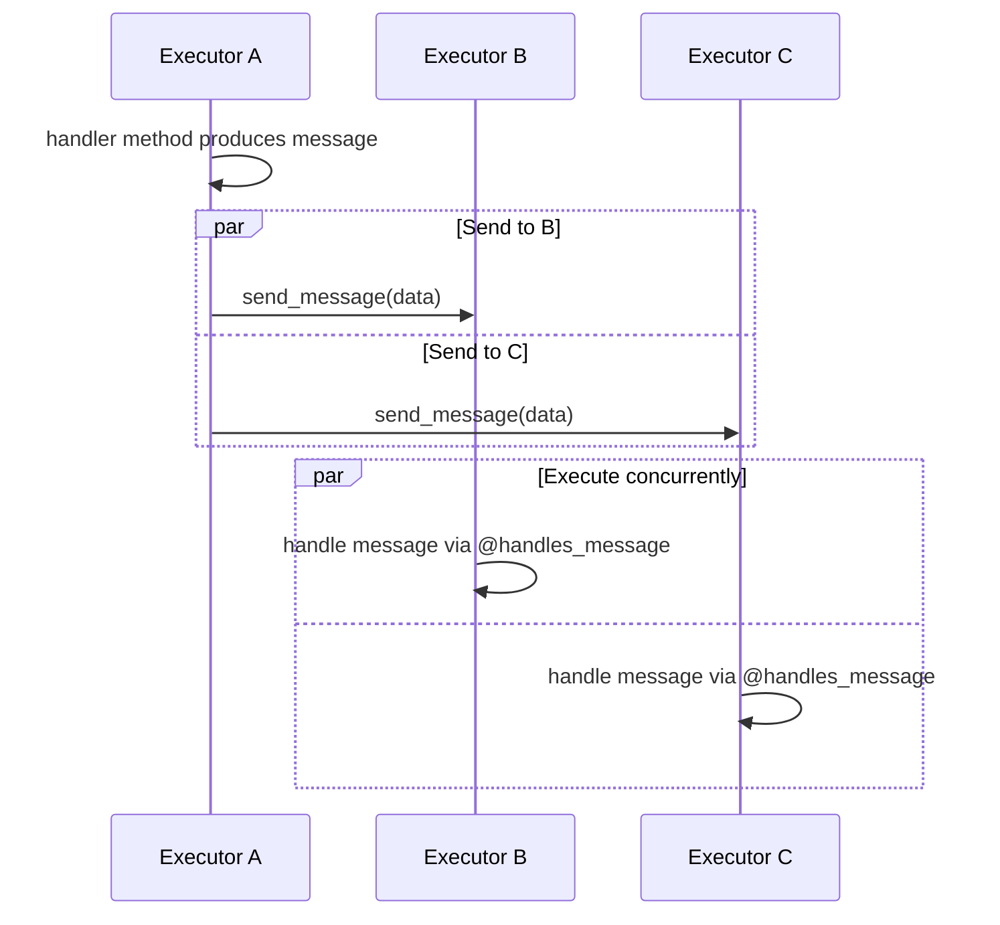
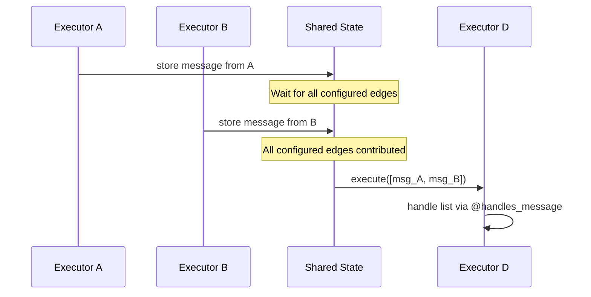
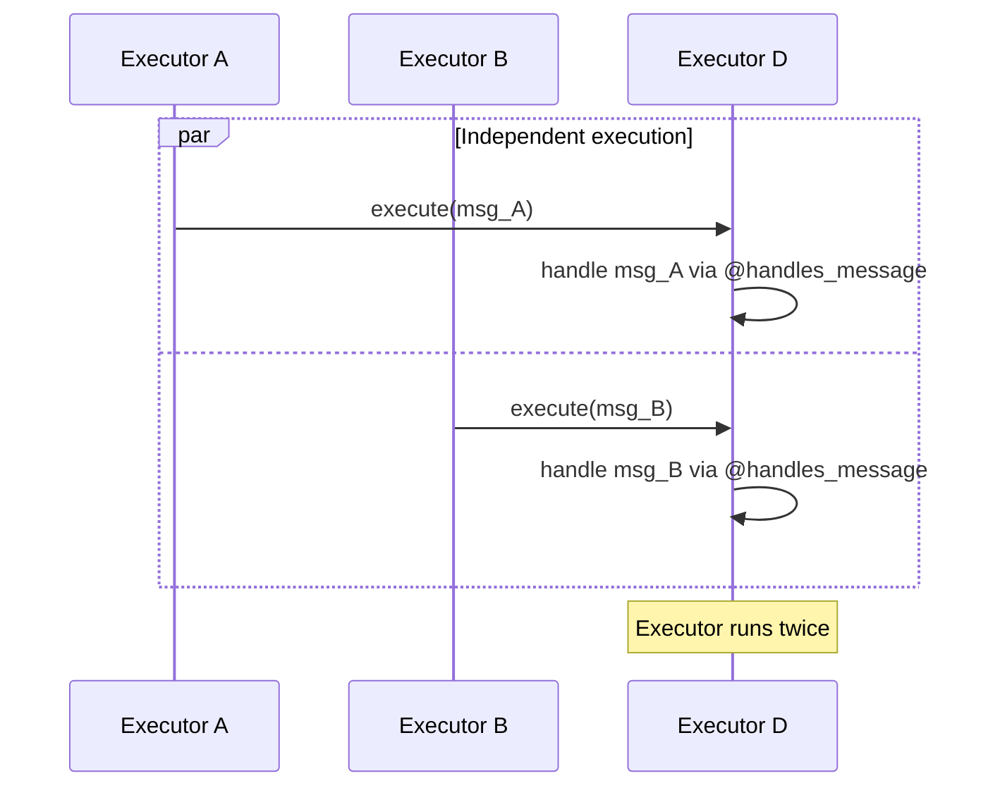
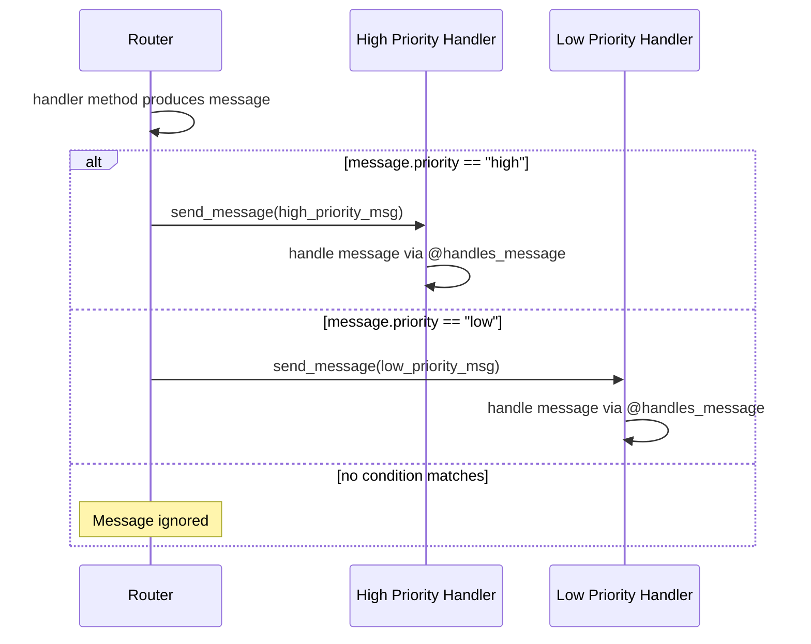

# Agent Framework Workflows - Technical Design Document

## Table of Contents

1. [Executive Summary](#executive-summary)
2. [Introduction](#introduction)
3. [Architecture Overview](#architecture-overview)
4. [Core Components](#core-components)
5. [Execution Model](#execution-model)
6. [API Design](#api-design)
7. [Pattern Implementation](#pattern-implementation)
8. [Event System](#event-system)
9. [State Management](#state-management)
10. [Request/Response Support](#request-response-support)
11. [Advanced Features](#advanced-features)
12. [Security Considerations](#security-considerations)
13. [Performance Considerations](#performance-considerations)
14. [Future Enhancements](#future-enhancements)

## Executive Summary

The Agent Framework Workflow system is a sophisticated orchestration framework designed to manage complex multi-agent workflows with advanced type safety and polymorphic execution patterns. Built on a graph-based architecture using Pregel-style execution, the framework provides a flexible and extensible foundation for building AI-powered applications with natural multi-handler patterns.

Key features include:

- **Multi-handler executors** with `@handles_message` decorator pattern
- **Built-in request/response support** with automatic correlation and external integration
- **Comprehensive type validation** preventing handler conflicts
- **Polymorphic message routing** based on runtime type checking
- **Thread-safe shared state management** with correlation tracking
- **Asynchronous event-driven execution** with comprehensive observability

## Introduction

### Purpose

The Workflow Framework serves as a middle layer between multi-agent orchestrations and the agent runtime, providing developers with a powerful abstraction for building complex AI workflows. It addresses the need for structured, observable, and maintainable agent coordination patterns.

### Design Goals

1. **Type Safety**: Enforce strong typing throughout the workflow pipeline
2. **Flexibility**: Support various execution patterns without framework modifications
3. **Observability**: Provide comprehensive event streaming for monitoring and debugging
4. **Extensibility**: Allow custom executors and patterns to be easily integrated
5. **Performance**: Enable concurrent execution where possible
6. **Reliability**: Support checkpointing and fault tolerance (future)

### Target Use Cases

- Multi-agent group chats with various routing strategies
- Map-reduce style data processing pipelines
- Sequential task chains with conditional branching
- Human-in-the-loop decision workflows
- Complex orchestrations requiring state management

## Architecture Overview

The framework follows a graph-based architecture where:

- **Nodes** are represented by `Executor` instances
- **Edges** define the flow of data between executors
- **Messages** carry typed data through the graph
- **Events** provide observability into the execution

```
┌─────────────┐     Edge      ┌─────────────┐
│  Executor A │──────────────▶│  Executor B │
└─────────────┘               └─────────────┘
       │                             │
       │         ┌─────────────┐     │
       └────────▶│  Executor C │◀────┘
                 └─────────────┘
```

### Key Architectural Decisions

1. **Executor-Based Design**: Each processing unit is an executor with strongly typed input/output
2. **Pregel-Style Execution**: Superstep-based execution model for predictable behavior
3. **Event-Driven Communication**: Asynchronous message passing between executors
4. **Shared State Management**: Thread-safe shared state with atomic operations

## Core Components

The workflow framework consists of six core components that work together to create a flexible, type-safe execution environment:

```txt
┌───────────────────────────────────────────────────────────────────┐
│                        Workflow System                            │
├─────────────────┬───────────────┬─────────────────────────────────┤
│                 │               │                                 │
│   Executors     │     Edges     │           Workflow              │
│  (Processing)   │   (Routing)   │       (Orchestration)           │
│                 │               │                                 │
│ ┌─────────────┐ │ ┌───────────┐ │ ┌─────────────────────────────┐ │
│ │@handles_msg │ │ │Conditional│ │ │ • Manages execution flow    │ │
│ │┌───────────┐│ │ │  Routing  │ │ │ • Coordinates executors     │ │
│ ││Handler A  ││ │ └─────┬─────┘ │ │ • Streams events            │ │
│ │├───────────┤│ │       │       │ └─────────────┬───────────────┘ │
│ ││Handler B  ││◄├───────┴───────┤►              │                 │
│ │├───────────┤│ │               │               ▼                 │
│ ││Handler C  ││ │  Type-based   │        WorkflowContext          │
│ │└───────────┘│ │   Routing     │    (Shared State & Events)      │
│ └─────────────┘ │               │                                 │
└─────────────────┴───────────────┴─────────────────────────────────┘
```

### Component Overview

1. **Executors**: The processing units that handle messages
2. **Edges**: Define message flow and routing rules between executors
3. **Workflow**: Orchestrates execution and manages the lifecycle
4. **WorkflowContext**: Provides shared state and event management
5. **Message Handlers**: Enable polymorphic message processing
6. **RequestInfoExecutor**: Built-in support for external integrations

### 0. Message Handler Pattern

The `@handles_message` decorator transforms executors into polymorphic processors:

```
┌─────────────────────────┐         ┌─────────────────────────┐
│    Traditional Way      │         │    Multi-Handler Way    │
├─────────────────────────┤         ├─────────────────────────┤
│                         │         │ @handles_message        │
│ class MyExecutor:       │         │ async def handle_typeA()│
│   def can_handle():     │   ───►  │                         │
│     # Complex logic     │         │ @handles_message        │
│   def _execute():       │         │ async def handle_typeB()│
│     # Big switch/if     │         │                         │
│                         │         │ # Automatic routing!    │
└─────────────────────────┘         └─────────────────────────┘
```

**How it works:**
- Decorates methods to mark them as message handlers
- Automatically extracts the expected message type from method signature
- Framework discovers all handlers during executor initialization
- Routes messages to appropriate handler based on runtime type

### 1. Executor - The Processing Unit

Executors are the fundamental building blocks that process messages in a workflow:

```
┌────────────────────────────────────────┐
│             Executor                   │
├────────────────────────────────────────┤
│ ID: "data_processor"                   │
├────────────────────────────────────────┤
│ Message Handlers:                      │
│  • handle_text(TextData) → ProcessedText│
│  • handle_image(ImageData) → Thumbnail │
│  • handle_batch(List[Any]) → Report    │
├────────────────────────────────────────┤
│ Lifecycle:                             │
│  1. Receive message                    │
│  2. Match type to handler              │
│  3. Execute handler                    │
│  4. Send output messages               │
│  5. Emit events                        │
└────────────────────────────────────────┘
```

**Key Concepts:**

- **Identity**: Each executor has a unique ID for routing and debugging
- **Polymorphic**: Can handle multiple message types via different handlers
- **Type-Safe**: Validates message types before processing
- **Event Emitting**: Broadcasts lifecycle events for observability
- **Stateless**: Designed to be stateless (state managed via WorkflowContext)

### 2. Edge - The Message Highway

Edges define how messages flow between executors:

```
┌─────────────┐                    ┌─────────────┐
│  Executor A │                    │  Executor B │
│             │     Edge Rules:    │             │
│   Output:   │  1. Type Check     │   Input:    │
│   UserData  │  2. Condition?     │   UserData  │
│             │  3. Route Message  │             │
└──────┬──────┘                    └──────▲──────┘
       │                                  │
       │         ┌──────────────┐         │
       └────────►│     Edge     │─────────┘
                 │              │
                 │ if user.age  │
                 │    >= 18     │
                 └──────────────┘
```

**Edge Capabilities:**

- **Type Filtering**: Only routes messages the target can handle
- **Conditional Logic**: Optional conditions for dynamic routing
- **Fan-out Support**: One source can connect to multiple targets
- **Fan-in Support**: Multiple sources can connect to one target
- **Edge Groups**: Coordinate message collection for fan-in patterns

### 3. Workflow - The Orchestrator

The Workflow ties everything together and manages execution:

```
┌─────────────────────────────────────────────────────┐
│                    Workflow                         │
├─────────────────────────────────────────────────────┤
│  Components:                                        │
│  • Executors: [A, B, C, RequestInfo*]               │
│  • Edges: [A→B, A→C, B→C]                           │
│  • Start: A                                         │
│  • Runner: Pregel-style superstep execution         │
├─────────────────────────────────────────────────────┤
│  Execution Flow:                                    │
│  1. run_stream(message) ──► Start at executor A     │
│  2. Superstep 1: A processes, sends to B & C        │
│  3. Superstep 2: B & C process in parallel          │
│  4. Stream events throughout execution              │
│  5. Complete when no messages remain                │
└─────────────────────────────────────────────────────┘
         * RequestInfo executor added automatically
```

**Workflow Responsibilities:**

- **Graph Management**: Maintains the executor graph structure
- **Execution Control**: Initiates and monitors workflow runs
- **Event Streaming**: Provides real-time execution visibility
- **Request/Response**: Built-in support for external integrations
- **Automatic Enhancement**: Adds RequestInfoExecutor if not present

### 4. WorkflowBuilder - The Construction API

Provides a fluent interface for building workflows:

```
┌─────────────────────────────────────────────────────┐
│            WorkflowBuilder Patterns                 │
├─────────────────────────────────────────────────────┤
│                                                     │
│  Sequential:     A ──► B ──► C                      │
│  .add_chain([A, B, C])                              │
│                                                     │
│  Fan-out:        ┌──► B                             │
│                A ─┼──► C                            │
│                   └──► D                            │
│  .add_fan_out_edges(A, [B, C, D])                   │
│                                                     │
│  Conditional:    ┌─[if x>0]─► B                     │
│                A ─┤                                 │
│                   └─[if x<0]─► C                    │
│  .add_edge(A, B, lambda x: x > 0)                   │
│  .add_edge(A, C, lambda x: x < 0)                   │
│                                                     │
│  Fan-in:      A ─┐                                  │
│               B ─┼──► D                             │
│               C ─┘                                  │
│  .add_fan_in_edges([A, B, C], D)                    │
└─────────────────────────────────────────────────────┘
```

### 5. WorkflowContext - The Shared Environment

Provides executors with access to shared state and event emission:

```
┌─────────────────────────────────────────────────────┐
│                 WorkflowContext                     │
├─────────────────────────────────────────────────────┤
│                                                     │
│  Shared State:          Event Stream:               │
│  ┌─────────────┐       ┌──────────────────┐         │
│  │ counter: 42 │       │ ExecutorInvoke   │         │
│  │ user: {...} │       │ ExecutorComplete │         │
│  │ cache: [...]│       │ RequestInfo      │         │
│  └─────────────┘       │ WorkflowComplete │         │
│                        └──────────────────┘         │
│                                                     │
│  Methods:                                           │
│  • send_message(msg) - Route to next executors      │
│  • add_event(event) - Emit to event stream          │
│  • get/set_shared_state(key, value) - Share data    │
└─────────────────────────────────────────────────────┘
```

**Context Capabilities:**

- **Message Routing**: Send messages that flow along edges
- **State Management**: Thread-safe shared state between executors
- **Event Broadcasting**: Emit events for external monitoring
- **Request Correlation**: Track request/response pairs

### 6. RequestInfoExecutor - The External Gateway

A special built-in executor for handling external interactions:

```
┌─────────────────────────────────────────────────────┐
│              RequestInfoExecutor                    │
│                (ID: "request_info")                 │
├─────────────────────────────────────────────────────┤
│                                                     │
│  Workflow                          External World   │
│     │                                    ▲          │
│     │  UserApprovalRequest               │          │
│     ▼                                    │          │
│  ┌──────────────┐      RequestInfoEvent │           │
│  │ RequestInfo  │ ─────────────────────►│           │
│  │  Executor    │      (request_id: 123)│           │
│  │              │                        │          │
│  │              │◄───────────────────────┘          │
│  └──────────────┘   send_response(true, 123)        │
│     │                                               │
│     │  true                                         │
│     ▼                                               │
│  Continue...                                        │
└─────────────────────────────────────────────────────┘
```

**How it works:**

1. **Intercepts Requests**: Catches any `RequestMessage` subclass
2. **Generates Correlation ID**: Creates unique request_id
3. **Emits Event**: Sends RequestInfoEvent for external handling
4. **Waits for Response**: External system calls `workflow.send_response()`
5. **Continues Flow**: Response routed back through workflow edges

**Use Cases:**
- Human approval workflows
- External API calls
- Database lookups
- Any async external integration

## Execution Model

### Data Flow Architecture

The workflow framework implements a type-safe message passing system with the following key principles:

#### Executor Type System
- **Multiple Input Types**: Executors can handle multiple types via `@handles_message` decorated methods
- **Handler Discovery**: Types automatically detected from method signatures
- **Type Validation**: Messages routed to appropriate handlers, raises error if no handler found
- **Conflict Prevention**: Validation prevents multiple handlers for same type

#### Edge Routing Logic
Messages flow along edges based on a two-step validation:
1. **Type Compatibility**: Target executor must be able to handle the message type
2. **Condition Check**: Optional edge condition (if present) must evaluate to true

If either check fails, the message is ignored for that edge.

### Pregel-Style Supersteps

The framework uses a modified Pregel execution model with clear data flow semantics:

```
Superstep N:
┌─────────────────┐    ┌─────────────────┐    ┌─────────────────┐
│  Collect All    │───▶│  Route Messages │───▶│  Execute All   │
│  Pending        │    │  Based on Type  │    │  Target         │
│  Messages       │    │  & Conditions   │    │  Executors      │
└─────────────────┘    └─────────────────┘    └─────────────────┘
                                                        │
┌─────────────────┐    ┌─────────────────┐              │
│  Start Next     │◀───│  Emit Events &  │◀────────────┘
│  Superstep      │    │  New Messages   │
└─────────────────┘    └─────────────────┘
```

### Message Delivery Patterns

#### 1. Direct Routing (1:1)
```
┌─────────────┐    message    ┌─────────────┐
│ Executor A  │──────────────▶│ Executor B  │
│ Output: T   │               │ Input: T    │
└─────────────┘               └─────────────┘
```

**Sequence:**


#### 2. Fan-out (1:N)
```
                  ┌─────────────┐
             ┌───▶│ Executor B  │
┌────────────┤    │ Input: T    │
│ Executor A │    └─────────────┘
│ Output: T  │    
└────────────┤    ┌─────────────┐
             └───▶│ Executor C  │
                  │ Input: T    │
                  └─────────────┘
```

**Sequence:**


#### 3. Fan-in Patterns (N:1)

##### 3a. Fan-in (Message Collection)
```
┌─────────────┐    
│ Executor A  │───┐   
│ Output: T₁  │   │   ┌─────────────────┐
└─────────────┘   │   │                 │
                  ├──▶│   Executor D    │
┌─────────────┐   │   │ Input: [T₁,T₂]  │
│ Executor B  │───┘   │                 │
│ Output: T₂  │       └─────────────────┘
└─────────────┘       
```

**Key Behavior**: When multiple executors connect to a single target executor that expects a list type, messages are collected and delivered as a list to the target executor's handler method.

**Sequence:**


##### 3b. Fan-in (Individual Message Processing)
```
┌─────────────┐    
│ Executor A  │───┐   
│ Output: T   │   │   ┌─────────────────┐
└─────────────┘   │   │                 │
                  ├──▶│   Executor D    │
┌─────────────┐   │   │ Input: T        │
│ Executor B  │───┘   │                 │
│ Output: T   │       └─────────────────┘
└─────────────┘       
```

**Key Behavior**: Each message triggers the executor independently. No accumulation occurs. If multiple messages arrive in the same superstep, the executor runs multiple times.

**Sequence:**


#### 4. Conditional Routing
```
              condition=λx: x.priority=="high"
         ┌──────────────────────────────────┐
┌────────┤                                  ▼
│Router  │                        ┌─────────────────┐
│        │                        │ High Priority   │
│        │                        │ Handler         │
└────────┤                        └─────────────────┘
         │  condition=λx: x.priority=="low"
         └──────────────────────────────────┐
                                            ▼
                                  ┌─────────────────┐
                                  │ Low Priority    │
                                  │ Handler         │
                                  └─────────────────┘
```

**Sequence:**


### Concurrency Model

- **Superstep Isolation**: All executors in a superstep run concurrently
- **Message Delivery**: Parallel delivery to all matching edges  
- **Shared State**: Thread-safe access with atomic operations
- **Event Collection**: Lock-free event streaming

## API Design

### Creating Single-Handler Executors

```python
@output_message_types(str)
class UpperCaseExecutor(Executor):
    @handles_message
    async def process_text(self, data: str, ctx: WorkflowContext) -> None:
        result = data.upper()
        await ctx.send_message(result)
```

### Creating Multi-Handler Executors

```python
@output_message_types(TemperatureResponse, WeatherResponse)
class WeatherService(Executor):
    """Service handling multiple weather query types"""

    @handles_message
    async def get_temperature(self, query: TemperatureQuery, ctx: WorkflowContext) -> None:
        response = TemperatureResponse(location=query.location, temperature=20.0)
        await ctx.send_message(response)

    @handles_message 
    async def get_weather(self, query: WeatherQuery, ctx: WorkflowContext) -> None:
        response = WeatherResponse(
            location=query.location, temperature=20.0, conditions="Sunny"
        )
        await ctx.send_message(response)
```

### Building Workflows

```python
# Sequential workflow
workflow = (
    WorkflowBuilder()
    .add_chain([executor_a, executor_b, executor_c])
    .set_start_executor(executor_a)
    .build()
)

# Conditional routing
workflow = (
    WorkflowBuilder()
    .add_edge(router, executor_a, lambda msg: msg.type == "A")
    .add_edge(router, executor_b, lambda msg: msg.type == "B")
    .set_start_executor(router)
    .build()
)

# Fan-out/Fan-in pattern
workflow = (
    WorkflowBuilder()
    .set_start_executor(splitter)
    .add_fan_out_edges(splitter, [worker1, worker2, worker3])
    .add_fan_in_edges([worker1, worker2, worker3], aggregator)
    .build()
)
```

### Running Workflows

```python
# Stream execution with event handling
async for event in workflow.run_stream(initial_message):
    if isinstance(event, ExecutorCompleteEvent):
        print(f"Executor {event.executor_id} completed")
    elif isinstance(event, RequestInfoEvent):
        # Handle request/response pattern
        user_response = await get_user_input(event.request_data)
        async for event in workflow.send_response(user_response, event.request_id):
            # Process response continuation events
```

## Pattern Implementation

### 1. Multi-Handler Pattern

Single executor handling multiple message types.

```python
@output_message_types(ProcessedDataA, ProcessedDataB)
class PolymorphicProcessor(Executor):
    @handles_message
    async def handle_type_a(self, data: InputTypeA, ctx: WorkflowContext):
        result = ProcessedDataA(data.value * 2)
        await ctx.send_message(result)

    @handles_message
    async def handle_type_b(self, data: InputTypeB, ctx: WorkflowContext):
        result = ProcessedDataB(data.text.upper())
        await ctx.send_message(result)
```

### 2. Request/Response Pattern

Built-in support for external request handling.

```python
@dataclass
class UserQuery(RequestMessage):
    question: str

# Workflow automatically includes RequestInfoExecutor
workflow = WorkflowBuilder().set_start_executor(processor).build()

# Handle request/response externally
async for event in workflow.run_stream(UserQuery("What is AI?")):
    if isinstance(event, RequestInfoEvent):
        response = await get_human_response(event.request_data.question)
        async for event in workflow.send_response(response, event.request_id):
            # Process response...
```

### 3. Sequential Processing

Simple chain of executors processing data in order.

```python
workflow = (
    WorkflowBuilder()
    .add_chain([preprocessor, analyzer, formatter]) 
    .set_start_executor(preprocessor)
    .build()
)
```

### 4. Round-Robin Group Chat

Multi-agent coordination with conditional routing.

```python
@output_message_types(TurnSelection)
class GroupChatManager(Executor):
    @handles_message
    async def coordinate_chat(self, messages: list[ChatMessage], ctx: WorkflowContext):
        next_agent = self._agents[self._turn_count % len(self._agents)]
        selection = TurnSelection(messages=messages, selected_agent=next_agent)
        await ctx.send_message(selection)

@output_message_types(list[ChatMessage])
class ChatAgent(Executor):
    @handles_message
    async def respond_when_selected(self, selection: TurnSelection, ctx: WorkflowContext):
        if selection.selected_agent == self._name:
            response = ChatMessage(text=f"This is {self._name} speaking!")
            await ctx.send_message([response])

# Conditional routing based on agent selection
workflow = (
    WorkflowBuilder()
    .set_start_executor(manager)
    .add_edge(manager, alice, 
              condition=lambda sel: sel.selected_agent == "alice")
    .add_edge(manager, bob,
              condition=lambda sel: sel.selected_agent == "bob")
    .add_edge(alice, manager)
    .add_edge(bob, manager)
    .build()
)
```

### 5. Map-Reduce Pattern

Parallel processing with aggregation using fan-out/fan-in.

```python
# Split -> Map (parallel) -> Reduce -> Aggregate
workflow = (
    WorkflowBuilder()
    .set_start_executor(splitter)
    .add_fan_out_edges(splitter, mappers)  # Parallel processing
    .add_fan_in_edges(mappers, aggregator)
    .build()
)
```

### 6. Conditional Branching

Dynamic routing based on message content.

```python
@output_message_types(EmailMessage)
class SpamDetector(Executor):
    @handles_message
    async def analyze_email(self, content: str, ctx: WorkflowContext):
        is_spam = any(keyword in content.lower() for keyword in self._spam_keywords)
        await ctx.send_message(EmailMessage(content=content, is_spam=is_spam))

# Conditional routing based on analysis results
workflow = (
    WorkflowBuilder()
    .set_start_executor(detector)
    .add_edge(detector, responder, 
              condition=lambda email: not email.is_spam)
    .add_edge(detector, spam_filter,
              condition=lambda email: email.is_spam)
    .build()
)
```

## Event System

### Event Types

```python
# Workflow lifecycle events
WorkflowStartedEvent    # Workflow execution begins
WorkflowCompletedEvent  # Workflow reaches completion

# Executor events
ExecutorInvokeEvent     # Executor starts processing
ExecutorCompleteEvent   # Executor finishes processing

# Agent-specific events
AgentRunEvent          # Agent produces final response
AgentRunStreamingEvent # Agent streams partial response

# Request/Response events
RequestInfoEvent       # Request received with correlation ID
```

### RequestInfoEvent Structure

```python
@dataclass
class RequestInfoEvent(WorkflowEvent):
    """Event emitted when RequestInfoExecutor processes a request"""
    request_id: str          # Unique correlation ID
    source_executor_id: str  # ID of the executor that sent the request
    request_type: str        # Type name of request message
    request_data: RequestMessage  # The actual request data
```

### Event Handling

Events are emitted during execution and streamed to consumers:

```python
async for event in workflow.run_stream(message):
    match event:
        case ExecutorCompleteEvent(executor_id=id):
            logger.info(f"Executor {id} completed")
        case RequestInfoEvent(request_id=rid, request_data=data):
            # Handle external request
            response = await get_external_response(data)
            # Resume with response
            async for event in workflow.send_response(response, rid):
                # Process continuation
        case WorkflowCompletedEvent(data=final_result):
            return final_result
```

## State Management

### Shared State

Thread-safe key-value store accessible to all executors.

```python
class _SharedState:
    """Thread-safe shared state management"""

    async def set(self, key: str, value: Any) -> None
    async def get(self, key: str) -> Any
    async def has(self, key: str) -> bool
    async def delete(self, key: str) -> None

    @asynccontextmanager
    async def hold(self):
        """Hold lock for multiple operations"""
```

### Usage in Executors

```python
class StatefulExecutor(Executor):
    @handles_message
    async def process_data(self, data: str, ctx: WorkflowContext) -> None:
        # Read from shared state
        counter = await ctx.get_shared_state("counter") or 0

        # Update shared state
        await ctx.set_shared_state("counter", counter + 1)

        # Atomic multi-operation update
        async with ctx._shared_state.hold():
            value1 = await ctx.get_shared_state("key1")
            value2 = await ctx.get_shared_state("key2")
            await ctx.set_shared_state("combined", value1 + value2)
```

## Request/Response Support

### Design Approach

The framework provides built-in request/response patterns through:

1. **RequestMessage Base Class**: All requests inherit from `RequestMessage`
2. **RequestInfoExecutor**: Automatically added to workflows
3. **Request Correlation**: Unique IDs for tracking request/response pairs
4. **External Integration**: Clean API for external response handling

### RequestMessage Pattern

```python
@dataclass
class UserApprovalRequest(RequestMessage):
    """Request requiring human approval"""
    action: str
    details: str
    risk_level: str

@output_message_types()
class ApprovalProcessor(Executor):
    @handles_message
    async def process_approval(self, response: bool, ctx: WorkflowContext):
        if response:
            await ctx.add_event(WorkflowCompletedEvent("Action approved"))
        else:
            await ctx.add_event(WorkflowCompletedEvent("Action rejected"))
```

### Integration Pattern

```python
# Workflow automatically includes RequestInfoExecutor
workflow = WorkflowBuilder().set_start_executor(processor).build()

# Request/response handling
async for event in workflow.run_stream(UserApprovalRequest(
    action="delete_files", details="Remove temp files", risk_level="low"
)):
    if isinstance(event, RequestInfoEvent):
        # Handle request externally
        user_decision = await prompt_user(
            f"Approve {event.request_data.action}? (y/n)"
        )
        approval = user_decision.lower() == 'y'
        
        # Send response back to workflow
        async for event in workflow.send_response(approval, event.request_id):
            if isinstance(event, WorkflowCompletedEvent):
                print(f"Result: {event.data}")
                break
        break
```

## Advanced Features

### 1. Edge Groups and Synchronization

Fan-in edges can be grouped for synchronized delivery:

```python
# All three workers must complete before aggregator runs
workflow = (
    WorkflowBuilder()
    .add_fan_in_edges([worker1, worker2, worker3], aggregator)
    .build()
)
```

### 2. Handler Conflict Validation

Prevents runtime errors through comprehensive validation:

```python
def _validate_handler_conflicts(self, handlers: list[tuple[str, Any, type]]) -> None:
    """Validate no conflicting message handlers exist"""
    type_to_handler = {}
    for method_name, method, message_type in handlers:
        expanded_types = self._expand_type(message_type)
        for expanded_type in expanded_types:
            if expanded_type in type_to_handler:
                existing = type_to_handler[expanded_type]
                raise ValueError(
                    f"Conflicting message handlers: {existing} and {method_name} "
                    f"both handle {expanded_type}"
                )
            type_to_handler[expanded_type] = method_name
```

**Conflict Detection:**
- **Direct conflicts**: Two handlers for same type
- **Union conflicts**: `Union[A, B]` vs separate `A` handler  
- **Subclass conflicts**: Parent and child class handlers

### 3. Advanced Type Handling

Supports Union types, generics, and subclass matching:

```python
@output_message_types(ProcessedData, ErrorReport)
class DataProcessor(Executor):
    @handles_message
    async def process_data(self, data: Union[TextData, ImageData], ctx: WorkflowContext):
        if isinstance(data, TextData):
            result = process_text(data)
        else:
            result = process_image(data)
        await ctx.send_message(ProcessedData(result))

    @handles_message
    async def handle_batch(self, items: list[Any], ctx: WorkflowContext):
        # Handles any list type (list[str], list[int], etc.)
        for item in items:
            await ctx.send_message(ProcessedData(item))
```

### 4. Type-Safe Message Routing

Automatic routing based on runtime type checking:

```python
def _get_handler_for_type(self, message_type: type) -> Callable | None:
    """Find appropriate handler for message type"""
    # Direct type match
    if message_type in self._message_handlers:
        return self._message_handlers[message_type]
    
    # Generic type matching (list matches list[str])
    for handler_type, handler in self._message_handlers.items():
        if hasattr(handler_type, '__origin__') and hasattr(message_type, '__origin__'):
            if handler_type.__origin__ == message_type.__origin__:
                return handler
    
    # Subclass matching
    for handler_type, handler in self._message_handlers.items():
        if isinstance(handler_type, type) and issubclass(message_type, handler_type):
            return handler
    
    return None
```

## Security Considerations

### 1. Type Safety

- Strong typing prevents type confusion attacks
- Runtime type validation catches mismatched messages
- Generic type parameters enforce compile-time safety

### 2. State Isolation

- Executors cannot directly access each other's state
- Shared state requires explicit key-based access
- No global mutable state outside controlled interfaces

### 3. Message Validation

- All messages are validated against executor input types
- Conditional routing provides additional filtering
- Malformed messages are rejected at edge boundaries

### 4. Resource Limits

- Maximum iteration count prevents infinite loops
- Timeout support for long-running executors (planned)
- Memory usage bounded by message queue size

## Performance Considerations

### 1. Concurrency

- Superstep model enables parallel executor execution
- Message delivery within superstep is concurrent
- Async/await throughout for non-blocking I/O

### 2. Memory Efficiency

- Messages are passed by reference where possible
- Event streaming prevents memory accumulation
- Lazy evaluation of conditional edges

### 3. Scalability

- O(E + V) complexity per superstep (edges + vertices)
- Linear scaling with number of messages
- Shared state operations are O(1) average case

### 4. Optimization Opportunities

- Edge pre-computation for static workflows
- Message batching for high-throughput scenarios
- Executor pooling for stateless processors

## Current Advanced Features

### 1. Polymorphic Executors

Single executors handling multiple message types with automatic routing:

```python
@output_message_types(ResponseA, ResponseB, ResponseC)
class MultiServiceExecutor(Executor):
    @handles_message
    async def handle_query_a(self, query: QueryA, ctx: WorkflowContext):
        response = ResponseA(result=self.process_a(query))
        await ctx.send_message(response)

    @handles_message
    async def handle_query_b(self, query: QueryB, ctx: WorkflowContext):
        response = ResponseB(result=self.process_b(query))
        await ctx.send_message(response)

    @handles_message
    async def handle_batch(self, queries: list[Union[QueryA, QueryB]], ctx: WorkflowContext):
        for query in queries:
            # Automatically routes to appropriate handler
            await self.execute(query, ctx)
```

### 2. Request Correlation and External Integration

Seamless external API and human-in-the-loop integration:

```python
# Built-in correlation with unique IDs
request_id = str(uuid.uuid4())
await ctx.set_shared_state(f"request:{request_id}", data)

# Events emitted for external handling
await ctx.add_event(RequestInfoEvent(
    request_id=request_id,
    request_type=type(data).__name__,
    request_data=data
))

# Clean response API
async for event in workflow.send_response(user_input, request_id):
    # Process response continuation
```

### 3. Type Safety and Validation

Comprehensive type checking and conflict prevention:

- **Handler Discovery**: Automatic type extraction from method signatures
- **Conflict Detection**: Prevents overlapping Union types and duplicate handlers  
- **Runtime Validation**: Type-aware message routing with subclass support
- **Generic Type Support**: Handles `list[T]`, `dict[K,V]`, `Union[A,B]` patterns

### 4. Comprehensive Observability

Built-in observability and debugging capabilities:

- **Event Streaming**: Real-time workflow execution events
- **Request Tracking**: Correlation IDs for request/response patterns  
- **Type Validation**: Clear error messages for handler conflicts
- **Execution Flow**: Detailed executor invoke/complete events

## Future Enhancements

### 1. Distributed Execution

- Support for executor distribution across nodes
- Message passing via message queues  
- Distributed shared state with consistency guarantees

### 2. Enhanced Observability

- OpenTelemetry integration
- Structured logging with correlation IDs
- Performance metrics and profiling
- Visual workflow debugging tools

### 3. Advanced Error Handling

- Configurable retry policies per executor
- Dead letter queues for failed messages
- Circuit breaker pattern support
- Graceful degradation strategies

## Conclusion

The Agent Framework Workflow system provides a powerful, type-safe foundation for building complex AI-powered workflows. Its multi-handler executor pattern, built-in request/response support, and comprehensive type validation make it suitable for a wide range of applications from simple sequential processing to complex multi-agent orchestrations with external integrations.

**Key Strengths:**

- **Polymorphic Design**: Single executors handle multiple message types with automatic routing
- **Type Safety**: Comprehensive validation prevents runtime conflicts and ensures correct message flow
- **External Integration**: Built-in request/response correlation for APIs and human-in-the-loop workflows
- **Developer Experience**: Clean, intuitive API with extensive validation and helpful error reporting
- **Extensibility**: Easy to add new handler types and message patterns

The framework's evolution from single-type executors to polymorphic handlers represents a significant advancement in workflow orchestration, enabling more natural and maintainable multi-agent system architectures while preserving the benefits of strong typing and predictable execution patterns.
