# Python hosting core and pluggable channels

## What are the business goals for this feature?

Give Python app authors one low-level, Starlette-based hosting surface that can expose a single **hostable target** — either a `SupportsAgentRun`-compatible agent **or** a `Workflow` — on one or more channels (Responses API, Invocations API, Telegram, future A2A, MCP-tool, Activity Protocol via Azure Bot Service — which fronts Teams, Web Chat, Slack, …— WhatsApp, optional future direct-to-Teams, etc.) without requiring them to hand-build protocol routing or server glue per protocol, **and** let an end user start a conversation on one channel (e.g. Telegram on their phone) and seamlessly continue it on another (e.g. Teams at their desk via the Activity channel) against the same target and the same conversation history.

This consolidates the protocol-specific hosting layers that exist today (`agent-framework-foundry-hosting`, `agent-framework-ag-ui`, `agent-framework-a2a`, `agent-framework-devui`) into a shared composable model where:

- a host owns the ASGI app and channels own protocol shape,
- session identity is **channel-neutral** — the host resolves a session from a channel-supplied `isolation_key` (e.g. a stable user identity) so two channels mounted on the same host can resolve to the **same** `AgentSession` for the same end user, and a future pluggable session store extends that continuity across hosts and processes, and
- channel-native identity is **mapped, not assumed** — the host owns a first-class `IdentityResolver` seam (channel-native id → `isolation_key`) and an `IdentityLinker` seam (well-known connect ceremony — OAuth, MFA, signed one-time code — to associate a new channel-native id with an existing `isolation_key`), so cross-channel continuity does not depend on each channel's user namespace happening to align, and
- response delivery is **decoupled from request origin** — every `ChannelRequest` carries a `ResponseTarget` (`originating` (default), `active` for the user's most recently used channel, a specific channel id, all linked channels, or `none` for background-only). Background/asynchronous runs are first-class via a `ContinuationToken` returned by `host.run_in_background(...)` so a user can submit a long-running request on one channel and receive the result on another (or poll by continuation token), and
- channels can be assigned different **confidentiality tiers** so two channels on one host can share an agent without sharing a session — e.g. Teams (corporate, allowed to access internal resources) and Telegram (public) can run against the same target while remaining session-isolated, with a host-level `LinkPolicy` that decides which confidentiality tiers may be linked (and includes an explicit "deny all" variant for hosts that want no cross-channel continuity at all). Running two separate hosts is always a valid alternative; the per-tier policy exists for cases where one shared host with two policy-isolated tiers is preferred, and
- **multi-user surfaces** (Telegram groups, supergroups, forum topics; Teams group chats and team channels) are first-class — the channel layer separates user identity from conversation locator, defaults to safe behavior (`mention_only` addressing, `per_user_per_conversation` session scoping, link ceremonies redirected to DMs), and exposes per-channel options to opt into shared-context modes when desired (see [Multi-user conversations](#multi-user-conversations-telegram-groups-teams-group-chats-and-channels)).

We know we're successful when:

- after the agent is created, a basic multi-channel sample requires only one `AgentFrameworkHost`, channel objects, and one `host.serve(...)` call — no handwritten protocol routes and no per-protocol server bootstrap. The hosting core itself takes no dependency on `agentserver`; individual channel packages MAY depend on it where it provides directly reusable building blocks (e.g. `agent-framework-foundry-hosting` builds on the Foundry response-store SDK that ships in `azure.ai.agentserver`),
- a single `AgentFrameworkHost` configured with two channels (e.g. Telegram + a future Activity Protocol channel — Teams via Azure Bot Service) can be exercised by one end user across both channels and observe one continuous conversation,
- an end user known on one channel can run a host-provided `link`/`connect` command on a second channel, complete an OAuth (or MFA, or one-time-code) ceremony, and see subsequent messages on the second channel resolved against the same `AgentSession` as the first, **and**
- a user can submit a long-running request on Telegram with `response_target="active"`, switch to Teams (via the Activity channel), and receive the result there as a proactive message — with a poll route as a fallback for callers that prefer polling.

## Problem Statement

### How do developers solve this problem today?

Today, every protocol surface is its own package with its own server. A developer who wants to expose one agent over both the Responses API and a webhook channel has to stand up two separate hosts and stitch them into one ASGI app by hand:

```python
# Today: developer composes two protocol-specific hosts manually
import os
import uvicorn
from starlette.applications import Starlette
from starlette.routing import Mount

from agent_framework import Agent
from agent_framework.openai import OpenAIChatClient
from agent_framework.foundry_hosting import (
    ResponsesHostServer,
    InvocationsHostServer,
)

agent = Agent(
    name="WeatherAgent",
    instructions="You are a helpful weather agent.",
    client=OpenAIChatClient(model="gpt-4.1-mini"),
)

# Two separate, protocol-specific host wrappers, each with their own
# request/session/event mapping inside.
responses_host = ResponsesHostServer(agent=agent)
invocations_host = InvocationsHostServer(agent=agent)

# Manually mount each into a Starlette app so they share a process.
app = Starlette(routes=[
    Mount("/responses", app=responses_host.app),
    Mount("/invocations", app=invocations_host.app),
])

# Bring up the server by hand.
if __name__ == "__main__":
    uvicorn.run(app, host="localhost", port=8000)
```

Adding a Telegram bot to the same agent today means leaving this stack entirely: spinning up a separate process, installing a Telegram SDK, writing the polling/webhook loop, manually translating updates into agent calls, and wiring command handlers (`/start`, `/new`, `/cancel`, ...) and `set_my_commands(...)` registration by hand — none of which is reusable across other message channels.

### Why does this problem require a new hosting abstraction?

The gap is between **owning a hostable target** (a `SupportsAgentRun` agent or a `Workflow`) and **operationalizing it on multiple channels**. Agent Framework already provides agents, workflows, sessions, run inputs, response/update streaming, the `SupportsAgentRun` execution seam, and the `Workflow` execution seam. What's missing is a generic host that:

1. Owns one Starlette app and one set of lifecycle hooks.
2. Lets channels contribute routes, middleware, commands, and startup/shutdown without protocol leakage into the host.
3. Standardizes how protocol requests become agent invocations (input, options, session, streaming) and how agent results flow back out.
4. **Resolves a session from a channel-neutral `isolation_key`** so two channels mounted on the same host can converge on the same `AgentSession` for the same end user — enabling cross-channel chat continuity (start on Telegram, continue on Teams) without per-channel session bookkeeping.
5. Provides a first-class extension seam for webhook/message channels with native command catalogs (per PR #5393 Telegram sample).

The current `agentserver`-based hosts are valuable prior art but sit too high in the stack — they encode protocol ownership at the host level. The new generic core learns from their behavior without depending on them; individual channel packages may still depend on the parts of `agentserver` that ship reusable building blocks (notably the Foundry response-store SDK).

## Non-Goals / Relationship to existing hosting packages

The hosting core is deliberately **not** a replacement for the existing protocol packages in their first form, and it is not a multi-agent router. Hosting core, `ag-ui`, `a2a`, `devui`, and `foundry-hosting` solve adjacent but distinct problems:

| Dimension | Existing protocol packages | `agent-framework-hosting` |
|---|---|---|
| **Mental model** | One package = one protocol surface, owns its own server | One host owns ASGI app; channels plug protocols in |
| **Scope** | Protocol-specific request/session/event mapping | Generic host + channel contract; protocol logic lives in channel packages |
| **Composition** | One protocol per process or per Mount | Many channels per host, shared middleware, lifecycle, session resolution |
| **Multi-agent** | Out of scope per package | **No.** One host = one agent. Future work. |

**Explicit non-goals:**
- Migrating `ag-ui`, `a2a`, or `devui` onto the new core in the first implementation.
- Standardizing a persistent session storage contract across all channels.
- Hosting multiple agents behind one router in this first design.
- Designing every detail of WhatsApp, the full Activity Protocol surface, or a future direct-to-Teams channel now (only Telegram is concretely targeted, informed by PR #5393; Activity Protocol via Azure Bot Service, A2A, MCP-tool, and Teams-native via `microsoft/teams.py` are designed-in fast follow — see reqs #25–#28).
- Replacing protocol-specific serializers with one generic event model.
- Taking a runtime or package dependency on the legacy protocol-specific hosts (e.g. `ResponsesAgentServerHost`, `InvocationAgentServerHost`) from the new hosting core. Channel packages MAY depend on lower-level parts of `azure.ai.agentserver` where it ships reusable building blocks (e.g. the Foundry response-store SDK consumed by `FoundryHostedAgentHistoryProvider`).

**Boundary rule:** If you need protocol-specific event semantics, codecs, or signature validation, that lives in the channel package. The host owns ASGI, lifecycle, session resolution, and the call into the target's execution seam (`SupportsAgentRun.run(...)` for agents, the workflow execution seam for workflows).

## Requirements

After we deliver `agent-framework-hosting` and its first channel packages, users will be able to:

1. **Compose one host with one or more channels** — instantiate `AgentFrameworkHost(target=..., channels=[...])` where `target` is either a `SupportsAgentRun`-compatible agent or a `Workflow`, and get one Starlette application with all channels mounted.
2. **Expose the Responses API** — add `ResponsesChannel()` and serve `/responses/v1` (and conversation routes) without writing protocol handlers.
3. **Expose the Invocations API** — add `InvocationsChannel()` and serve `/invocations/invoke` without writing protocol handlers.
4. **Expose a Telegram bot** — add `TelegramChannel(bot_token=...)` with either `polling` or `webhook` transport, and register native commands declaratively with `ChannelCommand`.
5. **Override mount roots without breaking protocol paths** — pass `path="/public/responses"` and the channel still owns the protocol-relative suffix (`/v1`, `/invoke`, `/webhook`).
6. **Customize per-request invocation behavior** — pass a `run_hook` to any built-in channel. The hook receives the channel-produced `ChannelRequest` (the host-neutral envelope each channel builds from its own protocol parsing — see [Key Types](#key-types)) and returns a possibly-modified `ChannelRequest`. Use it to validate, rewrite, or strip channel-derived options (e.g. enforce or drop `temperature`, override `session_mode`) before the host calls the target's execution seam. It is also the **adapter** that reshapes the channel's default `ChannelRequest.input` into the typed inputs a workflow target requires.
7. **Control session use per request** — built-in channels set `ChannelRequest.session_mode` to `auto`, `required`, or `disabled`; the host honors that when resolving `AgentSession`.
8. **Partition sessions by isolation key** — channels populate `ChannelSession.isolation_key` (user, tenant, chat, …) using hosted-agent terminology.
9. **Resolve to the same session across channels on one host** — two channels mounted on the same `AgentFrameworkHost` that produce the same `isolation_key` (e.g. a stable user identity mapped from each channel's native identifier) resolve to the same `AgentSession`, so an end user starting a chat on Telegram can continue it on Teams against the same conversation history without per-channel session bookkeeping.
10. **Map channel-native identity into `isolation_key`** — every channel has its own user namespace (Telegram `chat_id`, Teams AAD object id, WhatsApp phone, Slack user id). The host accepts a host-level `identity_resolver` callable that maps a `ChannelIdentity(channel_id, native_id, attributes)` into an `isolation_key` (or `None` if unknown). Channels publish the native identity they observed; the resolver decides whether it maps to an existing user.
11. **Link a new channel to an existing identity through a well-known ceremony** — the host accepts a host-level `identity_linker` (e.g. `OAuthIdentityLinker(...)`, `OneTimeCodeIdentityLinker(...)`) which contributes its own routes/lifecycle and exposes a `begin(channel_identity) -> LinkChallenge` / `complete(challenge_id, proof) -> isolation_key` flow. Channels surface a `link`/`connect` `ChannelCommand` that delegates to the linker; on success the resolver subsequently maps the new channel-native identity to the existing `isolation_key`. Mechanism (OAuth provider, signed one-time code, future linker types) is pluggable; the contract is fixed.
12. **Route the response to a chosen channel** — `ChannelRequest.response_target` accepts `ResponseTarget.originating` (default — synchronous response on the originating channel), `ResponseTarget.active` (the channel most recently observed for the resolved `isolation_key`), `ResponseTarget.channel("activity")` (specific channel id, recipient resolved from the link store), `ResponseTarget.channels([...])` (a list), `ResponseTarget.identities([ChannelIdentity(...)])` (one or more **explicit channel-native identities** — bypasses the link store, used when the caller already knows the recipient's channel-native id), `ResponseTarget.all_linked` (every channel where this `isolation_key` is known), or `ResponseTarget.none` (background-only — caller must poll the `ContinuationToken`). When the target is not the originating channel, the host delivers via the destination channel's `ChannelPush` capability.
13. **Push proactively from a channel** — channels that can deliver outbound messages without a prior request (Telegram bot proactive message, Activity Protocol proactive message via Azure Bot Service, webhook callbacks, SSE broadcasts) implement an optional `ChannelPush` capability on top of the base `Channel` protocol. Channels without push can only be the `originating` target.
14. **Submit background runs as a first-class operation** — `host.run_in_background(request) -> ContinuationToken` returns immediately with an opaque, URL-safe `token` and a status (`queued` | `running` | `completed` | `failed`). The host invokes the target asynchronously and, when complete, both delivers the result via the configured `ResponseTarget` push **and** records it against the token so callers can poll `host.get_continuation(token)`. Built-in channels expose poll routes (`/responses/v1/{continuation_token}`, `/invocations/{continuation_token}`) that surface this without app code. Continuation tokens are persisted via a `HostStateStore` (file-based by default — see [Host state storage](#host-state-storage)) so background runs survive host restarts.
15. **Track the active channel per `isolation_key`** — the host records `(isolation_key, last_seen_channel, last_seen_at)` on every successfully resolved request so `ResponseTarget.active` resolves correctly. Apps can override in the `run_hook` (e.g. force `active` to a specific channel for a particular request).
16. **Add Starlette middleware at the host level** — pass `middleware=[Middleware(CORSMiddleware, ...)]` to `AgentFrameworkHost`.
17. **Serve with one call** — call `host.serve(host="localhost", port=8000)` without manually importing `uvicorn`, while `host.app` remains the canonical ASGI surface for any other server (Hypercorn, Daphne, Granian, Gunicorn+uvicorn workers).
18. **Author new channels** — implement the `Channel` protocol, return a `ChannelContribution` with routes/middleware/commands/lifecycle hooks, and call `context.run(...)` or `context.stream(...)` to invoke the agent.
19. **Target any `SupportsAgentRun` or `Workflow`** — host an `Agent`, `A2AAgent`, or a `Workflow`; the `run_hook` is the seam for adapting the channel's default `ChannelRequest` into the target-specific input shape (free-form messages for agents, typed inputs for workflows).
20. **Contribute WebSocket endpoints from a channel** — `ChannelContribution.routes` accepts both `Route` (HTTP) and `WebSocketRoute` (WS); the channel codec is responsible for framing and the same `run_hook` / default mapping pipeline applies. Built-in `ResponsesChannel` exposes a WebSocket transport (default `/responses/ws`, controlled by `transports=("http", "websocket")`) alongside its HTTP+SSE transport, anticipating the OpenAI Responses WebSocket transport. The host requires an ASGI server with WebSocket scope support (Uvicorn, Hypercorn, Daphne, Granian).
21. **Mix channels of different confidentiality tiers on one host** — every `Channel` may declare an opaque `confidentiality_tier: str | None` (e.g. `"corp"`, `"public"`). The host's `LinkPolicy` decides which `(source_tier, target_tier)` pairs may share an `isolation_key` (link) and which may be `ResponseTarget` source/destination for one another (deliver). Built-in policies (`AllowAllLinks` (default), `SameConfidentialityTierOnly`, `ExplicitAllowList`, `DenyAllLinks`) and the policy contract are defined in [LinkPolicy](#linkpolicy-and-confidentiality_tier). Cross-tier link attempts are refused with a typed error; cross-tier deliveries are dropped — so two tiers can share **an agent target** on one host while remaining strictly session-isolated.
22. **Choose an authorization profile per channel** — every channel that emits a `ChannelIdentity` composes from two orthogonal parameters, `require_link: bool` and `allowlist: IdentityAllowlist | None`, producing the three named profiles **open** (default), **forced-link** (must authenticate, any authenticated identity accepted), and **allowlist** (only listed identities — keyed on either the channel-native id pre-link or on a verified IdP claim post-link). Built-in allowlists (`NativeIdAllowlist`, `LinkedClaimAllowlist`, plus `AnyOfAllowlists` / `AllOfAllowlists` combinators) and the unified host seam (`host.authorize(...)` → `AuthorizationOutcome` of `Allowed` / `LinkRequired` / `Denied`) are defined in [Authorization profiles and the IdentityAllowlist seam](#authorization-profiles-and-the-identityallowlist-seam). The host applies a `default_allowlist` to every channel whose `allowlist` is left at the sentinel `"inherit"`, so app authors can lock down a whole bot in one place. Configuration combinations that would silently deny every user (e.g. `LinkedClaimAllowlist` on a channel with `require_link=False` and no native verified claims) are rejected at host startup with a typed `ChannelConfigurationError`.

### v1 Fast Follow
23. **Generic auth helpers** — shared middleware for common channel auth patterns (HMAC signature, bearer token).
24. **Pluggable host state store** — interface for cross-host persistence of `ContinuationToken`s, identity-link grants, and last-seen `(isolation_key, channel)` records. Default implementation in v1 is **file-based** (`FileHostStateStore`); `InMemoryHostStateStore` is available for tests. A future `CosmosHostStateStore` / `SQLHostStateStore` would extend cross-channel chat continuity (req #9), background runs (req #14), and identity-link continuity (req #11) beyond a single host/process — but the v1 file-based default already survives host restarts on a single node. Same protocol covers session aliasing where applicable.
25. **First-party identity linker helpers** — concrete `OAuthIdentityLinker` (with provider presets) and `OneTimeCodeIdentityLinker` (cross-channel code exchange) shipped as opt-in helpers on top of the `IdentityLinker` contract. Investigation of additional first-party linker types tracked as a follow-up.
26. **`A2AChannel` package** (`agent-framework-hosting-a2a`) — exposes the hostable target over the Agent-to-Agent protocol so other agents can consume it as a peer. Caller-supplied-session family (alongside Responses and Invocations): A2A's per-conversation id maps to `ChannelSession.key`; the calling agent's identity (e.g. its A2A agent card / signed JWT) flows through `IdentityResolver`; structured replies fit the existing `ChannelRequest` + `ResponseTarget` envelope. No new host primitives required — only the protocol binding and package.
27. **`MCPToolChannel` package** (`agent-framework-hosting-mcp`) — exposes the hostable target as a **Model Context Protocol tool** so MCP clients (other agents, IDE tooling) can invoke it. Same caller-supplied-session family: the MCP `tool/call` carries the conversation key into `ChannelSession.key`; the MCP client identity flows through `IdentityResolver`; the tool result is the target's response. Streaming MCP tools map onto the host's existing streaming response delivery; long-running MCP tools map onto background runs with `ContinuationToken` when the work outlasts a single tool-call round-trip.
28. **`ActivityChannel` package** (`agent-framework-hosting-activity`) — exposes the hostable target behind **Azure Bot Service**, which fronts Teams, Web Chat, Slack-style connectors, and the rest of the Bot Framework / M365 connector ecosystem. Provides **native translations** between Activity Protocol objects (`Activity`, `ConversationReference`, adaptive cards, `Invoke` activities, …) and the host's `ChannelRequest` / `ChannelResponse` types — so the contract is **explicit** rather than implicit through a generic Invocations endpoint. Host-tracked-session family: Bot Service authenticates with a JWT carrying the AAD object id, the channel populates `ChannelIdentity` from `from.aadObjectId`, the host's per-`isolation_key` alias decides which `AgentSession` to resolve, and `host.reset_session(...)` is reachable via a Teams slash command or adaptive-card action. `ChannelPush` is implemented over Bot Service's `ConversationReference` + `continueConversationAsync` pattern. Naming this channel **Activity** rather than **Teams** keeps a `TeamsChannel` name available for the Teams-native channel below (req #29) and for any future direct-to-Teams transport.
29. **`TeamsChannel` package** (`agent-framework-hosting-teams`) — Teams-native channel built on the MIT-licensed [`microsoft/teams.py`](https://github.com/microsoft/teams.py) SDK (`microsoft-teams-apps`, `microsoft-teams-api`, `microsoft-teams-cards`). Where `ActivityChannel` (req #28) targets the **generic** Activity Protocol surface across all Bot Service-fronted channels, `TeamsChannel` exploits **Teams-specific affordances** that the generic Activity Protocol does not surface natively:
    - **Adaptive Cards** via the typed `microsoft-teams-cards` builder, attached as tool side-effects through a `ContextVar`-scoped pending-cards collector consumed by the channel's result projector.
    - **Streamed assistant replies** via `ctx.stream.emit(chunk)` — the channel projects `agent.run(..., stream=True)` chunks directly.
    - **Teams "AI generated" badge**, **built-in feedback controls + custom feedback form**, **suggested-prompt chips** (`SuggestedActions` / `CardAction(IM_BACK)`), **inline citations** (`CitationAppearance` populated from a `FunctionMiddleware` that assigns stable positions to tool-result sources).
    - **Modal Dialogs** (multi-step forms) with submission events routed through the host's normal request pipeline.
    - **Message Extensions** — action commands (modal forms invoked from the compose box / message context menu), search commands (typed-ahead inline cards), and link unfurling (preview cards on URL paste). Each is exposed via the same `ChannelCommand` model as Telegram-style slash commands.
    - **Proactive, targeted (ephemeral), and threaded messages** via `app.send(conversation_id, MessageActivityInput(...))`, `with_recipient(account, is_targeted=True)`, and `to_threaded_conversation_id(conversation_id, message_id)` — used by `ChannelPush` and by `ResponseTarget.identities([ChannelIdentity(channel="teams", chat_id=…)])`.
    - **SSO / OAuth** via the SDK's MSAL-backed connections, surfaced through `IdentityResolver` and the channel's run hook.
    - **Teams API client + Microsoft Graph client** preconfigured on the SDK's `App`, available to the run hook for Teams-specific lookups (team roster, channel metadata, …) without re-implementing auth.

    Mounts the SDK's `App` into the host's Starlette app via a custom `HttpServerAdapter` that defers `register_route(...)` to `ChannelContribution.routes` — the SDK does **not** start its own server; the host owns the lifecycle. Host-tracked-session family (same as `ActivityChannel`): `from.aadObjectId` populates `ChannelIdentity`. The result projector reads `AgentRunResult.messages[*].contents` and routes the rich content variants to their Teams-native renderings (`TextContent` → markdown body, `DataContent`/structured output → Adaptive Card, citation entries from `additional_properties` → `add_citation`, `ErrorContent` → typed error card).

    **Note on transport.** `TeamsChannel` **still rides on Azure Bot Service in v1** — the `microsoft/teams.py` SDK is a higher-level Pythonic wrapper over the same Activity Protocol pipeline that `ActivityChannel` exposes raw. The difference is **what the developer writes against**, not the underlying network path. A truly Bot-Service-free Teams transport is *not currently possible* and is tracked as a separate, speculative stretch item (req #31); when/if Microsoft ships one, the new transport would slot in under the same `TeamsChannel` package without changing this requirement.

    **`ActivityChannel` vs `TeamsChannel` — pick by audience:**

    | Channel | Built on | Audience |
    |---|---|---|
    | `ActivityChannel` (req #28) | Activity Protocol over HTTP, no Teams-specific helpers | Bot Service-fronted channels generically (Teams, Web Chat, Slack-style connectors, DirectLine, …); maximum portability across the Bot Framework / M365 connector ecosystem |
    | `TeamsChannel` (req #29) | `microsoft/teams.py` `App` mounted via custom `HttpServerAdapter` into the host's Starlette app | Teams-first deployments that want Adaptive Cards, modal Dialogs, Message Extensions, citations, feedback, suggested-prompt chips, and SSO out-of-the-box |

    Deployments that only need plain Activity Protocol over Bot Service stick with `ActivityChannel`; `TeamsChannel` is the upgrade path when Teams-native richness is wanted.

### Stretch
30. **WhatsApp channel package** — using the same `Channel` + `ChannelCommand` model, designed so it participates in cross-channel continuity (req #9) and can serve as a `ChannelPush` destination (req #13) when paired with a stable per-user `isolation_key`.
31. **Direct-to-Teams channel package** — *speculative*. Reserved for a future transport that connects to Teams **without going through Azure Bot Service** (and therefore without the Activity Protocol pipeline that backs both `ActivityChannel` (req #28) and `TeamsChannel` (req #29)). At the time of writing **no such transport is publicly available** — the Microsoft Graph chat APIs (`/teams/{id}/channels/{id}/messages`, `/chats/{id}/messages`) and the `microsoft/teams.py` SDK both ultimately route through Bot Service for the bot-as-conversation-participant pattern. This requirement is kept on the roadmap purely to preserve the `TeamsChannel` naming line for if/when Microsoft ships a Bot-Service-free transport (a native Teams REST/RPC, a Graph subscription strong enough to drive both inbound and outbound message flow, or similar). Until then, **the canonical Teams channel is `TeamsChannel` (req #29)** and `ActivityChannel` (req #28) covers the generic Bot Service surface.

## API Surface

### Architecture overview

The host wires one `Agent` (or `Workflow`) to one or more channels, each contributing routes, commands, and a push back-channel. **1a** is the runtime topology — how an inbound request flows through the host. **1b** is the contribution shape — what each channel hands the host at construction.

#### Runtime topology

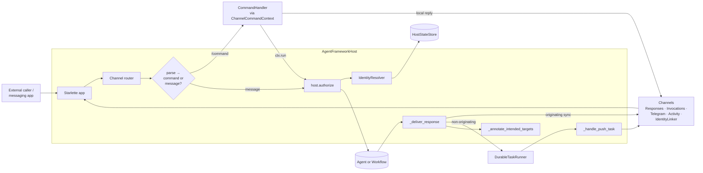

#### Channel contribution shape

Every channel exposes the same three contribution slots, all optional except `routes`. The host duck-types each slot and stitches them in at construction.

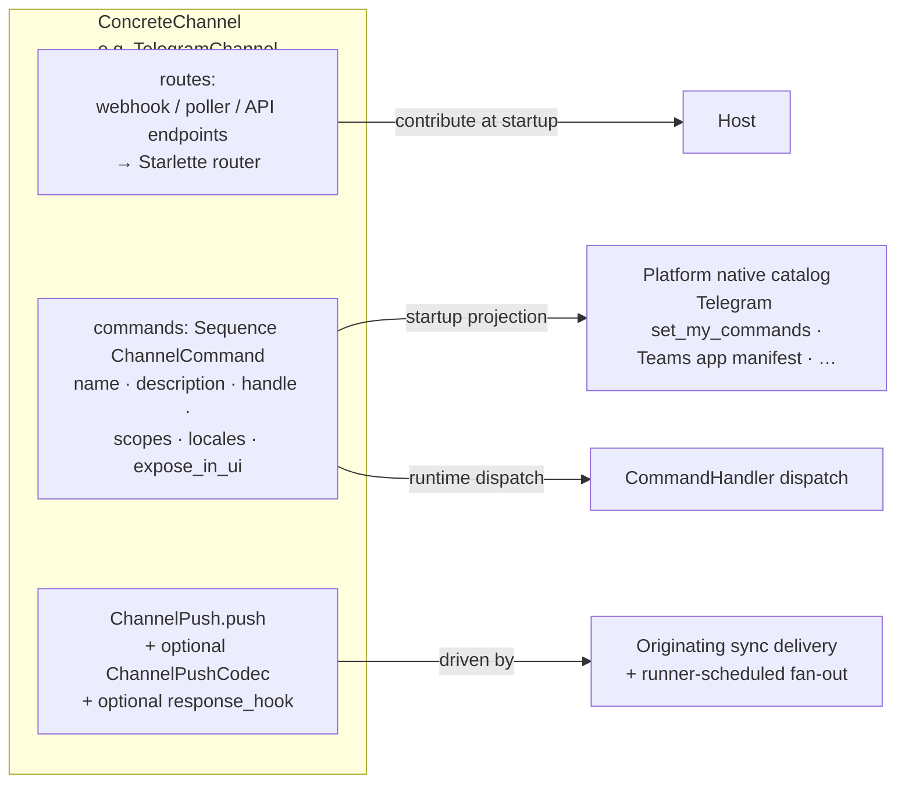

The `IdentityLinker` is itself a Channel specialisation: when one is configured, the host auto-inserts a `link` / `connect` `ChannelCommand` into every other channel's catalog (opt-out per channel via `expose_in_ui=False` or rename via metadata).

### Packages

| Distribution package | Public import surface | Purpose |
| --- | --- | --- |
| `agent-framework-hosting` | `agent_framework.hosting` | Core Starlette host, channel contract, session/request bridge |
| `agent-framework-hosting-responses` | `agent_framework.hosting` (lazy) | `ResponsesChannel` |
| `agent-framework-hosting-invocations` | `agent_framework.hosting` (lazy) | `InvocationsChannel` |
| `agent-framework-hosting-telegram` | `agent_framework.hosting` (lazy) | `TelegramChannel` and Telegram-specific helpers |

The split is between distribution packages. The **public import path stays stable at `agent_framework.hosting`** via lazy imports, consistent with the repository's packaging conventions.

### Built-in routes

For built-in channels, `path` is the configurable mount root, not the full final endpoint. The channel package owns the fixed protocol-relative suffix.

| Channel | Default `path` | Default exposed route(s) |
| --- | --- | --- |
| `ResponsesChannel` | `/responses` | `/responses/v1` and nested responses/conversation routes below it |
| `InvocationsChannel` | `/invocations` | `/invocations/invoke` |
| `TelegramChannel` | `/telegram` | webhook mode: `/telegram/webhook`; polling mode: no required HTTP route |

Overrides only replace the outer mount root:

```python
ResponsesChannel(path="/public/responses")        # -> /public/responses/v1
InvocationsChannel(path="/internal/invocations")  # -> /internal/invocations/invoke
TelegramChannel(path="/bots/telegram", bot_token=token)  # -> /bots/telegram/webhook
```

### Key Types

**`AgentFrameworkHost`** — owner of the Starlette app and channel lifecycle. Fronts one **hostable target** (an agent or a workflow).

| Field / Method | Type | Description |
|---|---|---|
| `__init__(target, *, channels, middleware=(), identity_resolver=None, identity_linker=None, debug=False)` | constructor | Composes one host from one **hostable target** (`SupportsAgentRun` or `Workflow`) and a sequence of channels. Optional `identity_resolver` and `identity_linker` provide channel-native-id → `isolation_key` mapping and a connect ceremony for linking new channels to existing identities. The host detects the target kind and dispatches to the appropriate runner. |
| `app` | `Starlette` | Canonical ASGI surface; can be handed to any ASGI server. |
| `serve(*, host="127.0.0.1", port=8000, **kwargs)` | method | Convenience wrapper around `uvicorn.run(self.app, ...)`. Lazy-imports `uvicorn`. |
| `run_in_background(request)` | `-> ContinuationToken` | Submits a `ChannelRequest` for asynchronous execution. Returns a `ContinuationToken` immediately; the result is delivered via the configured `ResponseTarget` push when ready and recorded against the token (in the configured `HostStateStore`) for later polling. Channels typically call this when their protocol response should be a 202 / acknowledgement rather than the agent reply. |
| `get_continuation(token)` | `-> ContinuationToken \| None` | Look up a previously submitted background run by its opaque token. Returns `None` when the token is unknown or has expired. Reads through the `HostStateStore` so tokens issued before the most recent restart still resolve. |

**`HostableTarget`** — the union of executable targets the host can front.

| Variant | Type | Execution seam |
|---|---|---|
| Agent | `SupportsAgentRun` | `target.run(input, *, session=..., stream=...)` |
| Workflow | `Workflow` | `target.run(input, ...)` (workflow execution seam) |

**`Channel`** (Protocol) — anything that contributes routes/commands/lifecycle to a host.

| Field | Type | Description |
|---|---|---|
| `name` | `str` | Channel name used for routing, telemetry, and `ChannelRequest.channel`. |
| `confidentiality_tier` | `str?` | Optional opaque confidentiality tier (e.g. `"corp"`, `"public"`). Consumed by the host's `LinkPolicy` to decide which channels may be linked into the same `isolation_key` and which may be `ResponseTarget` destinations for a given originating request. `None` = single-tier (no policy filtering). See `LinkPolicy`. |
| `contribute(context: ChannelContext) -> ChannelContribution` | method | Called once at host construction; returns routes/middleware/commands/lifecycle. |

**`ChannelContext`** — host-owned bridge channels use to invoke the agent.

| Method | Type | Description |
|---|---|---|
| `run(request: ChannelRequest)` | `-> HostedRunResult[Any]` | One-shot invocation. For agent targets `TResult` narrows to `AgentResponse`; for workflow targets to `WorkflowRunResult`. |
| `stream(request: ChannelRequest)` | `-> HostedStreamResult` | Streaming invocation. |

**`ChannelContribution`** — what a channel returns from `contribute(...)`.

| Field | Type | Description |
|---|---|---|
| `routes` | `Sequence[BaseRoute]` | Starlette routes mounted under the channel's `path`. Accepts both `Route` (HTTP) and `WebSocketRoute` (WS) — both are `BaseRoute`. |
| `middleware` | `Sequence[Middleware]` | Channel-scoped middleware. |
| `commands` | `Sequence[ChannelCommand]` | Native command catalog (e.g. Telegram bot commands). |
| `on_startup` | `Sequence[Callable]` | Lifecycle hooks for polling workers, command registration, etc. |
| `on_shutdown` | `Sequence[Callable]` | Lifecycle hooks for cleanup. |

**`ChannelRequest`** — normalized ingress passed to the host.

| Field | Type | Description |
|---|---|---|
| `channel` | `str` | Originating channel name. |
| `operation` | `str` | e.g. `message.create`, `command.invoke`, `approval.respond`. |
| `input` | `AgentRunInputs` | Reuses framework input types. |
| `session` | `ChannelSession?` | Session hint from the channel. |
| `options` | `ChatOptions?` | Caller-derived options (e.g. Responses `temperature`). |
| `session_mode` | `Literal["auto", "required", "disabled"]` | Whether host-managed session use is automatic, mandatory, or bypassed. |
| `metadata` | `Mapping[str, Any]` | Protocol-level metadata for telemetry. |
| `attributes` | `Mapping[str, Any]` | Channel-specific structured values (signature state, capability hints). Host code never reads this map; reserved for channel-private bookkeeping. |
| `client_state` | `Mapping[str, Any] \| None` | Bidirectional, mutable per-request state object supplied by event-rich front-ends (e.g. AG-UI). Channel-defined shape; the host treats it as opaque. Channels typically thread this into a channel-owned `ContextProvider` (see [Channel-owned per-thread state](#channel-owned-per-thread-state)) and read it back after the run to emit state-snapshot/delta events. |
| `client_tools` | `Sequence[ToolDescriptor] \| None` | Frontend tool catalog supplied per request. The channel forwards definitions onto the agent's `ChatOptions` so the LLM can call them, but tool *execution* returns to the originating client (the host does not invoke them). Run hooks may filter or rewrite the catalog. |
| `forwarded_props` | `Mapping[str, Any] \| None` | Pass-through bag for channel-protocol extras the run hook needs to route into the target — e.g. AG-UI `resume` / `command` / HITL response payloads that drive workflow `RequestInfo` / `RequestResponse` round-trips. Opaque to the host; the run hook decides where it lands on the rebuilt `ChannelRequest.input`. |
| `identity` | `ChannelIdentity?` | Channel-native **user** identity observed on this request — `(channel, native_id, attributes)`. Channels populate it from the inbound payload's user field (Telegram `from.id`, Teams `from.aadObjectId`, Responses `safety_identifier`, …) — **not** the chat / conversation id, which is carried separately on `conversation_id` and matters in multi-user surfaces (Telegram groups, Teams group chats and channels — see [Multi-user conversations](#multi-user-conversations-telegram-groups-teams-group-chats-and-channels)). The host records `(isolation_key, channel) → identity` on every successful resolve so `ResponseTarget.active`, `.channel(name)`, `.channels([...])`, and `.all_linked` can find a destination native id without per-request payload bookkeeping. |
| `stream` | `bool` | Whether to invoke `stream(...)` rather than `run(...)`. |
| `response_target` | `ResponseTarget` | Where the response is delivered (default: `ResponseTarget.originating`). See `ResponseTarget` below. |
| `background` | `bool` | If `True`, host returns a `ContinuationToken` immediately rather than awaiting the response. Forced `True` when `response_target == ResponseTarget.none`. |

**`ChannelSession`** — small, host-neutral session hint.

| Field | Type | Description |
|---|---|---|
| `key` | `str?` | Stable host lookup key for an `AgentSession`. **Caller-supplied** channels populate it from the wire payload (e.g. `previous_response_id`, request-body `session_id`). **Host-tracked** channels leave it `None` and let the host's per-`isolation_key` alias decide which `AgentSession` to resolve (see [Channel session-carriage models](#channel-session-carriage-models)). |
| `conversation_id` | `str?` | Protocol-visible conversation/thread identifier when one exists. |
| `isolation_key` | `str?` | Opaque isolation boundary (user, tenant, chat, …) using hosted-agent terminology. |
| `attributes` | `Mapping[str, Any]` | Channel-specific session hints. |

**`ChannelRunHook`** — per-request escape hatch for built-in channels.

```python
ChannelRunHook = Callable[..., Awaitable[ChannelRequest] | ChannelRequest]
```

Channels invoke the hook positionally with the channel-built `ChannelRequest` and pass named extras as keyword arguments. The minimum signature an app author needs is:

```python
def my_hook(request: ChannelRequest, **kwargs) -> ChannelRequest: ...
```

Hooks that want the named extras pull them out by name:

| Keyword | Type | Description |
|---|---|---|
| `target` | `SupportsAgentRun \| Workflow` | The hosted target (so hooks can adapt to e.g. `A2AAgent` or to a `Workflow`'s typed inputs). |
| `protocol_request` | `Any?` | Original channel-native protocol payload — Responses JSON body, Telegram `Update` dict, Activity Protocol `Activity` dict, Invocations body, … (loosely typed in v1). |

Runs **after** the channel has produced its default `ChannelRequest`, **before** the host resolves session behavior and calls the target's execution seam. This is the canonical adapter point for workflow targets, where the channel's free-form input must be reshaped into the workflow's typed inputs.

> Earlier drafts wrapped these arguments into a `ChannelRunHookContext` object. The signature was simplified so the typical hook only needs `(request, **kwargs)` — making it safe against future named extras and easier to write inline.

**`ChannelIdentity`** — the channel-native identity the host sees on each request, used as the resolver/linker input.

| Field | Type | Description |
|---|---|---|
| `channel` | `str` | Originating channel name (matches `Channel.name`). |
| `native_id` | `str` | Channel-native **user** identifier (Telegram `from.id`, Teams `from.aadObjectId`, WhatsApp phone number, Slack user id, …). In 1:1 chats this often coincides with the chat / conversation id; in multi-user surfaces (Telegram groups, Teams group chats and channels) it is **strictly the user** — the conversation locator lives separately on `ChannelRequest.conversation_id` / `ChannelSession.conversation_id`. Always per-channel; never assumed to align across channels. |
| `attributes` | `Mapping[str, Any]` | Optional per-channel context (display name, locale, group/private chat flag, Teams `tenantId`, Telegram `chat.type`, Teams `conversationType`, …) the resolver/linker may key on. |

**`IdentityResolver`** — host-level seam that maps a `ChannelIdentity` to an `isolation_key`.

```python
IdentityResolver = Callable[[ChannelIdentity], Awaitable[str | None] | (str | None)]
```

The **default resolver auto-issues** an `isolation_key` the first time a `(channel, native_id)` is seen and persists the mapping in the host's identity store, so every end user automatically gets a stable per-user `isolation_key` on first contact through **any** channel — no per-channel boilerplate is required for the single-channel case. Returning `None` is reserved for advanced cases where the resolver wants to refuse unknown identities; the dedicated host seam for accept/reject decisions is **`IdentityAllowlist`** — see [Authorization profiles and the IdentityAllowlist seam](#authorization-profiles-and-the-identityallowlist-seam) below.

Cross-channel continuity is then a one-shot **merge** operation: after a successful link ceremony (Scenario 6), the host atomically rewrites the second channel's auto-issued key to point at the first channel's existing `isolation_key`. Apps never have to write per-channel mapping hooks just to get continuity to work.

Apps that already own an identity namespace (corporate user id, tenant-scoped account id) can supply a custom resolver that returns those values directly — bypassing auto-issuance.

**`IdentityLinker`** (Protocol) — host-level seam that runs a connect ceremony to associate a new `ChannelIdentity` with an existing `isolation_key`. The linker is a peer of `Channel` for routing purposes and contributes its own routes/lifecycle.

| Field / Method | Type | Description |
|---|---|---|
| `name` | `str` | Linker name; used for telemetry and to namespace its routes. |
| `contribute(context: ChannelContext) -> ChannelContribution` | method | Same shape as `Channel.contribute(...)`; lets the linker publish callback/verification routes (e.g. `/identity/oauth/callback`, `/identity/verify`) and lifecycle hooks. |
| `begin(identity: ChannelIdentity, *, requested_isolation_key=None) -> LinkChallenge` | method | Starts the ceremony for a channel-native identity. Returns a `LinkChallenge` describing what the user must do (URL to visit, code to enter, MFA prompt). |
| `complete(challenge_id: str, proof: Mapping[str, Any]) -> str` | method | Verifies the proof and returns the resolved `isolation_key`. On success the host atomically records both `(channel, native_id) → isolation_key` and any verified IdP claim recovered from the proof (e.g. `(microsoft.oid, <oid>)`) so subsequent channels that supply the same claim auto-link without a second ceremony. |
| `is_linked(identity: ChannelIdentity, *, verified_claims: Mapping[str, str] = {}) -> str \| None` | method | Returns the `isolation_key` for an already-linked identity, or `None` if no link exists. Channels with `require_link=True` call this on every inbound request before invoking the agent. When `verified_claims` are supplied (e.g. Teams' AAD `oid` from the inbound activity bearer) and a match exists in the link store, the linker silently auto-merges the new `(channel, native_id)` onto the existing `isolation_key` and returns it — this is the "sign in once, every other channel just works" mechanism. |

| Built-in helper | Mechanism | Notes |
|---|---|---|
| `OAuthIdentityLinker(provider, ...)` | OAuth authorization-code redirect | Contributes `/identity/oauth/{provider}/start` + `/callback`; ships with provider presets (Microsoft, Google, GitHub) as opt-in helpers. Stores the verified IdP `sub` / `oid` as a verified claim alongside the channel-native identity so channels that authenticate with the same IdP (e.g. Teams via Entra ID) auto-link on first contact. |
| `OneTimeCodeIdentityLinker(...)` | Signed short-lived code | User runs `/link` on channel A, receives a code; runs `/link <code>` on channel B; host verifies and merges. |

A built-in `link` (or `connect`) `ChannelCommand` is exposed automatically when an `IdentityLinker` is configured. Its `handle` invokes `linker.begin(...)` and replies with the `LinkChallenge` payload (URL, code, instructions) projected through the channel's native rendering. Channels may opt out (`expose_in_ui=False`) or override the command's name per channel.

**`require_link` (per-channel)** — every channel that emits a `ChannelIdentity` accepts a `require_link: bool = False` constructor argument. When `True`, the channel calls `linker.is_linked(identity, verified_claims=…)` before producing a `ChannelRequest`; un-linked identities are short-circuited to a rendered `LinkChallenge` reply (the same payload the `link` command would emit) and the agent is **not** invoked for that turn. Combined with the linker's verified-claim auto-link, this gives an "authenticate before chatting" enforcement model where the first channel forces the OAuth ceremony and subsequent channels join the same `isolation_key` silently. See [Scenario 6](#scenario-6-linking-a-new-channel-to-an-existing-identity-via-oauth) for the end-to-end flow. Default is `False`, which preserves the opportunistic flow (auto-issued `isolation_key`, link manually later). Channels whose protocol does not authenticate the user (e.g. anonymous Responses calls) ignore the flag. `require_link` is the **"identity must be linked"** axis; the **orthogonal "identity is on the accept list"** axis is `allowlist` — see [Authorization profiles and the IdentityAllowlist seam](#authorization-profiles-and-the-identityallowlist-seam) below.

#### Authorization profiles and the `IdentityAllowlist` seam

`require_link` (above) and `allowlist` (below) compose into the **three named authorization profiles** the spec supports for any channel that emits a `ChannelIdentity`. The two parameters stay **orthogonal** on the channel constructor — there is no single `auth_mode` enum — but the host exposes named factories on `AuthPolicy` (`AuthPolicy.open()` / `.require_link()` / `.native_allowlist(...)` / `.linked_claim_allowlist(...)` / `.mixed(...)`) for ergonomic configuration:

| Profile | Channel config | What gets gated | Typical use |
|---|---|---|---|
| **Open** (default) | `require_link=False`, `allowlist=None` | Nothing — every identity gets an auto-issued `isolation_key` on first contact. | Public chatbot, internal dev/demo, single-tenant deployments. |
| **Forced link** | `require_link=True`, `allowlist=None` | Identity must complete the link ceremony at least once. Any successfully authenticated identity is then allowed. | "Sign in once with your corporate account, then chat freely" style bots that gate on tenancy via the IdP rather than per-user. |
| **Native allowlist** | `require_link=False`, `allowlist=NativeIdAllowlist(...)` | Only listed channel-native ids (Telegram `chat_id`s, WhatsApp numbers, Slack user ids) get through. Pre-link, no IdP claim involved. | Personal bots, single-user prototypes, small fixed-membership channels. |
| **Linked-claim allowlist** | `require_link=True`, `allowlist=LinkedClaimAllowlist(...)` | Identity must (a) complete the link ceremony **and** (b) carry an IdP claim whose value is on the list (e.g. AAD `oid in {…}` or `tid == "<tenant>"`). | Multi-channel corporate bot where any channel works but only specific people in a specific tenant are admitted. |
| **Mixed** | `require_link=False`, `allowlist=AnyOfAllowlists(NativeIdAllowlist(...), LinkedClaimAllowlist(...))` | Either the native id is preapproved **or** the user successfully links and matches the claim allowlist. Native-id hits bypass the link ceremony; everyone else is funneled into it. | A bot that wants ops-team Telegram ids in immediately while still letting other corp users self-onboard via OAuth. |

The decision pipeline that produces each of those profiles:

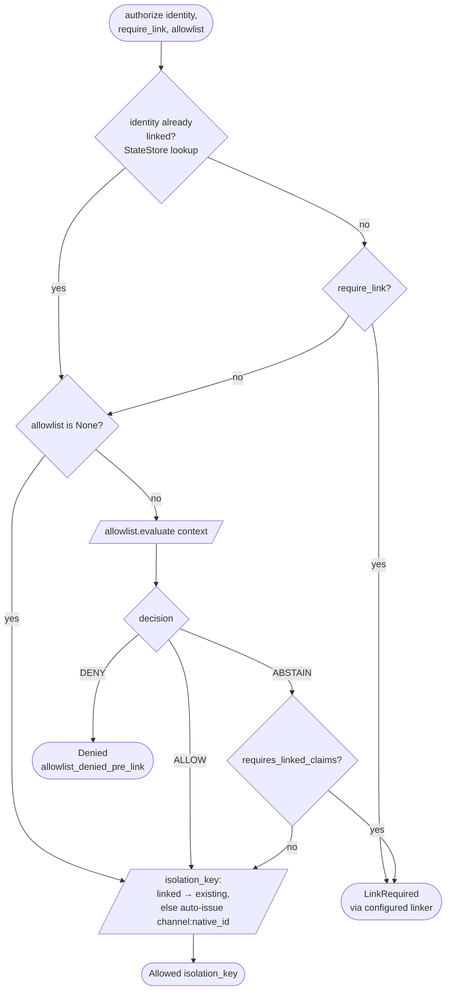

The flow shows three terminal states: `Allowed`, `LinkRequired`, `Denied`. `LinkRequired` is reachable whenever `require_link=True` and the identity has not completed the link ceremony (or an allowlist `ABSTAIN`ed and `requires_linked_claims=True`), independent of whether an allowlist is configured.

##### `IdentityAllowlist` Protocol (tri-state)

Allowlists are evaluated by a host-level pipeline (`host.authorize(...)`, below) that calls them twice — once with the raw channel-native identity (`phase="pre_link"`) and, if necessary, again after the link ceremony surfaces verified IdP claims (`phase="post_link"`). To make composition (`AnyOfAllowlists`, `AllOfAllowlists`) well-defined and to keep claim-based allowlists from accidentally denying everyone when claims are not yet available, the contract is **tri-state**:

```python
class AllowlistDecision(StrEnum):
    ALLOW = "allow"      # accept this identity unconditionally
    DENY = "deny"        # reject this identity unconditionally
    ABSTAIN = "abstain"  # this allowlist has no opinion at this phase
                         # (e.g. a claim-based list during pre_link)

@dataclass(frozen=True)
class AuthorizationContext:
    identity: ChannelIdentity
    phase: Literal["pre_link", "post_link"]
    isolation_key: str | None              # None at pre_link; resolved at post_link
    verified_claims: Mapping[str, str]     # {} when no claims; populated post_link
    claim_source: Literal["linker", "channel", "none"]
                                           # "channel" when the channel itself emits
                                           # verified claims (e.g. Activity Protocol
                                           # bearer with AAD oid); "linker" when the
                                           # IdentityLinker surfaces them; "none" otherwise.

class IdentityAllowlist(Protocol):
    requires_linked_claims: bool = False   # if True, host validation rejects
                                           # configurations where neither `require_link`
                                           # nor a claim-emitting channel can deliver
                                           # the claims this allowlist needs.

    async def evaluate(self, context: AuthorizationContext) -> AllowlistDecision: ...
```

`ABSTAIN` is **not** a denial — it is "this allowlist has no information yet". The host's decision pipeline (below) is what turns an all-`ABSTAIN` outcome into the appropriate next step (allow when open, escalate to a link ceremony when the configuration calls for one). Boolean allowlists were rejected as part of this design pass because two-state composition cannot distinguish "claim allowlist denies you" from "claim allowlist hasn't seen any claims yet" — a critical distinction for the **Mixed** profile.

##### Built-in allowlists

| Helper | Pre-link behavior | Post-link behavior | Notes |
|---|---|---|---|
| `AllowAll()` | `ALLOW` | `ALLOW` | Explicit "open" sentinel; useful for tests and for overriding a host-level `default_allowlist`. |
| `NativeIdAllowlist(channel=None, native_ids=...)` | `ALLOW` if `(channel, native_id)` is on the list; `DENY` if `channel` matches but `native_id` does not; `ABSTAIN` if `channel` does not match (allows mixing per-channel native lists under one `AnyOfAllowlists`). | Same as pre-link — native-id allowlists do not depend on link state. | Constructor accepts `native_ids: Collection[str] \| Callable[[], Awaitable[Collection[str]]]` so the list can be loaded asynchronously (config file, secret store). |
| `LinkedClaimAllowlist(claim, values)` | `ABSTAIN` (no claims available yet). | `ALLOW` if `verified_claims.get(claim)` is in `values`; `DENY` otherwise. | `requires_linked_claims = True`. Host construction-time validator rejects use with `require_link=False` on a channel that does not also emit verified claims natively — this prevents the silent-deny-everyone footgun. |
| `AnyOfAllowlists(*allowlists)` | `ALLOW` if any child `ALLOW`s; `DENY` only if **all** children `DENY`; otherwise `ABSTAIN`. | Same rule. | Composition for the **Mixed** profile. |
| `AllOfAllowlists(*allowlists)` | `DENY` if any child `DENY`s; `ALLOW` only if **all** children `ALLOW`; otherwise `ABSTAIN`. | Same rule. | E.g. require both tenancy (`LinkedClaimAllowlist("tid", ...)`) **and** group membership (`LinkedClaimAllowlist("groups", ...)`). |
| `CallableAllowlist(fn)` | Calls `fn(context)` and returns its result. | Same. | Escape hatch for app-specific logic; recommended only after exhausting the structured variants. |

##### Host configuration: `default_allowlist` + explicit channel inheritance

Allowlists can be configured at the host level (`AgentFrameworkHost(default_allowlist=...)`) and per-channel. The channel-side default is **explicit inheritance**, not an implicit `None`:

```python
class SomeChannel:
    def __init__(
        self,
        *,
        require_link: bool = False,
        allowlist: IdentityAllowlist | Literal["inherit"] | None = "inherit",
    ): ...
```

- `allowlist="inherit"` (default) → the host's `default_allowlist` applies. If the host did not set one either, the channel is open.
- `allowlist=None` → the channel is **explicitly open**, even if the host has a `default_allowlist`. Used to carve out a public endpoint inside an otherwise-locked-down host.
- `allowlist=<IdentityAllowlist>` → that allowlist applies, overriding the host default. To **add to** the host default rather than replace it, compose explicitly: `allowlist=AllOfAllowlists(host.default_allowlist, MyExtraList())`.

##### `host.authorize(...)` and `AuthorizationOutcome`

Channels do not run the decision pipeline themselves — they call into a single host seam after extracting `ChannelIdentity` and any natively verified claims:

```python
@dataclass(frozen=True)
class Allowed:
    isolation_key: str

@dataclass(frozen=True)
class LinkRequired:
    challenge: LinkChallenge

@dataclass(frozen=True)
class Denied:
    reason_code: str                       # stable, machine-readable
    user_message: str | None = None        # safe to render publicly (group-chat-safe)
    log_details: Mapping[str, Any] = {}    # never shown to users; structured for audit

AuthorizationOutcome = Allowed | LinkRequired | Denied

async def host.authorize(
    identity: ChannelIdentity,
    *,
    require_link: bool,
    allowlist: IdentityAllowlist | None,
    verified_claims: Mapping[str, str] | None = None,
    conversation_context: ConversationContext | None = None,  # for group-chat policy
) -> AuthorizationOutcome: ...
```

**Decision order** (the pipeline the host runs):

1. Build `AuthorizationContext(phase="pre_link", verified_claims=verified_claims or {}, claim_source=…)`.
2. `decision_pre = allowlist.evaluate(context_pre)` (defaults to `ALLOW` when `allowlist is None`).
3. `decision_pre == DENY` → `Denied(reason_code="allowlist_denied_pre_link", ...)`.
4. `decision_pre == ALLOW`:
   - If `require_link=True` and the linker has no record yet → `LinkRequired(linker.begin(identity))`.
   - Otherwise → `Allowed(resolved_or_auto_issued_isolation_key)`.
5. `decision_pre == ABSTAIN`:
   - If `require_link=True` **or** the allowlist declared `requires_linked_claims`: attempt `linker.is_linked(identity, verified_claims=…)`.
     - Not linked → `LinkRequired(linker.begin(identity))`.
     - Linked → evaluate again at `phase="post_link"` with the linker-emitted claims.
       - `ALLOW` → `Allowed(linked_isolation_key)`.
       - `DENY` → `Denied(reason_code="allowlist_denied_post_link", ...)`.
       - `ABSTAIN` post-link is a misconfiguration (no allowlist had an opinion even after linking); logged and treated as `Denied(reason_code="allowlist_abstain_after_link")`.
   - Otherwise (open profile, no claim dependency): `Allowed(auto_issued_isolation_key)`.

The channel **renders** the outcome — `Allowed` proceeds to `ChannelRequest`, `LinkRequired` projects the `LinkChallenge` through the channel's native UX (same path the `link` command already uses), `Denied` projects `user_message` (when set) through a short refusal. The channel **never** sees `log_details` and is responsible for not echoing `reason_code` to end users.

##### Configuration validation (fail-fast)

The host runs a startup validator across `(channel.require_link, channel.allowlist)` for every channel:

1. If `channel.allowlist` (after resolving `"inherit"`) contains any allowlist with `requires_linked_claims=True`, the channel **must** either have `require_link=True` or declare via a channel attribute that it natively emits verified claims (`Channel.emits_verified_claims: bool = False`). Otherwise: `raise ChannelConfigurationError("LinkedClaimAllowlist requires a source of verified claims; set require_link=True on <channel> or use a channel that emits them natively")`.
2. If `channel.allowlist` contains a `LinkedClaimAllowlist` and the host has no `identity_linker` configured: same `ChannelConfigurationError`.
3. If `channel.allowlist` contains a `NativeIdAllowlist(channel=<other>)` whose `<other>` is not a known channel on this host: `ChannelConfigurationError`.

These errors are raised eagerly at `AgentFrameworkHost.__init__` (or `host.serve(...)` startup), not on the first inbound request — silent deny-everyone is the worst possible default and is not allowed.

##### Group chats and privacy of denial

Authorization runs **per message**, not per conversation: in a group chat, one allowlisted user invoking the bot does not authorize other group members for subsequent messages. The host also mirrors the `LinkChallenge` group-chat redirect pattern (see [Multi-user conversations](#multi-user-conversations-telegram-groups-teams-group-chats-and-channels)) for denials:

- In a 1:1 chat, the channel may render the full `user_message` from `Denied`.
- In a group chat, the channel renders a generic refusal in-room (e.g. "You don't have access to this bot.") and, where the channel supports it, follows up with a DM containing the longer `user_message`. The full `log_details` payload only reaches the host's structured logs / OpenTelemetry span — never the wire.

Built-in `user_message` defaults are intentionally bland and tenancy-free ("You don't have access to this bot." / "Please link your account to continue.") to avoid leaking who else is in the allowlist or which tenant gates it.

##### v1 shipping plan

Because `host.authorize(...)` and `LinkedClaimAllowlist` are tied to the still-unimplemented `IdentityLinker` stack, the seam ships in two waves:

1. **Wave 1 (this core PR — standalone, no linker dep):**
   - `IdentityAllowlist` Protocol + `AllowlistDecision` enum + `AuthorizationContext` dataclass.
   - `AllowAll`, `NativeIdAllowlist`, `AnyOfAllowlists`, `AllOfAllowlists`, `CallableAllowlist` built-ins.
   - `LinkedClaimAllowlist` type exported for composition; `evaluate()` raises `NotImplementedError` until Wave 2 — it is illegal to ship it without either an `identity_linker` (Wave 2) or a channel that declares `emits_verified_claims=True` (caught by config validator #1).
   - `AuthorizationOutcome` (`Allowed` / `LinkRequired` / `Denied`) types.
   - `Host(default_allowlist=..., identity_linker=...)` + per-channel `allowlist: ... | Literal["inherit"] | None` parameter and the construction-time config validator. Wave-1 enforces rules #1 (claim-source), **#2 (linker presence — channels with `require_link=True` must be paired with a configured `identity_linker`; otherwise a `ChannelConfigurationError` is raised at construction so misconfigurations cannot ship)**, and #3 (NativeIdAllowlist channel typo). Combinator walking (`AnyOf` / `AllOf`) is recursive so nested misconfigurations are caught at the host level.
   - `host.authorize(identity, *, require_link, allowlist, verified_claims=None)` shipped for the native-id pipeline: the open path returns `Allowed` with an auto-issued `<channel>:<native_id>` isolation key (linear-scan registry lookup re-issues a known key when the identity has been seen before); a native-id allowlist returns `Allowed`/`Denied` per the list; an `ABSTAIN` decision is mapped to `Denied(reason_code="allowlist_requires_link")` when the allowlist declares `requires_linked_claims=True` (no linker shipped to convert it to `LinkRequired` yet) and falls through to `Allowed` otherwise.

2. **Wave 2 (with the `IdentityLinker` core PR):**
   - `LinkedClaimAllowlist` enabled end-to-end (replaces the Wave-1 raise).
   - `host.authorize(...)` returns `LinkRequired` (instead of the Wave-1 `Denied(reason_code="allowlist_requires_link")` placeholder) when an allowlist needs claims and a linker is configured to supply them.
   - Indexed `IdentityResolver` replaces the Wave-1 linear-scan auto-issue.
   - `AuthPolicy` factory helpers shipped on the public surface.


#### `LinkPolicy` and `confidentiality_tier`

**`LinkPolicy`** — host-level decision over which channels may share an `isolation_key` and which channels may be a `ResponseTarget` for one another. Consumed by both the `IdentityLinker` (to refuse incompatible link attempts) and the host's response-routing layer (to filter `all_linked` / `active` / specific destinations).

```python
LinkPolicy = Callable[[LinkPolicyContext], bool]
```

`LinkPolicyContext` carries the originating `Channel` (and its `confidentiality_tier`), the prospective destination `Channel` (and its `confidentiality_tier`), and the operation kind (`"link"` or `"deliver"`). Returns `True` to allow, `False` to refuse. Refusal during `link` raises a typed error to the user; refusal during `deliver` excludes that destination from the route set (and falls back to `originating` if the route set becomes empty).

| Built-in policy | Behavior |
|---|---|
| `AllowAllLinks()` | Default. Any pair allowed; preserves today's single-tier behavior. |
| `SameConfidentialityTierOnly()` | Only allows pairs whose `confidentiality_tier` matches (including both `None`). Most common multi-tier setup. |
| `ExplicitAllowList(allowed_pairs={("public", "corp"), ...})` | Allows only the listed `(source, target)` pairs. Useful for one-directional escalation flows. |
| `DenyAllLinks()` | Refuses every link attempt and excludes every non-`originating` destination — channels share an agent target on the host but never share sessions. Equivalent to running each channel on its own host minus the deployment overhead. |

Confidentiality tiers are **opaque labels** — the host does not interpret them; the policy decides what they mean. Setting `confidentiality_tier=None` on every channel preserves single-tier behavior. Two separate hosts is always a valid alternative to using `LinkPolicy`; the policy exists for cases where shared deployment, shared middleware, or a shared target object are preferred over running multiple hosts.

#### Multi-user conversations (Telegram groups, Teams group chats and channels)

Telegram and Activity Protocol (Bot Service) both surface **multi-user conversations** alongside 1:1 chats — Telegram has private chats, groups, supergroups, forum topics inside supergroups, and broadcast channels; Activity Protocol has `conversationType` of `personal`, `groupChat`, and `channel` (a Teams team channel, with optional threaded `replyToId`). The hosting contract treats these uniformly, but channel implementations and host configuration both need to make a few explicit choices:

**Identity vs. conversation are two axes, not one.** `ChannelIdentity.native_id` is always the **user** (`from.id` / `from.aadObjectId`); `ChannelRequest.conversation_id` is the **chat / channel / thread**. In 1:1 chats they collapse onto the same value (Telegram `chat.id == from.id`); in groups they don't and must not be conflated. The default `IdentityResolver` keys on `(channel, native_id)`, so a single user automatically gets one `isolation_key` whether they message in a group or in DM — that may or may not be what you want (see scoping below).

**Conversation scoping policy.** A channel exposes a `conversation_scope` constructor option declaring how the host should derive the resolved `isolation_key` for multi-user surfaces. Three built-ins:

| Scope | `isolation_key` derivation in multi-user conversations | When to pick it |
|---|---|---|
| `per_user` | The user's `isolation_key` from `IdentityResolver(ChannelIdentity)` only — group and DM share state. | Personal-assistant agents where the bot follows the user across surfaces and their preferences/memory should travel with them. Risky if the agent emits user-specific data in a public group. |
| `per_user_per_conversation` (default for multi-user) | `f"{user_isolation_key}:{conversation_id}"` — same user gets a different `isolation_key` per group / channel / topic / DM. | Default and safest. The agent's memory of a Teams team channel is separate from its memory of the same user's DM. |
| `per_conversation` | `f"_conv:{channel}:{conversation_id}"` — every member of the group shares one `isolation_key` and one `AgentSession`. The user identity is still attached to each turn (via `ChannelRequest.identity`) so the agent can address users by name, but session state is shared. | "Bot lives in this channel" deployments: meeting-notes bot, shared scratchpad, support-triage queue. |

1:1 chats always derive `isolation_key` from the user identity alone — the per-user-per-conversation key would just include the user's own DM and add no isolation value.

**Addressing rule.** Group surfaces typically don't want the bot replying to every message. Channels expose an `accept_in_group` constructor option:

| Mode | Semantics | Default for |
|---|---|---|
| `mention_only` | Accept only messages that explicitly mention the bot (`@bot` for Telegram, `<at>botname</at>` mention entity for Teams). | Telegram groups, Teams `groupChat`, Teams team channels |
| `command_only` | Accept only registered `ChannelCommand` invocations (e.g. `/ask …`). | — |
| `mention_or_command` | Either of the above. | — |
| `all` | Accept every inbound message. | 1:1 chats; opt-in for groups when the agent really is the only conversational participant |

Messages that don't satisfy the rule are ignored at the channel layer — no `ChannelRequest` is produced and the agent is never invoked. This is purely an inbound filter; outbound delivery (push / response routing) is unaffected.

**Reply / `originating` routing.** The `originating` `ResponseTarget` always replies in the **same conversation** the request came from — including the same Teams team-channel thread (`replyToId`) or Telegram forum topic (`message_thread_id`). Channels carry the conversation-locator details on `ChannelRequest.conversation_id` (and additional fields on `ChannelRequest.attributes` when needed, e.g. `thread_id`); the channel's reply path reads them back. Channels that cannot reply in-thread (rare) fall back to a fresh top-level reply in the same conversation.

**`ChannelPush` in groups.** When a non-`originating` `ResponseTarget` lands on a multi-user surface, the push must address a `(user, conversation)` pair: the host calls `ChannelPush.push(identity, payload)` where `identity.attributes` includes the recorded `conversation_id` (and thread/topic id when applicable) of the most recent observation under that scope. For `per_conversation` scope, every member's `ChannelIdentity` resolves to the same `isolation_key`, so the host instead picks the most recently observed `conversation_id` for that key and posts a single message to the conversation rather than fanning out to each user.

**Linker ceremonies in groups.** OAuth and one-time-code link flows MUST NOT post the challenge URL or code into a group conversation visible to other users. Channels that support groups MUST detect group context (via `ChannelIdentity.attributes`) and, when `require_link=True` triggers a `LinkChallenge`, redirect the rendered challenge to the user's DM (Telegram: bot DM with the user; Teams: `personal` scope conversation with the same user). If a DM cannot be opened (Telegram user has not started the bot, Teams personal scope not installed), the channel returns a short prompt asking the user to DM the bot and retry. Verified-claim auto-link is unaffected — when a Teams `groupChat` request carries an AAD-verified `from.aadObjectId` that already matches an existing claim in the link store, the merge happens silently with no group-visible artifact.

**Confidentiality tier interaction.** A Teams team channel post is visible to every member of the team; a 1:1 DM is not. Operators who care about the distinction MUST configure separate `Channel` instances (e.g. `ActivityChannel(scopes=["personal"], confidentiality_tier="user")` + `ActivityChannel(scopes=["channel", "groupChat"], confidentiality_tier="team")`) and apply a `LinkPolicy` so cross-tier `ResponseTarget` deliveries and identity links are filtered. The hosting layer does not infer tier from `conversationType`; it is an explicit deployment choice.

**Telegram broadcast `Channel` (the Telegram product) and forum topics.**

- *Broadcast Channels* — bots that are members of a Telegram broadcast Channel can post but generally do not receive user replies; treat as `ChannelPush`-only and configure with `accept_in_group="command_only"` so admin-issued commands (`/announce …`) are the only inbound trigger. Out of scope for v1; v1 ships group/supergroup support and leaves broadcast Channels for fast follow.
- *Forum topics* — supergroups with topics surface `message_thread_id`. The `TelegramChannel` populates `ChannelRequest.conversation_id` as `f"{chat_id}:{message_thread_id}"` so `per_user_per_conversation` and `per_conversation` scopes naturally separate topics from each other and from the group's general thread.

**Activity Protocol specifics for `ActivityChannel`.**

- `conversationType` mapping: `personal` → 1:1 (`accept_in_group="all"` rule applied), `groupChat` and `channel` → multi-user (default `mention_only`).
- Teams team channels carry both a channel id and an optional `replyToId`. The channel populates `conversation_id` as `f"{conversation.id}:{replyToId}"` when replying in-thread is desired (`per_user_per_conversation` scope makes thread-isolated sessions easy); deployments that prefer a single session per Teams channel can set `conversation_scope="per_conversation"` and the channel will key on `conversation.id` alone.
- `tenantId` is recorded on `ChannelIdentity.attributes` so multi-tenant deployments can implement an `IdentityResolver` that scopes `isolation_key` by tenant (or refuses unknown tenants).
- Adaptive-card submit (`Invoke` activities) flows are addressed in fast-follow alongside the `ActivityChannel` package; v1 of the host contract supports them via `ChannelRequest.forwarded_props`, so no host-level change is needed.

**`ResponseTarget`** — directs **where** the host delivers the agent response. Independent of `session_mode`.

| Variant | Constructor | Behavior |
|---|---|---|
| Originating | `ResponseTarget.originating` (default) | Synchronous response on the originating channel. |
| Active | `ResponseTarget.active` | Delivered to the channel most recently observed for the resolved `isolation_key`. |
| Specific channel (link-store recipient) | `ResponseTarget.channel("activity")` | Delivered via the named channel's `ChannelPush` to whichever channel-native identity is recorded for the resolved `isolation_key` in the link store. |
| Explicit identities | `ResponseTarget.identities([ChannelIdentity("telegram", native_id="<chat_id>"), ...])` | Delivered via each named channel's `ChannelPush` to the **caller-supplied channel-native identity** — bypasses the link store entirely. Used when the originating caller already knows the recipient's channel-native id (e.g. a server-side Responses caller relaying for a known user). The host still consults `LinkPolicy` for each delivery. Convenience alias: `ResponseTarget.identity(ChannelIdentity(...))` for the single-identity case. |
| Multiple channels | `ResponseTarget.channels(["telegram", "activity"])` | Delivered to each named channel (link-store recipient per channel). |
| All linked | `ResponseTarget.all_linked` | Delivered to every channel where the resolved `isolation_key` is known. |
| None | `ResponseTarget.none` | Background-only — caller must poll the `ContinuationToken`. Forces `background=True`. |

`ResponseTarget` constructors that take at least one channel id (`.channel(...)`, `.channels([...])`, `.identities([...])`) accept an `echo_input: bool = False` kwarg. When true, the host pushes the **originating user's input** to each non-originating destination as a `HostedRunResult[AgentResponse]` whose underlying `messages[*].role == "user"` **before** the agent reply (whose `messages[*].role == "assistant"`). Used when the developer wants downstream channels to mirror what the user said so their UI stays coherent (e.g. a workflow originating on Telegram that pushes to Teams as well — the Teams transcript shows both turns). The echo and the response are bundled into the **same scheduled push task** per destination (the runner-managed unit of work — see [Intended targets + durable delivery](#intended-targets--durable-delivery)); the echo is dispatched first, and an echo-push failure is logged and swallowed inside the task so a channel that drops echoes still receives the agent reply. Both pushes go through the same `ChannelPush.push(identity, payload)` entry point — channels distinguish the echo phase from the response phase by inspecting `payload.result.messages[*].role`, or (for channels that wire a `response_hook`) by branching on `ChannelResponseContext.is_echo` directly. Channels that cannot impersonate the user on their wire (most chat bots can only send as the bot) typically render echoes as a quoted / prefixed block, drop them, or rewrite them via their `response_hook`.

When `response_target` is anything other than `originating`, the originating channel's protocol response is the **`ContinuationToken`** (e.g. an Invocations 202 with the token in the response body and/or a polling URL header), and the actual agent response is delivered out-of-band via the destination channel(s)' `ChannelPush`. If the destination channel doesn't implement `ChannelPush`, the host falls back per the configured policy (default: deliver to `originating`; surfaces a warning in telemetry). The configured `LinkPolicy` is consulted for every destination — destinations that fail the policy (e.g. a corp-tier channel addressed from a public-tier originating request) are dropped, and if every destination is dropped the host falls back to `originating`.

**`ChannelPush`** (Protocol) — optional capability for channels that can deliver outbound messages without a prior request.

| Method | Type | Description |
|---|---|---|
| `push(identity: ChannelIdentity, payload: HostedRunResult)` | async | Proactively delivers a completed run result to the given channel-native identity (Telegram proactive message, Activity Protocol proactive message via Bot Service `continueConversation`, webhook callback, SSE broadcast). Channels implement this in addition to `Channel`; channels that cannot push omit it. |

**`ContinuationToken`** — first-class artifact for asynchronous / background runs.

| Field | Type | Description |
|---|---|---|
| `token` | `str` | Opaque, URL-safe continuation token. The only field channels expose to callers; all other fields are implementation detail of the host's `HostStateStore`. Stable for the lifetime of the run record (until expiry / eviction). |
| `status` | `Literal["queued", "running", "completed", "failed"]` | Current status. |
| `isolation_key` | `str?` | The resolved isolation key the run is associated with. |
| `created_at` | `datetime` | Submission time. |
| `completed_at` | `datetime?` | Set when status is `completed` or `failed`. |
| `result` | `HostedRunResult?` | Populated on `completed`. |
| `error` | `str?` | Populated on `failed`. |
| `response_target` | `ResponseTarget` | The configured delivery target (recorded for diagnostics). |

The host stores `ContinuationToken`s through a `HostStateStore` (see [Host state storage](#host-state-storage)). The v1 default is **`FileHostStateStore`** — one JSON file per token under a configurable directory (default `./.af-hosting/continuations/`), written atomically (`.tmp` + `os.replace`) so a host crash mid-write doesn't corrupt the record. This means background runs **survive host restarts**: a caller that polls `/responses/v1/{continuation_token}` after the process recycles still gets a valid status (and the result if the run had completed before the crash). Completed/failed entries are evicted by a configurable TTL (default 24h). `InMemoryHostStateStore` is available for tests / ephemeral hosts. Built-in channels expose poll routes that surface the token in their native shape (`/responses/v1/{continuation_token}` returns a Responses-shaped object; `/invocations/{continuation_token}` returns the Invocations status envelope).

#### Host state storage

`HostStateStore` is the single persistence seam for **host-execution metadata** that needs to outlive a single request: continuation tokens, identity-link grants, and last-seen `(isolation_key, channel)` records. It is deliberately separate from `ContextProvider` (per-conversation context) and `CheckpointStorage` (workflow checkpoints) because the data shapes are structurally different — but a deployment MAY back all three with the same physical store.

| Method | Purpose |
|---|---|
| `put_continuation(token: ContinuationToken)` / `get_continuation(token: str)` / `delete_continuation(token: str)` | Background-run records. |
| `put_link_grant(grant: LinkGrant)` / `get_link_grant(code: str)` / `consume_link_grant(code: str)` | Pending identity-link grants (Entra OAuth state, one-time codes). |
| `record_last_seen(isolation_key: str, channel: str, identity: ChannelIdentity, ts: datetime)` / `get_last_seen(isolation_key: str)` | Backs `ResponseTarget.active`. |

V1 ships two implementations:

- **`FileHostStateStore(directory: Path = "./.af-hosting/")`** — default; one JSON file per record under `continuations/`, `link_grants/`, plus a `last_seen.json` keyed by isolation key. Atomic writes; per-namespace TTL cleanup (continuations 24h, link grants 15min, last-seen 30d by default). Suitable for single-node hosts and dev; works in hosted-agent environments where the working directory is persisted and isolated per agent.
- **`InMemoryHostStateStore()`** — testing / ephemeral; same protocol, no persistence.

Pluggable v1-fast-follow implementations (Cosmos, SQL, Redis) plug into the same protocol — see req #24.

**`ChannelCommand` / `ChannelCommandContext` / `CommandHandler`** — cross-channel native command model (per PR #5393).

| Type | Fields | Description |
|---|---|---|
| `ChannelCommand` | `name`, `description`, `handle`, `expose_in_ui=True`, `metadata={}` | Transport-neutral command descriptor. |
| `ChannelCommandContext` | `session`, `state`, `raw_event`, `reply(...)`, `run(request)` | Runtime context for command handlers. |
| `CommandHandler` | `Callable[[ChannelCommandContext], Awaitable[None] \| None]` | Command implementation; may reply locally, mutate state, or invoke the agent. |

**`HostedRunResult` / `HostedStreamResult`** — outbound results from the host.

| Type | Fields | Description |
|---|---|---|
| `HostedRunResult[TResult]` | `result: TResult`, `session: AgentSession \| None` | One-shot outcome. `result` carries the **target's full-fidelity output unchanged**: `HostedRunResult[AgentResponse]` for agent targets (channels read `result.messages`, `result.text`, `result.value`, `result.response_id`, `result.usage_details`, … directly off the underlying response), `HostedRunResult[WorkflowRunResult]` for workflow targets (channels iterate `result.get_outputs()` and inspect `result.get_final_state()`). The host never pre-shapes, flattens, or filters — multi-modality and structured outputs survive end-to-end and each channel (through its `response_hook` and its native serializer) decides what subset its wire renders. The echo-input phase synthesises an `HostedRunResult[AgentResponse]` wrapping the originating user turn so the same delivery machinery applies. `session` carries the resolved per-isolation_key `AgentSession` (`None` for workflows, which do not own session state in the agent sense). Treat instances as immutable — the host clones per-destination via `result.replace(result=...)` before invoking each channel's `response_hook`; `replace()` is shallow, so channels that need to mutate ``result`` itself are responsible for their own deep copy. |
| `HostedStreamResult` | `updates: ResponseStream[...]`, `raw_events: AsyncIterable[Any] \| None`, `session: AgentSession?` | Streaming outcome. `updates` is the **normalized** stream of `AgentRunResponseUpdate` (lossless for messages, function calls, usage) and is the happy path for Responses, Invocations, Telegram, and most channels. `raw_events` is an optional **passthrough seam** onto the underlying agent event stream (before update normalization) for channels whose protocol carries domain events the framework does not model — e.g. AG-UI's `StateSnapshotEvent` / `StateDeltaEvent` / `ToolCallStartEvent`. Channels that consume `raw_events` bear responsibility for the full event translation; the request still flows through `context.stream(...)` so session resolution, identity, push, and policy continue to apply. `None` when the host has no raw upstream (e.g. a workflow-only target produced from cached events). |

The host does **not** emit protocol events directly — channels translate `HostedRunResult`/`HostedStreamResult` into Responses events, Invocations SSE, webhook callbacks, or platform messages.

**`ChannelResponseHook` / `ChannelResponseContext`** — dev-supplied post-processing seam applied per destination before push.

| Type | Shape | Description |
|---|---|---|
| `ChannelResponseHook` | `Callable[[HostedRunResult[Any], *, context: ChannelResponseContext], HostedRunResult[Any] \| Awaitable[HostedRunResult[Any]]]` | Stored as a `response_hook` attribute on a channel instance — **duck-typed**, not part of the `Channel` Protocol. Receives a per-destination clone of the `HostedRunResult` and returns a (possibly rewritten) replacement. Hooks rebind ``result`` via `HostedRunResult.replace(result=...)` rather than mutating it in place. Common uses: flatten multi-modal output to text for a text-only wire, filter out tool-call contents, project a workflow `WorkflowRunResult` into a channel-friendly `AgentResponse` for text-only channels, attach citation entities, decide an Adaptive Card vs plain-text presentation. The hook signature stays `Any`-typed in the envelope's `TResult` so a single channel can serve both agent (`HostedRunResult[AgentResponse]`) and workflow (`HostedRunResult[WorkflowRunResult]`) payloads; channels narrow at hook entry if they want static checking. |
| `ChannelResponseContext` | `request: ChannelRequest`, `channel_name: str`, `destination_identity: ChannelIdentity`, `originating: bool`, `is_echo: bool` | Per-destination context passed to a hook. `originating=False` for push deliveries (current scope of the host's `_deliver_response`); `is_echo=True` when this invocation is for the `ResponseTarget.echo_input` user-message phase rather than the agent reply phase. |
| `apply_response_hook(hook, result, *, context)` | helper | Standardised invocation convention so channels (and the host's delivery layer) all call hooks the same way. |

The host runs each destination's hook on a **cloned** `HostedRunResult`, so a hook that rebinds `result` cannot leak into the payload another destination observes. The clone is shallow — channels that need to mutate `result` itself (rather than rebind it via `replace()`) are responsible for their own deep copy.


### Built-in channel constructors

```python
class ResponsesChannel(Channel):
    def __init__(
        self,
        *,
        path: str = "/responses",
        run_hook: ChannelRunHook | None = None,
        expose_conversations: bool = True,
        transports: Sequence[Literal["http", "websocket"]] = ("http",),
        websocket_path: str = "/ws",
        options: object | None = None,
    ) -> None: ...

class InvocationsChannel(Channel):
    def __init__(
        self,
        *,
        path: str = "/invocations",
        run_hook: ChannelRunHook | None = None,
        openapi_spec: dict[str, Any] | None = None,
    ) -> None: ...

class TelegramChannel(Channel):
    def __init__(
        self,
        *,
        bot_token: str,
        transport: Literal["webhook", "polling"] = "webhook",
        path: str = "/telegram",
        run_hook: ChannelRunHook | None = None,
        commands: Sequence[ChannelCommand] = (),
        register_native_commands: bool = True,
        require_link: bool = False,
    ) -> None: ...
```

`options` on `ResponsesChannel` is intentionally loosely typed in this draft because the option-mapping boundary is still settling. If it becomes a formal type later, it should be Agent Framework-owned, not imported from `agentserver`.

#### Conversation history for the Responses channel

The Responses channel does **not** introduce its own history seam. Conversation history for every channel — Responses, Invocations, Telegram, Activity Protocol — flows through the agent's standard core `HistoryProvider` (`agent_framework._sessions.HistoryProvider`). The Responses channel is a *caller-supplied session* channel (see [Channel session-carriage models](#channel-session-carriage-models)): it parses `previous_response_id` (and/or `conversation_id`) off the inbound request and projects it into `ChannelSession.key`. The host then resolves an `AgentSession` for that key and the agent's `HistoryProvider` does the load / append exactly as it would for any other session.

```text
POST /responses { "previous_response_id": "resp_018f…", "input": [...] }
    -> ResponsesChannel parses previous_response_id
    -> ChannelRequest.session = ChannelSession(key="resp_018f…")
    -> host resolves AgentSession(id="resp_018f…")
    -> agent.HistoryProvider.load_messages(session=…)  # if load_messages=True
    -> agent.run(input, session=…)
    -> agent.HistoryProvider.save_messages(session=…, new_messages)
    -> ResponsesChannel serializes the result with response_id="resp_018f…+1"
```

This means **any** AF `HistoryProvider` backs Responses out of the box — `FileHistoryProvider`, an in-memory provider, a future `CosmosHistoryProvider`, etc. The wire `previous_response_id` is just a session id with channel-defined formatting; nothing in the provider has to know "this is a Responses session".

##### The Responses `store` parameter

The OpenAI Responses API exposes a `store` boolean on every request. Its meaning in the official SDK is "service-side: persist this response so a later call can reference it via `previous_response_id`." In the hosting world this gets more interesting because there are **three** independent places a turn can end up persisted:

- **Service-side** — the upstream provider's response store (e.g. OpenAI's hosted response store, accessible by `previous_response_id` against that provider directly). Controlled by the `store` flag on the agent's underlying `ChatClient` at construction time.
- **Hosted-agent storage** — the `HistoryProvider`(s) attached to the agent (`FileHistoryProvider`, `FoundryHostedAgentHistoryProvider`, in-memory, dual-write, …). Controlled by the host's `session_mode` directive, which `run_hook` can rewrite per request.
- **Caller-side** — the API caller keeps the `response_id` returned by the host and chains future calls with `previous_response_id`. Always available; out of host scope.

These axes are **independent**. The same wire `store` value can land in any combination of them — or none — depending on (a) how the developer assembled the agent (`HistoryProvider` attached or not? `ChatClient` configured with its own `store=True` or not?) and (b) what the channel's `run_hook` does with the value. **The point of the matrix below is that `store` does not have a single canonical meaning at the hosted-agent layer — the developer of the hosted agent decides what it means.**

| Caller sends | **Service-side** (underlying `ChatClient`'s own `store`) | **Hosted-agent storage** (agent's `HistoryProvider`) | **Caller-side** (caller chains `previous_response_id`) |
|---|---|---|---|
| `store=true` (or omitted; OpenAI default is `true`) | Writes **iff** the `ChatClient` was constructed to honor `store=true` against the upstream service. The host forwards the wire value into the chat client's options but does not look at it itself. | **Default:** loads and writes via the configured `HistoryProvider` (`session_mode="auto"`). <br> **Developer overrides** (via `run_hook`): `session_mode="disabled"` to suppress (compliance hold, ephemeral one-shots); `session_mode="required"` to fail closed if no session can be resolved instead of auto-issuing. | Always available — the host returns a chained `response_id` the caller may keep and re-send as `previous_response_id`. |
| `store=false` | Typically suppresses the service-side write — but the exact behavior depends on the `ChatClient` (some providers ignore the per-request flag, some honor it, some require a different opt-out). The host does not interpret it on the chat client's behalf. | **Default:** **still loads and writes** via the configured `HistoryProvider` — `store=false` is **not** auto-translated into a session-disable. The `HistoryProvider` is configured on the agent for app-level reasons (audit, replay, multi-channel continuity) the API caller has no business unilaterally overriding. <br> **Developer overrides** (via `run_hook`): `session_mode="disabled"` to **honor caller intent** (the path most apps that expose `store=false` as a real "stateless" guarantee will take); `session_mode="required"` (Scenario 3) to **ignore caller intent** and force host-managed sessions; conditional rules (e.g. honor `store=false` only from internal callers). | Always available — and the default fallback when both server-side surfaces are suppressed. |

The same `store=false` request can therefore end up persisted in:

- **service-side only** (chat client honors the flag → no service-side write; `HistoryProvider` not attached → no hosted-agent write; caller keeps `response_id`),
- **hosted-agent storage only** (chat client honors the flag → no service-side write; `HistoryProvider` attached and `run_hook` does not override → host writes anyway),
- **both** (chat client ignores the flag → service-side write happens; `HistoryProvider` attached and not overridden → hosted-agent write also happens),
- **neither** (chat client honors the flag and `run_hook` translates it into `session_mode="disabled"` → only the caller's local copy exists).

Two design properties fall out of this:

1. **`store` is forwarded, not auto-mapped to host policy.** The caller's `store` value is forwarded into the chat client's options (where the upstream provider's own `store` semantics apply), but it is **not** translated into a `session_mode` directive against the agent's `HistoryProvider` by default. Collapsing the two — for example to make `store=false` a real end-to-end "stateless" guarantee — is an explicit developer choice expressed in `run_hook`.
2. **Documenting `store` semantics is a per-deployment responsibility.** Because the resolved persistence depends on three independent developer decisions, the meaning of `store=true` / `store=false` against any given hosted agent is something the deployment **must document for its callers** — there is no framework-level guarantee beyond "the wire value is forwarded to the chat client, and the host's `HistoryProvider` runs by default unless `run_hook` says otherwise."
3. **Richer storage vocabulary via `extra_body`.** A single boolean is often too coarse to express what a deployment actually wants to offer. The OpenAI Responses request envelope supports an `extra_body` mapping (the official Python SDK exposes it on every call as a passthrough into the request JSON); the `ResponsesChannel` parses unknown body keys onto `ChannelRequest.attributes`, so `run_hook` can read deployment-specific knobs from there and translate them into `session_mode`, the chat client's `store` flag, or anything else. Examples a deployment might expose: `extra_body={"af_store": "audit_only"}` to write to the `HistoryProvider` but suppress the service-side mirror; `{"af_store": "ephemeral"}` to skip both server-side surfaces; `{"af_store": "replay_safe"}` to force `session_mode="required"` and reject calls without a resolvable session. The framework does not standardize these names — they are part of the deployment's documented contract with its callers, on top of the standard `store` flag.

##### `FoundryHostedAgentHistoryProvider` — Foundry-backed history

For users who want the conversation persisted in the **same Foundry response store** that `azure.ai.agentserver.responses.store._foundry_provider.FoundryStorageProvider` writes to (so e.g. Foundry Workbench can replay the conversation, or other Foundry tools can introspect it), a new provider is added — proposed name `FoundryHostedAgentHistoryProvider` — implementing the standard `HistoryProvider` Protocol and built **on top of** the Foundry response-store SDK that ships in `azure.ai.agentserver` (so the wire contract, auth, and isolation headers stay aligned with the SDK without re-implementation). Shipped in `agent-framework-foundry-hosting`, attached the same way any other history provider is attached to an agent:

```python
agent = Agent(
    client=client,
    history_provider=FoundryHostedAgentHistoryProvider(
        endpoint=os.environ["FOUNDRY_ENDPOINT"],
        load_messages=True,
    ),
)

host = AgentFrameworkHost(target=agent, channels=[ResponsesChannel()])
```

The provider implements the standard `HistoryProvider` interface — there is no Responses-specific Protocol in between. It is also valid for any other channel (Telegram, Invocations, …) — Foundry storage simply becomes the chosen backend.

Foundry's storage backend keys writes off two platform-injected request headers (`x-agent-user-isolation-key`, `x-agent-chat-isolation-key`) rather than the request body. The Responses and Invocations channels parse both headers off the inbound request and forward them as an opaque mapping on `ChannelRequest.attributes["isolation"]` (`{"user_key", "chat_key"}`); the host's per-request `bind_request_context` then passes that value to `FoundryHostedAgentHistoryProvider.bind_request_context(isolation=...)`, which the provider applies to its storage calls. Channels never import `IsolationContext`; the provider accepts both an `IsolationContext` instance and a plain mapping. When the headers are absent (local dev outside the Hosted Agents runtime) the attribute is omitted and storage falls back to non-isolated reads/writes, so the same code path works in both environments.

##### Multi-provider composition

The existing AF convention applies: an agent may compose **multiple** `HistoryProvider`s, but **only one** carries `load_messages=True`. Common patterns:

- *Single store.* `FileHistoryProvider(load_messages=True)` — local dev. Or `FoundryHostedAgentHistoryProvider(load_messages=True)` — Foundry-backed prod.
- *Audit dual-write.* `FoundryHostedAgentHistoryProvider(load_messages=True)` + `CosmosHistoryProvider(load_messages=False)` — Foundry is the source of truth used to reconstruct context for the LLM; Cosmos receives a write-only audit copy.
- *Mirror to Foundry for Workbench replay only.* Conversely, an in-house store can hold `load_messages=True` while `FoundryHostedAgentHistoryProvider(load_messages=False)` mirrors writes into Foundry purely so the conversation shows up in Foundry tooling.

The choice of where to store, and whether to dual-write, is fully the developer's. The channel does not need to know which backing store(s) the agent is using.

#### Channel-owned per-thread state

Some channel protocols carry **non-message** durable state attached to the conversation — most notably AG-UI's per-thread `state` object, mutated mid-stream via `StateSnapshotEvent` / `StateDeltaEvent` (JSON-Patch-shaped) and read by the front-end on the next turn. This is *not* message history, so it does not belong on `HistoryProvider`; but it has the same lifetime, isolation, and "opaque to the host" properties as messages, so the framework already has the right primitive: **`ContextProvider`**.

`HistoryProvider` is only one concrete `ContextProvider` (the one that uses the per-source `state: dict[str, Any]` slot to hold messages). Channels with non-message per-thread state SHOULD ship their own `ContextProvider` subclass and write into the same per-source `state` slot.

Sketch (for AG-UI; the same pattern applies to any event-rich front-end):

```python
from agent_framework import ContextProvider, ContextProviderState

class AgUiStateProvider(ContextProvider):
    """Per-thread non-message state for AG-UI front-ends.

    Persists the AG-UI ``state`` object scoped by ``source_id`` (the
    AgentSession id). Reads from ``ChannelRequest.client_state`` before
    the run, exposes the current value to the agent via Context, and lets
    the channel diff it after the run to emit StateSnapshotEvent /
    StateDeltaEvent on the wire.
    """

    state_key = "ag_ui_state"  # slot in the per-source state dict

    async def before_run(self, context, *, source_id, **kw):
        slot = context.state.setdefault(source_id, {})
        # If the request supplied a fresh client_state, seed/replace it.
        if (incoming := context.request.client_state) is not None:
            slot[self.state_key] = dict(incoming)
        # Expose the live value to the agent (e.g. into context.metadata).

    async def after_run(self, context, *, source_id, **kw):
        # The current value lives in context.state[source_id][self.state_key];
        # the channel reads it and emits StateSnapshotEvent / StateDeltaEvent.
        ...
```

Composition rules are unchanged: one `HistoryProvider` carries `load_messages=True`, additional `ContextProvider`s (including `AgUiStateProvider`) attach alongside. Backing storage is whatever the user wires — in-memory for dev, the same physical store as messages for prod. **No new storage protocol is introduced for channel state**; it shares the same per-source state slot that `HistoryProvider` uses.

#### Storage taxonomy

To make the picture explicit: there are exactly three distinct *storage seams* in the hosting design, each with a clear scope. The first two are usually backed by the same physical store the user wires; they stay distinct as protocols because the data shapes differ.

| Seam | Scope | Examples |
|---|---|---|
| **`ContextProvider`** (per-conversation) | Per-`source_id` data the agent needs at run time. Messages (via `HistoryProvider`), AG-UI per-thread state (via `AgUiStateProvider`), or any future per-conversation extension. **The only public per-conversation seam.** | `FileHistoryProvider`, `FoundryHostedAgentHistoryProvider`, `AgUiStateProvider` |
| **Host-level pluggable store** (per-host) | `ContinuationToken`s for background runs, identity-link grants, last-seen `(isolation_key, channel)` records. **File-based by default** in v1 (`FileHostStateStore`, atomic JSON writes under `./.af-hosting/`); `InMemoryHostStateStore` for tests; pluggable for Cosmos / SQL / Redis adapters in v1 fast follow (req #24). MAY be backed by the same physical store as `ContextProvider`, but the protocol is distinct because the data is host-execution metadata, not per-conversation context. | `FileHostStateStore` (v1 default), `InMemoryHostStateStore`, future Cosmos / SQL / Redis adapters |
| **`CheckpointStorage`** (workflow runtime) | Workflow executor frames so a workflow can resume after process restart. Structurally distinct from both seams above (the data is workflow-runtime state, not session/identity state). MAY share a physical backend, but the protocol stays separate. | `FileCheckpointStorage`, future `CosmosCheckpointStorage` |

Concretely, this means an app deploying onto e.g. Foundry storage can run **all three** against the same Foundry backend and still have three orthogonal protocol surfaces — one per concern — instead of one universal store everything accidentally collides in.

Channels surface per-request transport state (response ids, isolation keys, future signals) on `ChannelRequest.attributes`; the host's `bind_request_context` forwards those attributes as kwargs to each `ContextProvider.bind_request_context` call so providers can apply them to their reads and writes. Providers SHOULD accept `**_` to ignore unknown attributes for forward-compat. This keeps channel↔provider coupling to a documented attribute name (e.g. `"isolation"`) instead of requiring providers to install ASGI middleware.

The `ResponsesChannel` exposes both an HTTP transport (`{path}/v1/...`) and an optional **WebSocket transport** (`{path}{websocket_path}`, default `/responses/ws`) controlled by `transports`. The WS transport carries the same Responses request/event model as the HTTP+SSE variant — clients open a single connection per conversation and send/receive Responses frames as JSON messages. Both transports go through the same `run_hook`, the same default mapping, and the same `ChannelRequest` shape; the channel codec is responsible for framing only. Auth is reused from the HTTP transport (Authorization header on the `Upgrade` request); subprotocol negotiation is open (see Open Questions).

### Default invocation behavior by channel

Each built-in channel owns a **default** mapping from its protocol request model into a `ChannelRequest`. That mapping flows through the optional `run_hook` before the host resolves session behavior and invokes the target.

| Channel | Default mapping |
|---|---|
| `ResponsesChannel` | Forwards relevant caller settings (e.g. `temperature`, `store`) into `ChannelRequest.options` so the underlying chat client receives them; **does not** map `store=false` to `session_mode="disabled"` by default — see [The Responses store parameter](#the-responses-store-parameter) for the full matrix and the developer-override path. The same default mapping is used for both HTTP and WebSocket transports — WS frames are decoded into the same Responses request model before invocation. |
| `InvocationsChannel` | Maps the request body into `input`, `options`, and session behavior for the hosted target. |
| `TelegramChannel` | Maps incoming messages or commands into `input`, `stream`, and session defaults appropriate for the chat. |

### ASGI server portability

The hosting architecture is coupled to **ASGI/Starlette**, not to **Uvicorn** specifically.

- `host.app` is the canonical portability surface.
- `host.serve(...)` is only the default convenience path (lazy-imports `uvicorn`).
- Because `host.app` is a standard Starlette/ASGI app, it can run on Hypercorn, Daphne, Granian, or Gunicorn-with-Uvicorn-workers.
- ASGI **WebSocket** scope/frames are first-class: any channel may contribute `WebSocketRoute`s alongside HTTP routes, and the chosen ASGI server must support the WebSocket scope (Uvicorn, Hypercorn, Daphne, and Granian all do).

The packaging question for `uvicorn` (required dependency vs optional extra) is therefore a **convenience choice**, not an architectural constraint. See Open Questions.

### Error Responses

| Status | Condition | Notes |
|---|---|---|
| `400 Bad Request` | Channel-specific protocol validation failure | Owned by the channel codec. |
| `401 Unauthorized` / `403 Forbidden` | Channel-specific auth/signature validation failure | Owned by channel middleware (e.g. Telegram secret token, Invocations auth). |
| `404 Not Found` | Route not contributed by any channel | Standard Starlette behavior. |
| `409 Conflict` | Session-resolution conflict with `session_mode="required"` and no resolvable session | Host-level. |
| `422 Unprocessable Entity` | `run_hook` raised a validation error | Channel surfaces the hook's error per protocol conventions. |

## Terminology

- **Host** (`AgentFrameworkHost`): The Python object that owns one Starlette app, one **hostable target** (an agent or a workflow), and a sequence of channels. Provides `host.app` (canonical ASGI surface) and `host.serve(...)` (uvicorn convenience). Named `AgentFrameworkHost` rather than `AgentHost` because the target is not restricted to agents.
- **Hostable target**: The executable object the host fronts — either a `SupportsAgentRun`-compatible agent or a `Workflow`. The host detects the kind and dispatches to the appropriate execution seam; channels remain unchanged.
- **Channel**: A pluggable component that contributes routes, middleware, commands, and lifecycle hooks to a host. One channel = one external protocol surface (Responses, Invocations, Telegram, …). Used interchangeably with "head" in earlier discussions; **Channel** is the canonical name.
- **`ChannelRequest`**: The host-neutral, normalized invocation envelope produced by a channel before the host calls the target's execution seam. Carries `input`, `options`, `session`, `session_mode`, and channel-specific `attributes`.
- **`ChannelSession`**: A small session hint with a stable `key`, an optional protocol-visible `conversation_id`, and an opaque `isolation_key`. The host resolves it into an `AgentSession`; storage specifics are deferred.
- **`isolation_key`**: An opaque partition boundary aligned with hosted-agent terminology — may represent a user, tenant, chat, or other scope without baking direct identity semantics into the generic host.
- **Channel-native identity** (`ChannelIdentity`): The **user/account** identifier the channel observes from its own platform (Telegram `from.id`, Teams `from.aadObjectId`, WhatsApp phone number, Slack user id). Always per-channel; never assumed to align across channels. Distinct from the **conversation locator** (`ChannelRequest.conversation_id` / `ChannelSession.conversation_id`) — in multi-user surfaces (Telegram groups, Teams group chats and channels) the two never coincide. See [Multi-user conversations](#multi-user-conversations-telegram-groups-teams-group-chats-and-channels).
- **`IdentityResolver`**: Host-level callable that maps a `ChannelIdentity` to an `isolation_key`. The default resolver **auto-issues** a fresh, stable `isolation_key` the first time a `(channel, native_id)` pair is seen and persists it in the host's identity store, so every end user automatically gets a per-user partition on first contact through any channel — without app code. Linking (see `IdentityLinker`) **merges** the second channel's auto-issued key onto the first channel's `isolation_key`, so cross-channel continuity is a one-shot operation, not a per-channel mapping hook. Apps that already own an identity namespace (corporate user id, tenant-scoped account id) can supply a custom resolver that returns those values directly.
- **`IdentityLinker`**: Host-level component that runs a connect ceremony — typically OAuth, MFA, or a signed one-time code — to associate a new `ChannelIdentity` with an existing `isolation_key`. Contributes its own routes (e.g. OAuth callback) and lifecycle to the host. A built-in `link`/`connect` `ChannelCommand` is exposed automatically when one is configured. On successful ceremony completion, also stores any verified IdP claim recovered from the proof (e.g. Entra ID `oid`) so subsequent channels that supply the same claim can be auto-merged onto the same `isolation_key` silently. Combined with `Channel(require_link=True)`, this enables an "authenticate before chatting" enforcement model where the first channel forces the OAuth ceremony and every other channel using the same IdP joins the same session without a second `/link`.
- **`LinkChallenge`**: The protocol-neutral artifact returned by `IdentityLinker.begin(...)` describing what the user must do to complete the ceremony — typically one of: a URL to visit (OAuth), a short code to enter on the other channel (one-time code), or an MFA prompt.
- **`ResponseTarget`**: Per-request directive on `ChannelRequest` controlling **where** the response is delivered: `originating` (default), `active`, a specific channel, a list of channels, `all_linked`, or `none`. Independent of `session_mode`.
- **`ChannelPush`**: Optional channel capability for proactive outbound delivery — Telegram proactive message, Activity Protocol proactive message via Azure Bot Service, webhook callback, SSE broadcast. Required to be the destination of a non-`originating` `ResponseTarget`.
- **Active channel**: The channel most recently observed for a given `isolation_key`. Tracked by the host on every successfully resolved request; consumed by `ResponseTarget.active`.
- **`ContinuationToken`**: First-class artifact for background/asynchronous runs, returned immediately from `host.run_in_background(request)`. Carries an opaque, URL-safe `token` plus `status`, `isolation_key`, `result`/`error`, and the configured `response_target`. Persisted via `HostStateStore` (file-based by default in v1) so background runs survive host restarts. Host pushes the result to the response target when ready and serves it via channel poll routes.
- **Background run**: A `ChannelRequest` submitted via `host.run_in_background(request)` (or any request with `background=True`). The originating call returns a `ContinuationToken` immediately; the response is delivered later via the configured `ResponseTarget` and/or polled by token.
- **`HostStateStore`**: Single persistence seam for host-execution metadata — continuation tokens, identity-link grants, last-seen records. V1 default `FileHostStateStore` (atomic JSON writes under `./.af-hosting/`); `InMemoryHostStateStore` for tests; pluggable for Cosmos / SQL / Redis (fast follow, req #24). Distinct from `ContextProvider` (per-conversation) and `CheckpointStorage` (workflow), but a deployment MAY back all three with the same physical store.
- **`session_mode`**: Per-request directive (`auto` | `required` | `disabled`) that controls whether the host resolves a session before invoking the target. Lets `run_hook`s express explicit policy — e.g. translating Responses `store=false` into `session_mode="disabled"` to honor the caller's "don't store" intent at the `HistoryProvider` layer (the channel does not do this automatically — see [The Responses store parameter](#the-responses-store-parameter)).
- **`confidentiality_tier`** (channel-level): Opaque label (`"corp"`, `"public"`, `"internal"`, …) declared on a `Channel` and consumed by the host's `LinkPolicy`. Two channels with different confidentiality tiers can share an agent target on one host while remaining session-isolated.
- **`LinkPolicy`**: Host-level decision over which channel pairs may share an `isolation_key` (link) and which channel pairs may be `ResponseTarget` source/destination for one another (deliver). Built-in variants: allow-all (default), same-tier-only, explicit allow-list, deny-all. See [LinkPolicy and confidentiality_tier](#linkpolicy-and-confidentiality_tier) for the full contract and built-ins table.
- **`ChannelContribution`**: What a channel returns from `contribute(...)` — routes, middleware, commands, and `on_startup`/`on_shutdown` hooks. The host aggregates contributions into one Starlette app.
- **`ChannelCommand`**: A transport-neutral command descriptor (`name`, `description`, `handle`). Message channels project these into native command surfaces — Telegram bot commands, future Activity Protocol slash commands / adaptive cards, WhatsApp menus.
- **`ChannelRunHook`**: Per-request callable on built-in channels. Runs after the channel's default `ChannelRequest` is produced, before session resolution. The escape hatch for forcing or forbidding session use, requiring extra options, adapting to targets like `A2AAgent`, **and** reshaping a channel's free-form input into the typed inputs a `Workflow` target expects.
- **Native command registration**: The startup-time projection of `ChannelCommand` metadata into a platform's native command catalog (e.g. Telegram `set_my_commands(...)`).
- **`SupportsAgentRun`**: The existing framework agent execution seam (`run(..., session=..., stream=...)`) — the contract the host uses when the hostable target is an agent.
- **`Workflow`**: The framework workflow execution seam — the contract the host uses when the hostable target is a workflow. The host wraps the workflow's outputs into the same `HostedRunResult` / `HostedStreamResult` shape so channels do not need to distinguish.

## Runtime modes

The host runs in one of two operational shapes, declared (or auto-detected) via a single `runtime_mode` parameter. The parameter is **advisory** — it sets defaults for the seams below; the developer can override any individual choice.

```python
AgentFrameworkHost(
    target=my_agent,
    channels=[...],
    runtime_mode=None,                              # None → auto-detect; "long_running" | "ephemeral" to force
)
```

| Value | Shape | When to use |
|---|---|---|
| `"long_running"` | Always-on container / process. Owns its own scheduler. Survives across many requests. | Local dev, OpenClaw-style hosted deployments, classic web-app rollouts on AKS / App Service / Container Apps. |
| `"ephemeral"` | Scale-to-zero / per-request lifecycle. Process may terminate between requests; cold-start cost on each one. | Foundry Hosted Agent, Azure Functions consumption plan, AWS Lambda, and similar serverless runtimes. |
| `None` (default) | Auto-detect. The host inspects environment markers at construction; falls back to `"long_running"` when nothing is detected. | The default. Recommended for portable code that works locally and ships to a serverless target. |

**Auto-detection.** When `runtime_mode=None`, the host checks for known deployment markers in this order and picks `"ephemeral"` on the first hit:

| Marker | Meaning |
|---|---|
| `FOUNDRY_HOSTING_ENVIRONMENT` (env var) | Running inside Foundry Hosted Agent. |
| `AZURE_FUNCTIONS_ENVIRONMENT` (env var) | Running inside the Azure Functions worker. |
| `AWS_LAMBDA_FUNCTION_NAME` (env var) | Running inside an AWS Lambda. |

If none of the markers match, the host defaults to `"long_running"` (a sensible local-dev / container default). Additional markers may be added without bumping the API; the list is documented and overridable via the `runtime_mode` parameter itself.

**Defaults selected by mode.** The mode drives the *default selection* for these seams. Each is independently overridable:

| Concern | `"long_running"` default | `"ephemeral"` default |
|---|---|---|
| `HostStateStore` | `InMemoryHostStateStore` (process owns state) | `FileHostStateStore` (atomic JSON under `./.af-hosting/`; survives single-node restart) |
| `ContinuationToken` persistence | In-memory acceptable | Persistence required (file / Cosmos / Foundry) |
| `DurableTaskRunner` | `InProcessTaskRunner` (asyncio + bounded retry) | Adapter expected (`agent-framework-hosting-durabletask`, Foundry, …); falls back to `InProcessTaskRunner` with a startup warning when none configured |
| Background runs (req #14) | Owned by the long-running worker via `InProcessTaskRunner` | Hand off to the durable runner so the process can terminate between requests |
| Channel polling (e.g. Telegram `getUpdates`) | Natural fit — `on_startup` spawns the poller, `on_shutdown` cancels it | Requires an external scheduled trigger or webhook transport; polling channels emit a startup warning when paired with `"ephemeral"` |
| `IdentityLinker` short-lived grants | In-memory TTL fine | Must persist via `HostStateStore` |
| `IdentityAllowlist` lookup | In-memory cache fine | Persisted source or external IdP claim resolution |
| Health checks + readiness probes | First-class | Less relevant — runtime manages liveness |
| Per-channel polling-worker isolation | Important — leaks compound over days/weeks (see [`channels_vs_openclaw.md`](../../python/.user/channels_vs_openclaw.md)) | N/A — process recycles between requests |
| Process-recycle expectations | Days/weeks | Per-request |
| Memory/leak concerns | Important | Less relevant |

**Detection failures.** Auto-detection is best-effort. If a deployment uses a custom runtime not in the marker list, callers SHOULD set `runtime_mode="ephemeral"` (or `"long_running"`) explicitly. The host logs the detected mode at startup so misdetection is visible in normal operation.

**Why advisory and not enforced.** Most knobs make sense in both modes (e.g. a developer running a "long-running" container may still want `FileHostStateStore` for state durability across deploys); enforcing strict defaults per mode would force every override to fight a config error. The selected defaults are a starting point.

## Hero Code Samples

> **Common prerequisite:** Every sample below calls `host.serve(...)`, which lazy-imports `uvicorn`. Install `uvicorn` (e.g. `pip install uvicorn`) — or the corresponding `agent-framework-hosting[serve]` extra if the package ships one (see Open Question #2) — alongside the per-sample dependencies listed in each scenario's **Prerequisites** block. Samples that use `host.app` directly (handed to Hypercorn/Daphne/Granian/Gunicorn+uvicorn workers) do not require `uvicorn`.

### Scenario 1: Expose one agent on the Responses API

A developer has an agent and wants to expose it as the OpenAI-compatible Responses API on `localhost:8000` with no manual server bootstrap.

> **Prerequisites:** This sample assumes:
> - `agent-framework-hosting` and `agent-framework-hosting-responses` are installed
> - An `OPENAI_API_KEY` is available in the environment

```python
from agent_framework import Agent
from agent_framework.openai import OpenAIChatClient
from agent_framework.hosting import AgentFrameworkHost, ResponsesChannel

agent = Agent(
    name="WeatherAgent",
    instructions="You are a helpful weather agent.",
    client=OpenAIChatClient(model="gpt-4.1-mini"),
)

host = AgentFrameworkHost(
    target=agent,
    channels=[ResponsesChannel()],
)

if __name__ == "__main__":
    host.serve(host="localhost", port=8000)
```

This exposes the Responses routes under `/responses/v1`. No manual `uvicorn` import, no protocol handlers written by the user.

### Scenario 2: Expose Responses + Invocations on one host with shared Starlette middleware

Same agent, both protocols, with CORS applied at the host level.

> **Prerequisites:** This sample assumes:
> - `agent-framework-hosting`, `-responses`, and `-invocations` are installed
> - A Foundry project with a `gpt-4.1` model deployment

```python
from azure.identity import AzureCliCredential
from starlette.middleware import Middleware
from starlette.middleware.cors import CORSMiddleware

from agent_framework import Agent
from agent_framework.foundry import FoundryChatClient
from agent_framework.hosting import AgentFrameworkHost, InvocationsChannel, ResponsesChannel

agent = Agent(
    name="TravelAgent",
    instructions="Help users plan travel and keep answers concise.",
    client=FoundryChatClient(
        project_endpoint="https://my-project.services.ai.azure.com/api/projects/travel",
        model="gpt-4.1",
        credential=AzureCliCredential(),
    ),
)

host = AgentFrameworkHost(
    target=agent,
    channels=[
        ResponsesChannel(),         # -> /responses/v1
        InvocationsChannel(),       # -> /invocations/invoke
    ],
    middleware=[
        Middleware(
            CORSMiddleware,
            allow_origins=["https://chat.contoso.com"],
            allow_methods=["*"],
            allow_headers=["*"],
        ),
    ],
)

# Hand the canonical ASGI app to any server, or use the convenience method.
app = host.app  # for Hypercorn / Granian / Gunicorn+uvicorn workers
host.serve(host="localhost", port=8000)
```

### Scenario 3: Per-request run hook on the Responses channel

The developer wants to enforce that every Responses call sets `temperature`, and to **harden** session handling so that `session_mode="required"` (fail if no session can be resolved) — explicitly ignoring caller `store=false` since the channel's default already keeps the agent's `HistoryProvider` active regardless of that wire flag (see [The Responses store parameter](#the-responses-store-parameter)). None of this is part of the official Responses spec, but all of it is valid app policy.

> **Prerequisites:** This sample assumes:
> - The Responses channel is wired into an `AgentFrameworkHost` (see Scenario 1)

```python
from dataclasses import replace

from agent_framework.hosting import (
    AgentFrameworkHost,
    ChannelRequest,
    ResponsesChannel,
)


def responses_policy(request: ChannelRequest, **kwargs) -> ChannelRequest:
    if request.options is None or request.options.temperature is None:
        raise ValueError("This host requires temperature on every Responses call.")

    # Harden session handling: even when the caller sends store=false, keep host-managed
    # sessions and fail closed instead of auto-issuing. The HistoryProvider would already
    # run under the default "auto" mode; "required" upgrades that to a hard error if no
    # session can be resolved (e.g. missing previous_response_id and no resolver match).
    return replace(request, session_mode="required")


host = AgentFrameworkHost(
    target=agent,
    channels=[ResponsesChannel(run_hook=responses_policy)],
)
host.serve(host="localhost", port=8000)
```

The hook runs **after** the channel produces its default `ChannelRequest` and **before** the host resolves session behavior and calls `SupportsAgentRun.run(...)`. The same shape works to adapt to targets like `A2AAgent` — strip or remap channel-derived options that the target does not consume.

### Scenario 4: Telegram channel with native command catalog (polling)

A developer wants to expose the same agent as a Telegram bot, with first-class native commands (`/start`, `/new`, `/sessions`, …) registered into Telegram's command menu at startup. Modeled after PR #5393.

> **Prerequisites:** This sample assumes:
> - `agent-framework-hosting-telegram` is installed
> - `TELEGRAM_BOT_TOKEN` is set in the environment

```python
import os

from agent_framework.hosting import (
    AgentFrameworkHost,
    ChannelCommand,
    ChannelCommandContext,
    TelegramChannel,
)


async def handle_start(context: ChannelCommandContext) -> None:
    await context.reply(
        "Hi! Commands: /new, /sessions, /todo, /memories, /reminders, "
        "/resume, /cancel, /reasoning, /tokens."
    )


async def handle_noop(context: ChannelCommandContext) -> None:
    await context.reply("Command received.")


TELEGRAM_COMMANDS = [
    ChannelCommand("start", "Introduce the bot", handle_start),
    ChannelCommand("new", "Start a new local session", handle_noop),
    ChannelCommand("sessions", "List local sessions", handle_noop),
    ChannelCommand("todo", "List todos for the active session", handle_noop),
    ChannelCommand("memories", "List memory topics for the active session", handle_noop),
    ChannelCommand("reminders", "List reminders for the active session", handle_noop),
    ChannelCommand("resume", "Resume the latest pending or previous session", handle_noop),
    ChannelCommand("cancel", "Cancel the active response", handle_noop),
    ChannelCommand("reasoning", "Toggle the transient reasoning preview", handle_noop),
    ChannelCommand("tokens", "Toggle token usage details", handle_noop),
]

telegram = TelegramChannel(
    bot_token=os.environ["TELEGRAM_BOT_TOKEN"],
    transport="polling",
    commands=TELEGRAM_COMMANDS,
    register_native_commands=True,
)

host = AgentFrameworkHost(target=agent, channels=[telegram])
host.serve(host="localhost", port=8000)
```

This mirrors the important shape from PR #5393: command metadata is declared once, the channel registers it into Telegram's native menu at startup (`set_my_commands(...)`), and runtime command dispatch stays channel-local.

### Scenario 5: Telegram webhook mode on the same host as Responses + Invocations

Same agent, three channels, one Starlette app, one process.

> **Prerequisites:** Same as Scenario 4, plus a public HTTPS URL for the webhook.

```python
host = AgentFrameworkHost(
    target=agent,
    channels=[
        ResponsesChannel(),                          # -> /responses/v1
        InvocationsChannel(),                        # -> /invocations/invoke
        TelegramChannel(
            bot_token=os.environ["TELEGRAM_BOT_TOKEN"],
            transport="webhook",                     # -> /telegram/webhook
            commands=TELEGRAM_COMMANDS,
        ),
    ],
)

host.serve(host="0.0.0.0", port=8000)
```

Webhook transport contributes `/telegram/webhook` by default; the command catalog remains identical to the polling sample.

### Scenario 6: Linking a new channel to an existing identity via OAuth

A developer wants every Telegram chat to be **authenticated up front** via OAuth (Microsoft Entra ID) before the agent will respond, and wants Teams chats from the same Entra ID user to be **auto-linked** to the existing session — no second `/link` ceremony, just sign in once on the first channel and the rest follow automatically. This delivers cross-channel chat continuity as a side-effect of identity linking; Scenario 7 covers the alternative pattern where a trusted server-side relay supplies identity directly without a link ceremony.

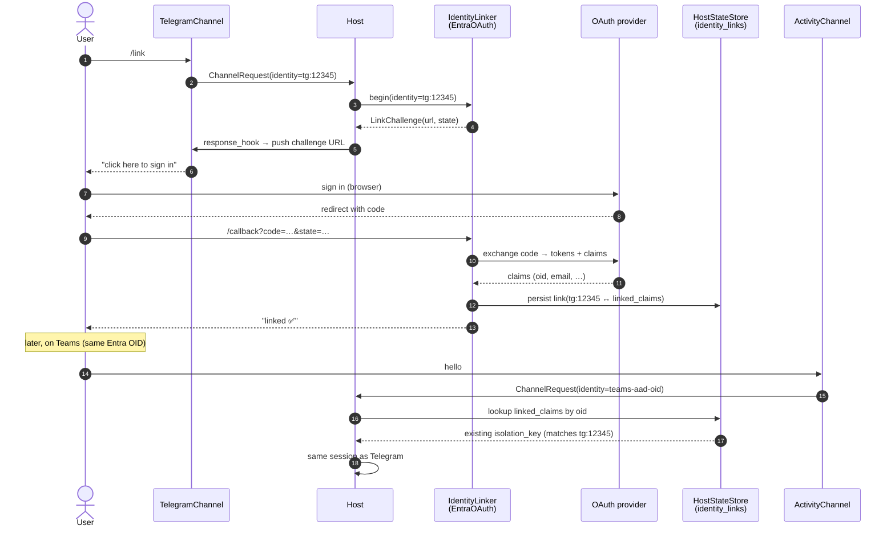

> **Prerequisites:** This sample assumes:
> - `agent-framework-hosting`, `agent-framework-hosting-telegram`, and the (future) `agent-framework-hosting-activity` channel are installed
> - An OAuth provider is configured (Microsoft Entra ID in this example)

```python
import os

from agent_framework.hosting import (
    AgentFrameworkHost,
    OAuthIdentityLinker,
    TelegramChannel,
)


# The OAuth linker contributes its own /identity/oauth/microsoft/{start,callback}
# routes to the host. On successful completion, the host's built-in identity
# store atomically records BOTH the originating channel-native identity AND the
# verified IdP claim (Entra ID object id) so future channels that authenticate
# the same IdP account can auto-link without a second ceremony.
linker = OAuthIdentityLinker(
    provider="microsoft",
    client_id=os.environ["AAD_CLIENT_ID"],
    client_secret=os.environ["AAD_CLIENT_SECRET"],
)

host = AgentFrameworkHost(
    target=agent,
    identity_linker=linker,
    channels=[
        # require_link=True gates the channel: any inbound message from an
        # un-linked ChannelIdentity is short-circuited to a LinkChallenge reply
        # instead of being dispatched to the agent.
        TelegramChannel(
            bot_token=os.environ["TELEGRAM_BOT_TOKEN"],
            transport="webhook",
            require_link=True,
        ),
        # ActivityChannel(app_id=..., require_link=True),  # future — same flag
    ],
)
host.serve(host="0.0.0.0", port=8000)
```

The flow:

1. `alice` sends her first message on Telegram. The `TelegramChannel` extracts `ChannelIdentity(channel="telegram", native_id="<chat_id>")` and asks the linker `is_linked(...)`. It is not. Because `require_link=True`, the channel does **not** invoke the agent; instead it asks `linker.begin(channel_identity)` for a `LinkChallenge`, renders the challenge URL into Telegram (clickable button), and returns.
2. `alice` clicks the button, signs in with Microsoft Entra ID, and the OAuth callback hits the linker's route. `linker.complete(...)` verifies the authorization code and records **two things atomically** in the identity store:
   - `(channel="telegram", native_id="<chat_id>") → isolation_key="hk_018f…a3"`
   - `verified_claim("microsoft.oid", "<aad-object-id>") → isolation_key="hk_018f…a3"`
3. `alice` replies on Telegram. The channel sees the link is now present, resolves the existing `isolation_key`, and forwards the message to the agent normally. From here on, Telegram chats are routed without further ceremony.
4. The next day, `alice` opens Teams. The `ActivityChannel` extracts both the channel-native identity (`activity`, `<aad-oid>`) **and** the verified IdP claim from the inbound activity (Teams already authenticates with Entra ID via Bot Service, so the AAD object id is trusted). It asks the linker `is_linked(...)`. The `(activity, <aad-oid>)` pair is **not** in the store — but the verified claim `("microsoft.oid", "<aad-object-id>")` **is**. The linker auto-merges `(activity, <aad-oid>) → isolation_key="hk_018f…a3"` without any user-visible `/link` ceremony.
5. From the next turn on, both Telegram and Teams resolve to the **same** `isolation_key` and the **same** `AgentSession`. The agent sees the conversation history from both channels as one continuous thread.

The two enabling pieces:

- **`require_link: bool` on the channel** — when `True`, the channel checks the linker before dispatching every inbound request. Un-linked identities are short-circuited to a rendered `LinkChallenge` instead of an agent invocation. Default is `False` (the opportunistic flow below).
- **Verified IdP claims in the linker's identity store** — when an OAuth ceremony completes, the linker records the verified identity claim (e.g. `(microsoft.oid, <oid>)`) alongside the channel-native identity. Channels that can supply the same kind of verified claim from their own auth context (Teams via the AAD bearer on the activity, future M365 channels via the same bearer, …) get **auto-linked silently** on first contact when their claim matches an existing entry. This is what makes "sign in once on Telegram, Teams just works" possible without any per-channel link ceremony.

**Variant — opportunistic linking (`require_link=False`).** Leave the flag at its default and the channel will dispatch un-linked identities straight to the agent (the host's default resolver auto-issues a fresh `isolation_key` for them). The user can later run the `link` `ChannelCommand` manually to merge that auto-issued key onto an existing one. This is the lower-friction onboarding flow at the cost of allowing pre-link conversations to exist in their own isolated session until merged.

**Variant — alternative ceremony.** Swapping the linker for `OneTimeCodeIdentityLinker(...)` changes the ceremony to "complete `/link` on channel A, get a 6-digit code, run `/link 482931` on channel B"; with `require_link=True` the channel just renders the code-entry instructions instead of an OAuth URL. Apps with their own corporate identity namespace can additionally pass a custom `identity_resolver` so the post-link `isolation_key` is the corporate user id instead of the host-issued opaque key. Channels themselves are unchanged across these variants — only the linker and (optionally) the resolver change.

### Scenario 7: Trusted server-side caller relays a Responses request and pushes the answer back to the user's Telegram chat

A developer runs an internal application server that already knows its end users (e.g. via an SSO session) and wants to expose **two surfaces against the same agent**: the OpenAI-compatible **Responses API** (so the application backend can drive the agent programmatically on behalf of the signed-in user) and **Telegram** (so the same end user can also chat with the agent directly). When the application backend submits a Responses call, it should be possible to (a) link that call to the same `isolation_key` as the user's existing Telegram chats — so the agent sees one continuous conversation history — and optionally (b) have the agent's response pushed back to the user's Telegram chat instead of (or in addition to) being returned synchronously on the Responses HTTP call.

This works **without** an `IdentityLinker` because the application backend is a **trusted relay**: it already authenticated the user through its own SSO and knows both the user's app-internal id and (because the user has previously connected their Telegram account in the application's own settings page) the user's Telegram `chat_id`. The host just needs to be told.

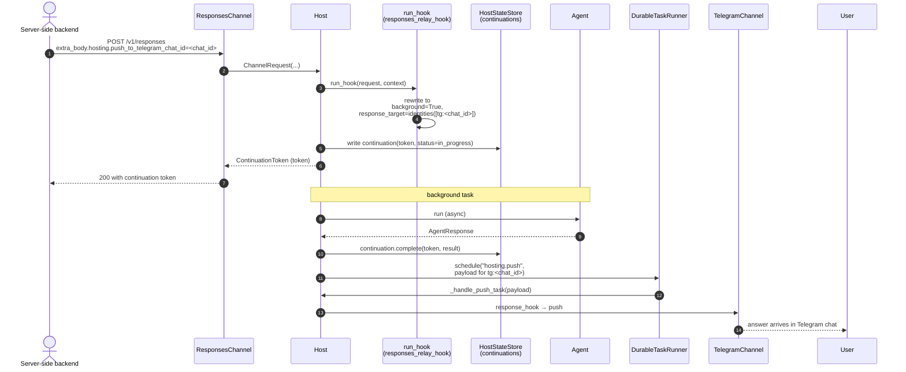

> **Prerequisites:** This sample assumes:
> - `agent-framework-hosting`, `agent-framework-hosting-responses`, and `agent-framework-hosting-telegram` are installed
> - The application backend can attach two extra fields to its Responses call: an `app_user_id` (the user's stable id in the application's own namespace) and, optionally, a `push_to_telegram_chat_id` (the user's known Telegram chat id from the application's own database)

```python
import os
from dataclasses import replace

from agent_framework.hosting import (
    AgentFrameworkHost,
    ChannelIdentity,
    ChannelRequest,
    IdentityResolver,
    ResponseTarget,
    ResponsesChannel,
    TelegramChannel,
)


# A custom identity resolver that promotes the app's own user id to the
# isolation_key whenever a channel can supply one. The Telegram channel exposes
# the chat_id (pre-registered in the application's settings page → so the
# application maps chat_id → app_user_id and tells the host); the Responses
# channel exposes the app_user_id directly via extra_body (see run_hook below).
async def app_identity_resolver(identity: ChannelIdentity, **_) -> str | None:
    # Both channels populate ChannelIdentity.attributes["app_user_id"] — see
    # the run hooks below.
    return identity.attributes.get("app_user_id")


# Telegram channel maps Telegram chat_id → app_user_id from the application's
# pre-registered chat-id table. Cached locally; in real apps this is whatever
# lookup matches the application's own user-account schema.
KNOWN_TELEGRAM_USERS: dict[str, str] = {
    "<chat_id_of_alice>": "user_alice",
    # ...
}


async def telegram_promote_app_user(request: ChannelRequest, **_) -> ChannelRequest:
    chat_id = request.identity.native_id
    app_user_id = KNOWN_TELEGRAM_USERS.get(chat_id)
    if app_user_id is None:
        return request  # falls back to host's auto-issued isolation_key
    return replace(
        request,
        identity=replace(
            request.identity,
            attributes={**request.identity.attributes, "app_user_id": app_user_id},
        ),
    )


# The application backend POSTs to /responses/v1/responses with
#
#   {
#     "model": "...",
#     "input": "...",
#     "extra_body": {
#       "hosting": {
#         "app_user_id": "user_alice",                # who this request is for
#         "push_to_telegram_chat_id": "<chat_id>",    # optional
#       }
#     }
#   }
#
# The Responses channel surfaces extra_body["hosting"] on
# ChannelRequest.attributes["hosting"]; this run_hook reads it and rewrites
# both the identity (so the request resolves to the same isolation_key as the
# user's Telegram chats) and the response_target (so the answer is pushed to
# Telegram in addition to / instead of the synchronous Responses reply).
async def responses_relay_hook(request: ChannelRequest, **_) -> ChannelRequest:
    hosting = request.attributes.get("hosting", {})
    app_user_id = hosting.get("app_user_id")
    push_chat_id = hosting.get("push_to_telegram_chat_id")

    if app_user_id is None:
        return request  # plain Responses call, no relay → keep defaults

    # Promote app_user_id onto the identity so the resolver returns it as
    # isolation_key.
    new_identity = replace(
        request.identity,
        attributes={**request.identity.attributes, "app_user_id": app_user_id},
    )

    # If the caller also supplied a Telegram chat id, push the answer there
    # via ResponseTarget.identities (explicit recipient — bypasses the link
    # store, which is empty for this user since no link ceremony ran). The
    # Responses HTTP call returns a ContinuationToken so the application
    # backend can correlate.
    if push_chat_id:
        return replace(
            request,
            identity=new_identity,
            response_target=ResponseTarget.identities([
                ChannelIdentity(channel="telegram", native_id=push_chat_id),
            ]),
            background=True,
        )

    return replace(request, identity=new_identity)


host = AgentFrameworkHost(
    target=agent,
    identity_resolver=IdentityResolver(app_identity_resolver),
    channels=[
        ResponsesChannel(run_hook=responses_relay_hook),
        TelegramChannel(
            bot_token=os.environ["TELEGRAM_BOT_TOKEN"],
            transport="webhook",
            run_hook=telegram_promote_app_user,
        ),
    ],
)
host.serve(host="0.0.0.0", port=8000)
```

The flow:

1. Alice has previously connected her Telegram account on the application's settings page; the application stored `chat_id_of_alice → user_alice` in `KNOWN_TELEGRAM_USERS` (a real deployment uses a database).
2. Alice opens the application's web UI and types a question. The application backend (signed in as `user_alice`) calls the Responses API mounted on this host with `extra_body={"hosting": {"app_user_id": "user_alice"}}` (and no `push_to_telegram_chat_id`). The `responses_relay_hook` promotes `app_user_id` onto the identity, the resolver returns `isolation_key="user_alice"`, the agent runs, and the answer is returned synchronously over HTTP. The agent's `HistoryProvider` appends both turns to the session keyed by `user_alice`.
3. Later, Alice messages the same agent on Telegram from her registered chat. The Telegram channel's `run_hook` promotes `app_user_id="user_alice"` onto the identity (because her chat_id is in the known-users table), the resolver returns the **same** `isolation_key="user_alice"`, the agent loads the **same** session — and sees the earlier turn from the web UI. **One continuous conversation across two channels, no link ceremony required, no `IdentityLinker` configured.**
4. Now Alice walks away from her desk. The application backend wants to fire a long-running task on her behalf and have the answer reach her on Telegram. It calls the Responses API with `extra_body={"hosting": {"app_user_id": "user_alice", "push_to_telegram_chat_id": "<chat_id_of_alice>"}}`. The `responses_relay_hook` rewrites the request to `background=True` and `response_target=ResponseTarget.identities([ChannelIdentity("telegram", "<chat_id_of_alice>")])`. The Responses HTTP call returns a `ContinuationToken` immediately (so the application backend can correlate); when the agent completes, the host calls `TelegramChannel.push(ChannelIdentity("telegram", "<chat_id_of_alice>"), result)` and the answer arrives in Alice's Telegram chat.

The two enabling pieces:

- **`extra_body["hosting"]` as a developer-controlled relay envelope.** The Responses channel surfaces an opaque `hosting` block from `extra_body` onto `ChannelRequest.attributes["hosting"]`. The hosting core does **not** define what goes in there — the developer decides what their trusted backend may carry (here `app_user_id` and `push_to_telegram_chat_id`) and reads it in their `run_hook`. This is the same pattern the `store=` table calls out for richer per-call control.
- **`ResponseTarget.identities([...])` for explicit caller-known recipients.** This bypasses the link store and pushes to a channel-native identity the caller already knows. Use it when the originating caller is a trusted relay that authenticated the user through some other means (corporate SSO, an internal API key bound to a user) and just needs the host to dispatch. `LinkPolicy` is still consulted per delivery, so a corp-tier Responses call cannot smuggle a public-tier Telegram push if the policy disallows it.

**Variant — same scenario with an `IdentityLinker` configured.** If the host *does* have an `IdentityLinker` (Scenario 6), the application backend doesn't need to maintain its own `chat_id → app_user_id` table at all: when Alice runs `/link` once on Telegram, the linker records the channel-native identity against `isolation_key="user_alice"` (resolved from the Entra OAuth claim that matches the application's own SSO). After that, the run hook can simply use `ResponseTarget.channel("telegram")` (link-store recipient) instead of `ResponseTarget.identities([...])`. The explicit-identities variant remains useful when the application owns identity end-to-end and prefers not to delegate to a host-level linker.

### Scenario 8: Background run with cross-channel response delivery

A developer wants the user to start a long-running task on Telegram and pick up the response on Teams (whichever channel the user happens to be on when the result is ready). The originating Telegram message returns a `ContinuationToken` immediately; when the agent completes, the host pushes the result to the user's currently active channel via `ChannelPush`. A poll route is also exposed for callers that prefer polling.

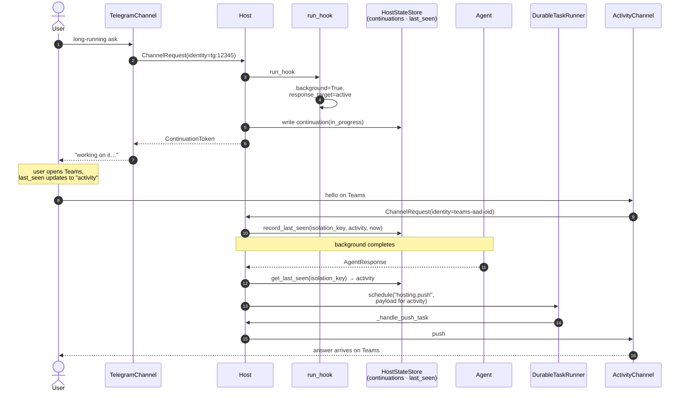

> **Prerequisites:** This sample assumes:
> - `agent-framework-hosting`, `agent-framework-hosting-telegram`, and the (future) `agent-framework-hosting-activity` channel are installed
> - The user is already linked across Telegram and Teams (Scenario 6)

```python
import os
from dataclasses import replace

from agent_framework.hosting import (
    AgentFrameworkHost,
    ChannelRequest,
    ResponseTarget,
    TelegramChannel,
)


# Override the Telegram channel default: any inbound message becomes a
# background run delivered to the user's currently active channel.
async def telegram_background(request: ChannelRequest, **kwargs) -> ChannelRequest:
    return replace(
        request,
        background=True,
        response_target=ResponseTarget.active,
    )


host = AgentFrameworkHost(
    target=agent,
    identity_linker=linker,                # from Scenario 6
    channels=[
        TelegramChannel(
            bot_token=os.environ["TELEGRAM_BOT_TOKEN"],
            transport="webhook",
            run_hook=telegram_background,
        ),
        # ActivityChannel(...),  # future
    ],
)
host.serve(host="0.0.0.0", port=8000)
```

The flow:

1. `alice` sends a Telegram message that triggers a long-running tool. The Telegram channel produces a `ChannelRequest`; the hook flips `background=True` and sets `response_target=ResponseTarget.active`.
2. `host.run_in_background(request)` returns a `ContinuationToken(token="ct_018f…", status="queued")`. The Telegram channel acknowledges with a short "Working on it…" reply that includes the token (it could equally render a "Cancel" inline button bound to the token).
3. The host runs the target asynchronously. When complete, it resolves `ResponseTarget.active` against the host-tracked last-seen channel for `isolation_key="alice@contoso.com"`. If `alice` is currently on Teams, the host calls `ActivityChannel.push(channel_identity, hosted_run_result)`; if she is still on Telegram, it calls `TelegramChannel.push(...)` (so the same setup gracefully degrades to "reply on Telegram if she never switched").
4. `ContinuationToken` is updated to `status="completed"` with the populated `result`. Any caller can poll `GET /telegram/runs/{continuation_token}` (or the equivalent route the channel exposes) to retrieve the run state by id.

Variants without changing channel code:

- `ResponseTarget.channel("activity")` — always deliver to Teams, regardless of where the user is.
- `ResponseTarget.all_linked` — broadcast to every channel `alice` has linked.
- `ResponseTarget.none` — fully detached: caller polls `host.get_continuation(token)` (or the channel's poll route); no proactive push.
- `background=False` with `response_target=ResponseTarget.active` — synchronous wait, but result still routed away from the originating channel (rare; mostly useful for pipelines where the originating call is a programmatic trigger and the human user lives elsewhere).

If the chosen destination channel does not implement `ChannelPush` (e.g. Responses), the host falls back to the `originating` channel and records the fallback in telemetry. This makes the Responses + background-run combo work as "submit on Responses, poll on Responses" without surprising silent drops.

### Scenario 9: Hosting a `Workflow` instead of an agent (with checkpoint storage)

The host shape is unchanged when the target is a `Workflow`; the result wrapper narrows to `HostedRunResult[WorkflowRunResult]` and `response_hook` carries the projection that lets text-only channels render workflow output.

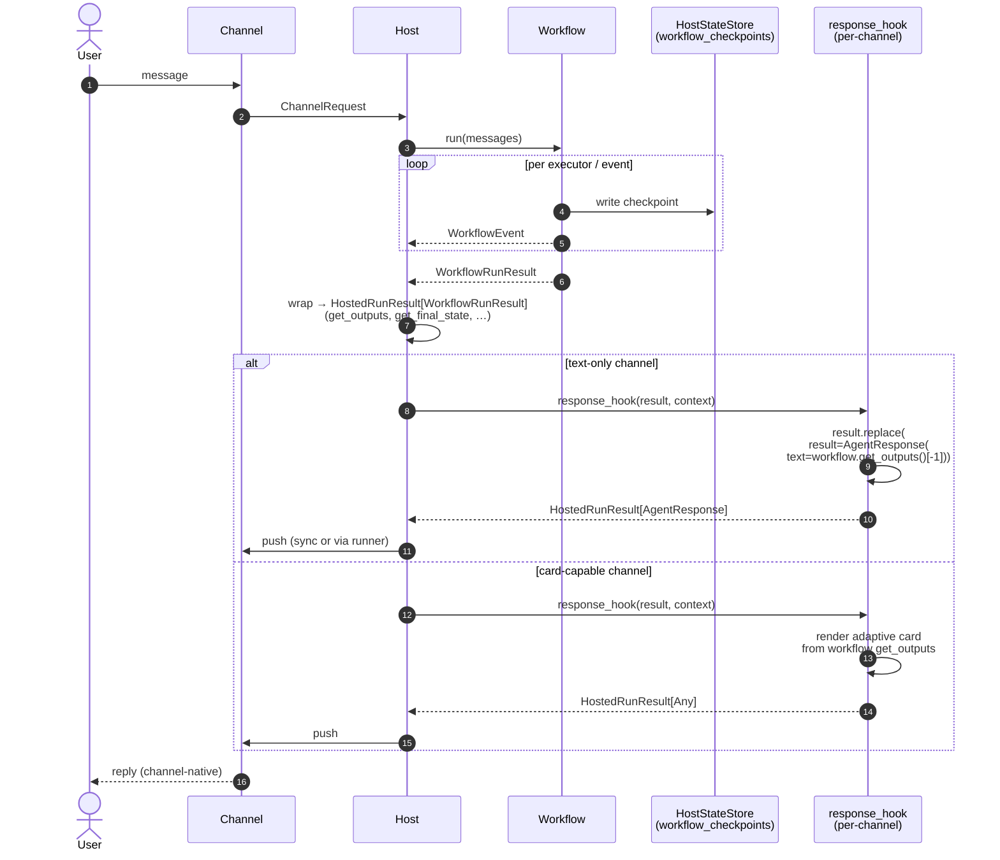

> **Prerequisites:** This sample assumes:
> - `agent-framework-hosting` and `agent-framework-hosting-invocations` are installed
> - A `Workflow` definition with typed inputs (`OrderIntakeInputs`)
> - A directory writable by the host process for workflow checkpoints

```python
from dataclasses import dataclass, replace
from pathlib import Path

from agent_framework import FileCheckpointStorage, WorkflowBuilder
from agent_framework.hosting import (
    AgentFrameworkHost,
    ChannelRequest,
    InvocationsChannel,
)


@dataclass
class OrderIntakeInputs:
    customer_id: str
    sku: str
    quantity: int


# Build the workflow with a CheckpointStorage so individual executor frames
# are persisted as the workflow runs. FileCheckpointStorage writes one file
# per checkpoint under the configured directory; survives host restarts.
checkpoint_storage = FileCheckpointStorage(directory=Path("./.af-hosting/checkpoints/"))

workflow = (
    WorkflowBuilder(checkpoint_storage=checkpoint_storage)
    .add_executor(...)        # application-defined
    .build()
)


def adapt_to_workflow_inputs(request: ChannelRequest, *, protocol_request=None, **kwargs) -> ChannelRequest:
    # The channel produces a default ChannelRequest with text input. The workflow
    # needs typed OrderIntakeInputs — the hook is the adapter point. The same
    # hook is the place to surface a caller-supplied checkpoint id (to resume
    # an interrupted run) by promoting it onto request.attributes; the host's
    # workflow dispatch reads it on the way to Workflow.run(...).
    payload = protocol_request  # raw Invocations request body
    inputs = OrderIntakeInputs(
        customer_id=payload["customer_id"],
        sku=payload["sku"],
        quantity=int(payload["quantity"]),
    )
    new_attrs = dict(request.attributes)
    if checkpoint_id := payload.get("resume_from_checkpoint"):
        new_attrs["workflow.checkpoint_id"] = checkpoint_id
    return replace(request, input=inputs, attributes=new_attrs)


host = AgentFrameworkHost(
    target=workflow,
    channels=[
        InvocationsChannel(run_hook=adapt_to_workflow_inputs),
    ],
)
host.serve(host="localhost", port=8000)
```

The host detects that `target` is a `Workflow` and dispatches the resulting `ChannelRequest.input` to `Workflow.run(...)` instead of `SupportsAgentRun.run(...)`. The channel does not need to know which kind of target it is fronting — `HostedRunResult` and `HostedStreamResult` are normalized across both seams. The same workflow target could equally be exposed on Telegram or a Responses channel by supplying the appropriate `run_hook` to translate inbound chat messages into typed workflow inputs.

**Checkpoint storage** is wired onto the workflow itself (via `WorkflowBuilder(checkpoint_storage=...)` or per-run via `Workflow.run(..., checkpoint_storage=...)`), **not** on the host. The host treats it as workflow-runtime state — structurally distinct from the `HostStateStore` (which persists `ContinuationToken`s, identity-link grants, and last-seen records — host-execution metadata, not workflow internals) and from `ContextProvider` (per-conversation context). All three protocols stay separate, but a deployment MAY back them with the same physical store. When `request.attributes["workflow.checkpoint_id"]` is set (as the run hook does above when the caller supplies `resume_from_checkpoint`), the host's workflow dispatch path passes it through to `Workflow.run(checkpoint_id=...)` so the workflow resumes from that frame instead of running from scratch — useful for long-running intake flows that survive host restarts or retries.

### Scenario 10: Authoring a new channel package

The shape any new channel follows: parse external protocol → produce default `ChannelRequest` → optionally apply hook → `context.run(...)` / `context.stream(...)` → serialize back.

```python
from starlette.requests import Request
from starlette.responses import JSONResponse
from starlette.routing import Route

from agent_framework.hosting import (
    Channel,
    ChannelContext,
    ChannelContribution,
    ChannelRequest,
    ChannelSession,
)


class MyWebhookChannel:
    name = "mywebhook"

    def __init__(self, *, path: str = "/mywebhook") -> None:
        self._path = path

    def contribute(self, context: ChannelContext) -> ChannelContribution:
        async def endpoint(request: Request) -> JSONResponse:
            payload = await request.json()
            channel_request = ChannelRequest(
                channel=self.name,
                operation="message.create",
                input=payload["text"],
                session=ChannelSession(
                    key=payload["thread_id"],
                    isolation_key=payload["account_id"],
                ),
            )
            result = await context.run(channel_request)
            # See "Result is rich, not just text" below — `result.text` is the
            # plain-text projection; this channel chooses to also surface
            # citations and any tool-call traces it cares about. The exact
            # serialization is the channel's call.
            return JSONResponse(_render_for_mywebhook(result))

        return ChannelContribution(routes=[Route(f"{self._path}/inbound", endpoint, methods=["POST"])])
```

**Result is rich, not just text.** `result` here is a `HostedRunResult[TResult]` — a thin generic envelope around the target's **full-fidelity output**. For agent targets `TResult` narrows to `AgentResponse`, so channels read everything the target produced directly off `result.result`:

- the full `messages: list[ChatMessage]` thread the agent produced this turn — each message holds an ordered list of typed `Contents` (see [`Contents` in core](https://github.com/microsoft/agent-framework/blob/main/python/packages/core/agent_framework/_types.py)): `TextContent`, `DataContent` (inline base64 blobs), `UriContent` (URLs to images/audio/files), `FunctionCallContent` and `FunctionResultContent` (tool-call traces), `HostedFileContent` / `HostedVectorStoreContent` (provider-side file/vector references), `UsageContent` (token usage), `ErrorContent`, `TextReasoningContent` (reasoning traces), and channel-extensible custom content kinds. Each content also has `additional_properties` for provider-specific extensions (citations, image alt text, source spans, …),
- `value: T | None` — the typed structured output when the agent returned one (e.g. via response-format / structured-output features),
- `response_id`, `usage_details: UsageDetails | None`, `raw_representation`, and per-message `additional_properties` carrying provider-native extras.

For workflow targets `TResult` is `WorkflowRunResult`, so `result.result.get_outputs()` iterates the per-executor output payloads and `result.result.get_final_state()` exposes terminal-state info. The host never collapses or pre-shapes workflow outputs — channels (and developer-supplied `response_hook`s) own the projection, since "what counts as a renderable output" is wire-format-specific.

A channel author is free to project this into **whatever the channel's native shape supports**. Examples:

- The built-in **Telegram channel** renders `text` segments with Telegram's `MarkdownV2` parse mode (escaping the special set), uploads `DataContent` images via `sendPhoto` and audio via `sendAudio` as separate Telegram messages in the same chat, and emits inline-button keyboards from `FunctionCallContent` traces when the channel is configured to surface tool calls as user-confirmable actions. Citations attached to a `TextContent.additional_properties["citations"]` slot are rendered as numbered footnote links the user can tap.
- The built-in **Responses channel** preserves the full content-list shape on the wire — every `ChatMessage` round-trips as a Responses-shaped output item so callers can inspect the typed mix of text, function-call traces, image/file outputs, reasoning, and structured-output `value`s exactly as the agent produced them. There is no lossy collapse to a single text field.
- A channel fronting a **chat UI** can render `TextContent` as full GitHub-Flavored Markdown / HTML (tables, code fences with syntax highlighting, math), `DataContent` and `UriContent` as inline images/audio/video players, `FunctionCallContent` / `FunctionResultContent` as collapsible "tool ran" cards, and `TextReasoningContent` as a collapsible reasoning panel — all from the same `result`.
- A **voice channel** can route `TextContent` through TTS, play `DataContent(audio/*)` directly, and surface `FunctionCallContent` only as audio earcons (or skip them entirely) — the same `result` object drives a completely different surface.
- A **richly-typed RPC channel** can return `result.result.value` (the structured output) directly when the workflow / agent produced one, and fall back to a text projection only when no typed output is available.

The host imposes no projection — channels read `result.result.text` for a convenience plain-text rollup on agent targets, but are encouraged to lean on the full underlying payload when their protocol supports more.

## Information Design

### Canonical flow

The default request/response shape — single channel, originating response, no fan-out. Authorization runs before `run_hook`; `response_hook` runs per-destination (here just one).

```mermaid
sequenceDiagram
    autonumber
    actor User
    participant Channel as Channel<br/>(inbound)
    participant Host
    participant Auth as host.authorize
    participant Target as Agent / Workflow
    participant Annot as _annotate_intended_targets

    User->>Channel: native payload (webhook / poll / HTTP body)
    Channel->>Channel: parse → ChannelRequest<br/>(identity, conversation_id, content, response_target=originating)
    Channel->>Host: dispatch(ChannelRequest)
    Host->>Auth: authorize(identity, require_link, allowlist)
    alt Denied / LinkRequired
        Auth-->>Host: Denied(reason_code, user_message)<br/>or LinkRequired(challenge)
        Host-->>Channel: render denial / link challenge<br/>(channel-appropriate UX)
        Channel-->>User: short refusal in-room
    else Allowed(isolation_key)
        Host->>Host: resolve session via StateStore
        Host->>Host: run_hook(request, context)
        Host->>Target: target.run(messages, session=...)
        Target-->>Host: AgentResponse / WorkflowRunResult
        Host->>Host: wrap → HostedRunResult[TResult]
        Host->>Annot: write hosting.intended_targets<br/>onto assistant message
        Host->>Channel: response_hook(result, context)
        Channel->>Channel: shape to native payload
        Channel-->>User: reply on originating wire
    end
```

The textual trace of the same flow (showing more of the per-step bookkeeping):

```text
external request/event
    -> channel-specific parsing + validation
    -> ChannelIdentity extraction (per-channel native id)
    -> default channel invocation mapping
    -> optional run_hook (dev-supplied; default no-op)
    -> ChannelRequest (carries response_target, background, echo_input)
    -> AgentFrameworkHost / ChannelContext
    -> identity_resolver(ChannelIdentity) -> isolation_key
    -> host records (isolation_key, channel, now) as last-seen (for ResponseTarget.active)
    -> AgentSession resolution (per session_mode, scoped by isolation_key)
    -> target execution seam (Agent.run / Workflow.run)
    -> HostedRunResult[AgentResponse] | HostedRunResult[WorkflowRunResult]
       (full-fidelity result carried unchanged; no pre-shaping by the host)
    -> [foreground] fan-out:
            for each destination resolved from ResponseTarget:
                -> clone HostedRunResult envelope (per-destination isolation; shallow copy)
                -> optional channel response_hook (dev-supplied; default = identity)
                    -> hook receives ChannelResponseContext(request, channel_name, destination_identity, originating, is_echo)
                    -> hook may rebind result via HostedRunResult.replace(result=...)
                       (e.g. project a WorkflowRunResult to an AgentResponse for a text-only wire)
                -> channel-native serialization (channel chooses what content types / outputs it can render)
                -> channel.push(identity, shaped_payload) | originating return value
            if ResponseTarget.echo_input is True:
                each non-originating destination receives the user's input first
                (synthesised as a HostedRunResult[AgentResponse] with a role="user" message),
                then the agent reply. Both pushes execute inside the same scheduled
                push task; an echo-push failure is logged and swallowed so the
                response push on the same destination is still attempted.
    -> [background or response_target != originating]
            -> ContinuationToken returned immediately to originating channel
            -> target executes asynchronously
            -> on completion, the same fan-out (clone + response_hook + push) applies
            -> ContinuationToken updated; available via host.get_continuation(token) and channel poll routes
```

**Full-fidelity contract.** The host never collapses agent / workflow output. `HostedRunResult[TResult]` carries the target output unchanged: agent targets see the full `AgentResponse` (multi-modal `messages`, `value`, `usage_details`, `response_id`, …); workflow targets see the full `WorkflowRunResult` (per-executor outputs via `get_outputs()`, terminal state via `get_final_state()`). Each channel — through its `response_hook` and its own serializer — decides what subset its wire can carry. A text-only channel iterates `result.result.messages` (or projects the workflow's outputs into a single text turn via a response hook); a card-capable channel inspects the underlying contents directly.

**Per-destination cloning.** Before invoking a channel's `response_hook`, the host clones the `HostedRunResult` envelope so one channel's `replace(result=...)` cannot leak into the payload another destination observes. The clone is shallow — channels that need to mutate `result` itself (rather than rebind it) own the deep copy.

**`response_hook` is a channel-level convention, not part of the `Channel` Protocol.** Channels expose a `response_hook` attribute (callable accepting `(result, *, context: ChannelResponseContext) -> HostedRunResult[Any] | Awaitable[HostedRunResult[Any]]`). The host duck-types this attribute. Adding hook support to an existing channel package does not break the public `Channel` Protocol.


A parallel **link ceremony flow** runs out-of-band when a user invokes the host-provided `link`/`connect` command on a channel:

```text
channel /link command
    -> linker.begin(ChannelIdentity) -> LinkChallenge
    -> channel-specific rendering (URL, code, MFA prompt)
    -> user completes the ceremony out-of-band (browser, second channel, MFA app)
    -> linker callback/verification route
    -> linker.complete(challenge_id, proof) -> isolation_key
    -> host atomically associates (channel, native_id) -> isolation_key
    -> subsequent requests resolve to the linked AgentSession
```

### Inbound ownership

| Concern | Owned by | Notes |
|---|---|---|
| HTTP / WebSocket route shape | Channel package | e.g. `/responses/v1`, `/responses/ws`, `/invocations/invoke`, `/telegram/webhook` — channels may contribute either or both |
| Protocol request model | Channel package | e.g. Responses items (HTTP body or WS frames), Invocations body, Telegram webhook payload |
| Signature/auth validation | Channel package or host middleware | channel-specific unless generic Starlette middleware |
| Request-to-agent invocation mapping | Channel package + optional `run_hook` | forwards caller parameters into `ChannelRequest.options`, chooses `session_mode`, can enforce extra app policy |
| Native command catalog | Channel package using host-defined `ChannelCommand` | e.g. Telegram bot commands, future Activity Protocol slash-command / adaptive-card surfaces, WhatsApp menus |
| Command registration at startup | Channel package | e.g. Telegram `set_my_commands(...)` |
| Command dispatch | Channel package | commands may reply locally, manipulate channel-owned state, or invoke the agent |
| Normalized input to the agent | Host core | `ChannelRequest.input` reuses `AgentRunInputs` |
| Session resolution | Host core | based on `ChannelSession` + `ChannelRequest.session_mode`; storage specifics deferred |
| Channel-native identity extraction | Channel package | populates `ChannelIdentity(channel, native_id, attributes)` per request |
| Identity resolution (`native_id` → `isolation_key`) | Host core via `IdentityResolver` | default **auto-issues and persists** a per-user `isolation_key` on first contact per `(channel, native_id)`; user-supplied resolver can return app-owned identities directly |
| Identity store (`(channel, native_id) → isolation_key`) | Host core via `HostStateStore` | file-based by default in v1 (`FileHostStateStore`); pluggable for Cosmos / SQL / Redis in fast follow (req #24). Owns auto-issuance and atomic merge-on-link. |
| Identity link ceremony (OAuth / MFA / one-time code) | Host core via `IdentityLinker` | linker contributes its own routes + lifecycle; channels surface a built-in `link`/`connect` command |
| Authorization (allowlist + link enforcement) | Host core via `host.authorize(...)` + per-channel `IdentityAllowlist` | tri-state allowlist evaluated pre- and post-link; combines with `require_link` to produce one of three named profiles (open / forced-link / allowlist); see [Authorization profiles and the IdentityAllowlist seam](#authorization-profiles-and-the-identityallowlist-seam) |
| Link & delivery policy across confidentiality tiers | Host core via `LinkPolicy` | consulted at link time (refuse incompatible link attempts) and at delivery time (drop incompatible `ResponseTarget` destinations); built-in policies cover all-allow, same-tier, explicit allow-list, deny-all |
| Active-channel tracking | Host core | updated on every successfully resolved request; consumed by `ResponseTarget.active` |
| Response-target resolution | Host core | translates `ResponseTarget` (originating, active, specific, list, all_linked, none) into an ordered set of `(channel, ChannelIdentity)` deliveries |
| Proactive outbound delivery | Channel package via optional `ChannelPush` capability | channels that can push (Telegram, Activity Protocol via Bot Service, webhook, SSE) implement `push(identity, result)`; channels that can't are only valid as `originating` targets |
| Per-delivery audit + replay state | Host core writes intent-only — the resolved destination set onto the assistant `Message.additional_properties["hosting"]["intended_targets"]` (immutable, single write). Operational state (attempts, retries, last error, success timestamp) lives in the `DurableTaskRunner` and is observed via the runner's own backend. | Replay across host restarts is a property of the configured runner (native for durable adapters; not supported for `InProcessTaskRunner`). See [Intended targets + durable delivery](#intended-targets--durable-delivery) and [Durable task runner](#durable-task-runner). |
| Background-run lifecycle | Host core | owns `ContinuationToken` issuance, async execution, completion notification; persists via `HostStateStore` (file-based default — survives restarts) |
| Run poll routes | Channel package | each channel exposes its own protocol-shaped poll route (`/responses/v1/{continuation_token}`, `/invocations/{continuation_token}`) backed by `host.get_continuation(token)` |
| Conversation history (all channels — Responses, Invocations, Telegram, Activity Protocol, …) | Agent's core `HistoryProvider` (`agent_framework._sessions.HistoryProvider`) | Channels project their wire id (`previous_response_id`, `conversation_id`, request body `session_id`, host-tracked alias, …) into `ChannelSession.key`; the host resolves an `AgentSession` and the agent's `HistoryProvider` does the load / append. No channel-specific history seam. Multi-provider composition (with a single `load_messages=True`) is the standard AF convention; see [Conversation history for the Responses channel](#conversation-history-for-the-responses-channel) for the Foundry-backed variant. |
| Channel-owned non-message per-thread state (e.g. AG-UI `client_state`) | Channel-shipped `ContextProvider` subclass written into the same per-source state slot | Reuses the existing `ContextProvider` seam — *not* a new storage protocol. Channel reads `ChannelRequest.client_state` in `before_run`, lets the agent observe/mutate the slot, then reads the post-run value in `after_run` to emit channel-specific events (e.g. AG-UI `StateSnapshotEvent` / `StateDeltaEvent`). Composition rules unchanged (one `HistoryProvider` carries `load_messages=True`; additional `ContextProvider`s attach alongside). See [Channel-owned per-thread state](#channel-owned-per-thread-state). |
| Agent invocation | Host core | always through the target's execution seam — `SupportsAgentRun.run(...)` for agent targets, `Workflow.run(...)` for workflow targets |
| Protocol response/event model | Channel package | core returns agent results; channel serializes them |
| ASGI server bootstrap | Host core convenience | `host.serve(...)` for default uvicorn path; `host.app` for custom hosting |

### Channel session-carriage models

Channels split into two families based on **who owns the session identifier across requests**. This distinction is invisible to the agent target, but it changes which host-side mechanisms are load-bearing for that channel.

| Model | Examples | `ChannelSession.key` source | How a caller starts a new thread |
|---|---|---|---|
| **Caller-supplied session** | Responses (`previous_response_id` / `conversation_id`), Invocations, A2A, MCP — generally any HTTP/RPC-shaped channel | The wire payload carries it; the channel parses it into `ChannelSession.key`. `None` means "ephemeral / fresh thread". | Omit the previous id (or send a fresh one). The caller is in control. |
| **Host-tracked session** | Telegram, Activity Protocol via Azure Bot Service (Teams/Web Chat/Slack/…), WhatsApp — generally any chat surface whose protocol carries identity (`chat_id`, AAD oid, `from.id`) but no per-conversation key | The channel leaves `ChannelSession.key = None` and lets the host's per-`isolation_key` alias decide which `AgentSession` to resolve (rule #8 below). | The channel surfaces a `/new`-style command (a `ChannelCommand`) that calls `host.reset_session(isolation_key)`; the host's session-id alias rotates. There is no in-band way for the user to address a specific past thread. |

Identity is an **orthogonal axis** (anonymous vs. identified). The realized cells in v1 are:

| | Anonymous | Identified |
|---|---|---|
| **Caller-supplied session** | ✓ — bare `curl /responses` + `previous_response_id`. The id effectively *is* the identity (the resolver may project `previous_response_id` into the `isolation_key` for that turn). | ✓ — Responses + `safety_identifier`, or any caller-supplied channel behind a JWT/OAuth bearer that the resolver maps to an `isolation_key`. |
| **Host-tracked session** | n/a in v1 | ✓ — Telegram / Activity Protocol (Bot Service) / WhatsApp. The channel always authenticates; the resolver maps `(channel, native_id)` to `isolation_key`. |

**Channel-author guidance.** When implementing a new channel:

- If your upstream protocol carries a per-conversation identifier on every request, populate `ChannelSession.key` from it. You are a **caller-supplied** channel. `host.reset_session(...)` is **not** the right primitive for your `/new`-equivalent (your callers control that by simply omitting the previous id). Cross-channel linking via `IdentityLinker` is opt-in and depends on whether you also extract a stable identity (header, JWT, etc.) into `ChannelIdentity`.
- If your upstream protocol carries identity but **no** per-conversation key, leave `ChannelSession.key = None`. You are a **host-tracked** channel. To support "start a fresh thread", expose a channel-native command (Telegram `/new`, Teams adaptive-card button, …) that invokes `host.reset_session(isolation_key)` — the host alias rotation does the rest, and prior history remains addressable under its previous session id. You are the canonical case for cross-channel linking; populate `ChannelIdentity` faithfully so `IdentityLinker` and `ResponseTarget.active`/`.all_linked` can find your users.

**Mixing on one host.** A single `AgentFrameworkHost` can mount channels of both families. A user can chat on Telegram (host-tracked) and have it linked via `IdentityLinker` to a Responses-channel session keyed by `previous_response_id`; in that case the linker's identity merge collapses both sides onto the same `isolation_key` and the host-tracked channel's alias becomes a peer of the caller-supplied `previous_response_id` for the same `AgentSession`. This is the v1 mechanism for "agent built on Responses, exposed to humans on Telegram, with continuity across both".

### Session resolution rules

1. If `ChannelRequest.session_mode == "disabled"`, the host bypasses session resolution and calls the target with `session=None`.
2. If `session_mode == "auto"`, the host resolves `ChannelSession.key` to an `AgentSession`, scoped by `isolation_key` when supplied.
3. If `session_mode == "auto"` and no key is supplied, the host may create an ephemeral session.
4. If `session_mode == "required"`, the host must resolve or create a usable session before invoking the target.
5. **Cross-channel resolution rule:** when two channels mounted on the same `AgentFrameworkHost` produce the same `isolation_key` (and either both omit `key` or both produce equivalent keys derived from `isolation_key`), the host resolves them to the **same** `AgentSession`. This is the v1 mechanism for cross-channel chat continuity (e.g. Telegram → Teams against the same conversation history). The **canonical** path for translating a channel's native per-channel identifier (Telegram `chat_id`, Teams AAD object id, …) into the stable `isolation_key` is the host-level `IdentityResolver` (per-channel `run_hook` mapping is supported as a lower-level alternative). When the channel-native identity is not yet linked, the `IdentityLinker` runs a connect ceremony (OAuth, MFA, signed one-time code) to associate it with an existing `isolation_key`.
6. The first spec does **not** standardize a cross-package storage API; cross-host/cross-process continuity is deferred to the pluggable session store (req #24), which also persists identity-link grants beyond the host process lifetime.
7. Responses and other conversation-aware channels may still own protocol-specific conversation/item storage above this layer.
8. **Session rotation (`reset_session`).** The host exposes `reset_session(isolation_key)` so **host-tracked** channels (see [Channel session-carriage models](#channel-session-carriage-models)) can implement "start a fresh thread" commands (e.g. Telegram `/new`). The default behavior **rotates the active session id alias** (`<isolation_key>` → `<isolation_key>#<short-uuid>`) rather than deleting on-disk history: prior history remains addressable by its original session id while subsequent runs for that `isolation_key` resolve to a brand-new `AgentSession`. Apps that want destructive reset can layer that on top by calling into their own `HistoryProvider`. **Caller-supplied** channels do not call `reset_session`; their callers branch threads by sending a fresh / no `previous_response_id` (or equivalent) on the next request.

### Channel metadata persisted onto stored messages

When the host invokes the target, it does **not** pass the raw `ChannelRequest.input` directly. It first wraps the input into a `Message(role="user", contents=[...])` whose `additional_properties["hosting"]` carries an envelope describing where the message came from and where its response should go. This makes the resulting conversation history self-describing for any `HistoryProvider` (`FileHistoryProvider`, future Cosmos/Foundry providers, …) without that provider having to know anything channel-specific.

```jsonc
{
  "channel": "telegram",                       // ChannelRequest.channel
  "identity": {                                // populated from ChannelRequest.identity
    "channel": "telegram",
    "native_id": "<telegram-chat-id>",
    "attributes": { /* channel-specific */ }
  },
  "response_target": {                          // populated from ChannelRequest.response_target
    "kind": "originating",
    "targets": []                               // [(channel, native_id), ...] for explicit targets
  }
}
```

Round-trip is guaranteed by `Message.to_dict()` / `Message.from_dict()`. Future providers that key on protocol shape (e.g. a Responses `previous_response_id`-keyed store) can read this envelope to reconstruct cross-channel context without needing a separate channel-metadata sidecar.

`FoundryHostedAgentHistoryProvider` round-trips the entire `additional_properties["hosting"]` namespace (and any other AF-side namespace) through the Foundry response store via a single opaque `agent_framework` container key written onto each `OutputItem`. Because the schema is now **intent-only** (no per-destination mutation after the initial write — see [Intended targets + durable delivery](#intended-targets--durable-delivery)), no service-side additions to the Foundry storage SDK are required for it to round-trip.

### Intended targets + durable delivery

The inbound envelope above captures the caller's **intent**. The assistant `Message` produced by the host carries a parallel envelope that records the *resolved destination set* — what the host actually intended to deliver to, after `ResponseTarget` resolution and `LinkPolicy` filtering. **This is a single write, never mutated.** Operational state for each push attempt (status, attempts, retries, last error, channel-issued id) lives in the [`DurableTaskRunner`](#durable-task-runner) — not on the message — because the runner is the component that performs and (when durable) retries the push.

The shape of the fan-out — synchronous on the originating wire, scheduled via the runner for every non-originating destination — is the same in every multi-target scenario (`all_linked`, `active`, `channels([...])`, `identities([...])`):

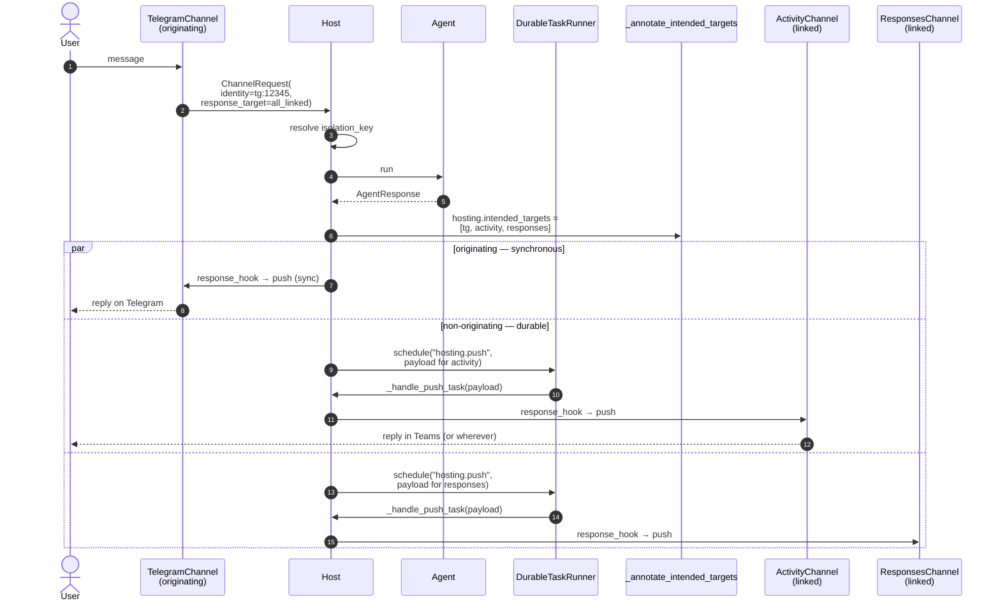

Schema on `Message.additional_properties["hosting"]` for a host-produced assistant message:

```jsonc
{
  "originating": {                                // mirror of the inbound envelope above
    "channel": "telegram",
    "identity": { "channel": "telegram", "native_id": "12345", "attributes": {} },
    "response_target": { "kind": "all_linked", "targets": [] }
  },
  "intended_targets": [
    { "destination": { "channel": "activity", "native_id": "29:abc..." } },
    { "destination": { "channel": "telegram", "native_id": "12345"     } }
  ],
  "skipped_targets": [                            // optional — present only when LinkPolicy excluded something
    {
      "destination": { "channel": "corp-only", "native_id": "..." },
      "reason": "link_policy"                     // link_policy | no_push_capability
    }
  ]
}
```

Lifecycle the host follows:

1. After `ResponseTarget` resolution and `LinkPolicy` filtering, the host writes the assistant `Message` **once**, with the resolved `intended_targets[]` (every destination it will attempt) and an optional `skipped_targets[]` for destinations dropped at resolution time (so audit can show *why* a resolved-by-`ResponseTarget` destination did not receive the message — `link_policy` or `no_push_capability`). This write is immutable.
2. For each non-originating destination, the host schedules a `"hosting.push"` task via the configured [`DurableTaskRunner`](#durable-task-runner). The runner is responsible for attempting, retrying per its `RetryPolicy`, and (for durable runners) surviving host restarts. The push handler resolves the channel, runs the channel's `response_hook`, and calls `ChannelPush.push(...)`.
3. Operational delivery state — attempt count, last error, success timestamp, channel-issued message id — lives in the runner's own log. Replay across host restarts is a property of the runner (native for durable runners; not supported for the in-process runner). Operators who want a queryable delivery dashboard can read it from their runner backend's observability surface (TaskHub, Foundry durable tasks, …) — the host does not project it back onto the message.

The originating destination (when `ResponseTarget` includes it) is **not** routed through the runner. It is rendered synchronously on the originating channel's wire; the host-internal `_deliver_response` helper returns `bool` (`True` if any push was scheduled / delivered, `False` otherwise) for the channel's own bookkeeping. Per-destination delivery outcomes are not collated back to the caller — durable runners surface them in their own logs / dashboards, and the in-process runner logs failures with structured fields. See [Built-in routes](#built-in-routes) for the synchronous return contract.

> **Why intent-only on the message, with operational state in the runner?** A single immutable write keeps the message store as the source of truth for "what the host intended", without requiring providers to implement in-place mutation (no `SupportsDeliveryTracking` capability, no Foundry `update_item` service ask). Per-destination retry, replay, and failure surfacing become responsibilities of the runner, which is the right component because it owns the work queue. Operators who already use a durable runner (TaskHub, Foundry durable tasks) get observability through the runner's existing tooling rather than through a parallel ETL on the message store.

### Durable task runner

The host delegates non-originating push fan-out — and, in v1 fast-follow, background runs — to a pluggable `DurableTaskRunner`. The runner is the component that owns "this work needs to happen; retry on failure; survive (or don't survive) restarts depending on which runner you chose". Channel packages never see it directly; they just implement `ChannelPush.push(...)`.

```python
from typing import Protocol, Callable, Awaitable, Mapping, Any, Literal
from dataclasses import dataclass

@dataclass(frozen=True)
class RetryPolicy:
    max_attempts: int = 5
    initial_backoff_seconds: float = 1.0
    backoff_multiplier: float = 2.0
    max_backoff_seconds: float = 60.0

@dataclass(frozen=True)
class TaskHandle:
    task_id: str                          # opaque, runner-issued
    name: str                             # the registered handler name

TaskStatus = Literal["scheduled", "running", "succeeded", "failed", "cancelled"]

class DurableTaskRunner(Protocol):
    def register(
        self,
        name: str,
        handler: Callable[[Mapping[str, Any]], Awaitable[None]],
    ) -> None: ...

    async def schedule(
        self,
        name: str,
        payload: Mapping[str, Any],
        *,
        retry_policy: RetryPolicy | None = None,
    ) -> TaskHandle: ...

    async def get(self, handle: TaskHandle) -> TaskStatus | None: ...
```

The host registers an internal handler `"hosting.push"` at startup. Each non-originating destination becomes a single `runner.schedule("hosting.push", payload)` call. The handler:

1. Resolves the channel from `payload["channel_id"]`.
2. Clones the `HostedRunResult` and runs the channel's `response_hook` (if any).
3. Calls `ChannelPush.push(identity, shaped_result)`.
4. Returns normally on success. On exception, the runner records the failure and either schedules a retry per `RetryPolicy` or marks the task `failed` (terminal).

Built-in runner shipped in core:

| Runner | Persistence | Replay across restarts | Default for |
|---|---|---|---|
| `InProcessTaskRunner` | None — `asyncio.create_task` + in-process retry | No (in-flight tasks lost on process death) | `runtime_mode="long_running"` |

Adapter packages (deferred to v1 Fast Follow; no runtime dep from core):

| Package | Backend | Notes |
|---|---|---|
| `agent-framework-hosting-durabletask` | `agent-framework-durabletask` (gRPC TaskHub) | Suits `ephemeral` deployments that already run a Durable Task sidecar. |
| `agent-framework-hosting-foundry` (extension) | Foundry durable-task API | Deferred until the FHA durable-task surface is finalized. |
| (possibly) SQLite-outbox runner | SQLite under the existing `HostStateStore` root | Lowest-dep "survives single-node restart" option for ephemeral hosts without an external sidecar. |

Default selection follows [Runtime modes](#runtime-modes). `long_running` defaults to `InProcessTaskRunner`. `ephemeral` is **strict**: if `durable_task_runner` is not configured and `allow_in_process_runner=True` is not opted in, the host raises `RuntimeError` at construction — falling back to the in-process runner in an ephemeral environment would silently drop in-flight pushes on the next scale-to-zero. The `allow_in_process_runner=True` escape hatch is intentionally noisy (warning) and meant for local dev / smoke tests.

#### Codec contract for durable serialisation

When a `DurableTaskRunner` is configured for a deployment that uses out-of-process scheduling (e.g. a sidecar / gRPC TaskHub), task payloads must be **JSON-serialisable** end to end. Two pieces of the contract enforce this:

- **`DurableTaskRunner.payload_mode`** — a class-level attribute declared by each runner implementation:
  - `OBJECT` — the in-process runner; payloads pass Python objects by reference. No serialisation required.
  - `JSON` — out-of-process runners; payloads must round-trip through JSON.
- **`ChannelPushCodec`** — a Protocol exposed by push-capable channels whose payloads are not natively JSON-serialisable. The codec defines `encode(payload) -> Mapping[str, Any]` / `decode(envelope) -> Any` so the channel owns the over-the-wire shape of its push payloads. Channels without exotic payloads can leave the codec unset and rely on the host's default `dataclasses.asdict`-style encode.

At construction the host runs `_validate_runner_codec_pairing`: if the configured runner declares `payload_mode == JSON` and any push-capable channel does not expose a codec, the host raises `ChannelConfigurationError` so the misconfiguration is caught before traffic. On the consumer side `_handle_push_task` accepts both `OBJECT`-mode (in-memory object) and `JSON`-mode (`{"type": "push", ...}` envelope) shapes so the same handler serves both runner backends.

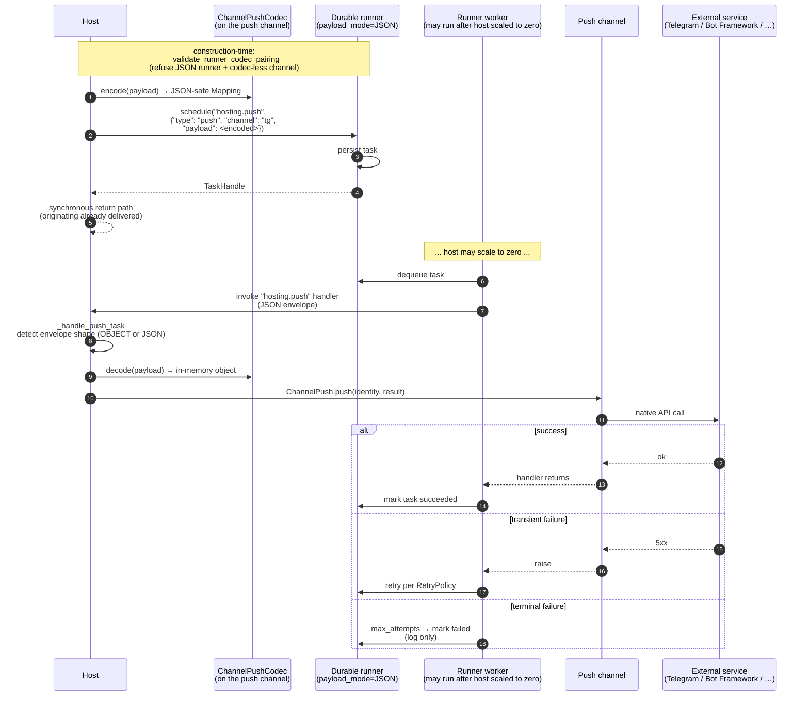

#### In-process runner shutdown drain

`InProcessTaskRunner` ships a two-phase shutdown driven by `shutdown_grace_seconds` (default `5.0`):

1. After lifespan shutdown signals, in-flight `"hosting.push"` tasks are given the grace period to finish — during which retries keep happening — so a clean Ctrl-C does not abandon work that is one network call away from completing.
2. When the grace expires, remaining tasks are cancelled and their `CancelledError` is swallowed (not logged as a failure — it is the expected shutdown shape).

This is purely operational hygiene for the `long_running` default; durable adapters get this behaviour for free from their backends.

#### Echo idempotency on retry

When `ResponseTarget.channel(name, echo_input=True)` is set, the host packages an echo (`role="user"`) push *and* the agent reply (`role="assistant"`) into the same `"hosting.push"` task per non-originating destination. The handler tracks an `echo_done` cursor on the task state and short-circuits the echo phase on retry: a retry that fires after the echo succeeded but before the response push completed will not double-echo the user's message. The cursor lives on the runner-owned task state, not the message — same principle as the broader "intent only on the message, operational state in the runner" rule.

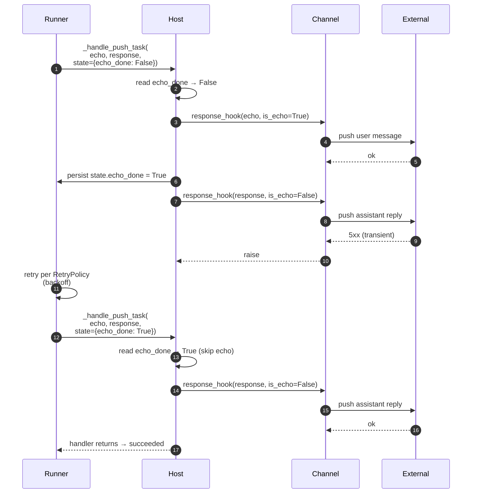

## Reference and Parity Plan

The new core sits **below** the conceptual boundary of today's top-level Responses/Invocations host wrappers but is implemented in Agent Framework-owned code. Existing top-level `agentserver` hosts inform behavior, naming, and parity targets — **without** becoming runtime dependencies of the hosting core. Individual channel packages MAY consume lower-level building blocks shipped in `azure.ai.agentserver` (e.g. `FoundryHostedAgentHistoryProvider` builds on the Foundry response-store SDK).

| Existing code area | Proposed treatment | Why |
|---|---|---|
| `SupportsAgentRun.run(..., session=..., stream=...)` | Reuse directly in core for agent targets | Already the correct Python execution seam |
| `Workflow.run(...)` and workflow streaming events | Reuse directly in core for workflow targets; normalize outputs into `HostedRunResult`/`HostedStreamResult` | Lets channels stay target-agnostic |
| Session resolution logic in current hosting layers | Implement in core, using current behavior as reference | Host behavior, not protocol behavior |
| Starlette app assembly and route aggregation | Implement in core, referencing current servers | Needed by every channel |
| PR #5393 Telegram `BOT_COMMANDS`, `CommandHandler(...)`, `set_my_commands(...)` | Reference for the generic `ChannelCommand` capability | Clearest current prior art for native command catalogs + runtime dispatch |
| `agent_framework_foundry_hosting._to_chat_options` | Inspiration for Responses channel-owned mapping | Still protocol-specific |
| `agent_framework_foundry_hosting._items_to_messages` / `_output_item_to_message` | Inspiration / parity reference in Responses channel codec | Useful, not generic hosting |
| `agent_framework_foundry_hosting._to_outputs` and `ResponseEventStream` | Inspiration for Responses event mapping; the new Responses channel owns its own AF-native serialization rather than reusing top-level `agentserver` host wrappers | Responses-specific serialization |
| `azure.ai.agentserver.responses.ResponseContext.get_history()` + `Store` | Folded into the agent's normal core `HistoryProvider` flow. The Responses channel projects `previous_response_id` / `conversation_id` into `ChannelSession.key`; the agent's `HistoryProvider` does the load / append exactly as for any other session. No Responses-specific history Protocol. | One uniform history seam across channels — the developer chooses where to store, and may compose multiple providers under the standard "single `load_messages=True`" rule. |
| `azure.ai.agentserver.responses.store._foundry_provider.FoundryStorageProvider` (HTTP-backed Foundry storage with `IsolationContext` user/chat headers) | Wrapped by a native `FoundryHostedAgentHistoryProvider` in `agent-framework-foundry-hosting` that **builds on top of** the SDK and exposes the standard core `HistoryProvider` Protocol. Agents attach it the same way they attach `FileHistoryProvider`. | Lets the Foundry response store back conversations driven through the new host, while keeping the channel agnostic to the storage backend. The provider owns a runtime dependency on `azure.ai.agentserver` (for the storage SDK) so it stays aligned with the SDK's wire contract, auth, and isolation headers without duplication. Same provider also works for non-Responses channels (Telegram, Invocations, …) so the choice is "where do I want history persisted" rather than "which channel am I exposing". |
| `agent_framework_foundry_hosting._invocations.InvocationsHostServer._sessions` (in-process `dict[str, AgentSession]`) | Replace with the host's normal `ChannelSession.key → AgentSession` resolution; agent history flows through its own (optional) core `HistoryProvider(load_messages=True)` | Invocations does **not** need a protocol-shaped history seam — confirmed by today's foundry hosting which keeps no `Store` on the Invocations side |
| `ResponsesAgentServerHost` / `InvocationAgentServerHost` top-level wrappers | Conceptual prior art only | Sit too high; encode protocol ownership |
| Workflow checkpoint behavior in current Responses hosting | Defer; reference only for future work | Needs separate design if it becomes shared |

## Dependencies & Commitment Status

| Dependency | Team | DRI | Status |
|---|---|---|---|
| `SupportsAgentRun` execution seam | Agent Framework Core (Python) | TBD | Committed (existing) |
| `Workflow` execution seam | Agent Framework Core (Python) | TBD | Committed (existing); host wraps workflow outputs into `HostedRunResult`/`HostedStreamResult` |
| `AgentSession` / conversation primitives | Agent Framework Core (Python) | TBD | Committed (existing); cross-package storage standardization deferred |
| Starlette | External (BSD-licensed) | n/a | Committed; required runtime dep of `agent-framework-hosting` |
| Uvicorn | External (BSD-licensed) | n/a | Open Question — required dep vs optional extra (see Open Questions) |
| `agent-framework-foundry-hosting` parity reference | Agent Framework Hosting | TBD | Reference-only, no runtime dependency |
| `FoundryHostedAgentHistoryProvider` (in `agent-framework-foundry-hosting`, built on `azure.ai.agentserver.responses.store._foundry_provider.FoundryStorageProvider`) | Agent Framework Foundry | TBD | Proposed v1 deliverable so Foundry-defined (and any other) agents can use Foundry's response store as a `HistoryProvider` through the new host. Implements the standard core `HistoryProvider` Protocol — usable from any channel, no Responses-specific Protocol. Owns a runtime dep on `azure.ai.agentserver` for the storage SDK. |
| PR #5393 Telegram sample (commands, polling/webhook patterns) | Agent Framework | PR author | Reference-only; informs `ChannelCommand` and `TelegramChannel` design |
| Telegram Bot API SDK | External | n/a | Committed (runtime dep of `agent-framework-hosting-telegram`) |
| `microsoft/teams.py` SDK (`microsoft-teams-apps`, `microsoft-teams-api`, `microsoft-teams-cards`) | External (MIT, Microsoft) | n/a | Proposed runtime dep of `agent-framework-hosting-teams` (req #29). The SDK already ships a "Build an agent using Microsoft Agent Framework" guide and a pluggable `HttpServerAdapter`, so the hosting package mounts the SDK's `App` into the host's Starlette app and reuses its Adaptive Cards / Streaming / Citations / Feedback / Suggested-prompts / Dialogs / Message-Extensions / SSO surface instead of re-implementing them. |
| `agent-framework-ag-ui`, `-a2a`, `-devui` | Agent Framework | various | Out of scope for first implementation; future convergence kept as a possibility |

## Open Questions

| # | Question | On Point | Notes |
|---|---|---|---|
| 5 | How much of the Responses Conversations API should the Responses channel own vs a future shared conversation utility? | Eng / PM | Tied to whether session storage gets standardized. |
| 6 | Should a later phase define a pluggable session store interface? | Eng | Needs to be designed **holistically across all storage axes** — sessions, messages, identity links, run-state / continuation tokens, workflow checkpoints — rather than per-axis. Tracked as v1 fast-follow / requirement #23. |
| 8 | Should command scopes / projection metadata become first-class — e.g. private-chat-only vs group-chat-visible commands, or per-locale descriptions? | Eng / PM | Telegram's `BotCommandScope` and `language_code` would need to be representable cross-channel. |
| 10 | Is "Channel" the GA name? "Head" was used interchangeably during design discussions. | PM | "Channel" chosen for the spec; confirm before public docs. |
| 12 | Should `ChannelRequest.session_mode` grow additional values (e.g. `"shared"` for multi-channel session sharing) or stay closed at three? | Eng | The taxonomy needs a **dedicated design exercise** covering all known channel session-shape patterns; revisit after that exercise. |
| 14 | Where do issued link grants live — short-lived in-memory state on the host, the same pluggable session store (#24), or a separate identity store? | Eng | Resolved as part of the **`HostStateStore`** seam (see [Host state storage](#host-state-storage)). Link grants live alongside continuation tokens and last-seen records in the v1 file-based default (`FileHostStateStore` → `link_grants/` namespace, 15min TTL). Pluggable Cosmos / SQL / Redis adapters tracked in req #24. **→ Move to Resolved Questions in next pass.** |
| 17 | Should `ResponseTarget.active` honor a configurable **time window** (last seen within N minutes) and what is the fallback when the window has expired before the response is ready — `originating`, `all_linked`, drop with `ContinuationToken` `status="failed"`? | PM / Eng | Likely yes with sensible default (e.g. 24h fall back to `originating`); per-request override via the run hook. |
| 22 | For the Responses WebSocket transport, what subprotocol identifier (if any) should be advertised on the `Upgrade` and how is auth conveyed — `Authorization` header on the upgrade, a `Sec-WebSocket-Protocol` token, or a query-string-bound short-lived token? | Eng / PM | Aligning with whatever OpenAI ships for Responses WS is preferable; keep the codec swappable so the channel can track upstream changes without breaking the host contract. |

### Resolved Questions (decisions log)

Original numbering preserved so external references (checkpoints, ADR cross-links) still resolve. Decisions captured here may imply spec-body changes elsewhere — see [Decisions-driven follow-ups](#decisions-driven-follow-ups) below.

| # | Question | Decision |
|---|---|---|
| 1 | Final distribution package names? | `agent-framework-hosting` with suffixes (`-responses`, `-invocations`, `-telegram`, …). Public imports stay at `agent_framework.hosting`. |
| 2 | `uvicorn` required vs optional extra? | Use **hypercorn** instead of uvicorn; the `serve` extra remains optional. `host.app` is still the canonical server-agnostic ASGI surface. |
| 3 | Keep `HostedRunResult` wrapper or return `AgentResponse` directly? | **Keep `HostedRunResult`,** now shaped as a **generic typed envelope `HostedRunResult[TResult]`** (see Q31). It wraps both `AgentResponse` *and* `WorkflowRunResult`, and carries host-run metadata (resolved `session`) alongside the full-fidelity target output. |
| 4 | Where do generic auth helpers live? | Only the **mechanisms** live in core. Concrete implementations sit in their own packages when they pull dependencies; dep-free helpers may live in `hosting`. |
| 7 | `protocol_request` typed (`Any`) or typed kwargs? | **Keep `Any`.** |
| 9 | Allow nested routers / `path=""`? | **Yes.** The host developer is responsible for ensuring routes do not overlap. |
| 11 | Should the host support multiple targets? | **No** — final. Solve a layer above (an external router that owns multiple single-target hosts). |
| 13 | Which identity linkers ship in phase 1? | **Entra linker** (in the Entra package) + **one-time-code linker** (in core). Drop MFA for now; investigating additional linkers tracked as a follow-up. |
| 15 | Identity resolver invoked once on host vs per channel? | **Once on the host** with `ChannelIdentity(channel, native_id, ...)`. |
| 16 | Should `IdentityLinker` and `Channel` share a base `Contributor` protocol? | **A linker *is* a Channel — specialised.** Use the single Channel-shaped contract; collapse `IdentityLinker` into a Channel specialisation. |
| 18 | Contract for `ChannelPush` failures? | **The `DurableTaskRunner` owns retry and final-failure semantics**, per its `RetryPolicy`. Push handler exceptions are caught by the runner, which retries with backoff and ultimately marks the task `failed` when `max_attempts` is exhausted. Downstream push outcomes live in the runner's own log — there is no per-destination status surfaced on the message and no synchronous failure object returned to the caller. The host's internal `_deliver_response` helper returns `bool` (whether any work was scheduled) for the originating channel; observability for downstream pushes comes from the runner backend (TaskHub, Foundry durable tasks, log fields on `InProcessTaskRunner`). The earlier `DeliveryReport` value type has been removed. See [Intended targets + durable delivery](#intended-targets--durable-delivery) and [Durable task runner](#durable-task-runner). |
| 19 | `host.run_in_background(...)` `notify` callback? | Programmatic non-channel delivery will be expressed via the **`continuation_token`** mechanism (see Q20), not a separate `notify` callback. |
| 20 | Storage / TTL of `ContinuationToken`s? | **Done in this revision.** `ContinuationToken` is the type, with an opaque `token: str` field that channels surface to callers; equivalent continuation-token support is added to the **Invocations channel** alongside the existing Responses behaviour. Push-capable channels can still use it; default behaviour remains "push on completion", but the developer can choose other UX (poll-after-push, hybrid, …). Persistence is the **`HostStateStore`** seam — v1 default is **`FileHostStateStore`** (atomic JSON writes, 24h TTL on completed entries), so background runs survive host restarts. |
| 21 | Partial-failure surfacing for `all_linked`? | **Runner-only.** Originating-destination outcome is rendered synchronously on the originating channel's wire; the host's `_deliver_response` helper returns `bool` for the channel's own bookkeeping. Non-originating destinations are scheduled as `"hosting.push"` tasks on the `DurableTaskRunner`; per-task outcome (success / retried / terminal-failure) is observable via the runner's backend (TaskHub, Foundry durable tasks, structured log fields on `InProcessTaskRunner`). The host does not collate per-destination status back onto the message and no longer emits a `DeliveryReport`. |
| 23 | Share one backing store contract for host-level vs `ContextProvider`? | **Stay separate protocols** (current draft direction confirmed). A deployment may still bind both onto the same physical backend. |
| 24 | Where does the Foundry history provider live? | Tentative name **`FoundryHostedAgentHistoryProvider`**, in the **`foundry-hosting`** package (shares the dependency). Confirm with Foundry package owners before launch. |
| 25 | `Channel.confidentiality_tier` opaque vs enum? | Keep as `str?` for now; can revisit before Release. |
| 26 | Where does the delivery-replay mechanism live? | **In the `DurableTaskRunner`.** Durable adapters (TaskHub, Foundry durable tasks) provide retry-with-backoff and survive host restarts natively — replay is "the runner keeps retrying until `max_attempts` is exhausted or the push succeeds". The built-in `InProcessTaskRunner` retries within the process but does **not** survive restarts (in-flight tasks are lost). Operator-driven replay (`host.replay(task_handle)`) is out of scope for v1; the runner's own surface is sufficient for the common case. |
| 28 | Should the host collapse agent / workflow output to text? | **No.** `HostedRunResult[TResult]` carries the target output **unchanged** — full `AgentResponse` (with its multi-modal `messages`, `value`, `usage_details`) for agent targets, full `WorkflowRunResult` (with its `get_outputs()` / `get_final_state()`) for workflow targets. Channels decide what subset their wire renders; a `response_hook` may rebind `result` (e.g. project a workflow output into an `AgentResponse` for a text-only wire) via `HostedRunResult.replace(result=...)`. The host never loses fidelity it has, and never restricts modality. |
| 29 | How do channels do per-destination post-processing (text flattening, card rendering, citation attachment) without breaking the `Channel` Protocol? | **Channels expose a `response_hook` instance attribute** (callable accepting `(result, *, context: ChannelResponseContext) -> HostedRunResult[Any] \| Awaitable[HostedRunResult[Any]]`). The host duck-types this attribute and applies it on a per-destination clone of the `HostedRunResult` envelope before push. The `Channel` Protocol stays a small `name / path / contribute` contract — adding hook support to a new channel does not require Protocol changes. |
| 30 | Should non-originating destinations also see the user's input message, not just the agent reply? | **Opt-in via `ResponseTarget.channel(name, echo_input=True)`** (and the same kwarg on `.channels([...])` / `.identities([...])`). The host synthesises a `HostedRunResult[AgentResponse]` wrapping the user's input as a `role="user"` message and bundles it into the same scheduled push task as the agent reply per non-originating destination; the echo is dispatched first inside the task and an echo-push failure is logged and swallowed so the response push on the same destination is still attempted. Channels can transform or drop echoes via their `response_hook` (which receives `is_echo=True` for the echo phase). |
| 31 | Should `HostedRunResult` be flattened (text / messages) or carry the full target output? | **Carry the full target output, generically typed.** `HostedRunResult[TResult]` exposes a single `result: TResult` field — `AgentResponse` for agent targets, `WorkflowRunResult` for workflow targets — plus an optional `session: AgentSession \| None`. Earlier drafts carried a flattened `messages: list[Message]` projection alongside `raw_response`; this lost workflow-specific affordances (`get_outputs()`, `get_final_state()`, structured per-executor payloads) and forced the host to pre-shape data only some channels needed. The generic envelope keeps the host modality-agnostic, lets channels read the canonical accessor on the underlying type (`result.messages`, `result.value`, `result.get_outputs()`, …), and gives channel authors static typing where they want it. |
| 32 | Should authorization (per-channel allowlist) ship as a single `auth_mode` enum or as two orthogonal parameters? | **Two orthogonal parameters (`require_link: bool` + `allowlist: IdentityAllowlist \| Literal["inherit"] \| None = "inherit"`)** plus named `AuthPolicy` factories for the three common combinations. A single enum collapses `require_link` and `allowlist` into one axis and cannot express the Mixed profile (`AnyOfAllowlists(NativeIdAllowlist, LinkedClaimAllowlist)` with `require_link=False` — native ids bypass auth, everyone else is funneled into linking) without re-introducing per-value sub-parameters that would defeat the point. Composition is built on a **tri-state `AllowlistDecision` (`ALLOW` / `DENY` / `ABSTAIN`)** rather than a boolean, because boolean composition cannot distinguish "claim allowlist denies you" from "claim allowlist hasn't seen any claims yet" — a critical distinction for the Mixed profile. `LinkedClaimAllowlist` is rejected at host startup if no source of verified claims is available (config validator, fail-fast), preventing the silent-deny-everyone footgun. Group-chat denials apply the same DM-redirect pattern as `LinkChallenge` (short generic refusal in-room, fuller `user_message` in DM, structured `log_details` only in logs). Shipping in two waves: the Protocol + `NativeIdAllowlist` + config validator ship with the next core PR; full `host.authorize(...)` pipeline + `LinkedClaimAllowlist` enforcement land with the `IdentityLinker` core PR. See [Authorization profiles and the IdentityAllowlist seam](#authorization-profiles-and-the-identityallowlist-seam). |
| 33 | How does the host decide whether it is running long-running vs ephemeral? | **Single `runtime_mode` parameter on `AgentFrameworkHost`**, defaulting to `None` for auto-detection. Auto-detect inspects known deployment markers (`FOUNDRY_HOSTING_ENVIRONMENT`, `AZURE_FUNCTIONS_ENVIRONMENT`, `AWS_LAMBDA_FUNCTION_NAME`) and picks `"ephemeral"` on the first hit; otherwise falls back to `"long_running"` (sensible local-dev / always-on default). The mode is **advisory** — it drives *defaults* for `HostStateStore`, `DurableTaskRunner`, identity-link state, and similar seams, but every individual choice remains overridable. Detected mode is logged at startup so misdetection is visible. See [Runtime modes](#runtime-modes). |
| 34 | How does delivery to non-originating destinations actually happen — synchronously in the originating request handler, or out-of-band? | **Out-of-band via a `DurableTaskRunner`.** The host registers an internal handler `"hosting.push"` at startup; each non-originating destination becomes a single `runner.schedule("hosting.push", payload)` call. The originating destination (when `ResponseTarget` includes it) is **still rendered synchronously** on the originating channel's wire — only fan-out goes through the runner. Default runner is `InProcessTaskRunner` (asyncio + bounded retry, no cross-restart persistence — suitable for `long_running`). Durable adapter packages (`agent-framework-hosting-durabletask`, future Foundry adapter) plug into the same Protocol for `ephemeral` deployments. See [Durable task runner](#durable-task-runner). |
| 35 | What is the audit shape on the assistant message — full per-destination state machine, or intent only? | **Intent only.** `Message.additional_properties["hosting"]["intended_targets"]` is a single immutable write that records the resolved destination set (after `ResponseTarget` + `LinkPolicy` filtering). Operational state — attempt count, last error, success timestamp, channel-issued id — lives in the `DurableTaskRunner` and is observed via the runner's backend. This eliminates the previous `deliveries[]` status state machine (`pending`/`delivered`/`failed`/`skipped`), the `SupportsDeliveryTracking` provider capability, and the Foundry `update_item` service ask. See [Intended targets + durable delivery](#intended-targets--durable-delivery). |
| 36 | What happens when `runtime_mode="ephemeral"` and no `durable_task_runner` is configured? | **Raise at construction.** Silently falling back to `InProcessTaskRunner` in an ephemeral environment would drop every in-flight push on the next scale-to-zero — a footgun. The host raises `RuntimeError` unless `allow_in_process_runner=True` is opted in (warning logged). The opt-in is intended for local-dev / smoke tests where the developer accepts the in-flight loss. See [Durable task runner](#durable-task-runner). |
| 37 | What is the wire contract for push payloads under a durable (out-of-process) runner? | **A two-piece contract.** Each `DurableTaskRunner` declares its `payload_mode` (`OBJECT` for in-process pass-by-reference; `JSON` for runners that round-trip through JSON). Channels that ship non-JSON-native payloads expose a `ChannelPushCodec` (`encode` / `decode`). At construction the host runs `_validate_runner_codec_pairing` and refuses a `JSON`-mode runner paired with codec-less push channels. The push handler accepts both `OBJECT` and `JSON` envelope shapes so the same handler serves both runner backends. See [Codec contract for durable serialisation](#codec-contract-for-durable-serialisation). |
| 38 | Should `DeliveryReport` remain as a per-destination return value? | **No — removed.** Operational state lives in the runner; observability comes from the runner's backend (TaskHub, Foundry durable tasks, structured log fields on `InProcessTaskRunner`). The host's internal `_deliver_response` helper now returns `bool` (whether any work was scheduled / delivered) for the originating channel's own bookkeeping. Removing the value type collapses the public surface and removes a coupling point that would have needed a "schedule-time failure" subtype to round-trip durable failures back to the caller — failures live where they originate (the runner), not on a parallel object passed back through the synchronous return. |
| 39 | How is double-echo avoided when a push task retries after the echo phase succeeded but the response phase failed? | **An `echo_done` cursor on the runner-owned task state.** When `echo_input=True`, the `"hosting.push"` handler packages both the echo (`role="user"`) and the assistant reply into the same task; on the first attempt the handler dispatches the echo, sets `echo_done=True` on the task state, and then dispatches the reply. A retry that fires after the echo succeeded but the reply failed reads the cursor and short-circuits the echo phase. The cursor lives in the runner — same principle as the broader "intent only on the message, operational state in the runner" rule. See [Echo idempotency on retry](#echo-idempotency-on-retry). |
| 40 | What happens to in-flight `"hosting.push"` tasks on a clean `InProcessTaskRunner` shutdown? | **Two-phase drain.** A `shutdown_grace_seconds` window (default `5.0`) lets in-flight retries finish; remaining tasks are then cancelled and `CancelledError` is swallowed (not logged as a failure — it is the expected shutdown shape). Operators with longer worst-case retry chains can extend the grace via the constructor. Durable adapters get equivalent behaviour from their backends. See [In-process runner shutdown drain](#in-process-runner-shutdown-drain). |

### Decisions-driven follow-ups

The following resolutions imply prose / API edits elsewhere in the spec body (not just the table above). Captured here so they aren't lost; the edits themselves are deferred to a separate pass.

- **Q2** — Switch all install / `host.serve()` references from `uvicorn` to `hypercorn`.
- **Q3** — ✅ Done. `HostedRunResult[TResult]` is now generic over the target output type; see Q31 below for the rationale.
- **Q11** — Strip any remaining "multi-target hedge" language from the spec body.
- **Q13** — Update the linker catalogue: Entra (in Entra package) + one-time-code (in core); remove MFA references.
- **Q16** — Collapse `IdentityLinker` into a Channel specialisation in the spec body (architecture diagrams, contracts, examples).
- **Q20** — ✅ Done. `ContinuationToken` type carries an opaque `token: str`; routes use `/{continuation_token}`; Invocations channel gets equivalent continuation-token support; persistence via `HostStateStore` (v1 default file-based).
- **Q32** — Spec text added (see [Authorization profiles and the IdentityAllowlist seam](#authorization-profiles-and-the-identityallowlist-seam) and req #22). **Wave 1 landed in this core PR**: `IdentityAllowlist` Protocol, `AllowlistDecision` enum, `AuthorizationContext`, `AllowAll` / `NativeIdAllowlist` / `AnyOfAllowlists` / `AllOfAllowlists` / `CallableAllowlist` built-ins, `LinkedClaimAllowlist` (composable; `evaluate()` raises until Wave 2), `Allowed` / `LinkRequired` / `Denied` outcomes, `Host(default_allowlist=..., identity_linker=...)` + per-channel `allowlist` parameter, construction-time validator (rules #1 + #2 + #3 — `require_link=True` without `identity_linker` now raises), and `host.authorize(...)` for the native-id pipeline. Wave 2 (linker stack, `LinkedClaimAllowlist` enablement, indexed `IdentityResolver`, `AuthPolicy` factories) ships with the `IdentityLinker` core PR.
- **Q36 / Q37 / Q38 / Q39 / Q40** — Spec text added: strict-ephemeral default + `allow_in_process_runner` opt-in in §[Durable task runner](#durable-task-runner); new sub-sections [Codec contract for durable serialisation](#codec-contract-for-durable-serialisation), [In-process runner shutdown drain](#in-process-runner-shutdown-drain), [Echo idempotency on retry](#echo-idempotency-on-retry); `DeliveryReport` references purged from §[Intended targets + durable delivery](#intended-targets--durable-delivery) and Qs 18 / 21. Code lands in this core PR: `DurableTaskPayloadMode` + `ChannelPushCodec` + `PushPayloadNotSerializable` exception in `_types.py`; `_validate_runner_codec_pairing` + dual-mode `_handle_push_task` + `_build_push_payload` + `echo_done` cursor + `_annotate_intended_targets` in `_host.py`; `shutdown_grace_seconds` + 2-phase drain in `_runner.py`.
- **Q33 / Q34 / Q35** — Spec text added: new top-level §[Runtime modes](#runtime-modes), rewritten §[Intended targets + durable delivery](#intended-targets--durable-delivery), new §[Durable task runner](#durable-task-runner). Code lands in this core PR: `DurableTaskRunner` Protocol + `InProcessTaskRunner` + `runtime_mode` constructor parameter + auto-detection. Durable runner adapters (`agent-framework-hosting-durabletask`, Foundry adapter) are separate follow-up packages tracked under §[Decisions-driven follow-ups](#decisions-driven-follow-ups). Bumping req #14 (background runs) to share the same runner is a non-goal of this PR — the `ContinuationToken` machinery and the runner can be wired together in a later pass without re-shaping either contract.
