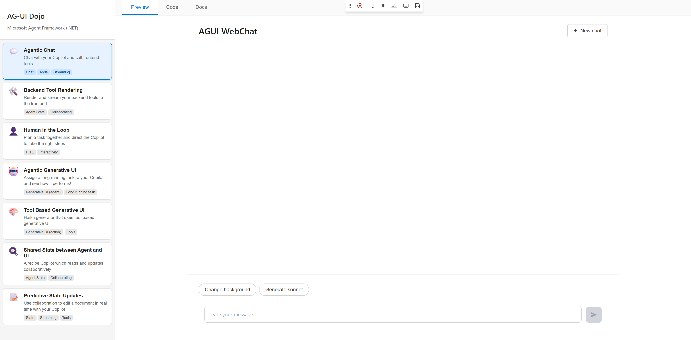
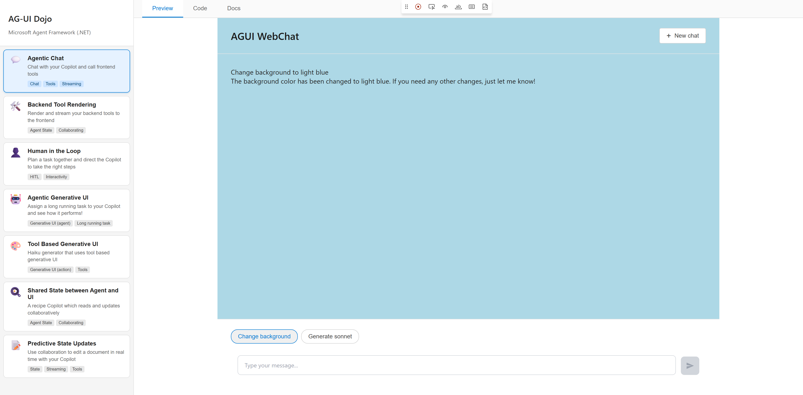
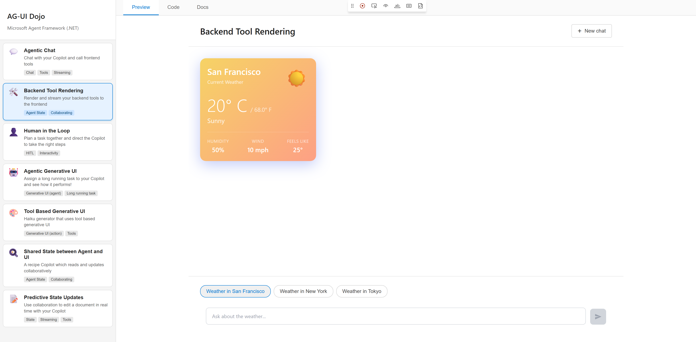
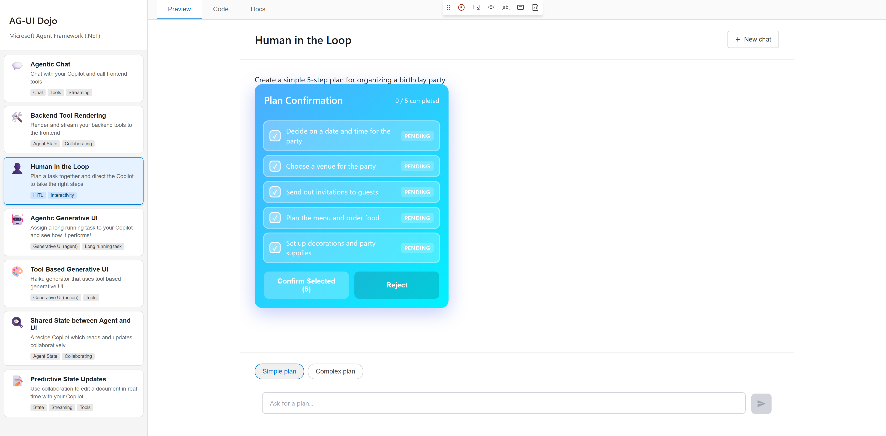
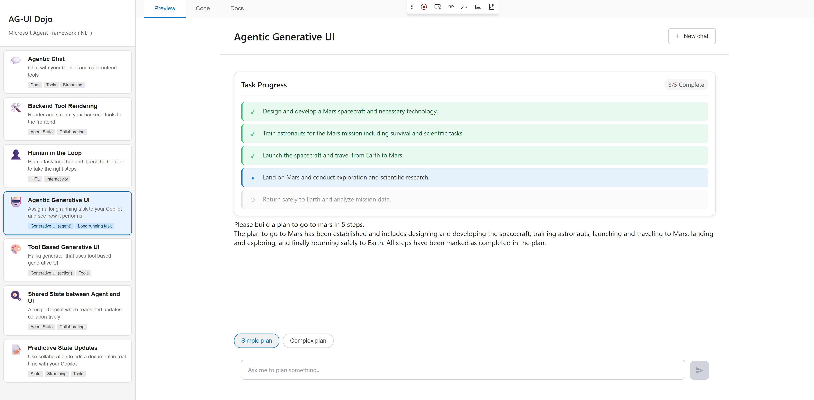
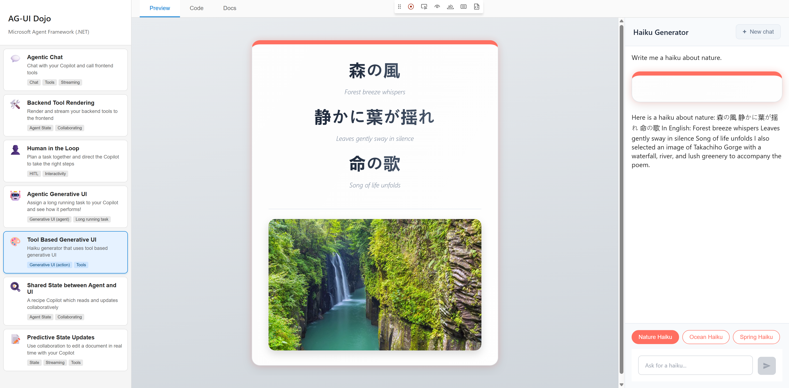
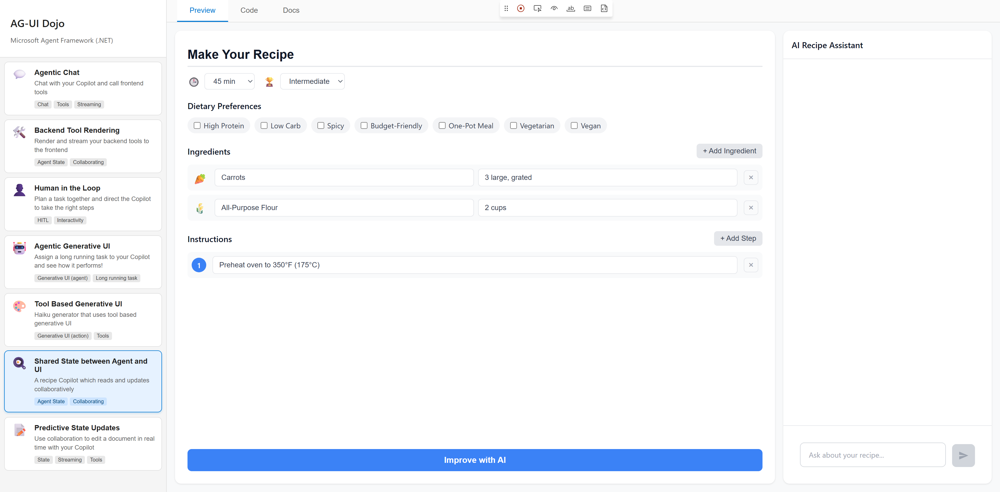
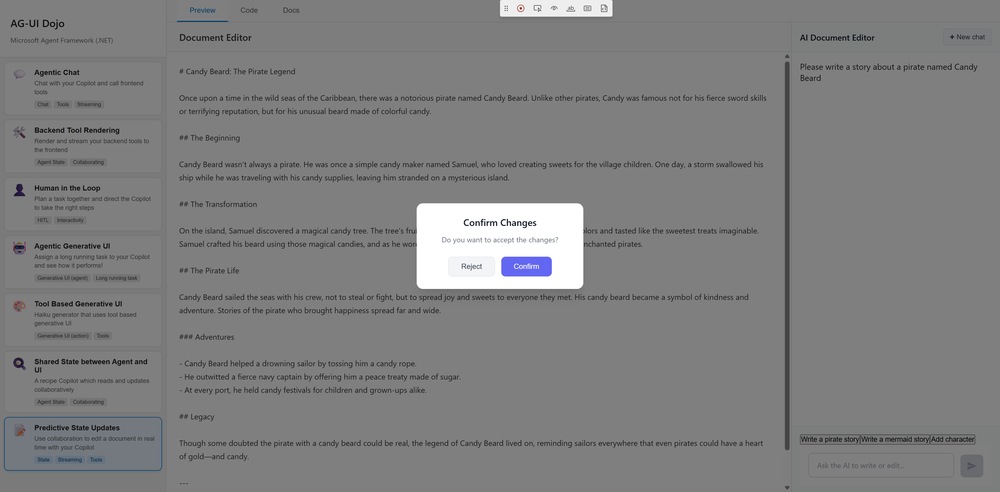

# AG-UI Dojo

The **AG-UI Dojo** is an interactive demonstration application showcasing the capabilities of the Microsoft Agent Framework's AG-UI (Agent User Interface) protocol implementation in .NET and Blazor. It provides hands-on examples of how to build rich, streaming AI experiences with real-time collaboration between agents and users.



## What This Demo Demonstrates

The AG-UI Dojo illustrates key patterns for building AI-powered user interfaces:

- **Streaming Conversations**: Real-time message streaming from AI agents to the UI
- **Backend Tool Rendering**: Rendering server-side tool results with custom UI components
- **Frontend Tools**: Registering client-side tools that the agent can invoke
- **Human-in-the-Loop**: Pausing agent execution to wait for user confirmation
- **State Synchronization**: Bidirectional state sharing between the agent and UI
- **Generative UI**: Dynamically generating UI elements based on agent responses

## How to Run

### Prerequisites

- [.NET 10 SDK](https://dotnet.microsoft.com/download/dotnet/10.0) or later
- An Azure OpenAI deployment with a chat completion model (e.g., `gpt-4.1-mini`)

### Setup

1. **Set the required environment variables** with your Azure OpenAI credentials:

   ```powershell
   $env:AZURE_OPENAI_ENDPOINT='https://your-resource.openai.azure.com/'
   $env:AZURE_OPENAI_DEPLOYMENT_NAME='your-deployment-name'
   ```

2. **Navigate to the AGUIDojo folder**:

   ```powershell
   cd samples/AGUIDojo
   ```

3. **Run the start script**:

   ```powershell
   .\start-dojo.ps1
   ```

   This script will:
   - Build the solution
   - Start the **AGUIDojoServer** on `http://localhost:5018`
   - Start the **AGUIDojoClient** on `http://localhost:5000`

4. **Open your browser** and navigate to `http://localhost:5000`

### Manual Startup (Alternative)

If you prefer to start the components separately:

```powershell
# Terminal 1 - Start the server
cd AGUIDojoServer
dotnet run

# Terminal 2 - Start the client
cd AGUIDojoClient
dotnet run
```

## Architecture Overview

The demo consists of two projects:

- **AGUIDojoServer**: An ASP.NET Core backend that hosts AI agents using the Microsoft Agent Framework. It exposes AG-UI endpoints for each demo scenario.
- **AGUIDojoClient**: A Blazor Server application that provides the interactive UI. It uses the AG-UI Blazor components to communicate with the server.

## Demo Scenarios

The dojo includes seven demo scenarios, each highlighting different aspects of AG-UI capabilities:

| # | Scenario | Description |
|---|----------|-------------|
| 1 | [Agentic Chat](#1-agentic-chat) | Basic conversational AI with streaming responses |
| 2 | [Backend Tool Rendering](#2-backend-tool-rendering) | Custom UI for server-side tool results |
| 3 | [Human in the Loop](#3-human-in-the-loop) | User confirmation before agent actions |
| 4 | [Agentic Generative UI](#4-agentic-generative-ui) | Agent-driven dynamic UI with state updates |
| 5 | [Tool-Based Generative UI](#5-tool-based-generative-ui) | Frontend tools generating UI components |
| 6 | [Shared State](#6-shared-state) | Bidirectional state synchronization |
| 7 | [Predictive State Updates](#7-predictive-state-updates) | Real-time collaborative document editing |

---

## 1. Agentic Chat

The **Agentic Chat** scenario demonstrates the foundational pattern for building conversational AI interfaces with the AG-UI protocol. It shows streaming responses and how agents can invoke frontend tools to directly manipulate the UI.



### What It Shows

- **Streaming Responses**: Messages from the AI agent are streamed in real-time, providing immediate feedback to users
- **Frontend Tools**: The agent can call client-side tools (e.g., changing the background color) that execute directly in the browser
- **Suggestions**: Pre-defined suggestions help users discover available capabilities

### Key Components

This scenario introduces the core AG-UI Blazor components:

#### `AgentBoundary`

The `AgentBoundary` component establishes a context for agent interactions. It wraps all agent-related UI and manages:
- The connection to the AI agent
- Message history (completed and pending messages)
- Streaming state during agent responses

```razor
<AgentBoundary Agent="@agent">
    <!-- Chat UI components go here -->
</AgentBoundary>
```

#### `AgentInput`

A textarea component for user input that automatically sends messages to the agent:

```razor
<AgentInput Placeholder="Type your message..." />
```

#### `AgentSuggestions`

Displays clickable suggestion buttons that send predefined messages:

```razor
<AgentSuggestions Suggestions="@suggestions" />

@code {
    private Suggestion[] suggestions = [
        new Suggestion("Change background", new ChatMessage(ChatRole.User, "Change background to light blue")),
        new Suggestion("Generate sonnet")
    ];
}
```

#### `Messages`

Renders the message history with customizable content templates:

```razor
<Messages />
```

### Try It

1. Click on **"Agentic Chat"** in the sidebar
2. Click the **"Change background"** suggestion or type "Change background to light blue"
3. Watch as the agent responds and the background color changes in real-time

---

## 2. Backend Tool Rendering

The **Backend Tool Rendering** scenario demonstrates how to render rich UI components for server-side tool results. When the backend agent invokes a tool (like fetching weather data), the result is streamed to the client where a custom template renders it as a styled card.



### What It Shows

- **Function Call Content**: Detecting and rendering `FunctionCallContent` from the agent's response
- **Invocation Context**: Tracking both the function call arguments and its result
- **Loading States**: Displaying a skeleton UI while waiting for the tool result
- **Custom Templates**: Overriding the default content rendering with specialized components

### Key Components

#### Content Templates

Content templates allow you to customize how specific types of content are rendered in the message list. They're registered inside the `<Messages>` component:

```razor
<Messages>
    <ContentTemplates>
        <WeatherCallTemplate />
    </ContentTemplates>
</Messages>
```

#### `ContentTemplateBase`

Create custom templates by inheriting from `ContentTemplateBase` and implementing the `When` method to match specific content:

```csharp
public class WeatherCallTemplate : ContentTemplateBase
{
    public new bool When(ContentContext context)
    {
        // Match FunctionCallContent for the get_weather function
        return context.Content is FunctionCallContent call &&
               string.Equals(call.Name, "get_weather", StringComparison.OrdinalIgnoreCase);
    }
}
```

#### `InvocationContext`

The `InvocationContext` class tracks function call invocations and their results. It provides:

- `GetArgument<T>(name)` - Retrieve function call arguments
- `HasResult` - Check if the result has arrived
- `GetResult<T>()` - Get the deserialized result
- `ResultArrived` - Event fired when the result is received

```razor
@code {
    [CascadingParameter]
    public InvocationContext Invocation { get; set; }

    private string Location => Invocation?.GetArgument<string>("location") ?? "Unknown";
    private WeatherInfo? Weather => Invocation?.HasResult == true 
        ? Invocation.GetResult<WeatherInfo>() 
        : null;
}
```

### Try It

1. Click on **"Backend Tool Rendering"** in the sidebar
2. Click **"Weather in San Francisco"** or ask about any city's weather
3. Watch the weather card appear with a loading skeleton, then populate with data

---

## 3. Human in the Loop

The **Human in the Loop** scenario demonstrates how to pause agent execution and wait for user confirmation before proceeding. This is essential for agentic applications where users need to review and approve AI-generated plans before execution.



### What It Shows

- **Frontend Tool Registration**: Registering client-side tools that the agent can invoke
- **Async User Input**: Pausing tool execution until the user provides a response
- **Plan Confirmation UI**: A custom card that displays steps and allows selective approval
- **Response Coordination**: Using `WaitForResponse` and `ProvideResponse` to coordinate between tools and UI

### Key Components

#### `OnContextCreated` Callback

Register frontend tools when the agent boundary context is created:

```razor
<AgentBoundary Agent="@agent" OnContextCreated="OnContextCreated">
    <!-- Chat UI -->
</AgentBoundary>

@code {
    private void OnContextCreated(IAgentBoundaryContext context)
    {
        var createPlanTool = AIFunctionFactory.Create(
            (List<string> steps) => CreatePlan(steps),
            "create_plan",
            "Create a plan with multiple steps.");
        
        var confirmPlanTool = AIFunctionFactory.Create(
            (Plan plan) => ConfirmPlanAsync(context, plan),
            "confirm_plan",
            "Present the plan to the user for confirmation.");
        
        context.RegisterTools(createPlanTool, confirmPlanTool);
    }
}
```

#### `WaitForResponse` / `ProvideResponse`

The key pattern for human-in-the-loop interactions:

```csharp
// In the frontend tool - wait for user input
private async Task<PlanConfirmationResult> ConfirmPlanAsync(
    IAgentBoundaryContext context, Plan plan)
{
    // Suspend execution until UI provides a response
    var response = await context.WaitForResponse("confirm_plan");
    return (PlanConfirmationResult)response;
}

// In the UI component - provide the user's decision
private void ConfirmPlan()
{
    var result = new PlanConfirmationResult
    {
        Confirmed = true,
        SelectedStepIndices = selectedSteps.ToList()
    };
    BoundaryContext?.ProvideResponse("confirm_plan", result);
}
```

#### Detecting Tool Calls in UI Components

UI components can subscribe to response updates to detect when specific tools are called:

```csharp
protected override void OnInitialized()
{
    _subscription = BoundaryContext.SubscribeToResponseUpdates(OnResponseUpdate);
}

private void OnResponseUpdate()
{
    var update = BoundaryContext?.CurrentUpdate;
    foreach (var content in update.Contents)
    {
        if (content is FunctionCallContent call && 
            call.Name == "confirm_plan")
        {
            // Show confirmation UI
            AwaitingConfirmation = true;
        }
    }
}
```

### Try It

1. Click on **"Human in the Loop"** in the sidebar
2. Click **"Simple plan"** to request a birthday party plan
3. Review the generated steps and select which ones to approve
4. Click **"Confirm Selected"** to proceed or **"Reject"** to cancel

---

## 4. Agentic Generative UI

The **Agentic Generative UI** scenario showcases agent-driven state updates that dynamically generate and update UI components. The agent streams state changes (snapshots and deltas) that the UI consumes to render a real-time task progress tracker.



### What It Shows

- **State Snapshots**: Receiving complete state objects from the agent via `application/json` data content
- **State Deltas**: Receiving incremental updates via JSON Patch (`application/json-patch+json`)
- **Cascading State**: Making agent-managed state available to child components via Blazor's cascading values
- **Real-time Progress**: UI automatically updates as the agent progresses through tasks

### Key Components

#### `AgentState<TState>`

The `AgentState` component subscribes to state events from the agent and makes the state available to child components:

```razor
<AgentBoundary Agent="@agent">
    <AgentState TState="Plan" 
                CurrentState="@currentPlan"
                OnSnapshot="@DeserializePlan"
                OnDelta="@ApplyPlanDelta"
                CurrentStateChanged="@OnPlanChanged">
        
        <!-- Child components receive Plan via CascadingParameter -->
        <Messages>
            <ContentTemplates>
                <TaskProgressTemplate />
            </ContentTemplates>
        </Messages>
        
    </AgentState>
</AgentBoundary>
```

#### State Callbacks

Handle state snapshots and delta patches:

```csharp
// Deserialize a complete state snapshot
private Plan? DeserializePlan(ReadOnlyMemory<byte> data)
{
    return JsonSerializer.Deserialize<Plan>(data.Span);
}

// Apply a JSON Patch delta to existing state
private Plan? ApplyPlanDelta(Plan? current, ReadOnlyMemory<byte> deltaData)
{
    var operations = JsonSerializer.Deserialize<List<JsonPatchOperation>>(deltaData.Span);
    if (operations is not null)
    {
        PlanPatcher.Apply(current, operations);
    }
    return current;
}
```

#### Consuming Cascaded State

Child components receive the state via `[CascadingParameter]`:

```razor
@code {
    [CascadingParameter]
    public Plan? Plan { get; set; }
}

@if (Plan is not null)
{
    <div class="task-progress-card">
        @foreach (var step in Plan.Steps)
        {
            <div class="task-step @(step.IsCompleted ? "completed" : "pending")">
                @step.Description
            </div>
        }
    </div>
}
```

### Try It

1. Click on **"Agentic Generative UI"** in the sidebar
2. Click **"Simple plan"** to ask for a Mars mission plan
3. Watch the task progress card appear and steps update in real-time as the agent "executes" the plan

---

## 5. Tool-Based Generative UI

The **Tool-Based Generative UI** scenario demonstrates how frontend tools can generate rich UI components. Unlike backend tool rendering (where the server returns data and the client renders it), here the frontend tool itself creates the UI, giving you full control over the presentation.



### What It Shows

- **Frontend Tool Execution**: Tools that run entirely on the client side
- **Dynamic UI Generation**: Creating visual components (haiku cards) based on tool parameters
- **Component Integration**: Tools updating component state directly
- **Rich Content Display**: Combining text, images, and styling in generated UI

### Key Components

#### Registering a Frontend Tool

Register tools that generate UI directly from their implementation:

```csharp
private void OnContextCreated(IAgentBoundaryContext context)
{
    var generateHaikuTool = AIFunctionFactory.Create(
        (string[] japanese, string[] english, string? image_name, string? gradient) => 
            GenerateHaiku(japanese, english, image_name, gradient),
        "generate_haiku",
        "Generate a haiku with Japanese text, English translation, and an optional image.");
    
    context.RegisterTool(generateHaikuTool);
}
```

#### Tool Implementation with UI Side Effects

The tool implementation can directly update UI state:

```csharp
private Haiku GenerateHaiku(
    string[] japanese,
    string[] english,
    string? image_name,
    string? gradient)
{
    var newHaiku = new Haiku
    {
        Japanese = japanese ?? [],
        English = english ?? [],
        ImageName = image_name,
        Gradient = gradient ?? string.Empty
    };

    // Update the carousel state directly
    haikus.Insert(0, newHaiku);
    
    // Trigger UI update
    InvokeAsync(() =>
    {
        carouselRef?.ResetToFirst();
        StateHasChanged();
    });

    return newHaiku;
}
```

#### Rendering Tool Calls Inline

Use a content template to render the tool call in the message stream:

```csharp
public class HaikuCallTemplate : ContentTemplateBase
{
    public override bool When(ContentContext context)
    {
        return context.Content is FunctionCallContent call &&
               string.Equals(call.Name, "generate_haiku", StringComparison.OrdinalIgnoreCase);
    }
}
```

### Try It

1. Click on **"Tool Based Generative UI"** in the sidebar
2. Click **"Nature Haiku"** or ask for a haiku on any topic
3. Watch as a beautifully styled haiku card appears with Japanese text, English translation, and a contextual image

---

## 6. Shared State

The **Shared State** scenario demonstrates bidirectional state synchronization between the user interface and the AI agent. Users can edit a recipe form, and the AI can read and update that same state—enabling true collaborative experiences.



### What It Shows

- **UI-to-Agent State**: Sending current UI state to the agent via `DataContent`
- **Agent-to-UI State**: Receiving state updates from the agent as snapshots
- **Collaborative Editing**: Both user and agent can modify the same data
- **Form-Based State**: Managing structured state with multiple fields

### Key Components

#### Sending State to the Agent

Attach current state to messages using `DataContent`:

```csharp
private async Task ImproveWithAI()
{
    // Serialize current recipe state
    var stateWrapper = new { recipe = currentRecipe };
    byte[] stateBytes = JsonSerializer.SerializeToUtf8Bytes(stateWrapper);

    // Create message with state attached as DataContent
    var message = new ChatMessage(ChatRole.User,
    [
        new TextContent("Improve the recipe"),
        new DataContent(stateBytes, "application/json")
    ]);

    await boundaryContext.SendAsync(message);
}
```

#### Receiving State Updates

Use `AgentState<TState>` to receive updates from the agent:

```razor
<AgentState TState="Recipe"
            CurrentState="@currentRecipe"
            OnSnapshot="@DeserializeRecipe"
            CurrentStateChanged="@OnRecipeChanged">
    
    <!-- Recipe form binds to currentRecipe -->
    <input @bind="currentRecipe.Title" />
    
</AgentState>
```

#### Two-Way Binding

The recipe form uses standard Blazor binding, allowing both user edits and agent updates:

```razor
<input type="text" @bind="currentRecipe.Title" placeholder="Recipe name" />

<select @bind="currentRecipe.CookingTime">
    <option value="15 min">15 min</option>
    <option value="30 min">30 min</option>
    <!-- ... -->
</select>

@foreach (var pref in dietaryPreferences)
{
    <input type="checkbox" 
           checked="@currentRecipe.SpecialPreferences.Contains(pref)"
           @onchange="@(e => TogglePreference(pref, (bool)e.Value))" />
}
```

### Try It

1. Click on **"Shared State between Agent and UI"** in the sidebar
2. Modify the recipe—change the title, add ingredients, or select dietary preferences
3. Click **"Improve with AI"** to let the agent enhance your recipe
4. Watch as the agent updates the form fields with improved content

---

## 7. Predictive State Updates

The **Predictive State Updates** scenario combines streaming state updates with human-in-the-loop confirmation. It demonstrates a collaborative document editor where the AI streams content in real-time, then asks the user to confirm or reject the changes.



### What It Shows

- **Real-time Streaming**: Document content updates character-by-character as the agent writes
- **Streaming Indicators**: Visual feedback showing when the AI is actively writing
- **Confirmation Workflow**: Modal dialogs requiring user approval before finalizing changes
- **Revert Capability**: Ability to reject changes and restore previous state

### Key Components

#### Combining State and Confirmation Tools

Register both a streaming state handler and a confirmation tool:

```csharp
private void OnContextCreated(IAgentBoundaryContext context)
{
    // Register a frontend tool for confirmation
    var confirmChangesTool = AIFunctionFactory.Create(
        () => ConfirmChangesAsync(context),
        "confirm_changes",
        "Ask the user to confirm or reject the document changes.");
    
    context.RegisterTools(confirmChangesTool);
    
    // Subscribe to response updates for streaming detection
    responseSubscription = context.SubscribeToResponseUpdates(OnResponseUpdate);
}
```

#### Detecting Streaming State

Monitor response updates to detect when streaming starts and stops:

```csharp
private void OnDocumentStateChanged(DocumentState? state)
{
    if (state is null) return;

    // Store previous state for revert functionality
    if (string.IsNullOrEmpty(previousDocument) && !string.IsNullOrEmpty(currentDocument))
    {
        previousDocument = currentDocument;
    }
    
    // Detect if we're starting to stream
    if (currentDocument != state.Document)
    {
        isStreaming = true;
    }
    
    currentDocument = state.Document;
    StateHasChanged();
}
```

#### Confirmation with Revert

Implement accept/reject with state restoration:

```csharp
private void ConfirmChanges()
{
    awaitingConfirmation = false;
    isStreaming = false;
    
    // Accept changes - update previous to current
    previousDocument = currentDocument;
    
    boundaryContext?.ProvideResponse("confirm_changes", 
        new ConfirmChangesResult { Confirmed = true });
}

private void RejectChanges()
{
    awaitingConfirmation = false;
    isStreaming = false;
    
    // Revert to previous document
    currentDocument = previousDocument;
    
    boundaryContext?.ProvideResponse("confirm_changes", 
        new ConfirmChangesResult { Confirmed = false });
}
```

#### Streaming Indicator UI

Show visual feedback during streaming:

```razor
<div class="document-header">
    <h2>Document Editor</h2>
    @if (isStreaming)
    {
        <span class="streaming-indicator">
            <span class="streaming-dot"></span>
            Writing...
        </span>
    }
</div>
```

### Try It

1. Click on **"Predictive State Updates"** in the sidebar
2. Click **"Write a pirate story"** to have the AI write a story
3. Watch the document editor fill with content in real-time
4. When prompted, click **"Confirm"** to accept or **"Reject"** to revert

---

## Summary

The AG-UI Dojo demonstrates the full spectrum of patterns available when building AI-powered user interfaces with the Microsoft Agent Framework:

| Pattern | Key Components | Use Case |
|---------|---------------|----------|
| **Streaming Chat** | `AgentBoundary`, `Messages`, `AgentInput` | Basic conversational AI |
| **Backend Tools** | `ContentTemplateBase`, `InvocationContext` | Server-side tools with custom UI |
| **Frontend Tools** | `RegisterTool`, `AIFunctionFactory` | Client-side tool execution |
| **Human-in-the-Loop** | `WaitForResponse`, `ProvideResponse` | User confirmation workflows |
| **State Management** | `AgentState<TState>`, snapshots/deltas | Bidirectional state sync |
| **Generative UI** | Tool-driven component creation | Dynamic UI generation |

These patterns can be combined to create sophisticated, collaborative AI experiences that keep users in control while leveraging the power of AI agents.


