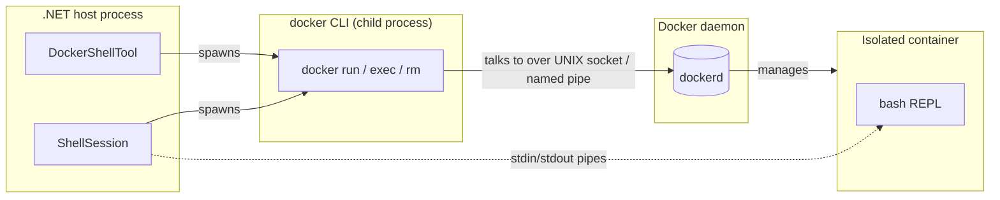
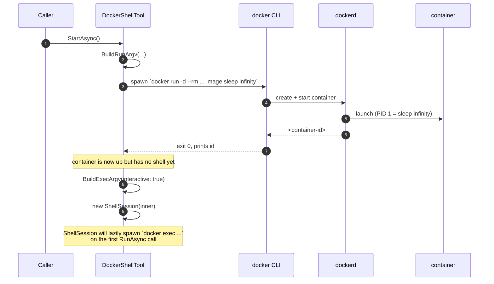
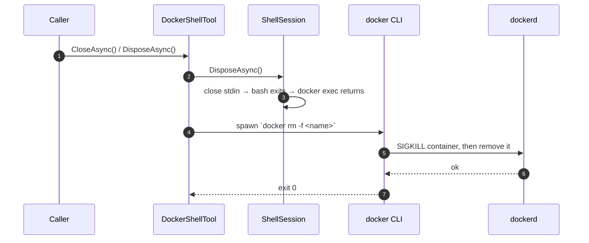
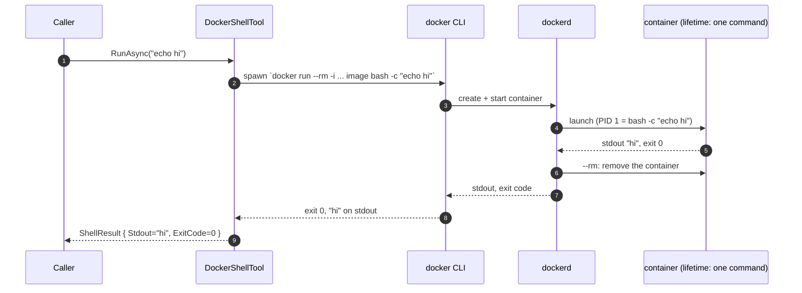
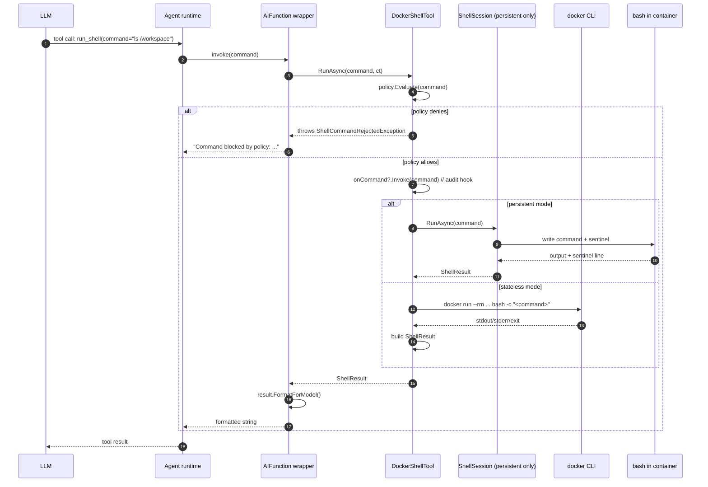

# How `DockerShellTool` works

This is a deep-dive on `DockerShellTool`: what it actually does, how it
talks to Docker, and the exact `docker` commands it invokes for every
public operation. If you've never written a Docker integration before,
read this top-to-bottom.

> TL;DR: `DockerShellTool` is a thin .NET wrapper that orchestrates the
> `docker` CLI binary as a subprocess. It does **not** talk to the Docker
> Engine API. Every operation the tool performs is one (or more)
> invocations of `docker run` / `docker exec` / `docker rm` over a normal
> child process.

---

## 1. The mental model

There is no library. There is no Docker SDK dependency. The whole
implementation is `Process.Start("docker", argv)`.



Key points:

- `DockerShellTool` itself never opens a TCP connection or a socket.
- Each call to the tool ends up as a child `docker` process.
- The daemon (`dockerd`) is the thing that actually creates / manages
  containers; we just ask the CLI to ask the daemon.
- In **persistent mode**, we keep one container alive and shovel
  commands into a long-lived `bash` running inside it. In **stateless
  mode**, we spawn-and-discard a container per call.

---

## 2. The two modes at a glance

| | Persistent (default) | Stateless |
|---|---|---|
| Container | Single, long-lived | One per call |
| `docker` invocations per call | 1 (`exec`) | 1 (`run --rm`) |
| State across calls | Yes (cwd, env, files in /tmp) | No |
| Startup cost | One-time `docker run` at `StartAsync` | None up front |
| Per-call latency | ~tens of ms (just `exec`) | ~hundreds of ms (full container start) |

---

## 3. Container hardening — the `docker run` argv

This is what every container starts with. It's the same set of flags
in both modes:

```
docker run -d --rm
  --name af-shell-<random>
  --user 65534:65534               # nobody:nogroup
  --network none                   # no outbound, no DNS, no internet
  --memory 512m
  --pids-limit 256
  --cap-drop ALL                   # drop every Linux capability
  --security-opt no-new-privileges # block setuid escalation
  --tmpfs /tmp:rw,nosuid,nodev,size=64m
  --workdir /workspace
  --read-only                      # root FS is read-only
  [-v <hostWorkdir>:/workspace:ro] # optional, defaults to ro
  [-e KEY=VALUE ...]               # optional env passthrough
  <image>
  sleep infinity                   # keep the container alive (persistent mode only)
```

The argv comes from `BuildRunArgv` in `DockerShellTool.cs` — it's a pure
static method, which is why we can unit test it without a daemon.

The `sleep infinity` at the end is a trick: containers exit when their
PID 1 exits. We need a long-lived PID 1 so we can `docker exec` into it
later. `sleep infinity` is the standard Unix way to do nothing forever.

---

## 4. Lifecycle: persistent mode

This is the default mode. One container is started up front and reused
across many calls.

### 4a. `StartAsync` — bringing the container up



What just happened:

1. We assembled the hardened argv from `BuildRunArgv`.
2. We spawned `docker` as a child process with that argv. The `-d` flag
   makes `docker run` return as soon as the container is **started**,
   not when it exits.
3. We checked the exit code. If non-zero (image not found, daemon down,
   bad flag, etc.) we throw `DockerNotAvailableException` with stderr.
4. We did **not** start a shell inside the container yet. We just
   constructed a `ShellSession` configured to use
   `docker exec -i <name> bash --noprofile --norc` as its launch argv.
   `ShellSession` only actually spawns that on the first command.

### 4b. `RunAsync` — running a command

This is where the `ShellSession` sentinel protocol kicks in. The first
call lazily attaches `bash` to the container; every subsequent call
reuses the same bash REPL.

```mermaid
sequenceDiagram
    autonumber
    participant Caller
    participant Tool as DockerShellTool
    participant Sess as ShellSession
    participant Cli as docker CLI<br/>(child of host)
    participant Bash as bash<br/>(in container)

    Caller->>Tool: RunAsync("ls && pwd")

    alt First call (bash not started)
        Tool->>Sess: RunAsync(...)
        Sess->>Cli: spawn `docker exec -i <name> bash --noprofile --norc`
        Cli->>Bash: stdin/stdout/stderr pipes opened
        Note over Sess,Bash: bash is now an interactive REPL<br/>connected to the host process via pipes
    else Subsequent call (bash already alive)
        Tool->>Sess: RunAsync(...)
    end

    Sess->>Bash: write user command + sentinel echo
    Note over Bash: { ls && pwd; }<br/>printf 'SENTINEL %d' $?

    Bash-->>Sess: stdout streams<br/>(user output + sentinel line)
    Sess->>Sess: detect sentinel,<br/>extract exit code
    Sess-->>Tool: ShellResult { Stdout, Stderr, ExitCode }
    Tool-->>Caller: ShellResult
```

Notes:

- `bash --noprofile --norc` skips `~/.bashrc` and `/etc/profile` — we
  want a clean, predictable environment.
- The sentinel protocol (`printf SENTINEL %d $?`) lets the host know
  when one command finishes without closing the bash REPL. See
  `ShellSession.cs` for details.
- Working directory and exported variables persist between calls
  because the same `bash` process keeps them in memory.
- Files written to `/tmp` persist across calls (it's a `tmpfs` inside
  the container) but **not** across container restarts.

### 4c. `CloseAsync` — tearing the container down



`docker rm -f` is best-effort; if the daemon is unreachable we swallow
the error. The `--rm` flag on the original `docker run` would also
have cleaned the container up on its own if the host process simply
crashed without `Close`. Belt and suspenders.

---

## 5. Lifecycle: stateless mode

Stateless mode does no setup work in `StartAsync`. Every `RunAsync` is
a fresh `docker run --rm` that starts a container, runs one command,
and exits.



Key differences from persistent mode:

- The container's PID 1 is now `bash -c <command>`, not `sleep
  infinity`. When the command finishes, PID 1 exits, the container
  exits, and `--rm` deletes it.
- No `docker exec` is involved. There's only ever one container
  invocation per call.
- On timeout we send `docker kill --signal KILL <perCallName>` to that
  specific container; `--rm` reaps it.
- Each call gets a unique container name (`GenerateContainerName`) so
  parallel calls don't collide.

Trade-off: stateless mode pays the full container-start cost on every
call (typically 200–800ms depending on image size), but it's the safest
mode if your model can't be trusted to clean up after itself.

---

## 6. The full call ladder for the AI function

When this tool is wired to a model via `AsAIFunction`, this is what
happens for one tool call:



`AsAIFunction` defaults to `requireApproval: false` because the
container itself is the security boundary — the model can't escape
`--network none` + `--read-only` + `--cap-drop ALL` no matter what
command it sends. The `LocalShellTool` defaults to the opposite,
because there is no boundary at all when running directly on the host.

---

## 7. Where each `docker` invocation lives

For grepping the source:

| Operation | Method | What it spawns |
|---|---|---|
| `IsAvailableAsync` | `DockerShellTool.IsAvailableAsync` | `docker version --format {{.Server.Version}}` |
| Container start (persistent) | `StartContainerAsync` → `RunDockerCommandAsync` | `docker run -d --rm ... image sleep infinity` |
| First command (persistent) | `ShellSession.EnsureStartedAsync` | `docker exec -i <name> bash --noprofile --norc` |
| Per call (persistent) | `ShellSession.RunLockedAsync` | none — writes into the existing bash stdin |
| Per call (stateless) | `RunStatelessAsync` | `docker run --rm -i ... image bash -c "<cmd>"` |
| Timeout (stateless) | `RunStatelessAsync` catch | `docker kill --signal KILL <perCallName>` |
| Container stop | `StopContainerAsync` | `docker rm -f <name>` |

All process spawning goes through `RunDockerCommandAsync`, which uses
`System.Diagnostics.Process` with `ProcessStartInfo.ArgumentList` —
that means we never build a shell command string and never have to
worry about quoting.

---

## 8. Things that can go wrong

| Symptom | Likely cause |
|---|---|
| `DockerNotAvailableException` on `StartAsync` | Daemon not running; PATH doesn't have `docker`; image not pullable |
| `IsAvailableAsync` returns `false` | Same as above; or `docker version` took >5s |
| `OCI runtime exec failed: bash: not found` | Image doesn't ship bash (e.g., alpine — try debian/azurelinux) |
| `docker exec` hangs forever | Container died between `run` and `exec`; check `docker ps -a` |
| Slow first call in stateless mode | Daemon is pulling the image; pre-pull or use `--pull never` |
| `Got permission denied while trying to connect to the Docker daemon socket` | User isn't in the `docker` group on Linux |

---

## 9. Why not use the Docker Engine API directly?

We could speak HTTP-over-UNIX-socket to `dockerd` and skip the CLI.
We chose not to because:

1. **Zero new dependencies.** Docker.DotNet would pull in a substantial
   tree of HTTP/socket code we don't otherwise need.
2. **Cross-tool compatibility.** The same code works with `podman`
   (just pass `dockerBinary: "podman"`) because the CLI surfaces are
   compatible. Engine APIs aren't.
3. **Operational symmetry.** Anyone debugging the tool can paste the
   exact same `docker run` argv into their terminal and see what we
   see. With an SDK that's a tedious translation step.

The cost is process-spawn overhead per call, which is negligible
compared to actual container/command latency.
