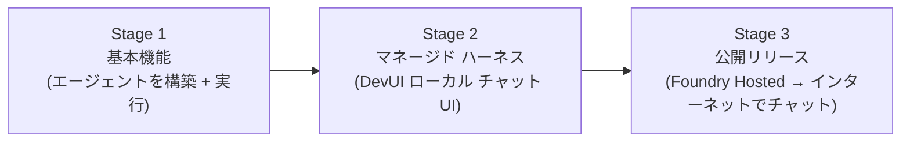
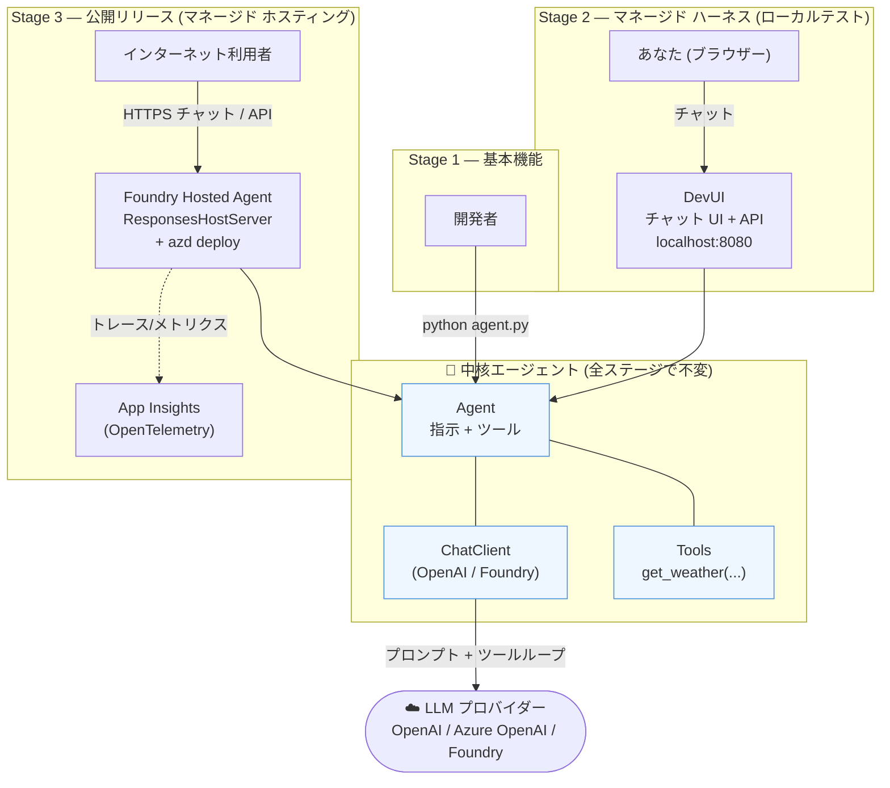
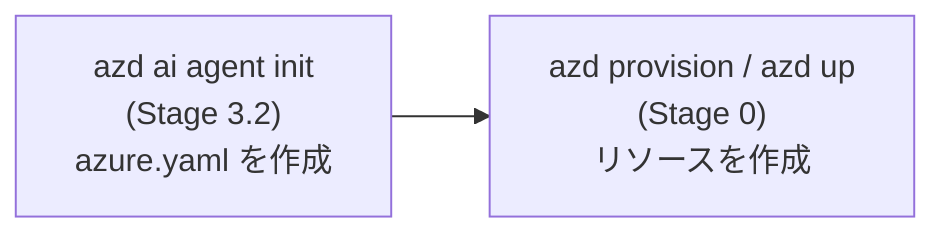
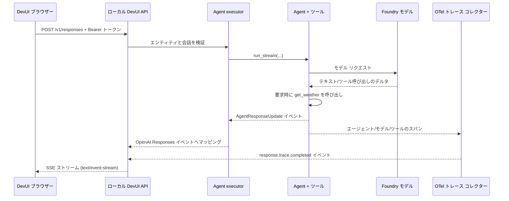
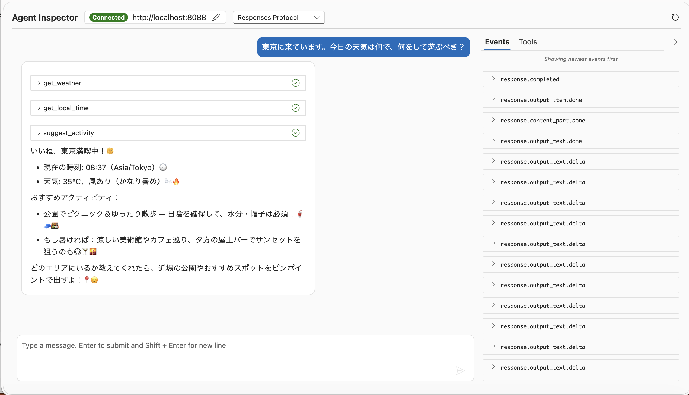
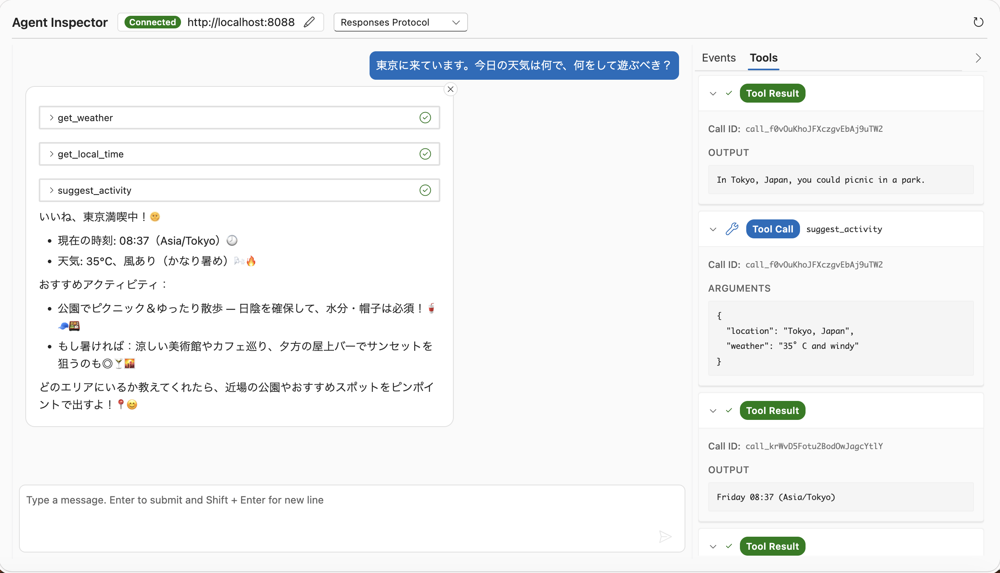

# Microsoft Agent Framework — 独自ハンズオン

> 📖 フレームワークの概要・インストール一覧・パッケージ情報は [../README-framework.md](../README-framework.md) を参照してください。&nbsp;|&nbsp; 🇬🇧 English version: [../README.md](../README.md)

---

## Part 1 — Agent Framework の概要

**Microsoft Agent Framework (MAF)** は、**本番運用グレードの AI エージェントとマルチエージェント ワークフロー**を構築するための、オープンかつ複数言語対応 (Python + .NET) のフレームワークです。LLM プロバイダーを自由に差し替えつつ、エージェントを構築・オーケストレーション・運用するための一貫した方法を提供します。

| 概念 | 内容 | このハンズオンでの対応 |
|---|---|---|
| **ChatClient** | LLM プロバイダーへの接続。 | `OpenAIChatClient` または `FoundryChatClient` |
| **Agent** | ChatClient + 指示 (instructions) + 任意のツール。実行の単位。 | `Agent(...)` |
| **Tools** | エージェントが呼び出せる素の Python 関数。 | `get_weather(...)` |
| **DevUI** | エージェントをテストするためのローカルな**対話型チャット UI + API サーバー**。*これがローカルテスト用の「マネージド ハーネス」です。* | `serve(...)` → `http://localhost:8080` |
| **Foundry Hosted Agents** | **マネージドなクラウド ホスティング** — エージェントをデプロイしてインターネット越しに到達可能にする。 | `azd ai agent ...` |
| **Workflows** | グラフベースのマルチエージェント オーケストレーション (逐次・並行・ハンドオフ・グループ)。 | (ここでは対象外) |

### 「ハーネス」という視点

**ハーネス (harness)** とは、モデルの*周囲*にあるランタイムの足場であり、素の LLM 呼び出しを信頼できる運用可能なエージェントへと変えるものです。
モデルはテキストを予測するだけで、ハーネスはそれを*動作させる*すべてを担います。すなわち、指示と履歴を投入し、ツール呼び出しループを実行し、状態やスレッドを管理し、ポリシーを適用し、テレメトリを送出し、そしてエージェントをインターフェース (ローカル UI、API、あるいはホストされたエンドポイント) 越しに公開します。
分かりやすく言えば、**モデル = 脳、ハーネス = 身体と神経系**です。

Agent Framework は、それ自体が**ハーネス**であり、しかも層状 (レイヤード) になっています。
各層は独立して差し替え可能な部品なので、最小構成から始めて、プロトタイプから本番へ進むにつれて層を追加できます。

| ハーネスの責務 | 意味 | Agent Framework での対応 |
|---|---|---|
| **モデルアクセス** | LLM と会話し、プロバイダー非依存を保つ | `ChatClient` 抽象化 — エージェントを書き直さずにプロバイダーを差し替え |
| **エージェントループ** | プロンプト + 最終回答までのツール呼び出しループ | `Agent` が「推論→ツール呼び出し→観測」ループを実行 |
| **ツール** | テキスト以外の能力をエージェントへ付与 | 素の Python 関数、MCP ツール、プロバイダー/ホスト提供ツール |
| **状態とメモリ** | 会話履歴、スレッド、長期記憶 | スレッド、履歴プロバイダー、メモリ統合 (例: Foundry Memory、Redis、Mem0) |
| **ポリシーと制御** | ガードレール、人間介在 (human-in-the-loop)、リクエスト/レスポンスの整形 | ミドルウェア パイプライン、ユーザー承認、フィルタリング |
| **オーケストレーション** | 複数エージェント/ステップを確実に協調させる | Workflows (逐次・並行・ハンドオフ・グループ)、チェックポイントと耐久性付き |
| **テストハーネス** | 出荷前にエージェントを対話的に動かす | **DevUI** — ローカル チャット UI + OpenAI 互換 API サーバー |
| **ホスティング ハーネス** | エージェントをマネージドかつインターネット到達可能なサービスとして実行 | **Foundry Hosted Agents** (`ResponsesHostServer` + `azd ai agent …`) |
| **可観測性** | エージェントが何を、なぜ行ったかを把握 | 組み込みの OpenTelemetry トレーシング/メトリクスをエンドツーエンドで |

**このハンズオンがハーネスをどう鍛えるか:** まず*内側*のハーネス (Stage 1 の ChatClient + エージェントループ + ツール) から始め、次に*テスト*ハーネス (Stage 2 の DevUI) を取り付け、そして*ホスティング*ハーネス (Stage 3 の Foundry Hosted Agents) へと昇格します。同じエージェント オブジェクトが 3 つすべてを貫いて流れ、変わるのは周囲のハーネス層だけです。

以下の道のりは、あなたの要望にそのまま対応しています。



### このハンズオン全体のアーキテクチャ

同じ **Agent** オブジェクト (ChatClient + 指示 + ツール) が全体を通じて中核です。ローカルのコードから、ローカルのテスト UI、そしてマネージドなインターネット ホスティングへと進んでも、変わるのはその周囲の**ハーネスの表面**だけです。



**1 つのエージェントを囲む 3 つの同心円状のハーネス層として読み解いてください:**

1. **内側ハーネス (Stage 1)** — `ChatClient` + `Agent` ループ + ツール。Python から直接呼び出す。
2. **テストハーネス (Stage 2)** — DevUI が同じエージェントをローカルのチャット UI + OpenAI 互換 API で包み、対話的にテストできるようにする。
3. **ホスティング ハーネス (Stage 3)** — `ResponsesHostServer` + `azd` が同じエージェントを、可観測性を組み込んだマネージドかつインターネット到達可能なサービスとして公開する。
4. **観測ハーネス (Stage 4)** — `configure_otel_providers()` が同じエージェントについて OpenTelemetry のトレース・ログ・メトリクスを、ローカル コンソールからクラウド APM (App Insights) まで送出する。これは上記すべての層を横断する。

---

## Stage 0 — Azure リソースをセットアップする (Foundry + モデル)

**ゴール:** エージェントが必要とする Azure リソース — **Foundry プロジェクト**と**モデル デプロイ** (加えて、後のホスティングで使う Application Insights とコンテナー レジストリ) を作成する。

> **OpenAI** を使い (Stage 1.2 の Option A)、Foundry へのデプロイを予定していない場合はこのステージをスキップできます。Azure/Foundry を選ぶ場合と Stage 3 では必須です。

**いずれか 1 つ**の経路を選んでください。

### Option A — `azd` (最も簡単、推奨)

> `azd provision` / `azd up` は、先に **azd プロジェクト** (`azure.yaml`) が存在している必要があります。そうでないと `ERROR: no project exists; to create a new project, run azd init` が表示されます。プロビジョニングの**前に** `azd ai agent init` (これは Stage 3.2) で作成してください。

**順序が重要な理由:** `azd` はプロジェクト ベースであり、各 `azd provision` / `azd up` コマンドは `azure.yaml` を読んで何をビルドするかを判断します。そのファイルは空のフォルダーには存在せず、Stage 3.2 の `init` ステップで生成されます。したがって、まず `init` を実行してプロジェクトを足場作りし、*その後で*プロビジョニングします。



```bash
az login

# リソースのみ:
azd provision
# 作成されるもの: リソース グループ、Foundry インスタンス + プロジェクト、モデル デプロイ、
#          Application Insights、コンテナー レジストリ。

# ...またはリソース作成とエージェントのデプロイを一括で (Stage 3.2 の後に再訪):
azd up
```

### Option B — Bicep (明示的でレビュー可能な Infrastructure-as-Code)

Foundry リソースをソース管理下で定義したい場合はこちらを使います。`infra/foundry.bicep` を作成します。

```bicep
// infra/foundry.bicep
@description('Azure region')
param location string = resourceGroup().location
@description('Base name for the resources')
param baseName string = 'mafhandson'
@description('Model + version to deploy')
param modelName string = 'gpt-4.1-mini'
param modelVersion string = '2025-04-14'

// Azure AI Foundry account (Cognitive Services, kind = AIServices)
resource account 'Microsoft.CognitiveServices/accounts@2025-06-01' = {
  name: '${baseName}-foundry'
  location: location
  kind: 'AIServices'
  sku: { name: 'S0' }
  identity: { type: 'SystemAssigned' }
  properties: {
    allowProjectManagement: true          // enables Foundry projects
    customSubDomainName: '${baseName}-foundry'
    publicNetworkAccess: 'Enabled'
  }
}

// Foundry project (child of the account)
resource project 'Microsoft.CognitiveServices/accounts/projects@2025-06-01' = {
  parent: account
  name: '${baseName}-project'
  location: location
  identity: { type: 'SystemAssigned' }
  properties: {}
}

// Model deployment
resource modelDeployment 'Microsoft.CognitiveServices/accounts/deployments@2025-06-01' = {
  parent: account
  name: modelName
  sku: { name: 'GlobalStandard', capacity: 50 }
  properties: {
    model: { format: 'OpenAI', name: modelName, version: modelVersion }
  }
}

output FOUNDRY_PROJECT_ENDPOINT string = 'https://${account.name}.services.ai.azure.com/api/projects/${project.name}'
output AZURE_AI_MODEL_DEPLOYMENT_NAME string = modelDeployment.name
```

デプロイして、出力をエージェントが使う環境変数へ取り込みます。

```bash
az login
az group create -n rg-maf-handson -l eastus2

az deployment group create \
  -g rg-maf-handson \
  -f infra/foundry.bicep

# 出力をシェルへ読み戻す
export FOUNDRY_PROJECT_ENDPOINT=$(az deployment group show -g rg-maf-handson -n foundry \
  --query properties.outputs.FOUNDRY_PROJECT_ENDPOINT.value -o tsv)
export AZURE_AI_MODEL_DEPLOYMENT_NAME=$(az deployment group show -g rg-maf-handson -n foundry \
  --query properties.outputs.AZURE_AI_MODEL_DEPLOYMENT_NAME.value -o tsv)
```

> ヒント: `az deployment group create -f infra/foundry.bicep`

✅ **チェックポイント:** Foundry プロジェクト + モデル デプロイができ、`FOUNDRY_PROJECT_ENDPOINT` / `AZURE_AI_MODEL_DEPLOYMENT_NAME` が設定されている。

---

## Stage 1 — 基本機能: 最初のエージェントを構築して実行する

**ゴール:** コードから呼び出せる動作するエージェント。

### 1.1 環境をセットアップする

```bash
# 任意の場所で。新しいプロジェクト フォルダーを作成
mkdir maf-handson && cd maf-handson

# uv が無ければインストール (一度だけ)、そしてこのシェルに読み込む
curl -LsSf https://astral.sh/uv/install.sh | sh
source $HOME/.local/bin/env        # 現在のシェルの PATH に `uv` を通す

# 高速な venv を作成して有効化
uv venv .venv
source .venv/bin/activate          # macOS/Linux

uv pip install agent-framework
```

### 1.2 「チャット ID」を選ぶ

エージェントは **ChatClient** を通じて LLM と会話します。1 つ選んでください。

**Option A — OpenAI (最も簡単、API キーだけ):**

```bash
export OPENAI_API_KEY="sk-..."
```

**Option B — Azure OpenAI / Foundry (キーの代わりに Azure ログインを使用):**

**Stage 0** で作成したリソースを再利用します。**`azd`** でプロビジョニングした場合はその環境から値を取得し、**Bicep** 経路を使った場合はテンプレート出力から既にエクスポート済みです。

```bash
az login

# Stage 0 の Option A (azd) を実行した場合、azure.yaml のあるフォルダーから実行:
export FOUNDRY_PROJECT_ENDPOINT="$(
  azd env get-value FOUNDRY_PROJECT_ENDPOINT
)"

export FOUNDRY_MODEL="$(
  azd env get-value AI_PROJECT_DEPLOYMENTS |
  sed 's/\\"/"/g' |
  jq -r '.[0].name'
)"

# 両方の変数が現在のシェルで利用可能か確認:
echo "$FOUNDRY_PROJECT_ENDPOINT"
echo "$FOUNDRY_MODEL"

# ...または手動で設定 (Stage 0 でデプロイした内容と一致させること):
# export FOUNDRY_PROJECT_ENDPOINT="https://<account>.services.ai.azure.com/api/projects/<project>"
```

### 1.3 エージェントを書く — `agent.py`

```python
# agent.py
import asyncio
from agent_framework import Agent
from agent_framework.openai import OpenAIChatClient   # Option A
# from agent_framework.foundry import FoundryChatClient  # Option B
# from azure.identity import AzureCliCredential


def get_weather(location: str) -> str:
    """Get the weather for a location."""
    return f"Weather in {location}: 72°F and sunny"


agent = Agent(
    name="WeatherAgent",
    instructions="You are a friendly assistant. Keep your answers brief.",
    client=OpenAIChatClient(),                 # Option A
    # client=FoundryChatClient(credential=AzureCliCredential()),  # Option B
    tools=[get_weather],
)


async def main():
    print(await agent.run("What's the weather in Seattle?"))


if __name__ == "__main__":
    asyncio.run(main())
```

### 1.4 実行する

```bash
python agent.py
# → エージェントが get_weather を呼び出し、簡潔な回答を返します。
```

✅ **チェックポイント:** ツールを持つ基本エージェントができ、ChatClient で駆動されている。

---

## Stage 2 — マネージド ハーネス: ローカルのチャット UI (DevUI) でテストする

**ゴール:** 同じエージェントを、コードではなく**ブラウザーのチャット UI**越しに操作する — ローカルの「テスト ハーネス」。

### 2.1 DevUI をインストールする

```bash
# DevUI はプレリリースのサンプル アプリ
uv pip install agent-framework-devui --pre
```

### 2.2 チャット UI を起動する — 2 行

以下を `agent.py` の末尾に追加する (または小さな `run_devui.py` を作る):

```python
# run_devui.py
from agent_framework.devui import serve
from agent import agent          # Stage 1 のエージェントを再利用

# http://localhost:8080 でブラウザーのチャット UI を開く
serve(
  entities=[agent],
  auto_open=True,
  auth_enabled=True,
  instrumentation_enabled=True,
  mode="developer",
)
```

```bash
# 現在のターミナルに一時的な DevUI Bearer トークンを作成。
# run_devui.py やソース管理には入れないこと。
export DEVUI_AUTH_TOKEN="$(openssl rand -hex 32)"

# ブラウザーの DEV TOKEN 欄に貼り付けられるよう一度だけ表示。
echo "$DEVUI_AUTH_TOKEN"

# 任意: 表示せずに設定済みかどうかだけ確認。
[[ -n "$DEVUI_AUTH_TOKEN" ]] && echo "DevUI token is set"

python run_devui.py
# → Web チャット UI: http://localhost:8080
# → OpenAI 互換 API: http://localhost:8080/v1/*
```

`echo` が表示した値をブラウザーの **DEV TOKEN** 欄に貼り付けます。DevUI は保護されたリクエストで次のように送信します:

```http
Authorization: Bearer <token>
```

`DEVUI_AUTH_TOKEN` は現在のターミナル セッションにのみ存在します。新しいターミナルを開いた場合は、DevUI を起動する前に新しいトークンをエクスポートしてください。トークンを見逃した場合は、`Ctrl+C` でサーバーを停止し、export と `echo` を再実行して `python run_devui.py` を再起動します。


### 2.3 DevUI が裏で行っていること

DevUI は静的なチャット ページ以上のものです。
ローカルの FastAPI/Uvicorn サーバーを起動し、Stage 1 でインポートした `agent` の周囲に HTTP テスト ハーネスを配置します。



重要な設定は互いに独立しています。

| 設定 | 何を有効にするか |
| --- | --- |
| `auth_enabled=True` | 保護されたローカル API 呼び出しに `Authorization: Bearer <DEVUI_AUTH_TOKEN>` を要求する。 |
| `mode="developer"` | reload やデプロイなどの開発者専用 API を有効にし、詳細なエラーを返す。これ自体はトレーシングを有効にはしない。 |
| `instrumentation_enabled=True` | エージェント・モデル・ツールのスパンを含む Agent Framework の OpenTelemetry 計装を有効にする。このローカル開発セッションでは機微なプロンプト/ツール データも有効になる。 |
| `auto_open=True` | サーバー起動後に `http://127.0.0.1:8080` を開く。 |

#### イベント vs. OpenTelemetry

| | イベント | OTel スパン |
| --- | --- | --- |
| 目的 | テキスト/ツール/ステータスのライブ更新 | タイミング、トークン、ステータス、エラー |
| 流れ | Agent → イベント → SSE → ブラウザー | Agent → スパン → DevUI または OTLP バックエンド |
| 例 | `response.output_text.delta` | モデル呼び出し: `1.8 s`、ステータス: `OK` |

代表的なスパン データには、エージェント所要時間、モデル所要時間、ツール所要時間、トークン使用量、ステータスが含まれます。DevUI は完了したスパンを `response.trace.completed` イベントへ変換し、トレースをブラウザーに表示できるようにもします。

> `instrumentation_enabled=True` は現在の DevUI 実装で機微データのトレーシングを有効にします。開発用データにのみ使用し、シークレットや本番の顧客コンテンツを入力しないでください。公開サービスでは、DevUI を公開する代わりに、エクスポーターと機微データ ポリシーを明示的に構成してください。

### 2.4 DevUI からエージェントを Azure へデプロイできるか?

できますが、**2 つの異なる Azure デプロイ経路**があります。

| 経路 | ターゲット | ここでの最適な用途 |
| --- | --- | --- |
| Stage 3 の `azd deploy` | 用意した `azure.yaml` と Responses プロトコルを使う **Foundry Hosted Agents** | **このハンズオンと公開リリースに推奨** |
| DevUI の **Azure Deployment** トグル | **Azure Container Apps**。DevUI が Dockerfile を生成しデプロイ進捗をストリーム表示 | ディレクトリで検出されたエージェント向けの任意の実験 |

推奨の Foundry 経路では、DevUI を停止し、`azure.yaml` のあるフォルダーへ移動して、プロビジョニング済みの環境をデプロイします。

```bash
cd ../
azd env select afharness
azd deploy
```

> Container Apps のワンクリック デプロイ ボタンは利用できません。`serve(entities=[agent])` がエージェントを**インメモリ エンティティ**として登録するためです。このハンズオンを **Foundry Hosted Agents** へ公開するには、上記の `azd deploy` を使ってください。

ローカルの `DEVUI_AUTH_TOKEN` は開発 UI のみを保護します。デプロイ済み Foundry エージェントの認証メカニズムではありません。

ブラウザーでエージェントとチャットし、ツール呼び出しが起きる様子を眺め、(任意で) トレースを表示します。

```bash
# エージェントのディレクトリから、テレメトリ付きで:
devui ./agents --port 8080 --instrumentation
```

> 注意: DevUI は**開発/テスト用のサンプル アプリであり、本番用ではありません**。既定の `127.0.0.1` にバインドしたままにし、開発トークンを公開したりリポジトリにコミットしたりしないでください。公開リリースには Stage 3 へ進んでください。

✅ **チェックポイント:** ローカルの Web UI でエージェントとチャットできる。

---

## Stage 3 — 公開リリース: インターネット越しに到達可能なマネージド ホスティング

**ゴール:** エージェントを **Foundry Hosted Agents** へデプロイし、インターネット エンドポイント (およびチャットできる Foundry UI) を持つマネージド サービスにする。

### 3.1 前提条件

```bash
# Azure Developer CLI + AI agent 拡張
# azd のインストール: https://learn.microsoft.com/azure/developer/azure-developer-cli/install-azd
azd ext install azure.ai.agents
azd auth login
```

Azure サブスクリプションも必要です。Foundry プロジェクト + モデル デプロイが無ければ `azd` が作成できます。

### 3.2 hosted-agent プロジェクトを初期化する (クローン不要)

```bash
mkdir hosted-agent && cd hosted-agent

# 公式の "basic responses" マニフェスト (GitHub) を azd に指定
azd ai agent init -m https://github.com/microsoft/agent-framework/blob/main/python/samples/04-hosting/foundry-hosted-agents/responses/01_basic/agent.manifest.yaml
```

**`azd ai agent init -m <path-or-URL>` が行うこと:** `-m` (`--manifest`) は、ホストされたエージェントを記述する宣言的な**スペック ファイル**である **`agent.manifest.yaml`** を `azd` に指定します (提供 `protocol` 例: `responses`、デプロイする `model`、ランタイム設定、必要な環境変数)。
そのマニフェストから `azd` は、現在のフォルダーに**デプロイ可能なプロジェクト一式を足場作り**します。

| 生成されるもの | 目的 |
| --- | --- |
| `azure.yaml` | azd プロジェクト ファイル (`infra.provider: microsoft.foundry`)。`azd provision` / `azd up` が何をビルドするかを把握 |
| `main.py`, `requirements.txt` | エージェントの実行可能コード + Python 依存関係 |
| `agent.manifest.yaml`, `agent.yaml` | ローカルにコピーされ、モデル・プロトコル・ランタイム (CPU/メモリ) を調整可能 |
| `.env.example` | エージェントが期待する環境変数 (エンドポイント、デプロイ名、…) |

- `-m` の後の値は、**ローカル パス** (`./agent.manifest.yaml`) でも **URL** (上記の GitHub raw/blob リンク) でも構いません。URL は単に公式サンプルを取得するので、リポジトリをクローンする必要がありません。
- `init` の後は、それらのファイルをローカルで所有します。編集してから `azd provision` (リソース作成) と `azd deploy` (コード出荷) を行います。特定のマニフェストではなく azd の既定テンプレートから始めるには `-m` を省略します。

これは、エージェントが次のように見えるプロジェクトを足場作りします (`ResponsesHostServer` がマネージド プロトコル向けにエージェントを包みます)。生成されるスタブは素の「フレンドリーなアシスタント」なので、ホストされたエージェントが実際に*何かをする*よう、個性**と実際のツール呼び出し**を備えたものに差し替えます。

```python
# main.py (生成されたスタブに、個性 + ツールを追加)
import os
import random
from datetime import datetime
from zoneinfo import ZoneInfo

from agent_framework import Agent
from agent_framework.foundry import FoundryChatClient, ResponsesHostServer
from azure.identity import DefaultAzureCredential
from dotenv import load_dotenv

load_dotenv()


# --- Tools the agent can call ---
def get_weather(location: str) -> str:
    """Get the current weather for a location."""
    conditions = ["sunny", "cloudy", "rainy", "windy", "snowy", "foggy"]
    return f"{location}: {random.randint(-5, 35)}°C and {random.choice(conditions)}"


def get_local_time(timezone: str = "UTC") -> str:
    """Get the current local time for an IANA timezone, e.g. 'Asia/Tokyo'."""
    try:
        now = datetime.now(ZoneInfo(timezone))
    except Exception:
        return f"Unknown timezone '{timezone}'. Try 'Asia/Tokyo' or 'America/New_York'."
    return now.strftime("%A %H:%M") + f" ({timezone})"


def suggest_activity(location: str, weather: str) -> str:
    """Suggest something fun to do given a location and its weather."""
    indoor = ["visit a cozy museum", "hunt for the best ramen", "catch a movie"]
    outdoor = ["take a scenic walk", "rent a bike", "find a rooftop view"]
    picks = indoor if any(w in weather.lower() for w in ("rain", "snow", "fog")) else outdoor
    return f"In {location}, you could {random.choice(picks)}."


def main():
    client = FoundryChatClient(
        project_endpoint=os.environ["FOUNDRY_PROJECT_ENDPOINT"],
        model=os.environ["AZURE_AI_MODEL_DEPLOYMENT_NAME"],
        credential=DefaultAzureCredential(),
    )
    agent = Agent(
        name="Wanderbot",
        client=client,
        instructions=(
            "You are Wanderbot, a witty, upbeat travel buddy who loves planning "
            "spontaneous adventures. Use your tools to check the weather and local "
            "time, then suggest a fun activity. Keep replies short, playful, and "
            "sprinkle in the occasional emoji."
        ),
        tools=[get_weather, get_local_time, suggest_activity],
        default_options={"store": False},  # history handled by the host
    )
    ResponsesHostServer(agent).run()

if __name__ == "__main__":
    main()
```

> **ツール呼び出しは 1 行で:** `tools=[...]` に素の Python 関数のリストを渡すだけです。エージェントは各関数の名前・型ヒント・docstring を読んで、いつ呼び出すかを判断します。スキーマの配線は不要です。*「東京にいるんだけど、今何をすべき?」*と尋ねて、`get_weather` → `get_local_time` → `suggest_activity` と連鎖する様子を見てみてください。

### 3.3 Azure リソースをプロビジョニングする (既に Foundry プロジェクトがあればスキップ)

**Stage 0** (`azd provision` / `azd up`、または Bicep テンプレート) を使って Foundry プロジェクト + モデル デプロイを作成します。既に Stage 0 を実行済みなら先へ進めます。

```bash
azd provision
# 作成されるもの: リソース グループ、Foundry インスタンス + プロジェクト、モデル デプロイ、
#          Application Insights、コンテナー レジストリ。
```
>
> ```bash
> # **azd 環境**を修正する場合
> azd env new afharness    
> azd provision
> ```

### 3.4 まずマネージド ホストをローカルで実行する (動作確認)

手入力する代わりに、`azd provision` (Stage 3.3) が azd 環境に既に保存した値を取得します。

> **azure.yaml のある azd プロジェクト フォルダーから実行してください** (例: `hosted-agent/agent-framework-agent-basic-responsesharnessagent/`)。それ以外の場所からだと、`azd env get-value` は JSON ではなく `ERROR: no project exists…` を表示し、パイプラインは `jq: parse error: Invalid numeric literal` で失敗します。

```bash
# azure.yaml を持つフォルダーへ移動 (パスは自分のものに合わせる)
cd hosted-agent/agent-framework-agent-basic-responsesharnessagent

# azd 環境からエンドポイントを直接読み取る
export FOUNDRY_PROJECT_ENDPOINT="$(azd env get-value FOUNDRY_PROJECT_ENDPOINT)"

# デプロイ名は AI_PROJECT_DEPLOYMENTS の JSON 配列の中にある
export AZURE_AI_MODEL_DEPLOYMENT_NAME="$(
  azd env get-value AI_PROJECT_DEPLOYMENTS |
  sed 's/\\"/"/g' |
  jq -r '.[0].name'
)"

# ホスト起動前に両方が設定済みか確認
echo "$FOUNDRY_PROJECT_ENDPOINT"
echo "$AZURE_AI_MODEL_DEPLOYMENT_NAME"

azd ai agent run          # http://localhost:8088 で提供

# 別のターミナルで:
azd ai agent invoke --local "Hello!"
# または:
curl -X POST http://localhost:8088/responses \
  -H "Content-Type: application/json" \
  -d '{"input": "Hello!"}'
```

### 3.5 インターネットへデプロイする (「公開リリース」)

```bash
azd deploy
```

これはエージェントをパッケージ化し、**マネージドかつインターネット アクセス可能なサービス**として Foundry へデプロイします。ホストは実行時に `FOUNDRY_PROJECT_ENDPOINT`、`AZURE_AI_MODEL_DEPLOYMENT_NAME`、`APPLICATIONINSIGHTS_CONNECTION_STRING` を注入します。デプロイ後は **Foundry UI でエージェントとチャット**でき、そのエンドポイントをどこからでも呼び出せます。

- デプロイ ガイド: https://learn.microsoft.com/azure/foundry/agents/how-to/deploy-hosted-agent
- デプロイ済みエージェントの管理: https://learn.microsoft.com/azure/foundry/agents/how-to/manage-hosted-agent

✅ **チェックポイント:** エージェントがインターネット チャット UI/エンドポイントを持って公開ホストされている。


---

## Stage 4 — 観測: エージェントが何をしているかを見る

**ゴール: 可観測性**を有効にし、すべてのモデル呼び出し・ツール呼び出し・トークン数を、ローカルでもクラウドでもトレースできるようにする。

Agent Framework は**ネイティブに計装済み**であり (OpenTelemetry、GenAI セマンティック規約に準拠)、既定で有効です。あなたはテレメトリの*送り先*だけを決めます。`configure_otel_providers()` の 1 回の呼び出しで、トレース・ログ・メトリクスが配線されます。

### 4.1 最速の確認 — コンソール トレース

Stage 1 のエージェントに計装を追加します — `observe.py`:

```python
# observe.py
import asyncio
from agent_framework.observability import configure_otel_providers, get_tracer
from opentelemetry.trace import SpanKind
from opentelemetry.trace.span import format_trace_id
from agent import agent           # Stage 1 のエージェントを再利用


async def main():
    # プロンプト、レスポンス、ツール引数を記録せずにトレース/ログ/メトリクスを出力。
    configure_otel_providers(enable_console_exporters=True, enable_sensitive_data=False)

    with get_tracer().start_as_current_span("Scenario: Agent Chat", kind=SpanKind.CLIENT) as span:
        print(f"Trace ID: {format_trace_id(span.get_span_context().trace_id)}")
        print(await agent.run("What's the weather in Seattle?"))


if __name__ == "__main__":
    asyncio.run(main())
```

```bash
python observe.py
# → エージェント実行、モデル呼び出し、get_weather ツール呼び出しのスパンがコンソールに出力されます。
```

### 4.2 実際のバックエンドへ送る (OTLP)

標準の OpenTelemetry 環境変数を、任意の OTLP 互換バックエンド (Aspire Dashboard、App Insights、Grafana/Prometheus など) に向けます。`configure_otel_providers()` 以外のコード変更は不要です。

```bash
export OTEL_EXPORTER_OTLP_ENDPOINT="http://localhost:4317"   # 例: ローカルの Aspire Dashboard
python observe.py
```

> ヒント: セットアップ不要のローカル ダッシュボードとして、**Aspire Dashboard** を Docker で実行するか、**AI Toolkit for VS Code** のトレース ビューを使ってください。

### 4.3 ハーネスの内側で観測する

- **DevUI (Stage 2):** スパンが UI に表示されるよう、トレーシング付きで起動:

  ```bash
  devui ./agents --port 8080 --instrumentation
  ```

- **Foundry Hosted (Stage 3):** Foundry がエクスポーターを管理し `APPLICATIONINSIGHTS_CONNECTION_STRING` を注入するため、デプロイ済みエージェントのテレメトリは、コード側のエクスポーター設定なしで **Application Insights** へ流れます。

### 4.4 エージェント向け OTel: 何を監視すべきか?

OTel には 3 つのシグナルがあります。

| シグナル | エージェントの例 | 用途 |
| --- | --- | --- |
| **Trace** | 子のモデル/ツール スパンを持つ 1 回のエージェント実行 | 実行パス全体のデバッグ |
| **Metric** | 多数の実行にわたって集計したレイテンシやトークン | ダッシュボード、傾向、アラート |
| **Log** | トレース ID で紐づいたエラーや業務イベント | 詳細イベントの検索 |

Agent Framework は OTel の **GenAI セマンティック規約**に従い、次の組み込みメトリクスを送出します。

| メトリクス | 測定・アラート対象 |
| --- | --- |
| `gen_ai.client.operation.duration` | モデル レイテンシ。プロバイダー/モデル別に p50/p95/p99 をチャート化し、高い p95 でアラート |
| `gen_ai.client.token.usage` | 入力/出力トークン。`gen_ai.token.type`、モデル、操作でグループ化 |
| `agent_framework.function.invocation.duration` | `agent_framework.function.name` 別のツール レイテンシ |

実運用のダッシュボードでは、次も導出または記録すべきです。

| エージェント KPI | 理由 |
| --- | --- |
| 実行数とエラー率 | 信頼性とトラフィックの変化 |
| エンドツーエンドのエージェント レイテンシ | 利用者が実際に体験するもの |
| ツール呼び出し数・レイテンシ・失敗 | 遅い/壊れた依存関係やエージェント ループの検出 |
| 実行あたりの入力/出力トークン | 容量とおおよそのコスト傾向 |
| 最初のトークンまでの時間 (TTFT) | ストリーミングの体感応答性 |
| タスク完了 / 品質スコア | 運用の健全性は回答品質とは異なる。Foundry の評価器やドメイン固有の評価器から取得 |

`gen_ai.agent.name`、`gen_ai.operation.name`、`gen_ai.provider.name`、`gen_ai.request.model`、`gen_ai.response.model`、`gen_ai.conversation.id` のような安定した属性でテレメトリを絞り込み・相関付けしてください。生のユーザー ID、プロンプト、レスポンス ID、会話 ID のような高カーディナリティのメトリクス ディメンションは避け、それらはトレース/ログ側に残してください。

**ローカル実行の Foundry エージェントを Application Insights へ送る:**

```bash
uv pip install azure-monitor-opentelemetry
```

```python
# 非同期のアプリ起動時、agent.run(...) の前に一度だけ呼び出す。
await client.configure_azure_monitor(
  enable_sensitive_data=False,
  enable_live_metrics=True,
)
```

`configure_azure_monitor()` は Application Insights 接続文字列を Foundry プロジェクトから取得します。これはローカルの Python プロセス向けです。Foundry Hosted Agents はデプロイ後にエクスポーターを管理します。Azure Portal で **Application Insights → Agents (Preview)** を開くと、実行・モデル・ツール・エラー・トークン使用量を確認できます。

> 本番では `enable_sensitive_data=False` を維持してください。有効にすると、プロンプト、レスポンス、ツール引数、ツール結果が記録される可能性があります。顧客コンテンツを収集する前に、アクセス制御、保持、サンプリング、リダクションを適用してください。プロバイダーがトークン使用量を返さない場合、その値は欠落することがあります。欠落はゼロではなく「不明」として扱ってください。

**参考資料**

- [Agent Framework observability](https://learn.microsoft.com/agent-framework/agents/observability)
- [Application Insights Agent details](https://learn.microsoft.com/azure/azure-monitor/app/agents-view)
- [Observability in Microsoft Foundry](https://learn.microsoft.com/azure/foundry/concepts/observability)
- [OpenTelemetry GenAI semantic conventions](https://opentelemetry.io/docs/specs/semconv/gen-ai/)
- [リポジトリの observability サンプル](../python/samples/02-agents/observability/README.md)

✅ **チェックポイント:** 同じエージェントについて、トレース、ツール呼び出し、トークン使用量を、ローカル コンソールからクラウド APM まで確認できる。

---

## 次のステップ
- エージェントに**ツール**と**ミドルウェア**を追加する。
- マルチエージェント オーケストレーションのための **Workflows** を探索する: `python/samples/03-workflows/`。
- **可観測性** (OpenTelemetry) をエンドツーエンドで有効にする。
