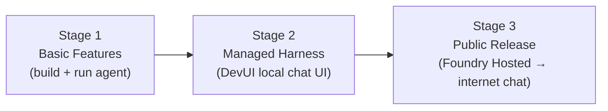
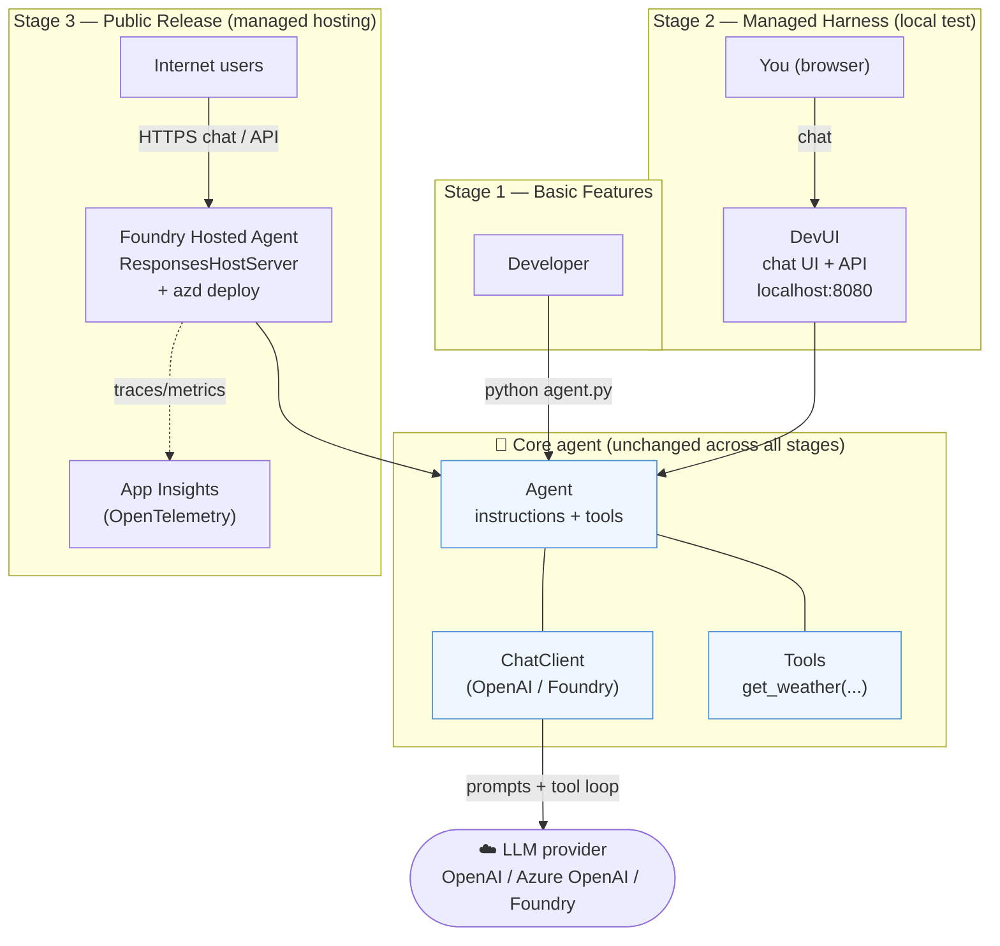
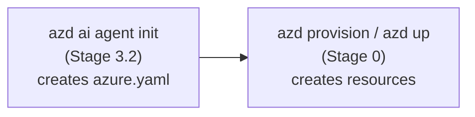
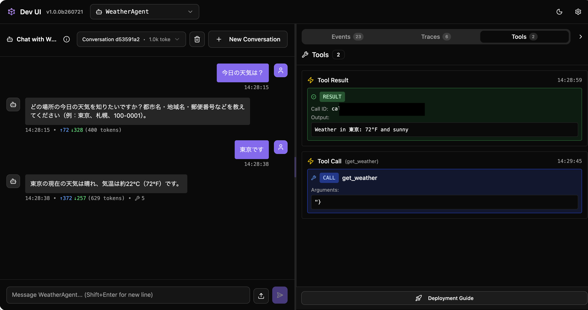
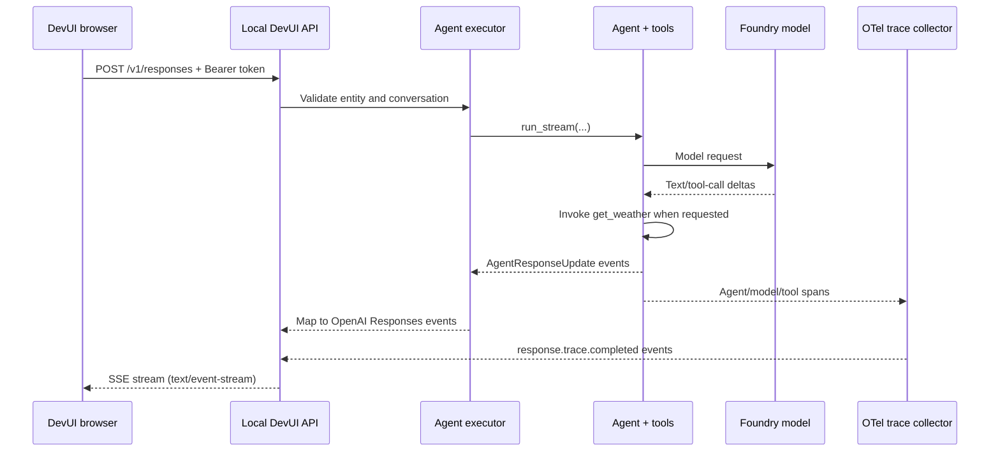

# Microsoft Agent Framework — Custom Hands-On
---

## Part 1 — Overview of Agent Framework

**Microsoft Agent Framework (MAF)** is an open, multi-language (Python + .NET) framework for building **production-grade AI agents and multi-agent workflows**. It gives you one consistent way to build, orchestrate, and operate agents while staying free to swap LLM providers.

| Concept | What it is | In this hands-on |
|---|---|---|
| **ChatClient** | The connection to an LLM provider. | `OpenAIChatClient` or `FoundryChatClient` |
| **Agent** | A ChatClient + instructions + optional tools. The unit you run. | `Agent(...)` |
| **Tools** | Plain Python functions the agent can call. | `get_weather(...)` |
| **DevUI** | A local, interactive **chat UI + API server** to test agents. *This is the "managed harness" for local testing.* | `serve(...)` → `http://localhost:8080` |
| **Foundry Hosted Agents** | **Managed cloud hosting** — deploy your agent so it's reachable over the internet. | `azd ai agent ...` |
| **Workflows** | Graph-based multi-agent orchestration (sequential, concurrent, handoff, group). | (out of scope here) |

### The "Harness" perspective

A **harness** is the runtime scaffolding *around* the model that turns a raw LLM call into a dependable, operable agent. 
The model only predicts text; the harness is everything that makes it *run*: it feeds in instructions and history, executes the tool-call loop, manages state/threads, enforces policy, emits telemetry, and exposes the agent through an interface (local UI, API, or hosted endpoint). 
A useful way to see it: **model = the brain, harness = the body and nervous system**.

Agent Framework *is* a harness — a layered one. 
Each layer is an independent, swappable piece, so you can start with the minimum and add layers as you go from prototype to production:

| Harness responsibility | What it means | How Agent Framework covers it |
|---|---|---|
| **Model access** | Talk to an LLM, stay provider-agnostic | `ChatClient` abstraction — swap providers without rewriting the agent |
| **Agent loop** | Prompt + tool-calling loop until a final answer | `Agent` runs the reason→call-tool→observe loop for you |
| **Tools** | Give the agent capabilities beyond text | Plain Python functions, MCP tools, and provider/hosted tools |
| **State & memory** | Conversation history, threads, long-term memory | Threads, history providers, and memory integrations (e.g. Foundry Memory, Redis, Mem0) |
| **Policy & control** | Guardrails, human-in-the-loop, request/response shaping | Middleware pipeline, user-approval, filtering |
| **Orchestration** | Coordinate multiple agents/steps reliably | Workflows (sequential, concurrent, handoff, group) with checkpointing & durability |
| **Test harness** | Exercise the agent interactively before shipping | **DevUI** — local chat UI + OpenAI-compatible API server |
| **Hosting harness** | Run the agent as a managed, internet-reachable service | **Foundry Hosted Agents** (`ResponsesHostServer` + `azd ai agent …`) |
| **Observability** | See what the agent did and why | Built-in OpenTelemetry tracing/metrics end-to-end |

**How this hands-on exercises the harness:** you start with the *inner* harness (ChatClient + Agent loop + tools in Stage 1), attach a *test* harness (DevUI in Stage 2), then graduate to the *hosting* harness (Foundry Hosted Agents in Stage 3). Same agent object flows through all three — only the surrounding harness layer changes.

The journey below maps directly to your request:



### Overall architecture of this hands-on

The same **Agent** object (ChatClient + instructions + tools) is the core throughout. Only the **harness surface** around it changes as you move from local code, to a local test UI, to managed internet hosting.



**Read it as three concentric harness layers around one agent:**

1. **Inner harness (Stage 1)** — `ChatClient` + `Agent` loop + tools; invoked directly from Python.
2. **Test harness (Stage 2)** — DevUI wraps the same agent in a local chat UI + OpenAI-compatible API for interactive testing.
3. **Hosting harness (Stage 3)** — `ResponsesHostServer` + `azd` publish the same agent as a managed, internet-reachable service with built-in observability.
4. **Observation harness (Stage 4)** — `configure_otel_providers()` emits OpenTelemetry traces, logs, and metrics for the same agent, from local console to a cloud APM (App Insights) — cutting across all layers above.

---

## Stage 0 — Set up Azure resources (Foundry + model)

**Goal:** create the Azure resources the agent needs — a **Foundry project** and a **model deployment** (plus Application Insights and a container registry used later for hosting).

> Skip this stage if you're using **OpenAI** (Option A in Stage 1.2) and don't plan to deploy to Foundry. It's required for the Azure/Foundry option and for Stage 3.

Pick **one** path.

### Option A — `azd` (simplest, recommended)

> `azd provision` / `azd up` require an **azd project** (an `azure.yaml`) to exist first — otherwise you'll see `ERROR: no project exists; to create a new project, run azd init`. Create it with `azd ai agent init` (this is Stage 3.2) **before** provisioning.

**Why the order matters:** `azd` is project-based — every `azd provision` / `azd up` command reads `azure.yaml` to know what to build. That file doesn't exist in an empty folder; it's generated by the Stage 3.2 `init` step. So run `init` first to scaffold the project, *then* provision:



```bash
az login

# Just the resources:
azd provision
# Creates: resource group, Foundry instance + project, a model deployment,
#          Application Insights, and a container registry.

# ...or provision AND deploy the agent in one shot (revisit after Stage 3.2):
azd up
```

### Option B — Bicep (explicit, reviewable infrastructure-as-code)

Use this when you want the Foundry resources defined in source control. Create `infra/foundry.bicep`:

```bicep
// infra/foundry.bicep
@description('Azure region')
param location string = resourceGroup().location
@description('Base name for the resources')
param baseName string = 'mafhandson'
@description('Model + version to deploy')
param modelName string = 'gpt-4.1-mini'
param modelVersion string = '2025-04-14'

// Azure AI Foundry account (Cognitive Services, kind = AIServices)
resource account 'Microsoft.CognitiveServices/accounts@2025-06-01' = {
  name: '${baseName}-foundry'
  location: location
  kind: 'AIServices'
  sku: { name: 'S0' }
  identity: { type: 'SystemAssigned' }
  properties: {
    allowProjectManagement: true          // enables Foundry projects
    customSubDomainName: '${baseName}-foundry'
    publicNetworkAccess: 'Enabled'
  }
}

// Foundry project (child of the account)
resource project 'Microsoft.CognitiveServices/accounts/projects@2025-06-01' = {
  parent: account
  name: '${baseName}-project'
  location: location
  identity: { type: 'SystemAssigned' }
  properties: {}
}

// Model deployment
resource modelDeployment 'Microsoft.CognitiveServices/accounts/deployments@2025-06-01' = {
  parent: account
  name: modelName
  sku: { name: 'GlobalStandard', capacity: 50 }
  properties: {
    model: { format: 'OpenAI', name: modelName, version: modelVersion }
  }
}

output FOUNDRY_PROJECT_ENDPOINT string = 'https://${account.name}.services.ai.azure.com/api/projects/${project.name}'
output AZURE_AI_MODEL_DEPLOYMENT_NAME string = modelDeployment.name
```

Deploy it and capture the outputs into the env vars the agent uses:

```bash
az login
az group create -n rg-maf-handson -l eastus2

az deployment group create \
  -g rg-maf-handson \
  -f infra/foundry.bicep

# Read the outputs back into your shell
export FOUNDRY_PROJECT_ENDPOINT=$(az deployment group show -g rg-maf-handson -n foundry \
  --query properties.outputs.FOUNDRY_PROJECT_ENDPOINT.value -o tsv)
export AZURE_AI_MODEL_DEPLOYMENT_NAME=$(az deployment group show -g rg-maf-handson -n foundry \
  --query properties.outputs.AZURE_AI_MODEL_DEPLOYMENT_NAME.value -o tsv)
```

> Tip: `az deployment group create -f infra/foundry.bicep` 

✅ **Checkpoint:** you have a Foundry project + model deployment, and `FOUNDRY_PROJECT_ENDPOINT` / `AZURE_AI_MODEL_DEPLOYMENT_NAME` are set.

---

## Stage 1 — Basic Features: build and run your first agent

**Goal:** a working agent you can call from code.

### 1.1 Set up the environment

```bash
# From anywhere; create a fresh project folder
mkdir maf-handson && cd maf-handson

# Install uv if you don't have it (one-time), then load it into this shell
curl -LsSf https://astral.sh/uv/install.sh | sh
source $HOME/.local/bin/env        # so `uv` is on PATH in the current shell

# Create and activate a fast venv
uv venv .venv
source .venv/bin/activate          # macOS/Linux

uv pip install agent-framework
```

### 1.2 Pick your "chat ID"

The agent talks to an LLM through a **ChatClient**. Pick one.

**Option A — OpenAI (simplest, just an API key):**

```bash
export OPENAI_API_KEY="sk-..."
```

**Option B — Azure OpenAI / Foundry (uses Azure login instead of a key):**

Reuse the resources you created in **Stage 0**. If you provisioned with **`azd`**, pull the values from its environment; if you used the **Bicep** path, you already exported them from the template outputs.

```bash
az login

# If you ran Stage 0 Option A (azd), run these from the folder containing azure.yaml:
export FOUNDRY_PROJECT_ENDPOINT="$(
  azd env get-value FOUNDRY_PROJECT_ENDPOINT
)"

export FOUNDRY_MODEL="$(
  azd env get-value AI_PROJECT_DEPLOYMENTS |
  sed 's/\\"/"/g' |
  jq -r '.[0].name'
)"

# Confirm that both variables are available to the current shell:
echo "$FOUNDRY_PROJECT_ENDPOINT"
echo "$FOUNDRY_MODEL"

# ...or set them by hand (must match what Stage 0 deployed):
# export FOUNDRY_PROJECT_ENDPOINT="https://<account>.services.ai.azure.com/api/projects/<project>"
```

### 1.3 Write the agent — `agent.py`

```python
# agent.py
import asyncio
from agent_framework import Agent
from agent_framework.openai import OpenAIChatClient   # Option A
# from agent_framework.foundry import FoundryChatClient  # Option B
# from azure.identity import AzureCliCredential


def get_weather(location: str) -> str:
    """Get the weather for a location."""
    return f"Weather in {location}: 72°F and sunny"


agent = Agent(
    name="WeatherAgent",
    instructions="You are a friendly assistant. Keep your answers brief.",
    client=OpenAIChatClient(),                 # Option A
    # client=FoundryChatClient(credential=AzureCliCredential()),  # Option B
    tools=[get_weather],
)


async def main():
    print(await agent.run("What's the weather in Seattle?"))


if __name__ == "__main__":
    asyncio.run(main())
```

### 1.4 Run it

```bash
python agent.py
# → The agent calls get_weather and replies with a brief answer.
```

✅ **Checkpoint:** you have a basic agent with a tool, driven by a ChatClient.

---

## Stage 2 — Managed Harness: test in a local chat UI (DevUI)

**Goal:** interact with the same agent through a **browser chat UI** instead of code — the local "test harness".

### 2.1 Install DevUI

```bash
# DevUI is a pre-release sample app
uv pip install agent-framework-devui --pre
```

### 2.2 Launch the chat UI — two lines

Add this to the bottom of `agent.py` (or make a small `run_devui.py`):

```python
# run_devui.py
from agent_framework.devui import serve
from agent import agent          # reuse the agent from Stage 1

# Opens a browser chat UI at http://localhost:8080
serve(
  entities=[agent],
  auto_open=True,
  auth_enabled=True,
  instrumentation_enabled=True,
  mode="developer",
)
```

```bash
# Create a temporary DevUI Bearer token in the current terminal.
# Keep it out of run_devui.py and source control.
export DEVUI_AUTH_TOKEN="$(openssl rand -hex 32)"

# Display it once so you can paste it into the browser's DEV TOKEN field.
echo "$DEVUI_AUTH_TOKEN"

# Optional: confirm it is set without displaying it.
[[ -n "$DEVUI_AUTH_TOKEN" ]] && echo "DevUI token is set"

python run_devui.py
# → Web chat UI: http://localhost:8080
# → OpenAI-compatible API: http://localhost:8080/v1/*
```

Paste the value printed by `echo` into the browser's **DEV TOKEN** field. DevUI then sends it on protected requests as:

```http
Authorization: Bearer <token>
```

`DEVUI_AUTH_TOKEN` exists only in the current terminal session. If you open a new terminal, export a new token before starting DevUI. If you missed the token, stop the server with `Ctrl+C`, run the export and `echo` commands again, and restart `python run_devui.py`.




### 2.3 What DevUI is doing behind the screen

DevUI is more than a static chat page. 
It starts a local FastAPI/Uvicorn server and places an HTTP test harness around the `agent` imported from Stage 1:



The important settings are independent:

| Setting | What it enables |
| --- | --- |
| `auth_enabled=True` | Requires `Authorization: Bearer <DEVUI_AUTH_TOKEN>` on protected local API calls. |
| `mode="developer"` | Enables developer-only APIs such as reload and deployment, and returns detailed errors. It does **not** enable tracing by itself. |
| `instrumentation_enabled=True` | Enables Agent Framework OpenTelemetry instrumentation, including agent, model, and tool spans. It also enables sensitive prompt/tool data for this local developer session. |
| `auto_open=True` | Opens `http://127.0.0.1:8080` after the server starts. |

#### Events vs. OpenTelemetry

| | Events | OTel spans |
| --- | --- | --- |
| Purpose | Live text/tool/status updates | Timing, tokens, status, errors |
| Flow | Agent → events → SSE → browser | Agent → spans → DevUI or OTLP backend |
| Example | `response.output_text.delta` | Model call: `1.8 s`, status: `OK` |

Typical span data includes agent duration, model duration, tool duration, token usage, and status. DevUI also converts completed spans to `response.trace.completed` events so the trace can appear in the browser.

> `instrumentation_enabled=True` enables sensitive-data tracing in the current DevUI implementation. Use it only for development data, and do not enter secrets or production customer content. For a public service, configure exporters and sensitive-data policy explicitly instead of publishing DevUI.

### 2.4 Can DevUI deploy the agent to Azure?

Yes, but there are **two different Azure deployment paths**:

| Path | Target | Best use here |
| --- | --- | --- |
| `azd deploy` from Stage 3 | **Foundry Hosted Agents** using the prepared `azure.yaml` and Responses protocol | **Recommended for this hands-on and public release** |
| DevUI **Azure Deployment** toggle | **Azure Container Apps**; DevUI generates a Dockerfile and streams deployment progress | Optional experiment for directory-discovered agents |

For the recommended Foundry path, stop DevUI, change to the folder containing `azure.yaml`, and deploy the already-provisioned environment:

```bash
cd ../
azd env select afharness
azd deploy
```

> The Container Apps one-click deploy button is unavailable because `serve(entities=[agent])` registers the agent as an **in-memory entity**. Use `azd deploy` above to publish this hands-on to **Foundry Hosted Agents**.

The local `DEVUI_AUTH_TOKEN` protects only your development UI. It is not the authentication mechanism for the deployed Foundry agent.

Chat with your agent in the browser, watch tool calls happen, and (optionally) view traces:

```bash
# From a directory of agents, with telemetry:
devui ./agents --port 8080 --instrumentation
```

> Note: DevUI is a **sample app for development/testing — not for production**. Keep it bound to the default `127.0.0.1`; do not publish the development token or commit it to the repository. For public release, continue to Stage 3.

✅ **Checkpoint:** you can chat with the agent in a local web UI.

---

## Stage 3 — Public Release: managed hosting reachable over the internet

**Goal:** deploy the agent to **Foundry Hosted Agents** so it's a managed service with an internet endpoint (and a Foundry UI to chat with it).

### 3.1 Prerequisites

```bash
# Azure Developer CLI + the AI agent extension
# Install azd: https://learn.microsoft.com/azure/developer/azure-developer-cli/install-azd
azd ext install azure.ai.agents
azd auth login
```

You also need an Azure subscription. `azd` can create the Foundry project + model deployment for you if you don't have them.

### 3.2 Initialize a hosted-agent project (no cloning needed)

```bash
mkdir hosted-agent && cd hosted-agent

# Point azd at the official "basic responses" manifest on GitHub
azd ai agent init -m https://github.com/microsoft/agent-framework/blob/main/python/samples/04-hosting/foundry-hosted-agents/responses/01_basic/agent.manifest.yaml
```

**What `azd ai agent init -m <path-or-URL>` does:** `-m` (`--manifest`) points `azd` at an **`agent.manifest.yaml`** — a declarative **spec file** that describes the hosted agent (its serving `protocol` e.g. `responses`, the `model` to deploy, runtime settings, and required env vars). 
From that manifest `azd` **scaffolds a full deployable project** in the current folder:

| It generates | Purpose |
| --- | --- |
| `azure.yaml` | The azd project file (`infra.provider: microsoft.foundry`) so `azd provision` / `azd up` know what to build |
| `main.py`, `requirements.txt` | Your agent's runnable code + Python deps |
| `agent.manifest.yaml`, `agent.yaml` | Copied locally so you can tweak the model, protocol, and runtime (CPU/memory) |
| `.env.example` | The env vars the agent expects (endpoint, deployment name, …) |

- The value after `-m` can be a **local path** (`./agent.manifest.yaml`) or a **URL** (the GitHub raw/blob link above). A URL just pulls the official sample so you don't have to clone the repo.
- After `init`, you own the files locally — edit them, then `azd provision` (create resources) and `azd deploy` (ship code). Omit `-m` to start from azd's default template instead of a specific manifest.

This scaffolds a project whose agent looks like this (a `ResponsesHostServer` wraps your agent for the managed protocol). The generated stub is a bare "friendly assistant" — swap it for something with personality **and real tool calling** so the hosted agent actually *does* things:

```python
# main.py (generated stub, upgraded with personality + tools)
import os
import random
from datetime import datetime
from zoneinfo import ZoneInfo

from agent_framework import Agent
from agent_framework.foundry import FoundryChatClient, ResponsesHostServer
from azure.identity import DefaultAzureCredential
from dotenv import load_dotenv

load_dotenv()


# --- Tools the agent can call ---
def get_weather(location: str) -> str:
    """Get the current weather for a location."""
    conditions = ["sunny", "cloudy", "rainy", "windy", "snowy", "foggy"]
    return f"{location}: {random.randint(-5, 35)}°C and {random.choice(conditions)}"


def get_local_time(timezone: str = "UTC") -> str:
    """Get the current local time for an IANA timezone, e.g. 'Asia/Tokyo'."""
    try:
        now = datetime.now(ZoneInfo(timezone))
    except Exception:
        return f"Unknown timezone '{timezone}'. Try 'Asia/Tokyo' or 'America/New_York'."
    return now.strftime("%A %H:%M") + f" ({timezone})"


def suggest_activity(location: str, weather: str) -> str:
    """Suggest something fun to do given a location and its weather."""
    indoor = ["visit a cozy museum", "hunt for the best ramen", "catch a movie"]
    outdoor = ["take a scenic walk", "rent a bike", "find a rooftop view"]
    picks = indoor if any(w in weather.lower() for w in ("rain", "snow", "fog")) else outdoor
    return f"In {location}, you could {random.choice(picks)}."


def main():
    client = FoundryChatClient(
        project_endpoint=os.environ["FOUNDRY_PROJECT_ENDPOINT"],
        model=os.environ["AZURE_AI_MODEL_DEPLOYMENT_NAME"],
        credential=DefaultAzureCredential(),
    )
    agent = Agent(
        name="Wanderbot",
        client=client,
        instructions=(
            "You are Wanderbot, a witty, upbeat travel buddy who loves planning "
            "spontaneous adventures. Use your tools to check the weather and local "
            "time, then suggest a fun activity. Keep replies short, playful, and "
            "sprinkle in the occasional emoji."
        ),
        tools=[get_weather, get_local_time, suggest_activity],
        default_options={"store": False},  # history handled by the host
    )
    ResponsesHostServer(agent).run()

if __name__ == "__main__":
    main()
```

> **Tool calling in one line:** just pass `tools=[...]` a list of plain Python functions. The agent reads each function's name, type hints, and docstring to decide when to call it — no schema wiring needed. Try asking *"I'm in Tokyo, what should I do right now?"* and watch it chain `get_weather` → `get_local_time` → `suggest_activity`.

### 3.3 Provision Azure resources (skip if you already have a Foundry project)

Create the Foundry project + model deployment using **Stage 0** (either `azd provision` / `azd up`, or the Bicep template). If you already ran Stage 0, you can skip ahead.

```bash
azd provision
# Creates: resource group, Foundry instance + project, a model deployment,
#          Application Insights, and a container registry.
```
>
> ```bash
> # When fixing **azd environment**
> azd env new afharness    
> azd provision
> ```

### 3.4 Run the managed host locally first (sanity check)

Pull the values that `azd provision` (Stage 3.3) already stored in the azd environment instead of typing them by hand.

> **Run from the azd project folder** — the one containing `azure.yaml` (e.g. `hosted-agent/agent-framework-agent-basic-responsesharnessagent/`). From anywhere else, `azd env get-value` prints `ERROR: no project exists…` instead of JSON, and the pipeline fails with `jq: parse error: Invalid numeric literal`.

```bash
# Move into the folder that holds azure.yaml (adjust the path to yours)
cd hosted-agent/agent-framework-agent-basic-responsesharnessagent

# Read the endpoint straight from the azd environment
export FOUNDRY_PROJECT_ENDPOINT="$(azd env get-value FOUNDRY_PROJECT_ENDPOINT)"

# The deployment name is inside the AI_PROJECT_DEPLOYMENTS JSON array
export AZURE_AI_MODEL_DEPLOYMENT_NAME="$(
  azd env get-value AI_PROJECT_DEPLOYMENTS |
  sed 's/\\"/"/g' |
  jq -r '.[0].name'
)"

# Confirm both are set before starting the host
echo "$FOUNDRY_PROJECT_ENDPOINT"
echo "$AZURE_AI_MODEL_DEPLOYMENT_NAME"

azd ai agent run          # serves on http://localhost:8088

# In another terminal:
azd ai agent invoke --local "Hello!"
# or:
curl -X POST http://localhost:8088/responses \
  -H "Content-Type: application/json" \
  -d '{"input": "Hello!"}'
```

### 3.5 Deploy to the internet (the "public release")

```bash
azd deploy
```

This packages the agent and deploys it to Foundry as a **managed, internet-accessible service**. The host injects `FOUNDRY_PROJECT_ENDPOINT`, `AZURE_AI_MODEL_DEPLOYMENT_NAME`, and `APPLICATIONINSIGHTS_CONNECTION_STRING` at runtime. After deploy you can **chat with the agent in the Foundry UI** and call its endpoint from anywhere.

- Deploy guide: https://learn.microsoft.com/azure/foundry/agents/how-to/deploy-hosted-agent
- Manage deployed agents: https://learn.microsoft.com/azure/foundry/agents/how-to/manage-hosted-agent

✅ **Checkpoint:** your agent is publicly hosted with an internet chat UI/endpoint.


---

## Stage 4 — Observation: see what your agent is doing

**Goal:** turn on **observability** so you can trace every model call, tool call, and token count — locally and in the cloud.

Agent Framework is **natively instrumented** (OpenTelemetry, following the GenAI semantic conventions) and enabled by default. You only decide *where* the telemetry goes. A single call to `configure_otel_providers()` wires up traces, logs, and metrics.

### 4.1 Quickest look — console traces

Add instrumentation to your Stage 1 agent — `observe.py`:

```python
# observe.py
import asyncio
from agent_framework.observability import configure_otel_providers, get_tracer
from opentelemetry.trace import SpanKind
from opentelemetry.trace.span import format_trace_id
from agent import agent           # reuse the agent from Stage 1


async def main():
    # Print traces/logs/metrics without recording prompts, responses, or tool arguments.
    configure_otel_providers(enable_console_exporters=True, enable_sensitive_data=False)

    with get_tracer().start_as_current_span("Scenario: Agent Chat", kind=SpanKind.CLIENT) as span:
        print(f"Trace ID: {format_trace_id(span.get_span_context().trace_id)}")
        print(await agent.run("What's the weather in Seattle?"))


if __name__ == "__main__":
    asyncio.run(main())
```

```bash
python observe.py
# → Spans for the agent run, model call, and get_weather tool call print to the console.
```

### 4.2 Send to a real backend (OTLP)

Point the standard OpenTelemetry env vars at any OTLP-compatible backend (Aspire Dashboard, App Insights, Grafana/Prometheus, etc.) — no code change beyond `configure_otel_providers()`:

```bash
export OTEL_EXPORTER_OTLP_ENDPOINT="http://localhost:4317"   # e.g. local Aspire Dashboard
python observe.py
```

> Tip: for a zero-setup local dashboard, run the **Aspire Dashboard** in Docker, or use the **AI Toolkit for VS Code** tracing view.

### 4.3 Observe inside the harnesses

- **DevUI (Stage 2):** launch with tracing so spans appear in the UI:

  ```bash
  devui ./agents --port 8080 --instrumentation
  ```

- **Foundry Hosted (Stage 3):** Foundry manages the exporters and injects `APPLICATIONINSIGHTS_CONNECTION_STRING`, so deployed agent telemetry flows into **Application Insights** without exporter setup in your code.

### 4.4 OTel for agents: what should you monitor?

OTel has three signals:

| Signal | Agent example | Use it for |
| --- | --- | --- |
| **Trace** | One agent run with child model/tool spans | Debugging the full execution path |
| **Metric** | Latency or tokens aggregated over many runs | Dashboards, trends, and alerts |
| **Log** | Error or business event linked by trace ID | Searching detailed events |

Agent Framework follows the OTel **GenAI semantic conventions** and emits these built-in metrics:

| Metric | Measure and alert on |
| --- | --- |
| `gen_ai.client.operation.duration` | Model latency; chart p50/p95/p99 by provider/model and alert on high p95 |
| `gen_ai.client.token.usage` | Input/output tokens; group by `gen_ai.token.type`, model, and operation |
| `agent_framework.function.invocation.duration` | Tool latency by `agent_framework.function.name` |

A practical production dashboard should also derive or record:

| Agent KPI | Why |
| --- | --- |
| Run count and error rate | Reliability and traffic changes |
| End-to-end agent latency | What the user actually experiences |
| Tool call count, latency, and failures | Detect slow/broken dependencies and agent loops |
| Input/output tokens per run | Capacity and approximate cost trends |
| Time to first token (TTFT) | Perceived streaming responsiveness |
| Task completion / quality score | Operational health is not the same as answer quality; obtain this from Foundry evaluators or a domain-specific evaluator |

Use stable attributes such as `gen_ai.agent.name`, `gen_ai.operation.name`, `gen_ai.provider.name`, `gen_ai.request.model`, `gen_ai.response.model`, and `gen_ai.conversation.id` to filter and correlate telemetry. Avoid high-cardinality metric dimensions such as raw user IDs, prompts, response IDs, or conversation IDs; keep those on traces/logs instead.

**Send a locally run Foundry agent to Application Insights:**

```bash
uv pip install azure-monitor-opentelemetry
```

```python
# Call once during async application startup, before agent.run(...).
await client.configure_azure_monitor(
  enable_sensitive_data=False,
  enable_live_metrics=True,
)
```

`configure_azure_monitor()` retrieves the Application Insights connection string from the Foundry project. Use this for a local Python process; Foundry Hosted Agents manage the exporter after deployment. In Azure Portal, open **Application Insights → Agents (Preview)** to inspect runs, models, tools, errors, and token usage.

> Keep `enable_sensitive_data=False` in production. Turning it on can record prompts, responses, tool arguments, and tool results. Apply access control, retention, sampling, and redaction before collecting customer content. Token usage can be missing when a provider does not return it; treat missing as unavailable, not zero.

**References**

- [Agent Framework observability](https://learn.microsoft.com/agent-framework/agents/observability)
- [Application Insights Agent details](https://learn.microsoft.com/azure/azure-monitor/app/agents-view)
- [Observability in Microsoft Foundry](https://learn.microsoft.com/azure/foundry/concepts/observability)
- [OpenTelemetry GenAI semantic conventions](https://opentelemetry.io/docs/specs/semconv/gen-ai/)
- [Repository observability samples](../python/samples/02-agents/observability/README.md)

✅ **Checkpoint:** you can see traces, tool calls, and token usage for the same agent, from local console to cloud APM.

---

## Recap

| Your words | What you did | Key command |
|---|---|---|
| "Testing basic features" | Built an agent + tool via a ChatClient | `python agent.py` |
| "easy chat ID / chat UI" | Ran it in a local browser chat UI | `serve(entities=[agent])` |
| "Managed harness" | DevUI (local) + Foundry hosting (cloud) | `devui` / `azd ai agent run` |
| "Public / internet release" | Deployed to managed Foundry hosting | `azd deploy` |
| "Observation" | Traced model/tool calls & tokens (local → cloud APM) | `configure_otel_providers()` / `devui --instrumentation` |

## Where to go next
- Add more **tools** and **middleware** to the agent.
- Explore **Workflows** for multi-agent orchestration: `python/samples/03-workflows/`.
- Turn on **observability** (OpenTelemetry) end-to-end.
- Reference samples: `python/samples/04-hosting/foundry-hosted-agents/`.
