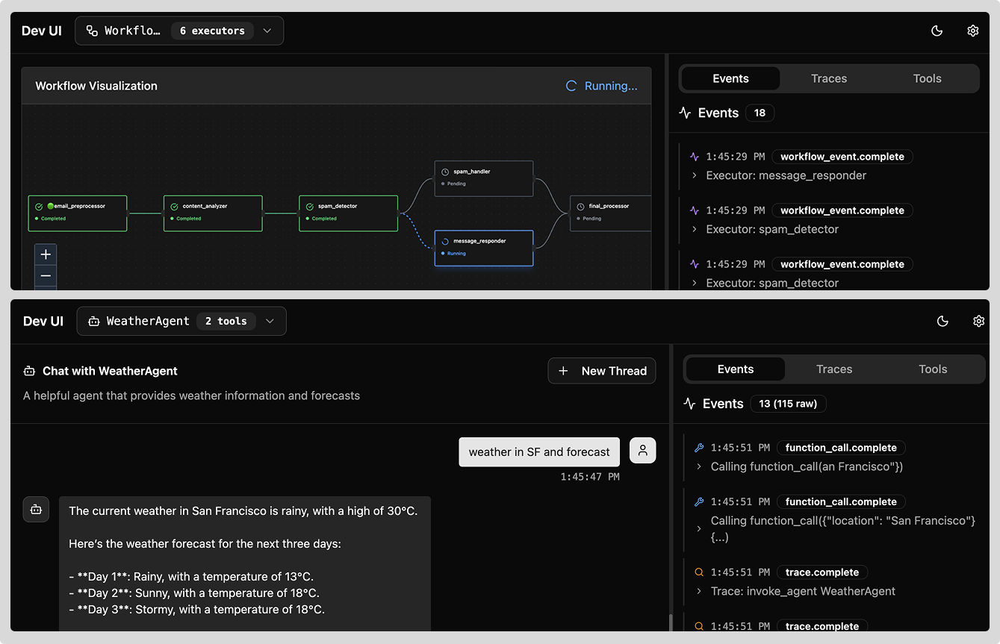

# DevUI - Agent Framework Debug Interface

A lightweight, standalone debug interface for Agent Framework supporting both **directory-based discovery** and **in-memory agent registration**.



## Overview

DevUI is a lightweight debug interface for Agent Framework agents and workflows. It follows the principle of being **"just another view to test and observe agents - not a product"**. DevUI leverages all existing Agent Framework capabilities without reimplementing any core functionality.

**What it does**: Single function call to start debugging with a clean web UI. Supports both programmatic agent registration and file-based project discovery with native streaming execution.

## Why DevUI?

**Developer Experience**: Make it effortless to test, debug, and showcase agents. DevUI bridges the gap between code and validation with immediate visual feedback and hot reload for rapid iteration.

**Competitive Edge**: Robust local development experience has been key to AutoGen's success. DevUI gives Agent Framework the same advantage with instant feedback and control developers expect.

**Zero Friction**: Single function call to get started - `debug(agents={"my_agent": agent})` with flexible discovery for both programmatic and file-based agent creation.

## Installation

```bash
# Install the standalone package
pip install devui

# Or install from source (development)
cd packages/devui
pip install -e .
```

## Quick Start

### 🎯 In-Memory Mode (Recommended)

Perfect for debugging agents created in your Python code:

```python
from agent_framework import ChatAgent
from agent_framework.openai import OpenAIChatClient
from devui import debug

# Create your agent
agent = ChatAgent(
    name="WeatherAgent",
    chat_client=OpenAIChatClient(),
    tools=[get_weather]
)

# Launch debug UI - that's it!
debug(agents={"weather": agent}, auto_open=True)
# → Opens browser to http://localhost:8080
```

### 📁 Directory Mode (ADK-style)

For existing agent projects or team development:

```bash
# Command line
devui ./agents --port 8080

# Or programmatically
from devui import debug
debug(agents_dir="./agents", auto_open=True)
```

### 🔀 Hybrid Mode

Combine both approaches:

```python
from devui import DebugServer

server = DebugServer(agents_dir="./agents", port=8080)
server.register_agent("runtime_agent", my_dynamic_agent)
server.start(auto_open=True)
```

## API Reference

### Main Functions

```python
from devui import debug, DebugServer

# Convenience function - most common usage
debug(
    agents: Optional[Dict[str, AgentProtocol]] = None,
    workflows: Optional[Dict[str, Workflow]] = None,
    agents_dir: Optional[str] = None,
    port: int = 8080,
    auto_open: bool = False,
    host: str = "127.0.0.1"
) -> None

# Advanced programmatic control
class DebugServer:
    def __init__(self, agents_dir: Optional[str] = None, port: int = 8080)
    def register_agent(self, agent_id: str, agent: AgentProtocol) -> None
    def register_workflow(self, workflow_id: str, workflow: Workflow) -> None
    def start(self, auto_open: bool = False) -> None
    def get_app(self) -> FastAPI  # For embedding in larger apps
```

### Command Line Interface

```bash
# Launch with directory scanning
devui [directory] [options]

# Options:
#   --port, -p     Port number (default: 8080)
#   --host         Host to bind to (default: 127.0.0.1)
#   --no-open      Don't auto-open browser

# Examples:
devui ./agents --port 3000
devui . --no-open
```

## Directory Structure Convention

For directory-based discovery, organize agents like this:

```
agents/
├── weather_agent/                     # Agent directory
│   ├── __init__.py                    # Must expose: agent = ChatAgent(...)
│   ├── agent.py                       # Agent implementation
│   └── .env                           # Agent-specific environment (optional)
├── spam_workflow/                     # Workflow directory
│   ├── __init__.py                    # Must expose: workflow = WorkflowBuilder()...
│   ├── workflow.py                    # Workflow implementation
│   └── .env                           # Workflow-specific environment (optional)
└── .env                               # Global environment (optional)
```

**Key Requirements:**

- Each directory must have `__init__.py` that exports `agent` or `workflow`
- Agent/workflow name is automatically derived from the directory name
- Environment files are loaded automatically if present in `.env` files.

## Examples

The `examples/` directory contains complete working examples:

### Weather Agent (Directory Mode)

```python
# examples/sample_agents/weather_agent/agent.py
from agent_framework import ChatAgent
from agent_framework.openai import OpenAIChatClient

def get_weather(location: str) -> str:
    return f"Weather in {location}: 72°F and sunny"

agent = ChatAgent(
    name="WeatherAgent",
    description="Provides weather information",
    chat_client=OpenAIChatClient(),
    tools=[get_weather]
)
```

### In-Memory Registration

```python
# examples/in_memory_mode.py
from devui import debug

# Create and register agents on-the-fly
debug(agents={"weather": weather_agent}, auto_open=True)
```

### Workflow Example

```python
# examples/sample_agents/spam_workflow/workflow.py
from agent_framework.workflow import WorkflowBuilder

workflow = (
    WorkflowBuilder()
    .set_start_executor(spam_detector)
    .add_switch_case_edge_group(spam_detector, [...])
    .build()
)
```

## HTTP API Endpoints

DevUI exposes a REST API for integration and custom frontends:

### Discovery

```http
GET /agents                 # List all discovered agents & workflows
GET /agents/{id}/info       # Get detailed agent metadata
GET /health                 # Health check endpoint
```

### Execution

```http
POST /agents/{id}/run/stream    # Execute agent with Server-Sent Events
POST /workflows/{id}/run/stream # Execute workflow with streaming
```

### Session Management

```http
POST /agents/{id}/threads       # Create new conversation thread
GET  /agents/{id}/threads       # List agent's threads
GET  /threads/{id}/messages     # Get thread message history
```

Example streaming execution:

```bash
curl -X POST http://localhost:8080/agents/weather/run/stream \
  -H "Content-Type: application/json" \
  -d '{"message": "What'\''s the weather in Seattle?"}' \
  --no-buffer
```

## Architecture

```
┌─────────────────────┐    HTTP/SSE    ┌─────────────────────┐
│   Web UI            │◄──────────────►│   DevUI Server      │
│   (Browser)         │                │   (FastAPI)         │
└─────────────────────┘                └─────────────────────┘
                                               │
                                               ▼
                                       ┌─────────────────────┐
                                       │  Agent Registry     │
                                       │  ┌───────────────┐  │
                                       │  │ Directory     │  │
                                       │  │ Scanner       │  │
                                       │  └───────────────┘  │
                                       │  ┌───────────────┐  │
                                       │  │ In-Memory     │  │
                                       │  │ Store         │  │
                                       │  └───────────────┘  │
                                       └─────────────────────┘
                                               │
                                               ▼
                                       ┌─────────────────────┐
                                       │ Agent Framework     │
                                       │ Native Execution    │
                                       └─────────────────────┘
```

## Advanced Usage

### Embedding in Existing Applications

```python
from fastapi import FastAPI
from devui import DebugServer

# Your existing FastAPI app
app = FastAPI()

# Add devui as a sub-application
debug_server = DebugServer()
debug_server.register_agent("my_agent", agent)
debug_app = debug_server.get_app()

app.mount("/debug", debug_app)
# → Debug UI available at /debug/
```

### Custom Environment Setup

```python
import os
from dotenv import load_dotenv

# Load environment for agents
load_dotenv()  # Global .env
load_dotenv("./agents/.env")  # Agent-specific

# Then start devui normally
debug(agents_dir="./agents")
```

### Hot Reload Development

DevUI automatically reloads directory-based agents when files change:

```bash
# Start with auto-reload (development mode)
devui ./agents --port 8080

# Edit agent.py files → automatically reloaded
# Edit .env files → automatically reloaded
# Add new agent directories → automatically discovered
```

## Troubleshooting

### Common Issues

**Agent not appearing in UI:**

- Check that `__init__.py` exports `agent` or `workflow`
- Verify no import errors in agent modules
- Check server logs for discovery errors

**Import errors in directory mode:**

- Ensure all dependencies are installed in current environment
- Check that Agent Framework is available
- Verify Python path includes agent directories

**Streaming not working:**

- Check that your agent uses supported streaming methods
- Verify OpenAI API keys are set correctly
- Check browser developer tools for SSE connection issues

### Debug Logging

```python
import logging
logging.basicConfig(level=logging.DEBUG)

from devui import debug
debug(agents={"my_agent": agent})
# → Detailed logs of discovery, registration, execution
```

## Contributing

DevUI is designed to be minimal and maintainable. When contributing:

1. **Keep it simple**: Prefer Agent Framework native behaviors
2. **Minimal dependencies**: Avoid heavy libraries
3. **Type safety**: Use proper type hints and validation
4. **Examples first**: Add working examples for new features

See `CONTRIBUTING.md` for development setup and guidelines.

## License

MIT - see LICENSE file for details.
