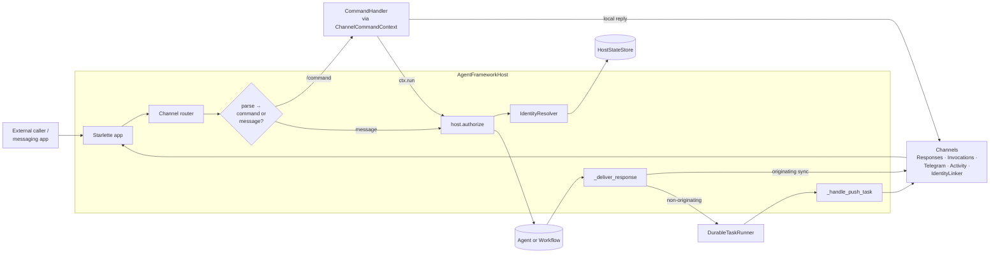

# agent-framework-hosting

Multi-channel hosting for Microsoft Agent Framework agents.

`agent-framework-hosting` lets you serve a single agent (or workflow)
target through one or more **channels** — pluggable adapters that
expose the target over different transports. The result is a single
Starlette ASGI application you can host anywhere (local Hypercorn,
Azure Container Apps, Foundry Hosted Agents, …).

The base package contains only the channel-neutral plumbing:

- `AgentFrameworkHost` — the Starlette host
- `Channel` / `ChannelPush` — the channel protocols
- `ChannelRequest` / `ChannelSession` / `ChannelIdentity` / `ResponseTarget`
  — the request envelope and routing primitives
- `ChannelContext` / `ChannelContribution` / `ChannelCommand` — the
  channel-side hooks for invoking the target and contributing routes,
  commands, and lifecycle callbacks
- `ChannelRunHook` / `ChannelStreamTransformHook` — the per-request
  customization seams
- `DurableTaskRunner` + `InProcessTaskRunner` — the seam used to
  dispatch non-originating push fan-out; the in-process runner is the
  default. Plug in a durable adapter (e.g.
  `agent-framework-hosting-durabletask`) for `runtime_mode="ephemeral"`
  deployments.

Concrete channels live in their own packages so you only install what
you use:

| Package | Transport |
|---|---|
| `agent-framework-hosting-responses` | OpenAI Responses API |
| `agent-framework-hosting-invocations` | Foundry-native invocation envelope |
| `agent-framework-hosting-telegram` | Telegram Bot API |
| `agent-framework-hosting-activity-protocol` | Bot Framework Activity Protocol (Teams, Direct Line, Web Chat, …) |
| `agent-framework-hosting-teams` | Microsoft Teams (Teams SDK) |
| `agent-framework-hosting-entra` | Entra (OAuth) identity-link sidecar |

## Architecture



For a richer set of flow diagrams — identity linking, multi-channel
fan-out, server-side relays, background runs, durable-runner codec
envelopes, echo idempotency, workflow targets — see the
[Python hosting spec](https://github.com/microsoft/agent-framework/blob/main/docs/specs/002-python-hosting-channels.md).

## Install

```bash
pip install agent-framework-hosting agent-framework-hosting-responses
# or with uvicorn pre-installed for the demo `host.serve(...)` helper
pip install "agent-framework-hosting[serve]" agent-framework-hosting-responses
# add the [disk] extra to opt in to on-disk persistence (see below)
pip install "agent-framework-hosting[disk]"
```

## Quickstart

```python
from agent_framework.openai import OpenAIChatClient
from agent_framework_hosting import AgentFrameworkHost, Channel

agent = OpenAIChatClient().as_agent(name="Assistant")

# Add channels from sibling packages, e.g. `agent-framework-hosting-responses`
# exposes a `ResponsesChannel` that serves the OpenAI Responses API.
channels: list[Channel] = []

host = AgentFrameworkHost(target=agent, channels=channels)
host.serve(port=8000)
```

See the [hosting samples](https://github.com/microsoft/agent-framework/tree/main/python/samples/04-hosting/af-hosting)
for richer multi-channel apps (Telegram + Teams + Responses fan-out,
identity linking, `ResponseTarget` routing, etc.).

## Optional disk persistence (`state_dir`)

By default the host keeps everything in memory: the durable-task runner's
pending push queue, the per-isolation-key session aliases, the active-channel
map, and the per-channel `ChannelIdentity` map. That is the right shape for
**ephemeral** runtimes (Foundry Hosted Agents et al.) where the host is
restarted per request and persistence lives behind a service like the Foundry
response store, and for short-lived local dev.

For **long-running** deployments (an always-on container, a local dev server
you restart often, a single-VM bot) opt in to disk persistence by passing
`state_dir` to `AgentFrameworkHost`. It uses [`diskcache`](https://grantjenks.com/docs/diskcache/)
(installed via the `[disk]` extra) and an OS-level advisory file lock so two
hosts pointed at the same directory can't double-execute scheduled pushes.

```python
from agent_framework_hosting import AgentFrameworkHost

# Single path → host auto-creates `runner/` and `sessions/` subfolders.
host = AgentFrameworkHost(
    target=agent,
    channels=channels,
    state_dir="./.host-state",
)

# Or route components to different roots — use the HostStatePaths TypedDict
# (or a plain dict with the same keys) for editor autocomplete on the keys.
from agent_framework_hosting import HostStatePaths

host = AgentFrameworkHost(
    target=agent,
    channels=channels,
    state_dir=HostStatePaths(runner="/var/lib/myapp/tasks", sessions="/var/lib/myapp/state"),
)
```

What survives a restart:

- **Pending durable-task records** — scheduled but not-yet-completed push
  deliveries replay on the next host startup via `runner.resume()`. Records
  that crashed mid-attempt resume with their already-consumed retry budget.
- **`_session_aliases`** — per-isolation-key session-id rewrites (via the
  reset-session command).
- **`_active`** — the most recently active channel for each isolation key
  (consumed by `ResponseTarget.active`).
- **`_identities`** — channel-native `ChannelIdentity` rows used by
  `ResponseTarget.channels([...])` / `.all_linked` fan-out.

What doesn't:

- Live `AgentSession` objects (rehydrated lazily by the history provider on the
  next turn).
- The `ContinuationToken` store (separate concern, plug in your own).

Unpicklable push payloads raise `PushPayloadNotPicklable` *eagerly* from
`schedule()` so issues surface at the call site, not on the next restart.

