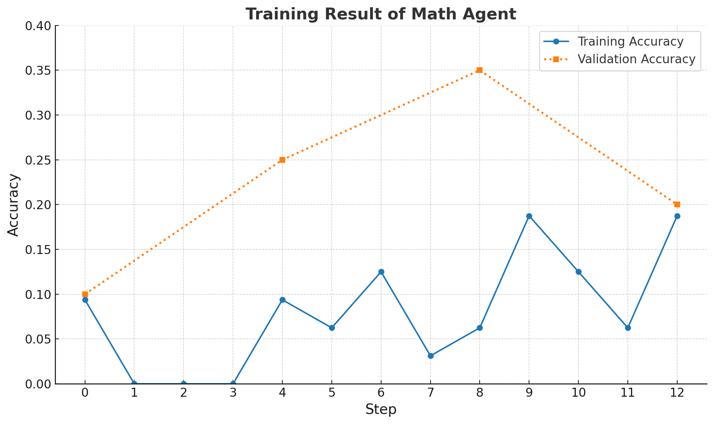

# Agent Framework Lab - Agent Framework x Agent Lightning

**Agent Framework Lab Lightning** is a specialized package that integrates Microsoft's [Agent Framework](https://github.com/microsoft/agent-framework) with [Agent Lightning](https://github.com/microsoft/agent-lightning) to provide reinforcement learning (RL) training capabilities for AI agents.

This package enables you to train and fine-tune agents using advanced RL algorithms like those provided in VERL (e.g., GRPO, PPO, Reinforce++) with support for distributed training, multi-GPU setups, and comprehensive monitoring. It also supports complex multi-turn agent interactions during training and other optimization techniques like prompt optimization. See [Agent-lightning documentation](https://microsoft.github.io/agent-lightning/stable/) for details.

## Installation

```bash
pip install agent-framework-lab-lightning
```

Install with Optional Dependencies:

```bash
# For math-related training
pip install agent-framework-lab-lightning[math]

# For tau2 benchmarking
pip install agent-framework-lab-lightning[tau2]
```

To prepare for RL training, you also need to install dependencies like PyTorch, Ray, vLLM, etc. See [this instruction](https://github.com/microsoft/agent-lightning) for more details.

## Usage Patterns

The most basic usage pattern is as follows:

1. **Prepare your dataset** as a list of samples (typically a list of dictionaries)
2. **Create an agent function** that processes samples and returns evaluation scores
3. **Decorate with `@agentlightning.rollout`** to enable training
4. **Configure and run training** with the `agentlightning.Trainer` class

## Example 101: Train Math Agent

The example trains an agent that uses a MCP calculator tool to solve math problems. It needs a minimum of 40GB GPU memory. To run the example:

```bash
cd samples
# Run the ray cluster
ray start --head --dashboard-host=0.0.0.0
# Run the training script
python train_math_agent.py
```

To debug the agent used in the example, you can run the script with the `--debug` flag:

### Explanation

At a high level, the example demonstrates a clear usage pattern of this package.

```python
import asyncio
from typing import TypedDict
from agent_framework.lab.lightning import init
from agent_framework.openai import OpenAIChatClient
from agent_framework import ChatAgent, MCPStdioTool
from agentlightning import rollout, Trainer, LLM, Dataset
from agentlightning.algorithm.verl import VERL

class MathProblem(TypedDict):
    question: str
    result: str

@rollout
async def math_agent(task: MathProblem, llm: LLM) -> float:
    """A function that solves a math problem and returns the evaluation score."""
    async with (
        MCPStdioTool(name="calculator", command="uvx", args=["mcp-server-calculator"]) as mcp_server,
        ChatAgent(
            chat_client=OpenAIChatClient(
                ai_model_id=llm.model,
                api_key="your-api-key",
                base_url=llm.endpoint,
            ),
            name="MathAgent",
            instructions="Solve the math problem and output answer after ###",
            temperature=llm.sampling_parameters.get("temperature", 0.0),
        ) as agent,
    ):
        result = await agent.run(task["question"], tools=mcp_server)
        # Your evaluation logic here...
        return evaluation_score

# Training configuration
config = {
    "data": {"train_batch_size": 8},
    "trainer": {"total_epochs": 2, "n_gpus_per_node": 1},
    # ... additional config
}


# This init basically tells agent-framework to send the telemetry data to the observability backend in agent-lightning
init()

trainer = Trainer(algorithm=VERL(config), n_workers=2)
trainer.fit(math_agent, train_dataset, val_data=val_dataset)
```

The training curve with Qwen2.5-1.5B-Instruct is as follows:



## Example 201: Train Tau2 Agent

This is an advanced example showing training on complex multi-agent scenarios using the Tau2 benchmark. It demonstrates a multi-agent setup with an assistant agent and a user simulator agent (and training the assistant agent while fixing the user simulator agent). It incorporates a multi-step workflow with tool usage and complex evaluation metrics. We currently train on the airline domain with 50% training data and 50% validation data.

Please make sure you have read [agent-lightning-lab-tau2](../tau2/README.md) and follow the setup instructions before running this example.

To run the example:

```bash
# Set required environment variables
export TAU2_DATA_DIR="/path/to/tau2/data"

# Used for user simulator and LLM judge
export OPENAI_BASE_URL="your-endpoint"
export OPENAI_API_KEY="your-key"

# Used for tracking on Weights & Biases
export WANDB_API_KEY="your-key"

# Train the tau2 agent
cd samples
python samples/train_tau2_agent.py

# Debug mode
python samples/train_tau2_agent.py --debug
```

The usage of agent-lightning in this example is more advanced than the math example. For instance, it is based on the `LitAgent` class rather than the `@rollout` decorator. It also involves concepts like resources and agent filtering. We recommend to read [Agent-lightning documentation](https://microsoft.github.io/agent-lightning/stable/) to learn more.

*Result TBD*

## Troubleshooting

### Ray Connection Issues

If you encounter Ray startup problems:

```bash
# Stop existing Ray processes
ray stop

# Start Ray with debugging enabled
env RAY_DEBUG=legacy HYDRA_FULL_ERROR=1 VLLM_USE_V1=1 ray start --head --dashboard-host=0.0.0.0
```

**Important**: Run Ray commands in the same directory as your training script. Set environment variables (`WANDB_API_KEY`, `HF_TOKEN`) before starting Ray if needed.

### GPU Memory Issues

1. **Reduce `gpu_memory_utilization`** to <0.8
2. **Enable FSDP offloading**:
   ```python
   "fsdp_config": {
       "param_offload": True,
       "optimizer_offload": True,
   }
   ```
3. **Decrease batch sizes**:
   - `train_batch_size`
   - `ppo_mini_batch_size`
   - `log_prob_micro_batch_size_per_gpu`

### Agent Debugging

Always test your agent before training:

```python
# Use debug mode to validate agent behavior
python your_training_script.py --debug

# Check agent responses and evaluation logic
# Ensure proper tool integration and result extraction
```

## Contributing

This package is part of the Microsoft Agent Framework Lab. Please see the main repository for contribution guidelines.

## License

This project is licensed under the MIT License - see the LICENSE file for details.
