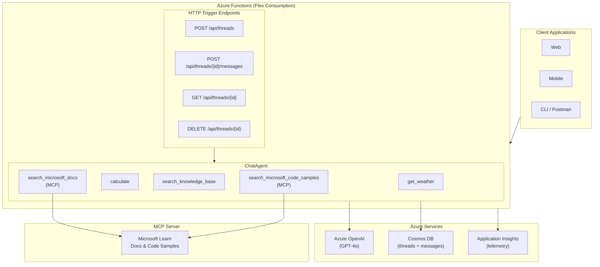

# Enterprise Chat Agent — Design Document

## Overview

This document describes the architecture and design decisions for a **production-ready Chat API** built with Microsoft Agent Framework, Azure Functions, and Cosmos DB.

### Goals

1. Demonstrate enterprise patterns: state persistence, observability, and thread-based conversations
2. Showcase **agent autonomy** — the agent decides which tools to invoke at runtime based on conversation context
3. Provide a reference architecture for deploying Agent Framework in production
4. Enable one-command deployment with `azd up`

### References

- **GitHub Issue**: [#2436 - Production Chat API with Azure Functions, Cosmos DB & Agent Framework](https://github.com/microsoft/agent-framework/issues/2436)
- [Create and run a durable agent (Python)](https://learn.microsoft.com/en-us/agent-framework/tutorials/agents/create-and-run-durable-agent)
- [Agent Framework Tools](https://learn.microsoft.com/en-us/agent-framework/concepts/tools)
- [Multi-agent Reference Architecture](https://learn.microsoft.com/en-us/azure/architecture/ai-ml/architecture/build-multi-agent-framework-solution)
- [Well-Architected AI Agents](https://learn.microsoft.com/en-us/azure/well-architected/service-guides/ai-agent-architecture)

---

## Architecture



### Components

| Component | Technology | Purpose |
|-----------|------------|---------|
| API Layer | Azure Functions (Flex Consumption) | Serverless HTTP endpoints |
| Agent | Microsoft Agent Framework ChatAgent | Conversation orchestration with tools |
| LLM | Azure OpenAI (GPT-4o) | Language model for responses |
| Message Storage | Cosmos DB + CosmosHistoryProvider | Automatic conversation persistence |
| Thread Metadata | Cosmos DB + CosmosConversationStore | Thread lifecycle management |
| External Knowledge | MCP (Microsoft Learn) | Official documentation access |
| Observability | OpenTelemetry + Application Insights | Tracing and monitoring |

---

## Message Processing Flow

```text
User Request
    ↓
POST /api/threads/{thread_id}/messages
    ↓
1. Validate thread exists (Cosmos DB lookup)
    ↓
2. agent.run(content, session=AgentSession(thread_id))
    ↓
   ┌─────────────────────────────────────────┐
   │  CosmosHistoryProvider (automatic):     │
   │  • Load previous messages from Cosmos   │
   │  • Add to agent context                 │
   └─────────────────────────────────────────┘
    ↓
3. Agent analyzes context and decides which tools to use
    ↓
4. Agent automatically calls tools as needed:
   • get_weather("Seattle")
   • calculate("85 * 0.15")
   • search_microsoft_docs("Azure Functions")
    ↓
   ┌─────────────────────────────────────────┐
   │  CosmosHistoryProvider (automatic):     │
   │  • Store user message to Cosmos         │
   │  • Store assistant response to Cosmos   │
   └─────────────────────────────────────────┘
    ↓
5. Return response to user
```

---

## Key Design Decisions

### 1. Runtime Tool Selection (Agent Autonomy)

The agent is configured with multiple tools but **decides at runtime** which tool(s) to invoke based on user intent. Tools are registered once; the agent autonomously selects which to use for each request.

| Tool | Purpose | Source |
|------|---------|--------|
| `get_weather` | Weather information | Local (simulated) |
| `calculate` | Math expressions | Local (safe AST eval) |
| `search_knowledge_base` | FAQ/KB search | Local (simulated) |
| `microsoft_docs_search` | Microsoft Learn search | MCP Server |
| `microsoft_code_sample_search` | Code sample search | MCP Server |

**Example Interactions:**

| User Query | Tool(s) Called |
|------------|----------------|
| "What's the weather in Tokyo?" | `get_weather("Tokyo")` |
| "What's the weather in Paris and what's 18% tip on €75?" | `get_weather("Paris")` AND `calculate("75 * 0.18")` |
| "How do I configure partition keys in Azure Cosmos DB?" | `search_microsoft_docs("Cosmos DB partition keys")` |
| "Tell me a joke" | (No tools — direct response) |

### 2. Cosmos DB Persistence Strategy

**Two-Container Approach:**

| Container | Purpose | Managed By | Partition Key |
|-----------|---------|------------|---------------|
| `threads` | Thread metadata (user_id, title, timestamps) | `CosmosConversationStore` (custom) | `/id` |
| `messages` | Conversation messages | `CosmosHistoryProvider` (framework) | `/session_id` |

**CosmosHistoryProvider** from `agent-framework-azure-cosmos` automatically:
- Loads conversation history before each agent run
- Stores user inputs and agent responses after each run
- Uses `session_id` (which equals `thread_id`) as the partition key
- Supports `source_id` field allowing multiple agents to share a container

### 3. Azure Functions Hosting

Using **HTTP Triggers** for a familiar REST API pattern:

| Aspect | Choice | Rationale |
|--------|--------|-----------|
| Trigger Type | HTTP Triggers | Standard REST API pattern |
| Hosting Plan | Flex Consumption | Serverless scaling, cost-effective |
| Agent Lifecycle | Singleton pattern | Reused across invocations |
| Deployment | `azd up` | One-command infrastructure + code |

### 4. MCP Integration for Microsoft Docs

**Model Context Protocol (MCP)** provides access to official Microsoft documentation:
- Official Microsoft Learn documentation
- Azure service documentation
- Code samples and examples
- API references

The integration uses `MCPStreamableHTTPTool` with per-request connections (serverless-friendly pattern).

**Benefits:**
- ✅ Authoritative information from official sources
- ✅ Always current with latest product updates
- ✅ Reduces hallucination by grounding in actual documentation
- ✅ Real, tested code samples

---

## API Design

### Endpoints

| Method | Path | Description |
|--------|------|-------------|
| `POST` | `/api/threads` | Create a new conversation thread |
| `GET` | `/api/threads` | List all threads (with optional filters) |
| `GET` | `/api/threads/{thread_id}` | Get thread metadata |
| `DELETE` | `/api/threads/{thread_id}` | Delete a thread and its messages |
| `POST` | `/api/threads/{thread_id}/messages` | Send a message and get response |
| `GET` | `/api/threads/{thread_id}/messages` | Get conversation history |
| `GET` | `/api/health` | Health check |

### Query Parameters for List Threads

| Parameter | Type | Description |
|-----------|------|-------------|
| `user_id` | string | Filter threads by user ID |
| `status` | string | Filter by status: `active`, `archived`, `deleted` |
| `limit` | int | Max threads to return (default 50, max 100) |
| `offset` | int | Skip N threads for pagination |

### Request/Response Behavior

| Endpoint | Behavior |
|----------|----------|
| **Create Thread** | Accepts optional `user_id`, `title`, `metadata`. Returns created thread with generated `thread_id`. |
| **Send Message** | Accepts `content` string. Agent loads history, processes request (with tools as needed), persists conversation. Returns assistant response with tool calls made. |
| **Delete Thread** | Removes thread metadata and clears all messages from the history provider. |

---

## Observability

### Design Principles

1. **Don't duplicate framework instrumentation** — Use the Agent Framework's automatic spans for agent/LLM/tool tracing
2. **Fill the gaps** — Add manual spans only for layers the framework cannot see (HTTP, Cosmos DB, validation)
3. **Use framework APIs** — Leverage `setup_observability()`, `get_tracer()`, and `get_meter()` from `agent_framework`

### Framework Built-in Instrumentation (Automatic)

| Span Name Pattern | When Created | Key Attributes |
|---|---|---|
| `invoke_agent {agent_name}` | `agent.run()` | `gen_ai.agent.id`, `gen_ai.agent.name`, `gen_ai.conversation.id` |
| `chat {model_id}` | `chat_client.get_response()` | `gen_ai.request.model`, `gen_ai.usage.input_tokens`, `gen_ai.usage.output_tokens` |
| `execute_tool {function_name}` | Tool invocations | `gen_ai.tool.name`, `gen_ai.tool.call.id`, `gen_ai.tool.type` |

### Custom Spans (Manual)

| Layer | Span Name Pattern | Purpose |
|-------|-------------------|---------|
| HTTP Request | `http.request {method} {path}` | Track request lifecycle |
| Cosmos DB | `cosmos.{operation} {container}` | Track database operations |
| Redis | `redis.{operation} {key_pattern}` | Track caching operations |
| AI Search | `ai_search.{operation} {index}` | Track search operations |
| Validation | `request.validate {operation}` | Track authorization checks |

### Span Hierarchy

```text
http.request POST /threads/{thread_id}/messages       ← MANUAL (HTTP layer)
├── cosmos.read threads                               ← MANUAL (Cosmos layer)
├── request.validate verify_thread_ownership          ← MANUAL (Validation)
├── invoke_agent ChatAgent                            ← FRAMEWORK (automatic)
│   ├── chat gpt-4o                                   ← FRAMEWORK (automatic)
│   │   └── (internal LLM call spans)
│   └── execute_tool get_weather                      ← FRAMEWORK (automatic)
├── cosmos.upsert threads                             ← MANUAL (Cosmos layer)
└── http.response                                     ← MANUAL (optional)
```

### Tool vs Non-Tool Service Calls

| Scenario | Manual Span Needed? | Why |
|----------|---------------------|-----|
| Service called **as agent tool** | ❌ No | Framework creates `execute_tool` span automatically |
| Service called **outside agent** | ✅ Yes | Framework doesn't see calls outside `agent.run()` |
| Cosmos DB (thread storage) | ✅ Yes | Always called outside agent context |

### Automatic Metrics

| Metric Name | Description |
|---|---|
| `gen_ai.client.operation.duration` | Duration of LLM operations |
| `gen_ai.client.token.usage` | Token usage (input/output) |
| `agent_framework.function.invocation.duration` | Tool function execution duration |

### Viewing Traces

| Environment | Backend |
|-------------|---------|
| Local Development | Jaeger, Aspire Dashboard, or AI Toolkit Extension |
| Azure Production | Application Insights → Transaction Search or Application Map |

---

## Security Considerations

| Concern | Mitigation |
|---------|------------|
| **Authentication** | `DefaultAzureCredential` (supports Managed Identity, CLI, etc.) |
| **Thread Isolation** | Cosmos DB partition key on `thread_id` / `session_id` |
| **Secrets Management** | Environment variables (Key Vault recommended for production) |
| **Input Validation** | Request body validation in route handlers |

---

## Project Structure

```text
enterprise-chat-agent/
├── function_app.py          # Azure Functions entry point
├── requirements.txt         # Dependencies
├── host.json               # Functions host configuration
├── azure.yaml              # azd deployment configuration
├── demo.http               # API test file
├── demo-ui.html            # Browser-based demo UI
├── services/
│   ├── agent_service.py    # ChatAgent + CosmosHistoryProvider
│   ├── cosmos_store.py     # Thread metadata storage
│   └── observability.py    # OpenTelemetry instrumentation
├── routes/
│   ├── threads.py          # Thread CRUD endpoints
│   ├── messages.py         # Message endpoint
│   └── health.py           # Health check
├── tools/
│   ├── weather.py          # Weather tool
│   ├── calculator.py       # Calculator tool
│   ├── knowledge_base.py   # KB search tool
│   └── microsoft_docs.py   # Microsoft Docs MCP integration
├── docs/                   # Additional documentation
└── infra/
    └── main.bicep          # Azure infrastructure (Bicep)
```

---

## Implementation Status

### ✅ Phase 1: Core Chat API

- Azure Functions HTTP triggers
- ChatAgent with Azure OpenAI
- Local tools (weather, calculator, knowledge base)
- `CosmosHistoryProvider` for automatic message persistence
- `CosmosConversationStore` for thread metadata
- README with setup instructions
- Infrastructure as Code (Bicep + azd)

### ✅ Phase 2: Observability

- OpenTelemetry integration via Agent Framework
- Custom spans for HTTP requests and Cosmos operations
- Structured logging
- Health check endpoint

### ✅ Phase 3: MCP Integration

- `MCPStreamableHTTPTool` for Microsoft Learn MCP server
- `microsoft_docs_search` tool via MCP
- `microsoft_code_sample_search` tool via MCP
- Per-request MCP connection (serverless-friendly)

### 🔄 Phase 4: Production Hardening (Future)

- Managed Identity authentication
- Retry policies and circuit breakers
- Rate limiting
- Input sanitization

### 🔄 Phase 5: Caching (Future)

- Redis session cache for high-frequency access
- Recent messages caching

---

## Configuration

### Environment Variables

| Variable | Description |
|----------|-------------|
| `AZURE_OPENAI_ENDPOINT` | Azure OpenAI endpoint URL |
| `AZURE_OPENAI_MODEL` | Model deployment name (e.g., `gpt-4o`) |
| `AZURE_OPENAI_API_VERSION` | API version (e.g., `2024-10-21`) |
| `AZURE_COSMOS_ENDPOINT` | Cosmos DB endpoint |
| `AZURE_COSMOS_DATABASE_NAME` | Database name (e.g., `chat_db`) |
| `AZURE_COSMOS_CONTAINER_NAME` | Messages container name |
| `AZURE_COSMOS_THREADS_CONTAINER_NAME` | Threads container name |
| `ENABLE_OTEL` | Enable OpenTelemetry (`true`/`false`) |
| `OTLP_ENDPOINT` | OTLP collector endpoint |
| `APPLICATIONINSIGHTS_CONNECTION_STRING` | Azure Monitor connection |
| `OTEL_SERVICE_NAME` | Service name for traces |

---

## Open Questions

1. **Multi-tenant**: Should thread isolation support user-level partitioning?
2. **Caching Strategy**: What's the optimal TTL for conversation context caching?
