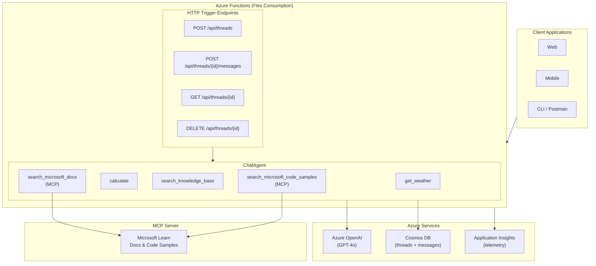

# Production Chat API with Azure Functions, Cosmos DB & Agent Framework

## References

- **GitHub Issue**: [#2436 - Python: [Sample Request] Production Chat API with Azure Functions, Cosmos DB & Agent Framework](https://github.com/microsoft/agent-framework/issues/2436)
- **Microsoft Documentation**:
  - [Create and run a durable agent (Python)](https://learn.microsoft.com/en-us/agent-framework/tutorials/agents/create-and-run-durable-agent)
  - [Agent Framework Tools](https://learn.microsoft.com/en-us/agent-framework/concepts/tools)
  - [Multi-agent Reference Architecture](https://learn.microsoft.com/en-us/azure/architecture/ai-ml/architecture/build-multi-agent-framework-solution)
  - [Well-Architected AI Agents](https://learn.microsoft.com/en-us/azure/well-architected/service-guides/ai-agent-architecture)

## What is the goal of this feature?

Provide a **production-ready sample** demonstrating how to build a scalable Chat API using the Microsoft Agent Framework with:

1. **Azure Functions** for serverless, scalable hosting
2. **Azure Cosmos DB** for durable conversation persistence
3. **Function Tools** showcasing runtime tool selection by the agent

### Value Proposition

- Developers can use this sample as a reference architecture for deploying Agent Framework in production
- Demonstrates enterprise patterns: state persistence, observability, and thread-based conversations
- Shows the power of **agent autonomy** - the agent decides which tools to invoke at runtime based on conversation context

### Success Metrics

1. Sample is referenced in at least 3 external blog posts/tutorials within 6 months
2. Sample serves as the canonical reference for "Agent Framework + Azure Functions + Cosmos DB" stack


## Architecture Overview




## Key Design Decisions

### 1. Runtime Tool Selection (Agent Autonomy)

The agent is configured with multiple tools but **decides at runtime** which tool(s) to invoke based on user intent. Tools are registered once; the agent autonomously selects which to use for each request.

**Implemented Tools**:
| Tool | Purpose | Status |
|------|---------|--------|
| `get_weather` | Weather information | ✅ Simulated |
| `calculate` | Math expressions | ✅ Safe AST eval |
| `search_knowledge_base` | FAQ/KB search | ✅ Simulated |
| `microsoft_docs_search` | Microsoft Learn search | ✅ MCP |
| `microsoft_code_sample_search` | Code sample search | ✅ MCP |

### 2. Cosmos DB Persistence Strategy

**Two-Container Approach**:

| Container | Purpose | Managed By |
|-----------|---------|------------|
| `threads` | Thread metadata (user_id, title, timestamps) | `CosmosConversationStore` (custom) |
| `messages` | Conversation messages | `CosmosHistoryProvider` (framework) |

**CosmosHistoryProvider** from `agent-framework-azure-cosmos` ([PR #4271](https://github.com/microsoft/agent-framework/pull/4271)) automatically:
- Loads conversation history before each agent run
- Stores user inputs and agent responses after each run
- Uses `session_id` (thread_id) as the partition key

**Partition Strategy**:
- **Messages**: `/session_id` - all messages for a thread stored together
- **Threads**: `/id` - thread metadata isolated by thread_id
- `source_id` field allows multiple agents to share a container

### 3. Azure Functions Hosting

Using **HTTP Triggers** for a familiar REST API pattern:

- Standard HTTP trigger endpoints (POST, GET, DELETE)
- Singleton pattern for agent and history provider (reused across invocations)
- Flex Consumption plan for serverless scaling
- Simple deployment via `azd up`

### 4. Observability

Using Agent Framework's `setup_observability()` with custom spans for:
- HTTP request lifecycle
- Cosmos DB operations
- Request validation

Exporters: OTLP and Azure Monitor (Application Insights)

## API Design

### Endpoints

| Method | Path | Description |
|--------|------|-------------|
| `POST` | `/api/threads` | Create a new conversation thread |
| `GET` | `/api/threads/{thread_id}` | Get thread metadata |
| `DELETE` | `/api/threads/{thread_id}` | Delete a thread and its messages |
| `POST` | `/api/threads/{thread_id}/messages` | Send a message and get response |
| `GET` | `/api/health` | Health check |

### Request/Response Behavior

**Create Thread**: Accepts optional `user_id`, `title`, and `metadata`. Returns created thread with generated `thread_id`.

**Send Message**: Accepts `content` string. Agent automatically loads history, processes request (with tool calls as needed), and persists the conversation. Returns assistant response with any tool calls made.

**Delete Thread**: Removes thread metadata and clears all messages from the history provider.

See [demo.http](../demo.http) for complete request/response examples.

## Implementation Status

### Phase 1: Core Chat API ✅

- [x] Azure Functions HTTP triggers
- [x] ChatAgent with Azure OpenAI
- [x] Local tools (weather, calculator, knowledge base)
- [x] `CosmosHistoryProvider` for automatic message persistence
- [x] `CosmosConversationStore` for thread metadata
- [x] `demo.http` file for testing
- [x] README with setup instructions
- [x] Infrastructure as Code (Bicep + azd)

### Phase 2: Observability ✅

- [x] OpenTelemetry integration via Agent Framework
- [x] Custom spans for HTTP requests and Cosmos operations
- [x] Structured logging
- [x] Health check endpoint

### Phase 3: MCP Integration ✅

- [x] `MCPStreamableHTTPTool` for Microsoft Learn MCP server
- [x] `microsoft_docs_search` tool via MCP
- [x] `microsoft_code_sample_search` tool via MCP
- [x] Per-request MCP connection (serverless-friendly)

### Phase 4: Production Hardening (Future)

- [ ] Managed Identity authentication (currently uses DefaultAzureCredential)
- [ ] Retry policies and circuit breakers
- [ ] Rate limiting
- [ ] Input sanitization

### Phase 5: Caching (Future)

- [ ] Redis session cache for high-frequency access
- [ ] Recent messages caching

## Project Structure

```text
python/samples/demos/enterprise-chat-agent/
├── function_app.py          # Azure Functions entry point
├── requirements.txt         # Dependencies
├── host.json               # Functions host configuration
├── azure.yaml              # azd deployment configuration
├── demo.http               # API test file
├── services/
│   ├── agent_service.py    # ChatAgent + CosmosHistoryProvider
│   ├── cosmos_store.py     # Thread metadata storage
│   └── observability.py    # OpenTelemetry instrumentation
├── routes/
│   ├── threads.py          # Thread CRUD endpoints
│   ├── messages.py         # Message endpoint
│   └── health.py           # Health check
├── tools/
│   ├── weather.py          # Weather tool
│   ├── calculator.py       # Calculator tool
│   └── knowledge_base.py   # KB search tool
├── docs/
│   ├── DESIGN.md           # This document
│   └── AGENT_IMPLEMENTATION.md
└── infra/
    └── main.bicep          # Azure infrastructure
```

## Security Considerations

| Concern | Mitigation |
|---------|------------|
| **Authentication** | `DefaultAzureCredential` (supports Managed Identity, CLI, etc.) |
| **Thread Isolation** | Cosmos DB partition key on `thread_id` / `session_id` |
| **Secrets Management** | Environment variables (Key Vault recommended for production) |
| **Input Validation** | Request body validation in route handlers |

## Testing

- **Local Testing**: Use `demo.http` with VS Code REST Client or `func start`
- **Deployment**: `azd up` for full Azure deployment
- **Unit Tests**: Located in `tests/` directory

## Open Questions

1. **Streaming support**: Should a future phase include SSE streaming responses?
2. **Multi-tenant**: Should thread isolation support user-level partitioning?
