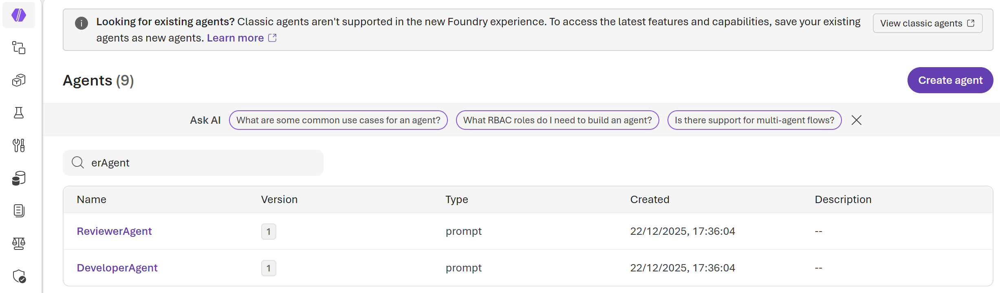
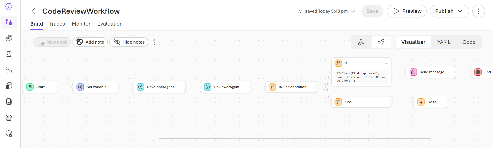
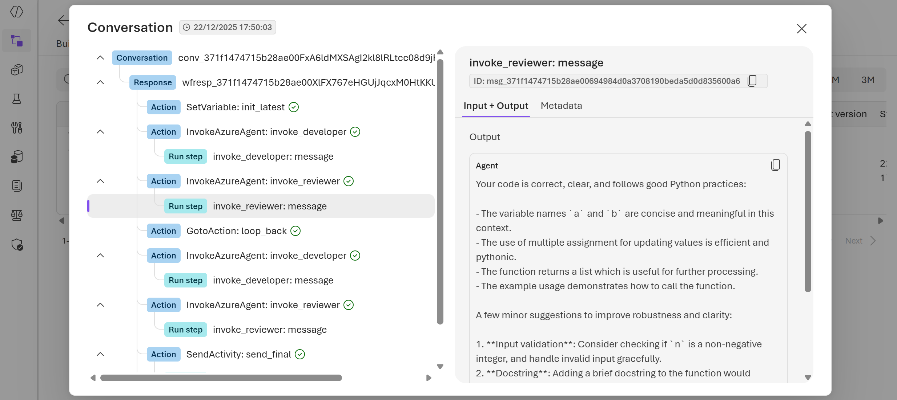

# Multi-Agent Orchestration: Hosted Workflows in Azure AI Foundry
This repo provides a practical implementation of _Hosted Workflows_ using the **Azure AI SDK** for Python. It utilises the **Microsoft Agent Framework** declarative schema to define multi-agent orchestration (workflow).

Unlike local workflows, hosted workflows are deployed directly to Azure AI Foundry, allowing them to be managed, versioned and executed within the Azure ecosystem.

> [!WARNING]
> To successfully run these notebooks, you must have an **Azure AI Foundry** project and **AI model deployment**. Please ensure you have the following environment variables set up in your system:
> | Environment Variable             | Description                                                                            |
> | -------------------------------- | -------------------------------------------------------------------------------------- |
> | `AZURE_FOUNDRY_PROJECT_ENDPOINT` | The endpoint URL for your Azure AI Foundry project.                                    |
> | `AZURE_FOUNDRY_GPT_MODEL`        | The name of the model deployment to be used by the Azure AI SDK, e.g., _gpt-4.1-mini_. |

## 📑 Table of Contents
- [Use-Case Scenario: Code Review](#use-case-scenario-code-review)
- [Code Sample: YAML Definition](#code-sample-yaml-definition)
- [Code Sample: Python Script](#code-sample-python-script)
- [Deployment of Hosted Workflow](#deployment-of-hosted-workflow)
- [Execution in Azure AI Foundry](#execution-in-azure-ai-foundry)

## Use-Case Scenario: Code Review
This sample demonstrates a _Code Review_ workflow involving two specialised agents:
- **Developer Agent**: writes code to solve problems and may occasionally introduce bugs,
- **Reviewer Agent**: checks the code for style and correctness.

The workflow continues in a loop until the Reviewer provides the `approved` keyword, at which point the final solution is delivered then to the user.

## Code Sample: YAML Definition
The workflow logic is defined in `CodeReview.yaml` file, that describes the triggers, variables and the sequence of agent invocations.

### 1.1 Workflow Trigger
The workflow is initialised using the `OnConversationStart` trigger, that captures the user's input into a local variable (`Local.LatestMessage`) as the starting context for the agents.

``` YAML
kind: workflow
trigger:
  kind: OnConversationStart
  id: trigger_wf
  actions:
    - kind: SetVariable
      id: init_latest
      variable: Local.LatestMessage
      value: =UserMessage(System.LastMessageText)
```

### 1.2 Agent Invocation
The logic utilises the `InvokeAzureAgent` action to call specific agents registered in Azure AI Foundry.
- **DeveloperAgent**: receives the initial problem or previous feedback to generate code,
- **ReviewerAgent**: analyses the developer's output to provide feedback or approval,

Both agents map their outputs back to `Local.LatestMessage`, for the conversation state to persist across turns.

``` YAML
- kind: InvokeAzureAgent
  id: invoke_developer
  agent:
    name: DeveloperAgent
  conversationId: =System.ConversationId
  input:
    messages: =Local.LatestMessage
  output:
    messages: Local.LatestMessage
    autoSend: true
```

### 1.3 Conditions and Looping
To manage the _code review_ interactions, the workflow utilises a `ConditionGroup` logic.
- **Approval Check**: A condition searches for the string "_approved_" within the reviewer's last message.
- **Termination**: If approved, the workflow sends the final activity and ends the conversation.
- **Looping**: If not approved, a `GotoAction` redirects the flow back to the `invoke_developer` step.

``` YAML
- kind: ConditionGroup
  id: check_approved
  conditions:
    - id: if_approved
      condition: =!IsBlank(Find("approved", Lower(Last(Local.LatestMessage).Text)))
      actions:
        - kind: EndConversation
  elseActions:
    - kind: GotoAction
      id: loop_back
      actionId: invoke_developer
```

## Code Sample: Python Script
The `hosted_workflow.py` script is your _deployment engine_. It utilises the `AIProjectClient` to register both the individual **agents** and the orchestration **workflow** in your Azure AI Foundry project.

### 2.1 Registering Agents
Agents are created as _versions_ in the new Azure AI Foundry UI. This allows you to define their persona once and reuse then specific versions in the target agentic workflows.

``` Python
agent = project_client.agents.create_version(
    agent_name="<YOUR_AGENT_NAME>",
    definition=PromptAgentDefinition(
        model=model,
        instructions="<YOUR_AGENT_INSTRUCTIONS>"
    ),
)
```

### 2.2 Registering the Workflow
The YAML definition is uploaded to Azure AI Foundry as a `WorkflowAgentDefinition`. By registering the workflow this way, you make it "hosted" and enable it being triggered within _AI Foundry UI_ or via _API calls_ to the project endpoint.

``` Python
workflow_agent = project_client.agents.create_version(
    agent_name=workflow_definition["name"],
    definition=WorkflowAgentDefinition(workflow=workflow_yaml),
    description=workflow_definition["description"],
)
```

### 2.3 Client Initialisation
To interact with Azure AI Foundry, the Python script initialises an `AIProjectClient` using your Azure AI Foundry project endpoint and `AzureCliCredential`. This client serves as the primary interface for managing agentic resources in AI Foundry.

``` Python
project_client = AIProjectClient(
    endpoint=project_endpoint,
    credential=AzureCliCredential()
)
```

## Deployment of Hosted Workflow
To deploy your orchestration logic to Azure, you must execute the provided Python script. 

> [!IMPORTANT]
> Ensure you have authenticated via the Azure CLI (`az login`) before starting.

### 3.1 Prerequisites
Before running the deployment, install the necessary _Azure AI SDK_ and _Azure Identity_ libraries:

``` PowerShell
pip install azure-ai-projects --pre
pip install azure-identity pyyaml
```

### 3.2 Running the Deployment
The script requires the path to your _YAML_ definition file as a command-line argument. If not provided, it defaults to **CodeReview.yaml**.

``` PowerShell
python hosted_workflow.py CodeReview.yaml
```

### 3.3 Deployment Process
The deployment process consists of the following few steps:
- **Connection**: The `AIProjectClient` establishes the connection to your Azure AI Foundry project endpoint, using your _Azure CLI credentials_.
- **Agent Creation**: The script utilises the _define_developer_agent_ and _define_reviewer_agent_ functions to create / update agent versions in the project.
- **Workflow Registration**: The script then reads the `CodeReview.yaml` file and registers it as a `WorkflowAgentDefinition` within the AI Foundry's Workflow section.

### 3.4 CLI Output
If successful, you should see a command-line output similar to this:

``` JSON
============================================================
Creating Hosted Workflow in Azure AI Foundry
============================================================
Project Endpoint: https://<YOUR_AI_FOUNDRY_ACCOUNT>.services.ai.azure.com/api/projects/<YOUR_AI_FOUNDRY_PROJECT>
Model: gpt-4.1-mini

Creating agents in Azure AI Foundry...
Created DeveloperAgent: DeveloperAgent:1
Created ReviewerAgent: ReviewerAgent:1

Creating workflow in Azure AI Foundry...
Loaded workflow definition from: CodeReview.yaml
Created workflow: CodeReviewWorkflow:1

============================================================
Hosted Workflow Created Successfully!
============================================================
Workflow ID: CodeReviewWorkflow:1
Agents: ['DeveloperAgent', 'ReviewerAgent']
```

## Execution in Azure AI Foundry
Once the deployment is complete, you can manage and visualise your agents and workflows directly within the new Azure AI Foundry portal's UI.

### 4.1 Agents Section
Navigate to the _Agents_ tab to view your newly registered _DeveloperAgent_ and _ReviewerAgent_.
- **Validation**: inspect the specific system instructions, created versions and assigned model deployments.
- **Individual Testing**: use the new AI Foundry UI to test agent responses independently before running the full orchestration.


### 4.2 Workflows Section
Under the _Workflows_ tab, you will find the _CodeReviewWorkflow_.
- **Visualizer** View: view the logic flow, incl. the loop between agents and the final conditional exit.
- **YAML** View: review or update the uploaded declarative schema directly in the Azure AI Foundry UI.
- **Code** View: access the code representation of your workflow in _Python_, _JavaScript_ and _C#_.


### 4.3 Traceability and Debugging
Every workflow execution generates a unique trace, allowing granular audit of the multi-agent interaction.
- **Transcript Analysis**: view the messages exchanged, e.g. the _ReviewerAgent_ providing code feedback and the _DeveloperAgent_ submitting revisions.
- **Loop Monitoring**: check how many iterations occurred before the approved keyword was detected by the condition group.

